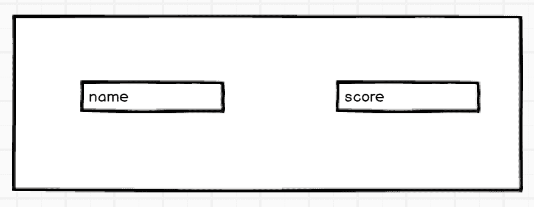
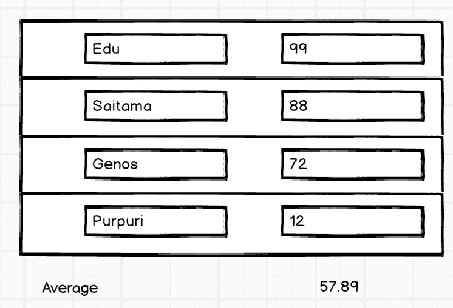

# 从父函数中调用一个子函数来获取计算数据

> 原文：<https://dev.to/arcioneo/invoke-a-child-function-from-the-parent-one-to-get-computed-data-2kka>

好，假设我们有最基本的组件，一个有两个输入的`
`元素:

且姑且称这个组件为`Card`；还有一个名为`CardHolder`的第二个组件，它由一个包含`Card`组件的`div`元素组成(一个名字和分数的列表)。

假设我们希望`CardHolder`组件在按钮上打印列表中所有分数的平均值，如下图所示:

考虑到以下限制，如何实现这一点？：

1)函数的使用(没有类)
2)卡元素是独立的(不需要任何外部信息来工作)和可重用的(任何组件都可以导入和使用它，而不需要知道它的内部结构，也不需要调用者发送属性/状态给`Card`子元素)
3)保持简单，即:不推荐全局状态处理程序(即:`Redux`)，这就像用一个建筑来杀死一只蚂蚁，让我们记住这里的目标是保持一个简单的组件具有非常基本的功能。

我的背景是 java，实现这一点最简单的方法是在`card`(即:`getScore()`)中创建一个公共函数，这样父节点(无论是谁)只需要调用它，而不需要知道它在内部是如何工作的；这在 react 中是否可行，或者这里的正确方法/模式是什么？

提前感谢任何人...