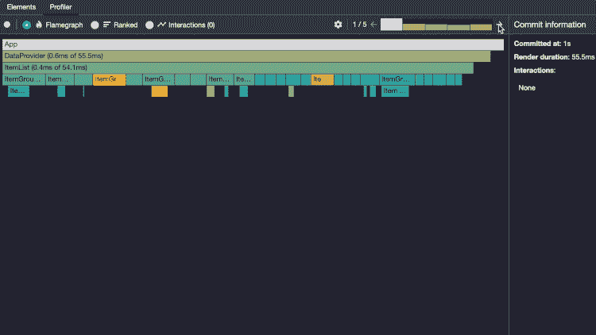
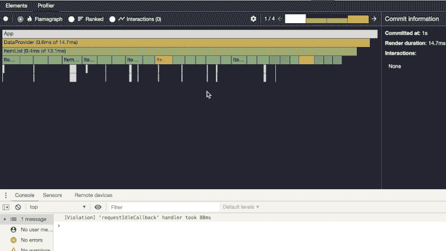
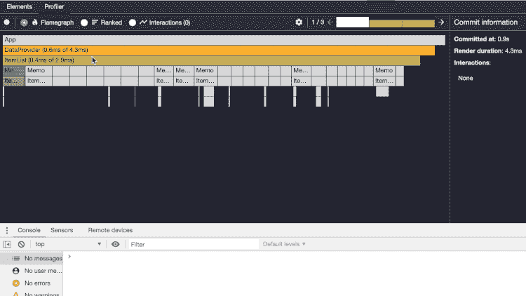

# 使用 React.memo 更快地渲染

> 原文：<https://dev.to/thejohnstew/faster-renders-with-react-memo-4hi7>

我正在进入`React.memo`的这个帖子，以及它如何被用来加速一个 React 应用程序。我将从一个包含一些未优化的 React 代码的示例应用程序开始。使用 React Devtools Profiler，我的目标是演示如何微调 React 应用程序，使其尽可能具有高性能。使用这种方法将允许您逐步完成 React 应用程序的每个部分，并在您认为合适的地方提高性能。

## 示例 App

[https://codesandbox.io/embed/l22p644jq7](https://codesandbox.io/embed/l22p644jq7)

这个应用程序是一个属于子组的项目的大列表，这些子组属于标记为 A，B，C 等的父组。每个子组中有 15 个项目，每个父组有 2 个子组，项目总数为 780。那太多了。

就功能而言，我们所要做的就是在这个列表中进行选择。单击某个项目时，该项目应以红色突出显示。

## 基线应用性能

是时候了解应用程序当前的运行情况了。使用 React Devtools Profiler，我们可以进行一些测量。

[](https://res.cloudinary.com/practicaldev/image/fetch/s--Yv6bHZqH--/c_limit%2Cf_auto%2Cfl_progressive%2Cq_66%2Cw_880/https://thepracticaldev.s3.amazonaws.com/i/pgda4jsp0dftbi5nozji.gif)

上面是显示应用程序花费时间的分析器。每个模块都是一个反应元件。颜色从蓝色到橙色不等。蓝色表示快，橙色表示慢。

上面你还可以看到，每当我们对一个组件进行更新时，每个组件都在做一些事情。我们只想更新我们正在操作的单个组件或者到那个单独组件的组件路径。

最后，在右边你会看到一个叫做`Render duration`的指标。我们尝试更新的第一个项目使用了`55.5ms`来让 React 将更改提交给 DOM。

## React.memo

在示例中，React 处理所有组件并选择列表中的单个项目，这意味着在这种情况下，779 个项目保持不变。React 为这种用例公开了`React.memo`。

```
import React from "react";

function Item({ item, selectItem, group, subgroup }) {
  return (
    <div
      className={`item${item.selected ? " item--selected" : ""}`}
      onClick={() => selectItem(group, subgroup, item.id)}
    >
      <div className="item-img">
        
      </div>
      <span>{item.name}</span>
    </div>
  );
}

const MemoItem = React.memo(Item, (prevProps, nextProps) => {
  if (prevProps.item.selected === nextProps.item.selected) {
    return true;
  }
  return false;
});

export default MemoItem; 
```

上面是`Item`组件。在底部，它已经被更新为导出一个记忆版本的`Item`组件。函数签名看起来像这样`React.memo(MyReactComponent, compareFn(prevProps, nextProps))`。在比较功能中，您告诉 React 组件是否相同(`true`)或不同(`false`)。

时间来衡量。

[](https://res.cloudinary.com/practicaldev/image/fetch/s--3dX-t3Xs--/c_limit%2Cf_auto%2Cfl_progressive%2Cq_66%2Cw_880/https://thepracticaldev.s3.amazonaws.com/i/i8pyu1jhcpjq9c69zvwn.gif)

什么变了？渲染持续时间现在在`14.7ms`👍。进一步深入组件，您可以看到所有的`Item`组件现在都是灰色的，除了进行了更改的组件。那就更接近目标了！

不幸的是，仍然有不必要的额外处理要做。当只有一个组件被更新时，每个组件仍然在工作。回到`React.memo`。

```
import React from "react";
import Item from "./Item";

function ItemGroup({ items, selectItem, group }) {
  return (
    <div className="item-group">
      <div className="item-group--a">
        {items.SUB_GROUPA.items.map(item => (
          <Item
            group={group}
            subgroup={"SUB_GROUPA"}
            key={`item-${item.id}`}
            item={item}
            selectItem={selectItem}
          />
        ))}
      </div>
      <div className="item-group--b">
        {items.SUB_GROUPB.items.map(item => (
          <Item
            group={group}
            subgroup={"SUB_GROUPB"}
            key={`item-${item.id}`}
            item={item}
            selectItem={selectItem}
          />
        ))}
      </div>
    </div>
  );
}

const MemoItemGroup = React.memo(ItemGroup, (prevProps, nextProps) => {
  if (prevProps.updatedAt === nextProps.updatedAt) {
    return true;
  }
  return false;
});

export default MemoItemGroup; 
```

上面包含了处理每组项目的`ItemGroup`组件。默认的导出现在是`ItemGroup`的记忆化版本，它包含了`updatedAt`时间戳变量之间的比较。

[](https://res.cloudinary.com/practicaldev/image/fetch/s---0YYSVSa--/c_limit%2Cf_auto%2Cfl_progressive%2Cq_66%2Cw_880/https://thepracticaldev.s3.amazonaws.com/i/8ssaqcgzwm7it676weq7.gif)

经过最后一次修改，渲染持续时间现在是`4.3ms`！🚀

## 思想

可以对道具进行任何类型的比较。我尝试使用布尔值和数字(时间戳),因为与比较对象相比，它们似乎更容易处理。

所有这些中的另一个重要部分是在项目集合上正确使用键。我艰难地发现这有多重要。所以请确保这些设置正确。

最后，React Devtools Profiler 是一个很好的工具，可以帮助你更好地理解 React 应用。我们经常被迫赶在截止日期前完成任务，削减性能指标。如果可以的话，花几天时间试着深入理解 React 应用的各个部分，试着找出在哪里创建渲染的快速路径。

## 链接

*   [React.memo](https://reactjs.org/docs/react-api.html#reactmemo)
*   [Codesandbox 示例 1 (No React。备忘录)](https://codesandbox.io/s/l22p644jq7?fontsize=14)
*   [Codesandbox 示例 2 (React.memo)](https://codesandbox.io/s/yj8yj60r2x?fontsize=14)

最初发布在我的博客上，地址为 [johnstewart.io](https://bit.ly/2Dcsu4c) 。