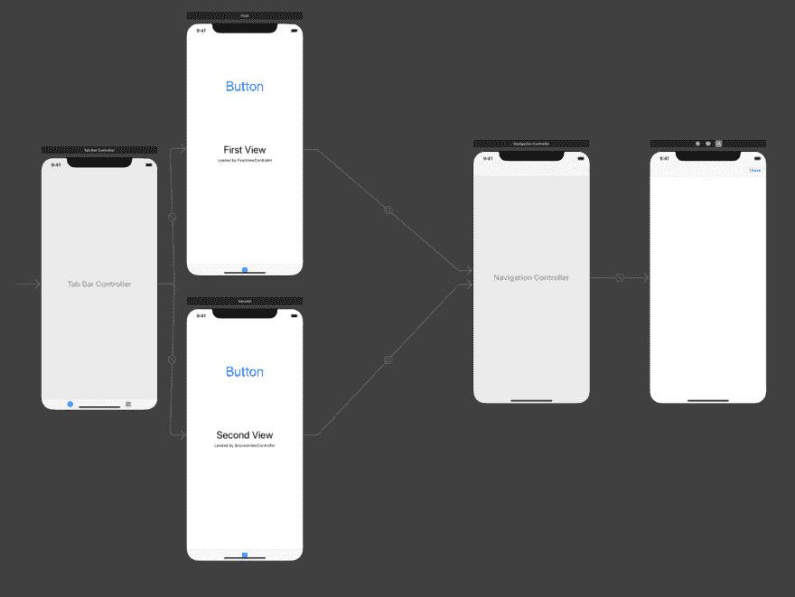
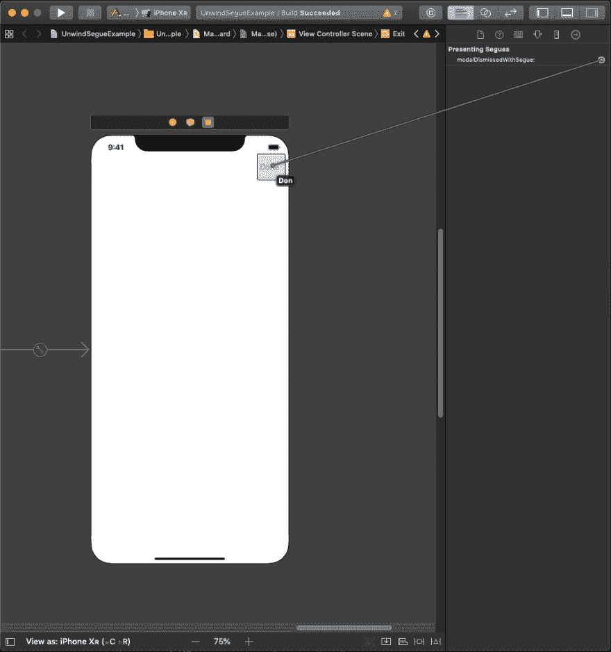

# 您可以再次回家——使用 unwind segues 导航回之前的屏幕

> 原文：<https://dev.to/evandeaubl/you-can-go-home-again-using-unwind-segues-to-navigate-back-to-previous-screens-1e9b>

如果你在故事板中完成所有的应用导航，你肯定会发现的一个优势是，这是一个用最少的代码为你的应用指定所有导航的好方法。不过，您可能会遇到这种情况:为向前导航指定一个 segue 很简单，但是如果您想指定一个 segue 来关闭一个屏幕呢？最常见的例子是使用 Done 按钮关闭模式化的视图控制器。

如果你在网上搜索这个，你会得到各种各样的建议:

*   有规律地进行
    *   这种解决方案显然是错误的，因为您希望在解散视图控制器时将其从堆栈中移除，而不是添加到堆栈中
*   在代码中自行关闭控制器
    *   我们使用故事板让我们的导航脱离代码，这违背了我们的目的
*   编写一个自定义序列来关闭视图控制器
    *   这更接近，但是不灵活，并且使视图控制器的重用更加困难，我们将在后面讨论

The correct solution for flexible navigation backwards in your storyboards is what is called an *unwind segue*. The functionality is a little more hidden in Interface Builder than the regular segue — let’s talk about how they work, and how to find and use them in Interface Builder.

* * *

展开片段的工作方式与标准片段略有不同，因为它们需要。正常情况下，从一个视图控制器中的控件到另一个视图控制器建立规则片段。点击控件，触发序列，跳转到另一个视图控制器。

展开段转到视图层次结构中的上一个屏幕，这意味着**你不知道展开段的目的地。**现在大多数时候，这不是真的，因为你只有一条回去的路。但是如果你在你的故事板中重用一个视图控制器——也许它是你的一个标准模态屏幕——你不能硬编码一个视图控制器让它返回。

[](https://res.cloudinary.com/practicaldev/image/fetch/s--ciujuFMy--/c_limit%2Cf_auto%2Cfl_progressive%2Cq_auto%2Cw_880/https://www.appsdissected.com/wp-content/uploads/2019/04/Screen-Shot-2019-04-03-at-10.44.30.png)

上面的故事板例子说明了这个问题。构建展开段是为了以一种巧妙方式处理多目的地问题。让我们先讨论如何定义它们，然后我们将讨论 iOS 在触发展开序列时使用的巧妙机制，以找到正确的视图控制器并导航回去。

## 1.创建接收展开序列的方法

展开段的另一个不同之处在于，您不会使用通常的`prepare(for segue: UIStoryboardSegue, sender: Any?)`方法接收它们，因为这个段是反向的:它将由目标视图控制器处理，而不是由源代码处理。取而代之的是，您在视图控制器上定义一个`@IBAction`函数。

```
@IBAction func modalDismissed(segue: UIStoryboardSegue) {
  // You can use segue.source to retrieve the VC
  // being dismissed to collect any data which needs
  // to be processed
} 
```

您将为每个视图控制器定义这个方法，您可能希望返回使用这个展开序列。例如，共享同一个可重用模态视图控制器的多个不同的屏幕。我将在本文后面讨论 iOS 如何决定跳回哪个屏幕。

回到上面的示例故事板，两个屏幕都将显示该视图控制器，当单击 Done 时，您需要返回到正确的选项卡，因此您将向第一个和第二个场景视图控制器添加上述方法的同名副本。

**注意:**方法签名非常重要！它必须是一个`@IBAction`，并且必须有一个`UIStoryboardSegue`参数，标有`segue`。与此有任何差异，接口生成器都不会将您的方法识别为展开序列目标，因此在下一步尝试将其链接到控件时不会显示出来。

## 2.将界面生成器中的 segue 连接到解除控件

一旦在至少一个视图控制器中定义了该方法，就需要连接负责通过触发 unwind 序列来解除视图控制器的控件。

最简单的方法是在模态视图控制器中选择出口节点，转到连接检查器，并在“呈现序列”下，将适当的方法连接到适当的控件。

[](https://res.cloudinary.com/practicaldev/image/fetch/s--wPPc32di--/c_limit%2Cf_auto%2Cfl_progressive%2Cq_auto%2Cw_880/https://www.appsdissected.com/wp-content/uploads/2019/04/Screen-Shot-2019-04-03-at-10.53.47.png)

您还可以按住 Control 键，从解除控件的操作出口拖动到实现 unwind segue 方法的一个视图控制器的出口节点。它的优点是确保您的 segue 能够正确展开(至少在这种情况下)，但是第一种技术在 Interface Builder 中要容易得多。

无论使用哪种技术，这只需要做一次，即使多个屏幕可能是展开序列的目标。为什么会这样是下一节的主题。

## 展开序列在运行时如何工作

当您的控件被点击时，展开是如何执行的，这就是展开序列如何将您导航回正确的屏幕。当请求展开序列时，iOS 会遍历您提供的屏幕堆栈，寻找一个视图控制器，其方法与您的解除控件上配置的签名相匹配。它找到的第一个对象成为展开的目标:调用 VC 的方法来处理展开，并将视图控制器堆栈弹出到该视图控制器。如果找不到匹配的方法，就中止展开过程；如果您的解除控制不做任何事情，寻找一个丢失或错误命名的方法。

例如，如果您有一个带有两个选项卡的`UITabViewController`，并且它们都希望显示同一个模态对话框。当您在两个屏幕上定义 unwind segue 方法时，当您的用户关闭模式对话框时，它将返回到正确的屏幕，因为这是它将在实现适当方法的视图控制器堆栈上找到的第一个屏幕。

再回到示例故事板，如果你追溯点击完成按钮时会发生什么，它会通过视图控制器堆栈弹出到导航控制器。这没有实现适当的方法，所以它会弹出到第一个场景或第二个场景，这取决于按钮是从哪个场景被点击的。因为方法是为这两者实现的，所以它发现它有一个展开目标，调用方法，然后将所有视图控制器返回到目标视图控制器。

* * *

你喜欢这个建议吗？关于[的下一个技巧是让你的圆形组件在界面构建器](https://www.appsdissected.com/circular-view-interface-builder-ibdesignable/)中看起来是圆形的，这个技巧已经在等着你了。

或者[注册，将所有提示直接发送到您的收件箱](https://www.appsdissected.com/newsletter/)，另外还有时事通讯提示和网站文章的深度挖掘以及未来产品发布的折扣。

这篇文章最初发表在 [Apps 剖析。](https://www.appsdissected.com/unwind-segues-storyboard/)