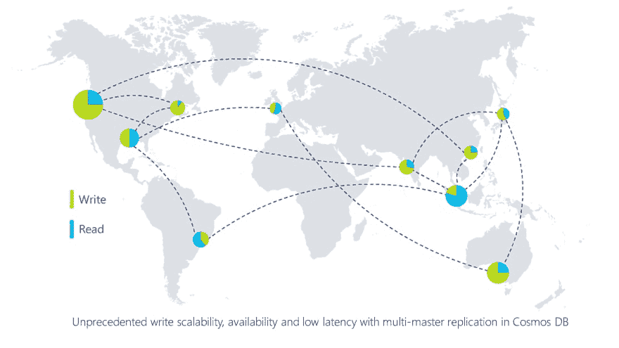
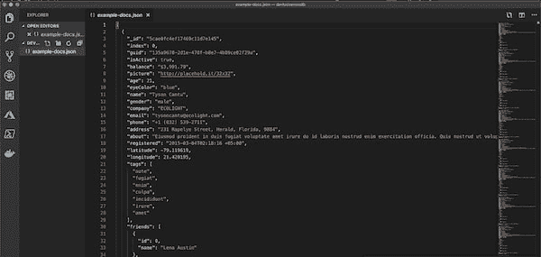
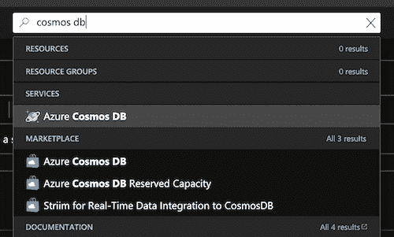
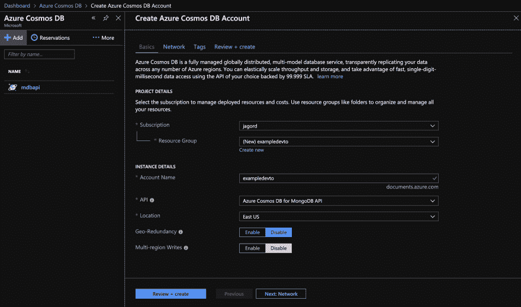
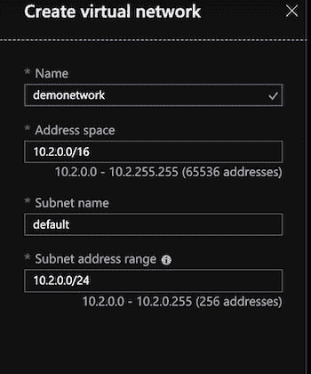
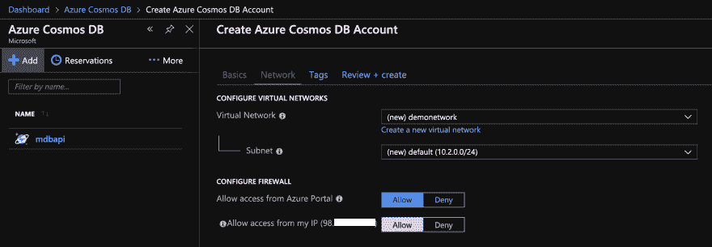
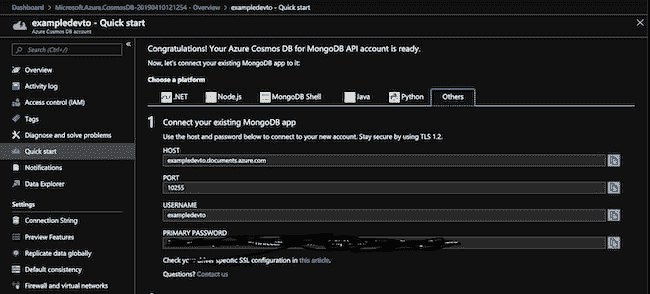
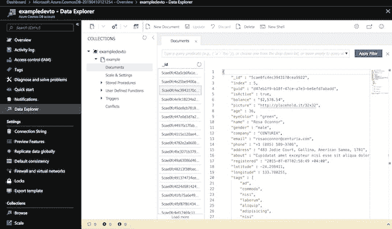

# 将 JSON 数据上传到 Azure Cosmos DB for MongoDB API

> 原文：<https://dev.to/azure/uploading-your-json-data-to-azure-cosmos-db-for-mongodb-api-1mh9>

*我们选择了由[迈克尔·克伦普](https://twitter.com/mbcrump)创造的我们最喜欢的技巧和诀窍，并在整个四月在 Azure 上提供新的技术内容！错过一天(或更多)？[赶上系列](https://dev.to/t/azureapril)。*

**没有天蓝色？** [抢免费订阅](https://azure.microsoft.com/en-us/free?&WT.mc_id=azureapril_devto-blog-cxa)。

如果您已经构建了一个应用程序，并且当前正在将数据存储在一个静态 JSON 文件中，那么您可能会考虑为微软 Azure 的 Cosmos DB 使用 MongoDB API。借助 Microsoft Azure with Cosmos DB 的全面管理以及全球扩展的能力，您将拥有您的应用程序所需的文档数据存储。这将允许您创建到客户所在区域的复制。

[](https://res.cloudinary.com/practicaldev/image/fetch/s--bLy2aAzS--/c_limit%2Cf_auto%2Cfl_progressive%2Cq_auto%2Cw_880/https://thepracticaldev.s3.amazonaws.com/i/2uue7l9h1ogz8c1ksz8h.png)

今天，我们将从应用程序中取出一个现有的数据库，并使用一些简单的原生 MongoDB 工具来教您如何轻松地将一些数据迁移到 Cosmos DB。

必需的:

*   [Azure 账户](https://azure.microsoft.com/en-us/free/?WT.mc_id=azureapril_devto-blog-cxa)
*   用于 MongoDB API 的 Azure Cosmos DB
*   [示例数据库 JSON 文件](https://github.com/jaydestro/devtocosmodb)
*   饭桶
*   [`mongoimport`为你的本地外壳](https://docs.mongodb.com/manual/reference/program/mongoimport/)

这个例子将集中于使用 bash 终端，它可以在 Mac OS X、Linux 和 Windows 上使用 [Windows 子系统 for Linux](https://docs.microsoft.com/en-us/windows/wsl/install-win10?WT.mc_id=azureapril_devto-blog-cxa) 。

首先，存储库中提供的 JSON 文件是一个非常简单的虚拟数据 DB，使用[json-generator.com](https://www.json-generator.com/)创建。

[](https://res.cloudinary.com/practicaldev/image/fetch/s--DzJ3ZGOM--/c_limit%2Cf_auto%2Cfl_progressive%2Cq_auto%2Cw_880/https://thepracticaldev.s3.amazonaws.com/i/zflegv1l94c4k02pqndn.png)

如果愿意，您可以创建自己的数据库，但是为了简单起见，本教程提供了一个 1052 条目的示例文档数据库来导入到 Cosmos DB 中。

转到 Azure 门户，为我们的数据创建一个用于 MongoDB 部署的 Azure Cosmos DB API。

只需在搜索栏中输入“Cosmos Azure DB”就可以很容易地开始，然后你可以点击“服务”下出现的选项

[](https://res.cloudinary.com/practicaldev/image/fetch/s--MU58LOOd--/c_limit%2Cf_auto%2Cfl_progressive%2Cq_auto%2Cw_880/https://thepracticaldev.s3.amazonaws.com/i/6ro0uowa8nr5eue5ioma.png)

现在点击左上角的 Add，你将被带到 blade，在这里你可以开始选择你的新的 Cosmos DB 帐户。在那里，您可以选择已链接到您的帐户的订阅，并选择一个[资源组](https://docs.microsoft.com/en-us/azure/azure-resource-manager/resource-group-overview?WT.mc_id=azureapril_devto-blog-cxa)或创建一个新的资源组。帐户名将代表添加到完全限定的域名中的主机名，该域名是作为应用程序将连接到的端点的一部分而创建的。在这个例子中，创建了一个新的资源组，并选择了 Azure Cosmos DB for MongoDB API 和一个将托管数据的区域。

在本例中，我们不会启用地理冗余或多区域写入，这些都是扩展数据可用性的好方法，但对于演示来说不是必需的。

[](https://res.cloudinary.com/practicaldev/image/fetch/s--RCHtLoze--/c_limit%2Cf_auto%2Cfl_progressive%2Cq_auto%2Cw_880/https://thepracticaldev.s3.amazonaws.com/i/cojlvgkrdrv2v7m6zts6.png)

单击“next ”,进入“Network”部分，在这一部分，我们需要创建一个虚拟网络，然后允许自己连接到 API 端点。

我们首先创建一个新的 VNET 并选择`10.2.0.0/16`网络。您将为我们的教程创建一个默认子网。在更复杂的解决方案中，您可能希望为此创建一个专用子网，以进一步限制您的数据暴露。目前，本例将使用一个`10.2.0.0/24`子网。确保您允许您的 IP，以便您能够访问创建的端点。

[](https://res.cloudinary.com/practicaldev/image/fetch/s--VsvA4bkX--/c_limit%2Cf_auto%2Cfl_progressive%2Cq_auto%2Cw_880/https://thepracticaldev.s3.amazonaws.com/i/oex9mdgz8wjl7qc4f0qg.png)
[T6】](https://res.cloudinary.com/practicaldev/image/fetch/s--A_Pnqenj--/c_limit%2Cf_auto%2Cfl_progressive%2Cq_auto%2Cw_880/https://thepracticaldev.s3.amazonaws.com/i/bzzmmc52wjs83294z7hk.png)

单击`Review and Create`您的新 Cosmos DB 部署并验证设置。现在单击 Create，等待您的新部署被创建。

[](https://res.cloudinary.com/practicaldev/image/fetch/s--V4e9YjCv--/c_limit%2Cf_auto%2Cfl_progressive%2Cq_auto%2Cw_880/https://thepracticaldev.s3.amazonaws.com/i/13iqeap3d82r5bhq637w.png)

现在让我们确保您已经用您的数据库示例文件克隆了存储库:

`git clone git@github.com:jaydestro/devtocosmodb.git`

现在进入目录并确保您可以开始使用我们需要的 mongo 工具:

```
cd devtocosmodb
mongoimport --version 
```

Enter fullscreen mode Exit fullscreen mode

根据本教程使用的操作系统，您应该会得到某种形式的输出:

```
mongoimport version: 4.0.2
git version: homebrew
Go version: go1.11
   os: darwin
   arch: amd64
   compiler: gc
OpenSSL version: OpenSSL 1.0.2r  26 Feb 2019 
```

Enter fullscreen mode Exit fullscreen mode

到目前为止，Cosmos DB 部署应该已经准备好了，并获得了导入数据所需的连接字符串。

[](https://res.cloudinary.com/practicaldev/image/fetch/s--xLOHELZw--/c_limit%2Cf_auto%2Cfl_progressive%2Cq_auto%2Cw_880/https://thepracticaldev.s3.amazonaws.com/i/uo0zyy4re4tz9hym53ld.png)

单击 go to resource 并为您的新数据库找到 Cosmos DB 门户，在那里我们可以开始存储可以使用 MongoDB API 查询的文档集合。

单击 Quickstart 并找到“其他”部分，这将为您提供使用`mongoimport`和导入 json 所需的登录信息。

[](https://res.cloudinary.com/practicaldev/image/fetch/s--EI4fbNo6--/c_limit%2Cf_auto%2Cfl_progressive%2Cq_auto%2Cw_880/https://thepracticaldev.s3.amazonaws.com/i/tid208yjucvfpmjhhcn8.png)

现在使用`mongoimport` :
将 example-docs.json 文件导入 Cosmos DB

```
mongoimport -h exampledevto.documents.azure.com:10255 \
 -d exampledevto -c example -u exampledevto \
  -p  YOURPASSWORDHERE \
  --ssl --jsonArray  --file example-docs.json 
```

Enter fullscreen mode Exit fullscreen mode

预期的输出应该是这样的:

```
2019-04-10T13:06:08.163-0400    connected to: exampledevto.documents.azure.com:10255
2019-04-10T13:06:11.051-0400    [##############..........] exampledevto.example 1.36MB/2.25MB (60.5%)
2019-04-10T13:06:14.155-0400    [########################] exampledevto.example 2.25MB/2.25MB (100.0%)
2019-04-10T13:06:14.155-0400    imported 1051 documents 
```

Enter fullscreen mode Exit fullscreen mode

现在让我们看看 Cosmos DB 门户中的数据浏览器中的新集合和文档:

[](https://res.cloudinary.com/practicaldev/image/fetch/s--PmDeYG-P--/c_limit%2Cf_auto%2Cfl_progressive%2Cq_auto%2Cw_880/https://thepracticaldev.s3.amazonaws.com/i/4bd4uuj6ndm78oq1btw4.png)

现在转到“连接字符串”部分，开始将这些数据连接到应用程序，并选择您喜欢的语言(如 JavaScript 或 Golang)来查询和操作数据。

* * *

我们将在 4 月份每天发布文章，所以请继续关注或提前查看更多提示和技巧[现在](http://azuredev.tips)。