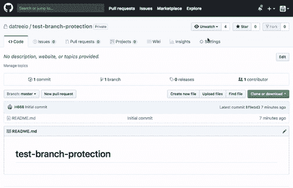
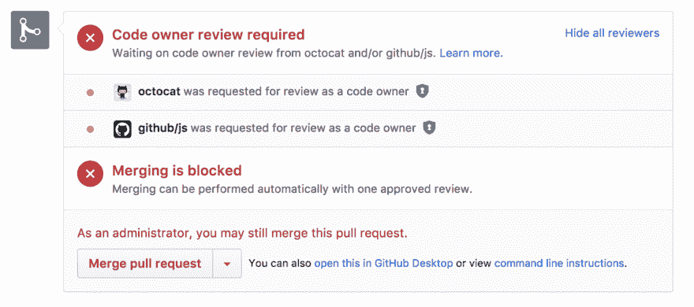
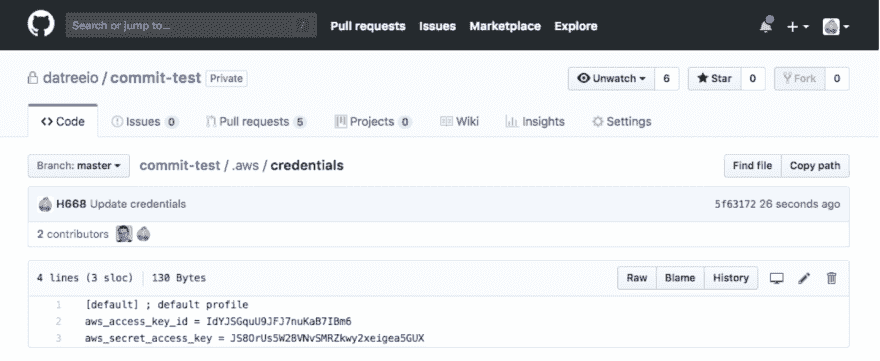
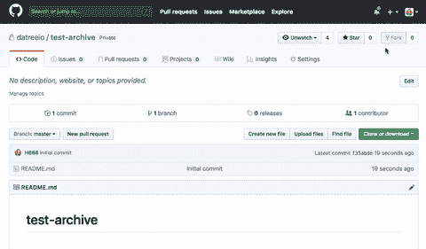
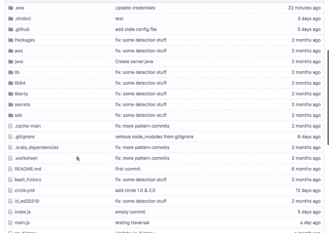
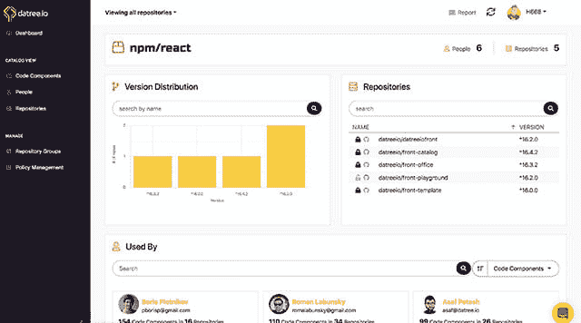

# 十大 GitHub 最佳实践

> 原文：<https://dev.to/datreeio/top-10-github-best-practices-3kl2>

在扫描了数千个存储库并采访了数百个 GitHub 之后，我创建了一个通用最佳实践的列表，强烈建议每个使用 GitHub 存储代码的现代软件开发组织都采用这个列表:

## 9。🚧保护主要分支免于直接提交

主分支中的任何东西都应该是可部署的，这就是为什么你永远不应该直接提交到默认分支，也是为什么 [Gitflow workflow](https://nvie.com/posts/a-successful-git-branching-model/) 已经成为标准。使用[分支保护](https://help.github.com/articles/configuring-protected-branches/)可以帮助你防止直接提交，当然，一切都应该通过拉请求来管理。

## 8。👻避免无法识别的提交者

也许你正在一个新的环境中工作，或者你没有注意到你的 [Git 配置是不正确的](https://help.github.com/articles/why-are-my-commits-linked-to-the-wrong-user/)，这导致用户用错误的电子邮件地址提交代码。现在，他们的提交与正确的用户没有关联，这使得几乎不可能追溯到谁写了什么。

确保您的 [Git 客户端配置了正确的电子邮件地址](https://help.github.com/articles/setting-your-commit-email-address-in-git/)，并链接到您的 GitHub 用户。在代码审查期间检查您的拉请求，看是否有未识别的提交。

## 7。🎩为每个存储库定义代码所有者

使用 [CODEOWNERS](https://help.github.com/articles/about-codeowners/) 特性允许您定义哪些团队和人员被自动选为存储库的评审者。这种能力会自动向存储库所有者请求审查。如今，组织有几十个甚至几百个存储库，代码所有者可以选择定义组织中谁是 repo 维护者。

## 6。🙊将秘密凭证与源代码分开

在构建云原生应用时，我们会保护许多秘密——帐户密码、API 密钥、私有令牌和 SSH 密钥。绝不！在你的代码中加入任何秘密。相反，使用从安全存储外部注入的环境变量。

你可以使用像 [Vault](https://www.vaultproject.io/) 和 [AWS Secrets Manager](https://aws.amazon.com/secrets-manager/) 这样的工具来帮助你在生产中进行秘密管理。

有很多很棒的工具可以识别代码中已有的秘密并防止新的秘密。例如， [Git-secrets](https://dev.toGit-secrets) 可以帮助你识别代码中的密码。使用 [Git 钩子](https://githooks.com/)你可以构建一个[预提交钩子](https://github.com/git/git/blob/master/templates/hooks--pre-commit.sample)并检查每个 pull 请求的秘密。

## 5。⛔避免将依赖关系提交到项目中

将依赖项推送到远程源将增加存储库的大小。删除您的存储库中包含的任何项目依赖项，并让您的包管理器在每个构建中下载它们。如果你害怕“依赖可用性”，你应该考虑使用二进制存储库管理器解决方案，如 [Jfrog](https://jfrog.com/) 或 [Nexus 存储库](https://www.sonatype.com/nexus-repository-sonatype)。另外，看看 GitHub 的 [Git-Sizer](https://github.com/github/git-sizer) 。

## 4。🔧将配置文件与源代码分开

我们强烈建议不要将本地配置文件提交给版本控制。通常，这些是私有配置文件，您不希望将它们推送到远程，因为它们包含机密、个人偏好、历史或一般信息，这些信息应该只保留在您的本地环境中。

## 📤 3.创造一个有意义的。git 忽略项目文件

答。gitignore file 是每个存储库中必须忽略的预定义文件和目录。它将帮助您防止密钥、依赖性和代码中许多其他可能的差异。你可以从 [Gitignore.io](https://www.gitignore.io/) 中选择一个相关的模板。

## 2。💀归档失效的存储库

随着时间的推移，由于各种原因，我们发现自己拥有无人维护的存储库。也许你为一个特别的用例打开了一个新的存储库(或者你想 POC 一项新技术)，或者你有一些旧的和不相关的代码的存储库。问题是相同的——那些存储库在完成它们的用途后不再被积极地开发，所以你不想维护它们或者其他人会依赖/使用它们。最佳实践总是将这些存储库归档，这将使它们对每个人都是“只读”的。

## 1。🔒锁定包版本

您的清单文件包含关于所有软件包版本的信息，以在每次安装应用程序依赖项时保持一致的结果，而不会破坏您的代码。最佳实践是使用清单锁文件来避免任何差异，并确认您每次都获得相同的包版本。相反的是，您让您的代码组件版本不精确，不确定在下一个构建中将安装哪个版本，您的代码可能会中断。

## 0。♻️对齐包版本控制

尽管您使用的是同一个包，但是不同的版本发行版将使得在不同的项目中重用代码和测试变得更加困难。

如果您有一个在多个项目中使用的包，至少尝试在不同的存储库中使用相同的主要版本。

## 🚀下一步是什么？

剩下你要做的就是在你的每一个仓库中，一个接一个地检查前面提到的每一个最佳实践。

或者，救救你的理智，用 [Datree 的 GitHub app](https://github.com/marketplace/datree/?source=dev.to) (甚至免费！)来扫描您的存储库并生成您的免费状态报告，以评估您的存储库是否符合列出的最佳实践。