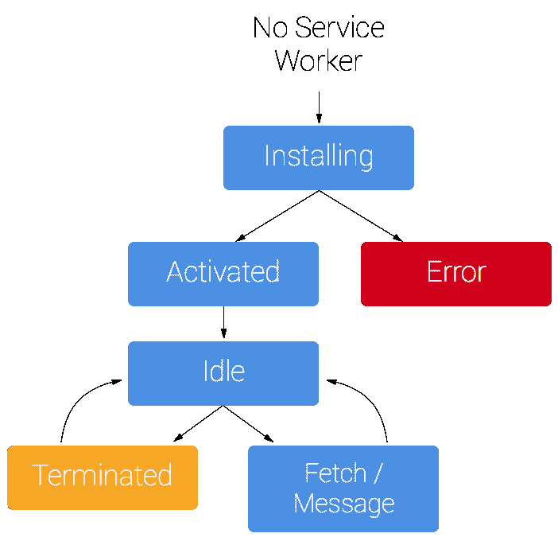
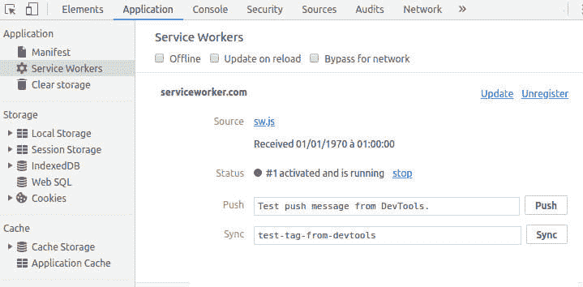

# 先说 PWA 吧

> 原文：<https://dev.to/ekansss/let-s-start-with-pwa-bmd>

去年出现的最流行的技术之一是渐进式网络应用(PWA)。不再需要为每个移动商店构建一个应用程序，每个应用程序都有其约束和特殊性(商店规则、语言、平台限制等)，你的网站**就是你的应用程序**，它(此时)可以在许多机器人和最新的 iOs 系统中运行(【https://caniuse.com/#feat=serviceworkers】T2

但即使这项技术很棒，当你想建立自己的 PWA 时，也很容易迷路，因为他太年轻，stackOverflow 上没有太多的教程甚至解决方案。

### 你会学到什么

*   建立公共工程部
*   使用 ServiceWorker
*   使用脱机功能

### 你不会学到什么

*   使用像 Workbox.js 这样的框架
*   生命、宇宙和其他一切的终极答案(抱歉！)

## 我们开始吧

### 要求

要让移动客户端安装 pwa(例如 android 上的原生弹出窗口)，您需要满足一些要求:

*   你的网站必须在 HTTPS
*   拥有有效的 web 清单
*   注册服务人员

### HTTPS

我不打算解释如何在 https 上设置你的站点，关于这个主题已经有很多了，但是如果你的目标只是发现和测试 PWA，这部分是不需要的，如果你的本地服务器在 chrome 上使用`http://localhost/`，因为多个安全检查在这个 url 上是关闭的，就像对服务人员的 https 要求一样！

### 网页清单

一件简单的事情是实现一个正确的 webmanifest 来告诉 navigator 您有一个 PWA！所以我们开始吧

```
<!-- in your html head -->
<link rel="manifest" href="/manifest.json"> 
```

```
// in /manifest.json
{
  "short_name": "PWA",
  "name": "My first PWA",
  "icons": [
    {
      "src":img/icons-192.png",
      "type": "image/png",
      "sizes": "192x192"
    },
    {
      "src":img/icons-512.png",
      "type": "image/png",
      "sizes": "512x512"
    }
  ],
  "start_url": "/?source=pwa",
  "background_color": "#000000",
  "display": "standalone",
  "scope": "/",
  "theme_color": "#FFFFFF"
} 
```

这里没那么 mch 的东西可说，除了需要`name`(或`short_name`)`icons``start_url``display`之外。

你可以在这里找到关于 PWA 的 webmanifest 的更多信息:[https://developers . Google . com/web/fundamentals/we B- app-manifest/](https://developers.google.com/web/fundamentals/web-app-manifest/)

### 服务人员

这是它，任何 PWA 的核心，一个服务工作者(SW)但是你可能想知道它是什么和它做什么？

*   它是一个 Javascript 工作器，因此它可以接收指令，即使当您的 PWA 或 navigator 关闭时。
*   充当完全可配置网络代理，处理离线情况。

关于 SW 需要知道的一件事是它非常依赖`promise`，所以如果你不了解它，我建议你学习一点！

##### 注册一个软件

```
<script type="text/javascript">
if ('serviceWorker' in navigator) {
  navigator.serviceWorker.register('/sw.js', {'scope': '/').then(function(registration) {
    // Registration was successful
    console.log('ServiceWorker registration successful with scope: ', registration.scope);
  }, function(err) {
    // registration failed :(
    console.log('ServiceWorker registration failed: ', err);
  });
}
</script> 
```

*就把它放在`</body>`前面，例如*

这是一个基本的软件注册，我们测试导航器是否支持功能，然后我们把它添加到客户端。很简单不是吗？

服务范围工人很重要！如果它在站点根目录，它可以监听来自你站点任何地方的任何请求，但是如果它在`/assets/`中，它只会监听来自`/assets/*`页面的请求。

##### 生命周期

软件有一个“应用程序”一样的生命周期，让我们看看。

[](https://res.cloudinary.com/practicaldev/image/fetch/s--rY1mGm7W--/c_limit%2Cf_auto%2Cfl_progressive%2Cq_auto%2Cw_880/https://thepracticaldev.s3.amazonaws.com/i/vvzhocwty8gre1vd1sei.png)

需要提醒的最重要的一点是，服务人员在你的网站标签之外是活跃的，它直接在浏览器中执行，所以当用户关闭你的网站时，它仍然活跃并准备就绪，允许他随时接收推送通知或内容同步！

##### 我们开始吧

现在一切都准备好了，让我们用基本安装为您的第一个服务人员编写代码

```
//sw.js
const cacheName = 'my-cache';
const filesList = [
  '/assets/style.css',
  '/assets/main.js'
];
self.addEventListener('install', (event) => {
  event.waitUntil(
    caches.open(cacheName)
      // Add your file to cache
      .then( (cache) => {
        return cache.addAll(filesList);
      })
      // Tell SW to end 'waiting' state
      .then(() => self.skipWaiting())
  );
})

self.addEventListener('activate', (event) => {
  event.waitUntil(
    // tell browser to use this service worker and not outdated one
    self.clients.claim()
  );
}) 
```

要查看您的软件是否正确安装，例如在 chrome 上，打开 DevTools 并进入应用程序选项卡，您应该会看到如下内容:

[](https://res.cloudinary.com/practicaldev/image/fetch/s--NOi270ov--/c_limit%2Cf_auto%2Cfl_progressive%2Cq_auto%2Cw_880/https://thepracticaldev.s3.amazonaws.com/i/lkvclvt3uzubkyesr9kf.jpg)

### PWA

现在，您的第一个软件已经准备好了，让我们将其升级到 pwa，为了实现这一目标，我们只需要让您的服务人员在我们不在线时做出一些响应，比如一个通用的离线页面。

```
const cacheName = 'my-cache';
const offlinePage = '/offline.html';
const filesList = [
  '/assets/style.css',
  '/assets/main.js',
  offlinePage
];
self.addEventListener('install', (event) => {
  event.waitUntil(
    caches.open(cacheName)
      // Add your file to cache
      .then( (cache) => {
        return cache.addAll(filesList);
      })
      // Tell SW to end 'waiting' state
      .then(() => self.skipWaiting())
  );
})

self.addEventListener('activate', (event) => {
  event.waitUntil(
    // Tell browser to use this service worker and not outdated one
    self.clients.claim()
  );
})

self.addEventListener('fetch', (event) => {
  // If we don't have internet connection and it's a navigation request
  if (!navigator.onLine && event.request.mode === 'navigate') {
    event.respondWith( caches.open(cacheName)
      .then( (cache) => {
        // If we find our offline page in cache, respond with it
        return cache.match(offlinePage)
          .then( (response) => response);
      })
    );
  } else {
    // Return null let browser do his normal behavior
    return;
  } 
```

所以我们只需在开始时添加更多要缓存的文件和一个`fetch`监听器。对于那些想知道人来说，这将把您的 SW 转换成一个本地代理，因此来自您网站的每个请求都将被您的服务人员捕获，并在做任何事情之前进行处理(比如让请求通过或直接用缓存文件进行响应)。

### 享受

您的第一个 PWA 现在可以使用了！对于那些只想快速尝试的人，我做了一个全功能的 github。

##  [埃坎萨斯](https://github.com/ekanSSS) / [ pwa](https://github.com/ekanSSS/pwa)

### pwa 的一些测试和工作

<article class="markdown-body entry-content container-lg" itemprop="text">

# PWA 教程

在这里你可以很容易地测试 PWA basic，

## 安装

在当地进行回购，然后去 index.html。等待服务人员安装，然后切断您的互联网连接，并尝试重新加载页面

PS:不要忘记使用 https 或者 chrome 上的 [http://localhost](http://localhost)

</article>

[View on GitHub](https://github.com/ekanSSS/pwa)