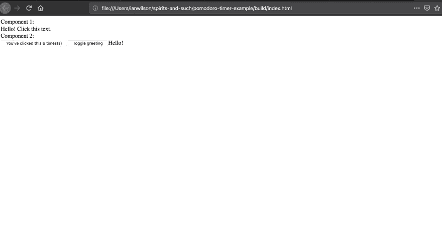
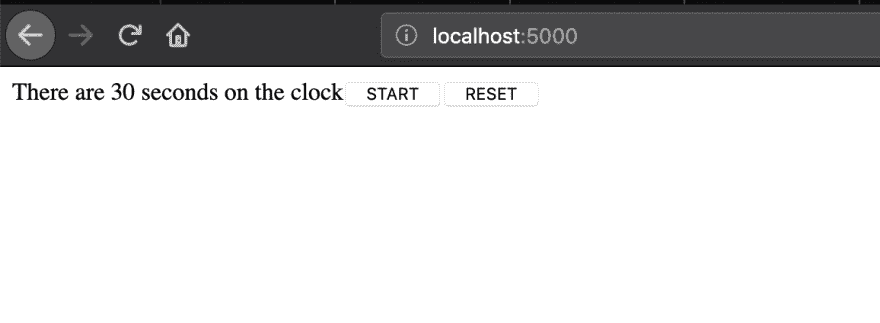
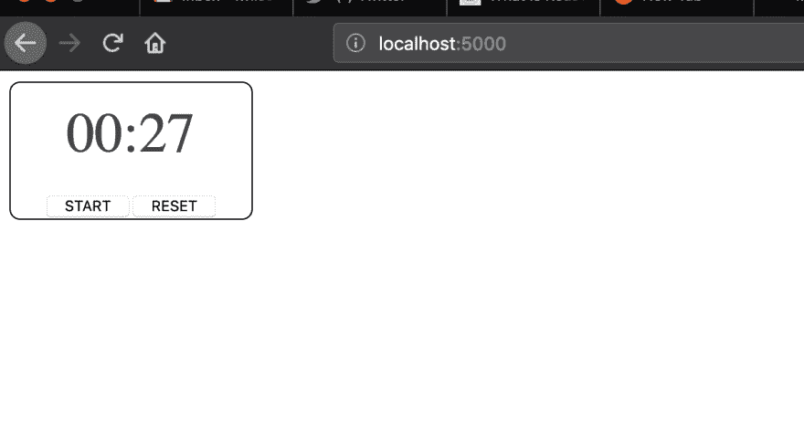
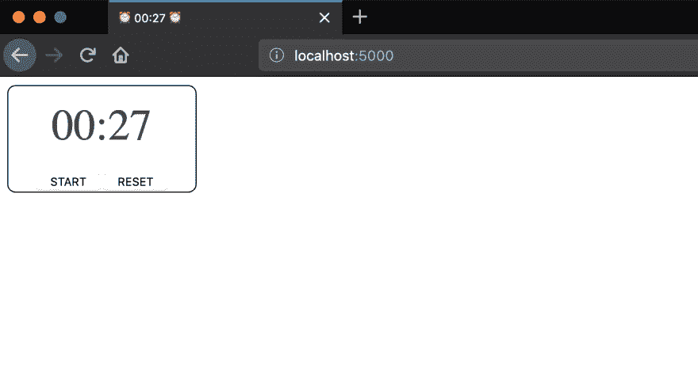

# React 钩子教程——制作番茄定时器

> 原文：<https://dev.to/iwilsonq/reasonml-with-react-hooks-tutorial-building-a-pomodoro-timer-57h0>

*源代码在 github 上[可用](https://github.com/iwilsonq/pomodoro-timer-example)*

ReasonML 是一种结合了 JavaScript 的简单性和 OCaml 的性能的编程语言。JavaScript 程序员应该试试 ReasonML。Reason 继承了 OCaml 的类型系统以及 JavaScript 的易用性。

有了 [ReasonReact](https://reasonml.github.io/reason-react/) 和 [BuckleScript](https://bucklescript.github.io/) ，我们可以将 Reason 代码编译成 JavaScript，就像以前的 React 一样工作。

但这还不是全部，因为理性生态系统，事情变得更好了。上周早些时候，reason React 0 . 7 . 0 版本下降，支持 React 挂钩。我们现在可以用 React 挂钩构建健壮的组件，这些组件:

*   消除重复的生命周期逻辑(如 componentDidMount、componentDidUpdate 和 componentWillUnmount)
*   消除对复杂模式的需求，如高阶组件或渲染道具
*   让有状态组件的重构变得更加容易

思考一下最后一点，还有什么能让我们更容易重构？

坚如磐石的类型系统和有用的编译器！

今天，我们要用 Reason 和 React 来建造一个像这样的番茄定时器[。](https://tomato-timer.com/)

番茄定时器可以让你设置一个 25 或 30 分钟的定时器，让你知道什么时候停止工作。因为有时候休息一下是好的，你最好相信我在写这篇文章的时候正在休息。

## 初始化项目

第一步是安装 BuckleScript，这是一个将我们的原因代码编译成 JavaScript 的工具。

```
npm install -g bs-platform 
```

Enter fullscreen mode Exit fullscreen mode

之后，我们可以用`init`命令搭建我们的项目，并将`theme`设置为反应钩子。

```
bsb -init pomodoro-timer -theme react-hooks
cd pomodoro-timer && npm install 
```

Enter fullscreen mode Exit fullscreen mode

现在，我们的项目设置，我们可以提到我们的文件夹布局。我们的原因代码属于 src 目录。JavaScript React 项目中通常有一个 index.js 文件，而我们有一个 Index.re 文件。这些文件服务于相同的目的:渲染应用程序根。

由于我们的代码将编译成 JavaScript，我仍然喜欢用 Webpack 这样的捆绑器来捆绑这些文件。

> 提示:使用大写文件名(如 Timer.re ),用 ReasonML 使你的文件夹结构尽可能扁平，这通常被认为是一种最佳实践。关于项目结构的讨论，参见 Reason[docs](https://Reason ml . github . io/docs/en/project-structure # folders)。

### 运行代码

在我清理环境之前，让我们试着运行代码。这将需要两个或三个单独的端子标签:

```
# in one tab
npm start 
```

Enter fullscreen mode Exit fullscreen mode

这会运行`bsb -make-world -w`,它会在每次更改时编译您的原因文件。请注意，它做得很快。

```
# in another tab
npm run webpack 
```

Enter fullscreen mode Exit fullscreen mode

这个命令获取我们编译的 JavaScript，并抛出一个包，然后我们可以使用:
在浏览器中打开它

```
open build/index.html 
```

Enter fullscreen mode Exit fullscreen mode

我更喜欢使用静态文件服务器，比如 zeit/serve。

```
# install `serve` globally
npm i -g serve

# serve it!
serve build/ 
```

Enter fullscreen mode Exit fullscreen mode

[](https://res.cloudinary.com/practicaldev/image/fetch/s--ac8l1Sn9--/c_limit%2Cf_auto%2Cfl_progressive%2Cq_auto%2Cw_880/https://thepracticaldev.s3.amazonaws.com/i/pud90gzv30t0dy35d51h.png)

### 清理环境

我想在编写实现之前清理默认的项目结构。

1.  删除 Component1.re 和 Component2.re 文件，我们将不使用它们。你仍然可以阅读它们，并尝试理解钩子在我们的新环境中是如何工作的。
2.  用下文取代 index.html:

```
<!DOCTYPE html>
<html lang="en">
  <head>
    <meta charset="UTF-8" />
    Pomodoro Timer
  </head>
  <body>
    <div id="root"></div>
    <script src="Index.js"></script>
  </body>
</html> 
```

Enter fullscreen mode Exit fullscreen mode

1.  将 Index.re 替换为以下内容:

```
ReactDOMRe.renderToElementWithId(<Timer />, "root"); 
```

Enter fullscreen mode Exit fullscreen mode

1.  打开 bsconfig.json，将字段“in-source”从 true 更改为 false。这将把我们编译的 JavaScript 输出到 lib/js 目录中。我更喜欢这样，而不是把它们放在我们的根 src 目录中。

2.  通过将 webpack.config.js 更改为以下内容，告诉 webpack 从新位置构建:

```
module.exports = {
  entry: './lib/js/src/Index.bs.js',
  // rest of webpack config
} 
```

Enter fullscreen mode Exit fullscreen mode

现在，所有这些都处理好了，我们可以开始有趣的部分，即实现。

## 构建无状态组件

清理之后，请注意我们正试图呈现一个`Timer`组件，但是我们甚至还没有定义它。让我们编写一个无状态组件来呈现给页面。

```
[@react.component]
let make = () => {
  <div> {ReasonReact.string("One day this will be a timer")} </div>;
}; 
```

Enter fullscreen mode Exit fullscreen mode

我想强调一下这段代码有多简单。在以前的版本中编写无状态 React 组件更加冗长:

```
/* DO NOT WRITE THIS */
let component = ReasonReact.statelessComponent("Timer");
let make = () => {
  ...component,
  render: _children =>  <div> {ReasonReact.string("One day this will be a timer")} </div>;
}; 
```

Enter fullscreen mode Exit fullscreen mode

即使与普通的带有 React 的 JavaScript 相比，这种新语法也非常流畅。使用 Reason 项目，我们不需要在每次创建新文件时都在文件的顶部添加导入层。

## useReducer 挂钩

现在我们要在这个方程中引入一些状态。我们没有任何“类”组件，我们仍在使用功能组件。但是现在我们将使用 React 钩子来构造一个解决方案。

对于我们的计时器，我们至少需要跟踪两件事:

1.  时钟上的秒
2.  不管它是否在滴答作响

当我们考虑任何计时器时，我们通常有三个按钮:`Start`、`Stop`和`Reset`。这些直接映射到用户交互，但是还有一个:T3 本身。即使 tick 不受用户控制，它仍然是一个应该为我们的 reducer 返回一个新状态的动作。

在 Timer.re 的顶部，我们将构建整个应用程序，添加以下内容:

```
type state = {
  seconds: int,
  isTicking: bool
};

type action =
  | Start
  | Stop
  | Reset
  | Tick; 
```

Enter fullscreen mode Exit fullscreen mode

在描述了州的需求和行动之后，实现一个应用程序是多么容易啊！

接下来，我们将更新 make 函数，使用一个缩减器:

```
[@react.component]
let make = () => {
  let (state, dispatch) =
    React.useReducer(
      (state, action) =>
        switch (action) {
        | Start => {...state, isTicking: true}
        | Stop => {...state, isTicking: false}
        | Reset => {...state, seconds: 30}
        | Tick => {...state, seconds: state.seconds - 1}
        },
      {isTicking: false, seconds: 30},
    );

  <div>
    {ReasonReact.string(
       "There are " ++ string_of_int(state.seconds) ++ " on the clock",
     )}
  </div>;
}; 
```

Enter fullscreen mode Exit fullscreen mode

语法类似于 ReactJS。`useReducer`函数返回一个元组，而不是数组。这是因为 JavaScript 不知道元组到底是什么。我们确保在这个缩减器中处理我们的每个动作类型，返回状态的完整副本。

`useReducer`的第二个参数是减速器的初始状态。对于时间来说，将初始时间作为一个道具是有意义的，但我现在就让它这样。

现在我们需要一种方法来调用这些动作。让我们从`Tick`开始，因为它是最复杂的部分。

## 使用效果挂钩

为了每秒更新计时器，我们需要创建一个效果。在 JavaScript 世界中，这意味着在`setInterval`中放置一个回调函数。

让我们在`useReducer`函数和返回的 JSX 之间添加这个钩子。

```
React.useEffect0(() => {
  let timerId = Js.Global.setInterval(() => dispatch(Tick), 1000);
  Some(() => Js.Global.clearInterval(timerId));
}); 
```

Enter fullscreen mode Exit fullscreen mode

如果你记得`useEffect`的工作方式:

*   第一个参数是一个回调函数，在组件安装、更新或卸载时运行。
*   可选地，回调函数可以返回另一个执行清理的函数。这包括取消套接字订阅或清除 setInterval，这样它就不会永远存在。

如果您运行代码并刷新浏览器，您会看到我们的计时器将无限期运行。

它不应该这样做，所以让我们再次更新我们的 reducer 来说明`isTicking`标志是真还是假。我们还将确保`seconds`大于零，这样我们就不会变成负数。

```
let (state, dispatch) =
    React.useReducer(
      (state, action) =>
        switch (action) {
        | Start => {...state, isTicking: true}
        | Stop => {...state, isTicking: false}
        | Reset => {...state, seconds: 30}
        | Tick => state.isTicking && state.seconds > 0
            ? {...state, seconds: state.seconds - 1} : state
        },
      {isTicking: false, seconds: 30},
    ); 
```

Enter fullscreen mode Exit fullscreen mode

现在，您可以通过将`isTicking`设置为 true 并将`seconds`设置为 3 来验证这一点。可爱，这个应用程序现在功能。如果你真的想使用它，刷新你的浏览器，看着它倒计时。

## 与按钮的交互性

为了使这个计时器更好，我将添加按钮。

让我们在与定时器相同的文件中定义一个按钮模块，就在 make 函数的上面。

```
module Button = {
  [@react.component]
  let make = (~label, ~onClick) => {
    <button onClick> {label |> ReasonReact.string} </button>;
  };
}; 
```

Enter fullscreen mode Exit fullscreen mode

这个按钮接受一个标签和一个 onClick 属性。我们可以将它们添加到我们的定时器中，底部的 make 函数如下:

```
[@react.component]
let make = () => {
  /* useReducer */

  /* useEffect0 */

  <div>
      {ReasonReact.string(
        "There are " ++ string_of_int(state.seconds) ++ " seconds on the clock",
      )}
      {state.isTicking
        ? <Button label="STOP" onClick={_event => dispatch(Stop)} />
        : <>
            <Button label="START" onClick={_event => dispatch(Start)} />
            <Button label="RESET" onClick={_event => dispatch(Reset)} />
          </>}
    </div>;
}; 
```

Enter fullscreen mode Exit fullscreen mode

尝试在您的浏览器中运行该程序，您应该会看到:

[](https://res.cloudinary.com/practicaldev/image/fetch/s--iNyq2lja--/c_limit%2Cf_auto%2Cfl_progressive%2Cq_auto%2Cw_880/https://thepracticaldev.s3.amazonaws.com/i/6kfxaery7dmc3cbiub1w.png)

如果您单击开始，它将开始。如果你点击停止，它会停止。重置会将计时器恢复到初始时间。它的工作原理非常简单！

至此，我们的 app 已经**功能完备**。继续读下去，用风格和其他美学细节让它更酷。

## 审美顾虑

让我们添加一些风格，使这个计时器看起来很漂亮。或者至少更好。

将计时器中的 JSX 更新为:

```
[@react.component]
let make = () => {
  /* useReducer */

  /* useEffect0 */
<div
    style={ReactDOMRe.Style.make(
      ~border="1px solid black",
      ~borderRadius="8px",
      ~maxWidth="180px",
      ~textAlign="center",
      (),
    )}>
    <p
      style={ReactDOMRe.Style.make(
        ~color="#444444",
        ~fontSize="42px",
        ~margin="16px 0",
        (),
      )}>
      {state.seconds |> formatTime |> ReasonReact.string}
    </p>
    {state.isTicking
       ? <Button label="STOP" onClick={_event => dispatch(Stop)} />
       : <>
           <Button label="START" onClick={_event => dispatch(Start)} />
           <Button label="RESET" onClick={_event => dispatch(Reset)} />
         </>}
  </div>;
}; 
```

Enter fullscreen mode Exit fullscreen mode

我已经介绍了 ReasonReact 附带的默认样式。它们不是我的首选风格解决方案，因为我更喜欢 bs-css，但是对于这个小项目，它们会做得很好。

我还引入了一个`formatTime`函数。让我们实现这个函数，这样我们的项目就可以编译:

```
let padNumber = numString =>
  if (numString |> int_of_string < 10) {
    "0" ++ numString;
  } else {
    numString;
  };

let formatTime = seconds => {
  let mins = seconds / 60;
  let minsString = mins |> string_of_int |> padNumber;
  let seconds = seconds mod 60;
  let secondsString = seconds |> string_of_int |> padNumber;
  minsString ++ ":" ++ secondsString;
}; 
```

Enter fullscreen mode Exit fullscreen mode

我还包括了`padNumber`，这是一个有用的工具，可以填充小于 10 的分钟和秒钟。这使得计时器对读者更友好。

老实说，这个计时器现在看起来相当不错，我甚至还没有设计按钮。如果读者愿意的话，我会把这个任务留给他们。

[](https://res.cloudinary.com/practicaldev/image/fetch/s--1OaA6ZfQ--/c_limit%2Cf_auto%2Cfl_progressive%2Cq_auto%2Cw_880/https://thepracticaldev.s3.amazonaws.com/i/2w2jymw33xx7497ytldd.png)

## 更新文档标题

浏览器中计时器的概念可以进一步改进。如果我们将剩余时间保存在浏览器标签中，那么如果用户在另一个标签中，它将是可见的。

我们要做的就是更新减速器中的`Tick`动作。我甚至会通过更新文档标题来展示 ReasonML 与 JavaScript 的互操作。注意`%bs.raw`指令，这允许我们戴上 JavaScript 训练轮并直接使用它。

```
let updateTitle: string => unit = [%bs.raw
  {|
  function updateTitle(remaining) {
    document.title = "⏰ " + remaining + " ⏰";
  }|}
];

[@react.component]
let make = () => {
let (state, dispatch) =
    React.useReducer(
      (state, action) =>
        switch (action) {
        | Start => {...state, isTicking: true}
        | Stop => {...state, isTicking: false}
        | Reset => {...state, seconds: 30}
        | Tick =>
          state.isTicking && state.seconds > 0
            ? {
              updateTitle(formatTime(state.seconds - 1));
              {...state, seconds: state.seconds - 1};
            }
            : state
        },
      {isTicking: false, seconds: 30},
    );

/* useEffect0 */

/* JSX return */
}; 
```

Enter fullscreen mode Exit fullscreen mode

至此，我完成了定时器的实现:

[](https://res.cloudinary.com/practicaldev/image/fetch/s--QmOHqZkV--/c_limit%2Cf_auto%2Cfl_progressive%2Cq_auto%2Cw_880/https://thepracticaldev.s3.amazonaws.com/i/qkkcfquk5z1m0y8djbl6.png)

## 总结

在本教程中，我们用 React 钩子处理了更新的 ReasonReact 语法。当 React hooks 在去年年底推出时，我迫不及待地想在 Reason 项目中使用它们。既然它们在这里，我们就可以利用强类型、可组合、功能性的代码。

我们了解到:

*   如何制作一个基本的无状态组件
*   如何使用`useReducer`挂钩
*   如何使用`useEffect`挂钩
*   如何在同一个文件/模块中定义其他 React 组件？
*   如何在 ReasonReact 中使用基本样式
*   如何用`%bs.raw`做互操作

我希望这是一次有趣或有用的经历，一定要在[开发者到](https://dev.to/iwilsonq)、[推特](https://twitter.com/iwilsonq)、[媒体](https://medium.com/@iwilsonq)或我漫游的任何地方关注我的 [@iwilsonq](https://dev.to/iwilsonq) 。

如果您想了解 ReasonML 如何与 GraphQL 无缝协作，请查看我写的这篇关于 ReasonML 与 GraphQL 的文章:

[](/iwilsonq) [## 类型安全 Web 应用程序的未来

### 伊恩·威尔逊 3 月 13 日 199 分钟阅读

#reason #graphql #javascript #functional](/iwilsonq/reasonml-with-graphql-the-future-of-type-safe-web-applications-18o6)

如果你想继续关注未来的帖子，[在这里注册我的时事通讯](https://buttondown.email/iwilsonq)！