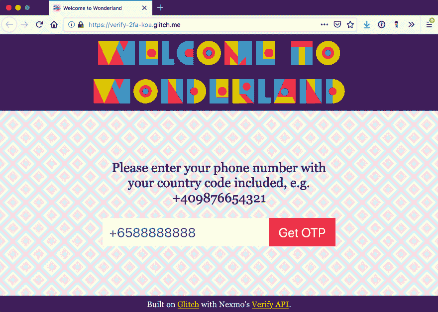
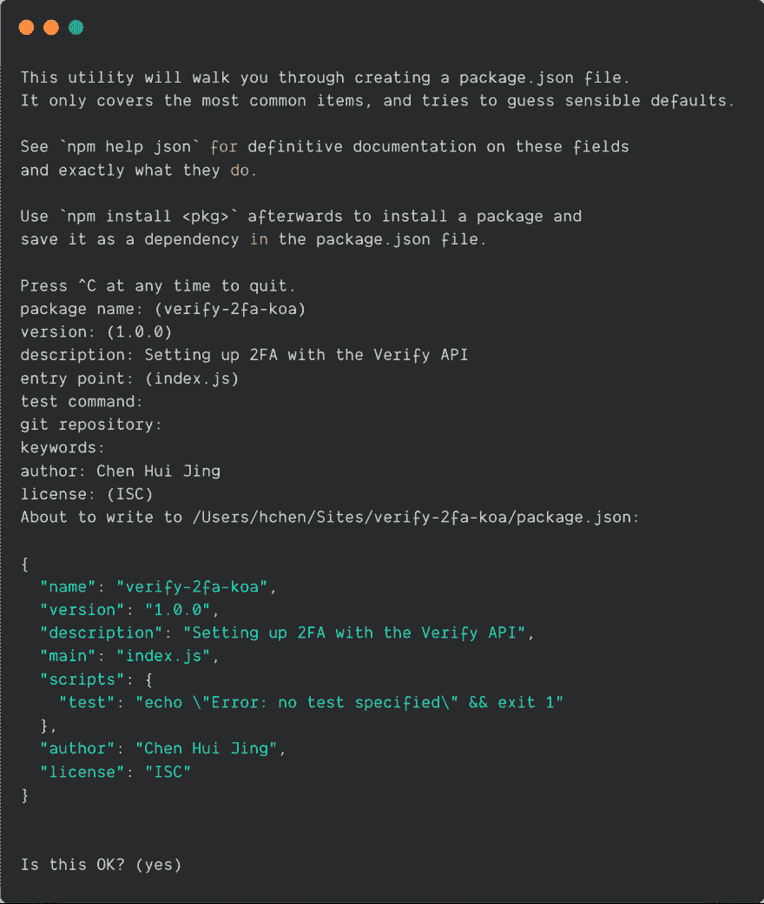
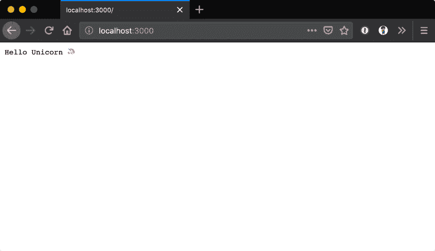

# 向 Node.js Web 应用程序添加双因素身份验证

> 原文：<https://dev.to/vonagedev/add-two-factor-authentication-to-node-js-web-apps-1k2h>

双因素身份验证(2FA)得名于这样一个事实，即您需要两样东西来验证您的身份。您知道的一些东西，如密码，以及您拥有的一些东西，如来自您的移动设备或物理令牌的验证码。

将 2FA 添加到您的应用程序中并不是一件困难的事情。本教程将介绍如何在 Nexmo Verify API 的帮助下，为您的 web 应用程序和服务实现 2FA，以获得额外的安全层。我们将构建一个简单的 Koa.js 应用程序来理解底层机制是如何工作的。这将使您更容易看到它如何适合您自己的现有项目，即使您没有使用 Koa.js。

你可以从一个要求用户输入手机号码的登录页面开始。提交后，他们会被要求输入验证码，验证码会通过短信发送到他们的手机号码。一旦完成排序，他们就可以访问应用程序了。

## 先决条件

*   对 Javascript 的基本理解
*   安装在您机器上的 [Node.js](https://nodejs.org/en/download/)
*   一个 [Nexmo](https://dashboard.nexmo.com/sign-up) 帐户(用于您的 API 凭证)

本教程将带你从头开始这个过程。如果您想看到完成的代码，您可以克隆这个项目的 [git 库](https://github.com/nexmo-community/verify-2fa-koa)。我们还有一个 Glitch 版本，它有一个更夸张的设计，你也可以[重新混音](https://glitch.com/edit/#!/remix/verify-2fa-koa)。请注意，它们对于 Glitch 实现略有不同，以适应项目在平台上的托管方式。

[](https://res.cloudinary.com/practicaldev/image/fetch/s--28EeUWPd--/c_limit%2Cf_auto%2Cfl_progressive%2Cq_auto%2Cw_880/https://cdn.glitch.com/e53b88bf-b990-43c3-8efd-a5141145a96c%252Fglitch.png%3F1554816007328)

## 从零开始一个 Koa.js 项目

在本地计算机上创建一个项目文件夹，然后运行以下命令来设置一个新的 Node.js 项目。

```
npm init 
```

Enter fullscreen mode Exit fullscreen mode

这将触发一系列提示，生成您的`package.json`文件。如果愿意，您可以选择将答案留空以使用默认值。

[](https://res.cloudinary.com/practicaldev/image/fetch/s--niuEw8Zb--/c_limit%2Cf_auto%2Cfl_progressive%2Cq_auto%2Cw_880/https://cdn.glitch.com/e53b88bf-b990-43c3-8efd-a5141145a96c%252Fnpm-init.png%3F1554655286468)

接下来，安装 [Koa.js](https://koajs.com/) 。请注意，Koa 需要 7.6.0 或更高版本的节点来支持 ES2015 和异步功能。

```
npm install koa --save 
```

Enter fullscreen mode Exit fullscreen mode

在项目文件夹中创建一个`server.js`文件。

```
touch server.js 
```

Enter fullscreen mode Exit fullscreen mode

将以下代码粘贴到新创建的文件中。

```
const Koa = require('koa')
const port = process.env.PORT || 3000
const app = new Koa()

app.use(async ctx => {
  ctx.body = 'Hello Unicorn 🦄'
})

const listener = app.listen(port, function() {
  console.log('Your app is listening on port ' + listener.address().port)
}) 
```

Enter fullscreen mode Exit fullscreen mode

运行`server.js`文件。

```
node server.js 
```

Enter fullscreen mode Exit fullscreen mode

如果你从浏览器导航到`http://localhost:3000`，你应该会看到一个空白页面，上面写着“你好，独角兽🦄".

[](https://res.cloudinary.com/practicaldev/image/fetch/s--Y1SBsHFW--/c_limit%2Cf_auto%2Cfl_progressive%2Cq_auto%2Cw_880/https://cdn.glitch.com/e53b88bf-b990-43c3-8efd-a5141145a96c%252Fkoa-server.png%3F1554656108532)

您还应该安装 [dotenv](https://www.npmjs.com/package/dotenv) ，它允许您将存储在`.env`文件中的环境变量加载到`process.env`中。

```
npm install dotenv --save 
```

Enter fullscreen mode Exit fullscreen mode

现在您可以创建`.env`文件，它至少应该包含以下变量:

```
NEXMO_API_KEY=''
NEXMO_API_SECRET='' 
```

Enter fullscreen mode Exit fullscreen mode

要访问环境变量，你必须需要它，最好是在你的`server.js`文件的顶部。

```
require('dotenv').config() 
```

Enter fullscreen mode Exit fullscreen mode

如果你还没有注册一个 Nexmo 账户，现在是时候了。一旦您登录到仪表板，您首先看到的应该是您的 API 凭证。请务必用引号将您的密钥和机密括起来。

## 项目结构

现在，你的项目可能只有一个`package.json`、一个`server.js`和一个`.env`文件。让我们设置项目结构，这样您就可以有一个基本的前端供用户进行交互。

```
PROJECT_NAME/               
    |-- public/             
    | |-- client.js
    | `-- style.css
    |-- views/
    | `-- index.html
    |-- .env
    |-- package.json
    `-- server.js 
```

Enter fullscreen mode Exit fullscreen mode

这样，您必须对`server.js`文件进行一些调整，以服务于`index.html`文件和相关资产，而不仅仅是一行文本。Koa.js 是一个相当简单的框架，所以任何路由或服务静态资产的附加功能都需要单独安装。以下是附加模块及其用途的列表:

*   `koa-static`用于服务静态资产
*   `koa-bodyparser`用于处理通过 POST 请求发送的数据
*   `koa-router`为路由
*   `koa-views`渲染模板

这个例子也使用了 [Nunjucks](https://mozilla.github.io/nunjucks/) 来呈现模板文件。Nexmo Verify API 将用于通过 SMS 触发验证码，因此您还需要安装 Nexmo 的 Node.js 客户端库。

```
npm install koa-static koa-bodyparser koa-router koa-views nunjucks nexmo --save 
```

Enter fullscreen mode Exit fullscreen mode

## 服务静态资产和 HTML 文件

以允许应用程序服务于静态资产。像样式表和客户端 Javascript 一样，在 */public* 文件夹中，您可以将以下内容添加到`server.js`文件中:

```
const serve = require('koa-static')
app.use(serve('./public')) 
```

Enter fullscreen mode Exit fullscreen mode

为了提供来自*/视图*文件夹的 HTML 文件，你可以使用`koa-views`，它提供了一个`render()`功能。本例中使用的模板引擎是 Nunjucks，但是您可以自由选择最适合您的模板引擎。

```
const views = require('koa-views')
app.use(views('./views', { map: { html: 'nunjucks' }})) 
```

Enter fullscreen mode Exit fullscreen mode

接下来要设置的是为应用程序页面提供服务的一些基本路线。

```
const Router = require('koa-router')
const router = new Router()

router.get('/', (ctx, next) => {
  return ctx.render('./index')
})

app.use(router.routes()).use(router.allowedMethods()) 
```

Enter fullscreen mode Exit fullscreen mode

对于这个例子，您将需要 3 个页面，`index.html`作为主登录页面，`verify.html`供用户输入他们的验证码，`result.html`显示验证是否成功。

web 表单的结构相当简单，您可以随意用 CSS 修饰它。

```
<form method="post" action="verify">
  <input name="phone" type="tel" placeholder="+6588888888">
  <button>Get OTP</button>
</form> 
```

Enter fullscreen mode Exit fullscreen mode

该表单将用户输入发布到`/verify`路线，您可以使用输入中的电话号码来触发验证码请求。类似的表格也可用于`/check`和`/cancel`的其他两条路线。

```
<form method="post" action="check">
  <input name="pin" placeholder="Enter PIN">
  <input name="reqId" type="hidden" value="">
  <button>Verify</button>
</form>

<form method="post" action="cancel">
  <input name="reqId" type="hidden" value="">
  <button class="inline">Cancel verification</button>
</form> 
```

Enter fullscreen mode Exit fullscreen mode

## 处理用户输入

然后，为了通过 web 表单处理用户输入，您还需要一些路由来处理`POST`请求。务必在任何路线之前声明`bodyparser()`。

```
const bodyParser = require('koa-bodyparser')

/* This should appear before any routes */
app.use(bodyParser())

router.post('/verify/', async (ctx, next) => {
  const payload = await ctx.request.body
  /* Function to trigger verification code here */
})

router.post('/check/', async (ctx, next) => {
  const payload = await ctx.request.body
  /* Function to check verification code here */
})

router.post('/cancel/', async (ctx, next) => {
  const payload = await ctx.request.body
  /* Function to cancel verification code here */
}) 
```

Enter fullscreen mode Exit fullscreen mode

既然您已经能够接收用户的电话号码，那么您将需要使用 Verify API 向它发送一个 PIN 码。用你的凭证初始化一个新的 Nexmo 实例。

```
const Nexmo = require('nexmo');
const nexmo = new Nexmo({
  apiKey: YOUR_API_KEY,
  apiSecret: YOUR_API_SECRET
}); 
```

Enter fullscreen mode Exit fullscreen mode

我们需要处理 3 个功能。第一种是通过`nexmo.verify.request()`功能触发验证码。它包括用户的电话号码和品牌名称的字符串，该字符串将作为发送者显示给用户。

```
async function verify(number) {
  return new Promise(function(resolve, reject) {
    nexmo.verify.request({
      number: number,
      brand: process.env.NEXMO_BRAND_NAME
    }, (err, result) => {
      if (err) {
        console.error(err)
        reject(err)
      } else {
        resolve(result)
      }
    })
  })
} 
```

Enter fullscreen mode Exit fullscreen mode

一旦您的用户通过短信收到 PIN 码，他们必须将其提交给`nexmo.verify.check()`功能，以便进行验证。您会注意到一个`request_id`参数。当 PIN 码被成功触发时，获得该值。有很多方法可以将请求 ID 传递给`nexmo.verify.check()`函数，这个例子使用了 *check* 表单中的一个隐藏字段。

```
async function check(reqId, code) {
  return new Promise(function(resolve, reject) {
    nexmo.verify.check({
      request_id: reqId,
      code: code
    }, (err, result) => {
      if (err) {
        console.error(err)
        reject(err)
      } else {
        resolve(result)
      }
    })
  })
} 
```

Enter fullscreen mode Exit fullscreen mode

如果用户改变主意，最后一个功能可以让他们选择取消验证。它使用`nexmo.verify.control()`函数，同样需要触发 PIN 码生成的请求 ID 和一个字符串值`cancel`。

```
async function cancel(reqId) {
  return new Promise(function(resolve, reject) {
    nexmo.verify.control({
      request_id: reqId,
      cmd: 'cancel'
    }, (err, result) => {
      if (err) {
        console.error(err)
        reject(err)
      } else {
        resolve(result)
      }
    })
  })
} 
```

Enter fullscreen mode Exit fullscreen mode

[](https://res.cloudinary.com/practicaldev/image/fetch/s--M2WxLK8m--/c_limit%2Cf_auto%2Cfl_progressive%2Cq_auto%2Cw_880/https://cdn.glitch.com/e53b88bf-b990-43c3-8efd-a5141145a96c%252Flanding.png%3F1554815323752)

现在，您需要在我们之前指定的路由中使用这 3 个函数，首先从触发验证码的函数开始。

```
router.post('/verify/', async (ctx, next) => {
  const payload = await ctx.request.body
  const phone = payload.phone

  const result = await verify(phone)
  const reqId = result.request_id 
  ctx.status = 200
  return ctx.render('./verify', { reqId: reqId })
}) 
```

Enter fullscreen mode Exit fullscreen mode

`ctx.request.body`看起来会像这样:

```
{  phone:  '+40987654321'  } 
```

Enter fullscreen mode Exit fullscreen mode

您可以获取该电话号码并将其传递给`verify()`函数。只要是一个有效的电话号码，验证码就会被激活，你会收到一个包含`request_id`和`status`的响应。

```
{  request_id:  '1bf002ecd1e94d8aa81ba7463b19f583',  status:  '0'  } 
```

Enter fullscreen mode Exit fullscreen mode

从那里，您可以将请求 ID 发送到前端，以便在用户输入验证码时使用。

[](https://res.cloudinary.com/practicaldev/image/fetch/s--QF6mIxWa--/c_limit%2Cf_auto%2Cfl_progressive%2Cq_auto%2Cw_880/https://cdn.glitch.com/e53b88bf-b990-43c3-8efd-a5141145a96c%252Fcheck.png%3F1554884941055)

当您的用户提交正确的 PIN 时，您需要将 PIN 和请求 ID 插入到`check()`函数中。

```
router.post('/check/', async (ctx, next) => {
  const payload = await ctx.request.body
  const code = payload.pin
  const reqId = payload.reqId

  const result = await check(reqId, code)
  const status = result.status
  ctx.status = 200
  return ctx.render('./result', { status: status })
}) 
```

Enter fullscreen mode Exit fullscreen mode

同样，这两个值都可以从`ctx.request.body`中获得，如果 PIN 被验证为正确，您将会收到一个类似如下的响应:

```
{  request_id:  '1bf002ecd1e94d8aa81ba7463b19f583',  status:  '0',  event_id:  '150000001AC57AB2',  price:  '0.10000000',  currency:  'EUR'  } 
```

Enter fullscreen mode Exit fullscreen mode

然后，您可以利用状态代码来确定您希望向用户显示什么消息。这个例子使用了 Nunjucks，所以结果页面上的标记看起来像这样:

```

<p>Code verified successfully. ¯\_(ツ)_/¯</p>

<p>Something went wrong… ಠ_ಠ</p>
<p>Please contact the administrator for more information.</p>
 
```

Enter fullscreen mode Exit fullscreen mode

[](https://res.cloudinary.com/practicaldev/image/fetch/s--Cky5FJOQ--/c_limit%2Cf_auto%2Cfl_progressive%2Cq_auto%2Cw_880/https://cdn.glitch.com/e53b88bf-b990-43c3-8efd-a5141145a96c%252Fmessage.png%3F1554885944796)

这是对代码每一部分的彻底分解，但是为了查看应用程序整体的样子，请查看 GitHub 上的[源代码。](https://github.com/nexmo-community/verify-2fa-koa)

## 额外要照顾的东西

本教程是一个精简版，只强调实现双因素身份验证所必需的部分。但是在实际应用中有许多事情需要注意。其中最重要的是错误处理。对于成功的查询，Verify API 返回状态值`0`,但是任何其他值都表示错误。

应该处理这些错误，并且前端的用户界面应该反映任何阻止成功验证的潜在错误。实现某种前端验证或者甚至利用 Nexmo 的 [Number Insight API](https://developer.nexmo.com/number-insight/overview) 来确保只有有效的电话号码被传递给 Verify API 也是一个好主意。

## 下一步去哪里？

如果您热衷于使用这些 API 做更多的事情，下面是一些可能对您有帮助的链接:

*   [开发人员门户上验证 API 的文档](https://developer.nexmo.com/verify/overview)
*   各种 Nexmo APIs 的系列教程
*   如果你需要我们，试试 [Nexmo 社区 Slack 频道](https://developer.nexmo.com/community/slack)
*   请发推文到 [@NexmoDev](https://twitter.com/nexmodev) 让我们知道你的想法