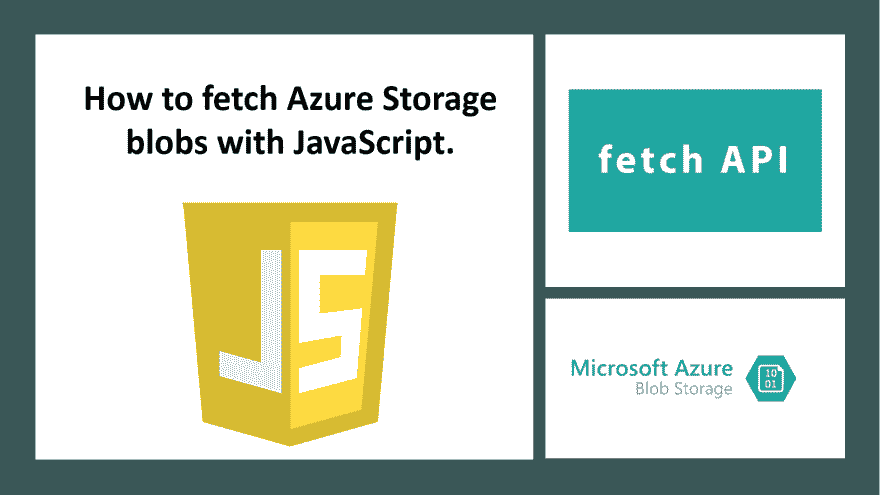

# 如何用 JavaScript 获取 Azure Blob 存储

> 原文：<https://dev.to/azure/how-to-fetch-azure-blob-storage-with-javascript-o0>

[](https://res.cloudinary.com/practicaldev/image/fetch/s--xclgkMTy--/c_limit%2Cf_auto%2Cfl_progressive%2Cq_auto%2Cw_880/https://cdn-images-1.medium.com/max/2560/1%2AUhIm-ux8JST2wGPpAqBQ0A.png)

Tldr 这篇文章介绍了 Azure Blob 存储和 Javascript fetch api，并在下面提供了一个代码示例，用于将公共 Blob 快速集成到自己的应用程序中。

Azure Blob 服务为您的所有应用程序非结构化数据提供可扩展、经济高效的云存储。

[](https://res.cloudinary.com/practicaldev/image/fetch/s--EW28bZ2Y--/c_limit%2Cf_auto%2Cfl_progressive%2Cq_auto%2Cw_880/https://cdn-images-1.medium.com/max/800/1%2A07Zm0VRbTZbi0lykNIoxUw.png)

点击[此处](https://docs.microsoft.com/en-us/azure/storage/blobs/storage-blobs-introduction?WT.mc_id=blog-devto-abornst)了解更多关于 blob 存储的信息。

使用 blob 存储，开发人员只需为他们使用的内容付费，与本地存储选项相比，可以节省资金。

在 web 应用程序中，我们可以使用 blobs 做任何事情，从存储图像和视频内容到实际托管我们的客户端应用程序逻辑和用于动态加载的样式表。通过这种方式，你只需为用户实际使用而你并不需要的网站托管部分付费。

## Blob 存储简介 Azure 中的对象存储

Azure Blob 存储存储大量的非结构化对象数据，如文本或二进制数据。根据您访问数据的频率，从四个存储层中进行选择。将对性能敏感的数据存储在高级存储中，将经常访问的数据存储在热存储中，将不常访问的数据存储在冷存储中，将很少访问的数据存储在归档中。如果你想开始使用 Azure，请点击[此处](https://azure.microsoft.com/en-us/offers/ms-azr-0044p/?WT.mc_id=medium-blog-abornst)获取免费帐户。

## Blob 服务休息 API

[Blob 服务 REST API](https://docs.microsoft.com/en-us/rest/api/storageservices/blob-service-rest-api?WT.mc_id=blog-medium-abornst) 将文本和二进制数据作为 Blob 存储在云中。

## 获取 API

[获取 API](https://developer.mozilla.org/en-US/docs/Web/API/Fetch_API) 提供了获取资源的接口(包括跨网络)。虽然 fetch 本身支持 JSON 响应，但它可以通过窗口进行扩展。DOMParser 支持 XML 数据，例如从 Blob Storage REST API 返回的数据，如下例所示。

```
fetch("https://{namespace}.blob.core.windows.net/{containerName}/?restype=container&comp=list")
.then(response => response.text())
.then(str => new window.DOMParser().parseFromString(str, "text/xml"))
.then(xml => {
  let blobList = Array.from(xml.querySelectorAll("Url")); //.getAttribute("Url");
  blobList.forEach(async blobUrl => {
      console.log(blobUrl);
  }); 
```

好了，你有了开始使用 Azure Blob 存储的客户端消费所需的代码，希望这对你的 Azure 之旅有所帮助。

## 关于作者

亚伦(阿里)博恩施泰因是一个狂热的人工智能爱好者，对历史充满热情，致力于新技术和计算医学。作为微软云开发倡导团队的开源工程师，他与以色列高科技社区合作，用改变游戏规则的技术解决现实世界的问题，然后将这些技术记录在案、开源并与世界其他地方共享。