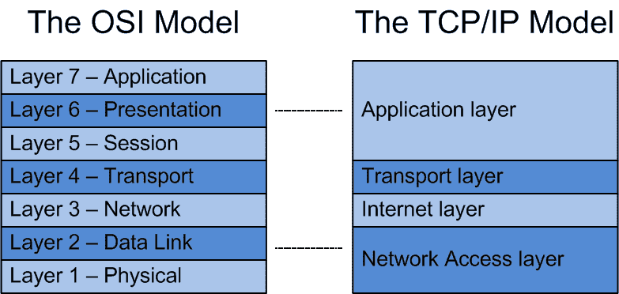
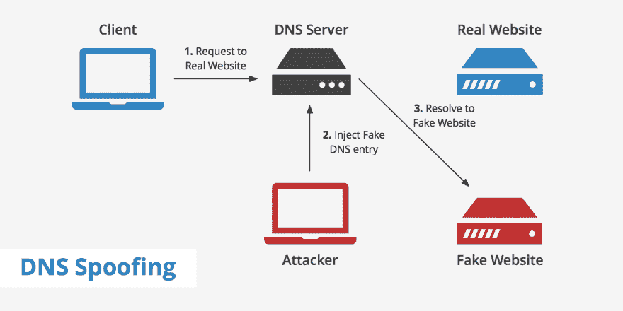

# 面向前端人员的全栈第 1 部分

> 原文：<https://dev.to/thisguymartin/full-stack-for-frontender-folks-part-1-48g3>

在这篇文章中，我将首先说明什么是 IP 地址、DNS、服务器等等，以便您部署您的第一台服务器。

### 互联网是如何工作的？

对于那些已经获得计算机科学学位的人来说，这些就是互联网是如何被创造出来的。

[](https://res.cloudinary.com/practicaldev/image/fetch/s--0hztxNwc--/c_limit%2Cf_auto%2Cfl_progressive%2Cq_auto%2Cw_880/https://thepracticaldev.s3.amazonaws.com/i/ep3vlbem4nn8noie8xlj.png)

这七层功能由应用程序、操作系统、网卡设备驱动程序和网络硬件的组合提供，使系统能够通过网络以太网或光缆或通过 Wi-Fi 或机器或设备中的其他无线协议传输信号。

如果你想了解互联网的不同层次，这里有一篇好文章[网络的第七层](http://blog.boson.com/bid/102913/The-Seven-Layers-of-Networking-Part-III)

### 什么是域？

让我们从什么是域开始。域名只是一个 IP 地址的包装。作为工程师，最常见的是 127.0.0.1，它代表 localhost。essense 中的 Localhost 只是 127.0.0.1 的一个包装器，它总是你的本地机器 IP 地址。

你可能听说过域和子域。域名主要用作网站名称。子域依赖于标准域。

```
 example: domain

martinpatino.com

example: subdomain

blog.martinpatino.com 
```

Enter fullscreen mode Exit fullscreen mode

### 什么是 IP 地址？

IP 地址代表互联网协议，它是一种通过网络进行通信的协议。IP 地址是分配给连接到使用 IP 进行通信的计算机网络的每台设备的数字标签。IP 地址有两个主要功能:主机或网络接口识别和位置寻址。

```
Example: 

 172.16.254.1 
```

Enter fullscreen mode Exit fullscreen mode

有许多协议，但 IP 地址是最常见的开发者。互联网使用 TCP 协议，这是一个完整的网络课程，我不会进入。然而，如果你有兴趣学习更多关于 TCP 的知识，这里有一篇文章可以帮助你学习更多的 [TCP](https://searchnetworking.techtarget.com/definition/TCP) 。

### 什么是 DNS？

简单来说，DNS 代表域名系统，负责将 IP 地址映射到域。所以把它组合在一起就像这样

```
martinpatino.com == 23.12.185.66 
```

Enter fullscreen mode Exit fullscreen mode

DNS 有多层兑现，这有助于提高速度，你的机器不必每次都解析 IP 地址。如果您的第一层没有映射到 DNS IP 地址，那么它将解析到第二层，如果没有，那么第三层，直到它被解析，这可以由某个服务器更新。

第一层:本地缓存
第二层:局域网 DNS 服务器(调制解调器也有本地缓存)
ISP DNS 服务器:有自己的本地缓存

故障排除场景:假设您的门户网站关闭了。可能不是你的服务器坏了，而是你的 DNS 坏了。一个简单的测试就是 ping 你的网站/门户。如果你得到一个响应，那么你的服务器已经启动并运行，否则你将会超时。

```
ping google.com 

response:

PING google.com(lax28s01-in-x0e.1e100.net (2607:f8b0:4007:801::200e)) 56 data bytes
64 bytes from lax28s01-in-x0e.1e100.net (2607:f8b0:4007:801::200e): icmp_seq=1 ttl=55 time=23.8 ms
64 bytes from lax28s01-in-x0e.1e100.net (2607:f8b0:4007:801::200e): icmp_seq=2 ttl=55 time=22.2 ms 
```

Enter fullscreen mode Exit fullscreen mode

#### 安全问题(DNS)

DNS 的安全问题称为 DNS 欺骗。当特定 DNS 服务器的记录被恶意“欺骗”或更改以将流量重定向到攻击者时，就会发生 DNS 欺骗。

[](https://res.cloudinary.com/practicaldev/image/fetch/s--yENEC3Ho--/c_limit%2Cf_auto%2Cfl_progressive%2Cq_auto%2Cw_880/https://thepracticaldev.s3.amazonaws.com/i/6nrislv8qtvzo6h49d6l.png)

目前解决这个问题的方法是利用 https，它创建一个握手，并确认您就是您所说的那个人。DNS 欺骗通常在 HTTPS 网站上不起作用，除非客户端选择忽略警告标志，或者您设法获得了该网站的私钥。

##### 什么是 SSH？

SSH 代表 Secure Shell，这是一种加密网络协议，用于在不安全的网络上安全地运行网络服务。典型的应用程序包括远程命令行登录和远程命令执行，但是任何网络服务都可以使用 SSH 来保护。

```
Example of a ssh being executed

ssh student@45.55.12.123 
```

Enter fullscreen mode Exit fullscreen mode

为了使用 ssh，您需要用户名/密码或 ssh 密钥来登录服务器。最好的做法是使用 ssh 密钥，而不是用户名和密码，因为我们很容易记住密码，而密码可能在几分钟内被破解。

大多数人常用的密码是:

*   One hundred and twenty-three thousand four hundred and fifty-six
*   密码
*   One hundred and twenty-three million four hundred and fifty-six thousand seven hundred and eighty-nine
*   Twelve million three hundred and forty-five thousand six hundred and seventy-eight
*   one two three four five
*   One hundred and eleven thousand one hundred and eleven
*   One million two hundred and thirty-four thousand five hundred and sixty-seven

为了开始使用 ssh 密钥，您必须生成您的机器的 ssh 密钥。生成一个 ssh 密钥，它由两个密钥组成，一个公钥和一个私钥。公钥存储在服务器上，私钥保存在您的机器上。可以把它想象成一个双向锁，为了解密机器之间发送的信息，它需要私钥和公钥。

生成生成 ssh 密钥的方式:

```
 some user (11:39) ~>  ssh-keygen
Generating public/private rsa key pair.
Enter file in which to save the key (/home/ylo/.ssh/id_rsa): 
Enter passphrase (empty for no passphrase): 
Enter same passphrase again: 
Your identification has been saved in /home/ylo/.ssh/id_rsa.
Your public key has been saved in /home/ylo/.ssh/id_rsa.pub.
The key fingerprint is:
SHA256:Up6KjbnEV4Hgfo75YM393QdQsK3Z0aTNBz0DoirrW+c ylo@klar
The key's randomart image is:
+---[RSA 2048]----+
|    .      ..oo..|
|   . . .  . .o.X.|
|    . . o.  ..+ B|
|   .   o.o  .+ ..|
|    ..o.S   o..  |
|   . %o=      .  |
|    @.B...     . |
|   o.=. o. . .  .|
|    .oo  E. . .. |
+----[SHA256]-----+
klar (11:40) ~> 
```

Enter fullscreen mode Exit fullscreen mode

您应该可以在~/中找到您的 ssh 密钥。ssh 目录。您可以使用这个 ssh 公钥来认证服务器、twitter、github 等。

##### 注意不要丢失或分享你的私钥！

关于生成 ssh-key 信息的更多细节，这里有一个链接[https://www.ssh.com/ssh/keygen/](https://www.ssh.com/ssh/keygen/)

在下一篇文章中，我们将讨论服务器，以及如何运行你自己的 AWS LightSail Ubuntu 服务器。