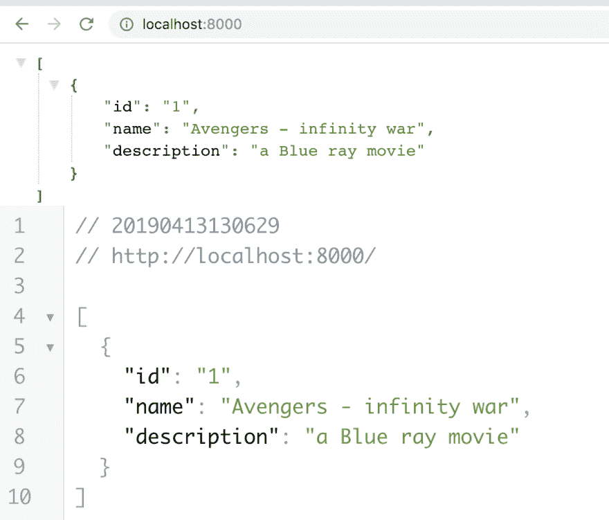
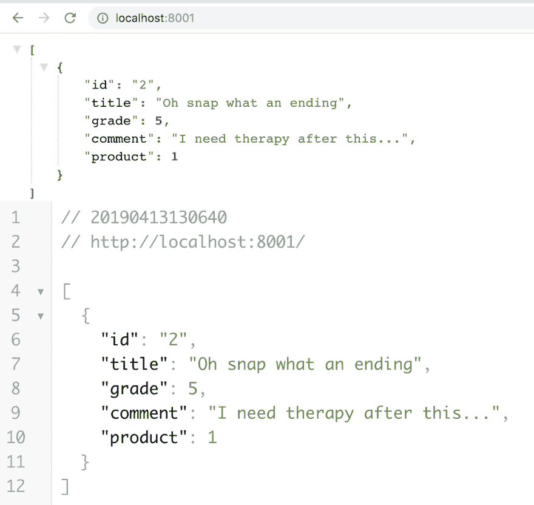
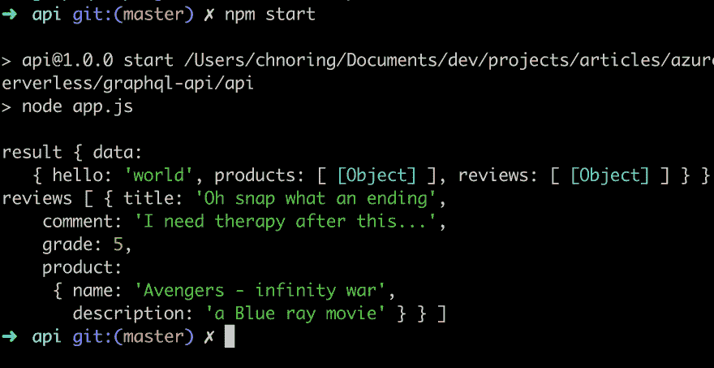

# 了解如何在微服务架构之上构建无服务器的 GraphQL API，第 1 部分

> 原文：<https://dev.to/azure/learn-how-you-can-build-a-serverless-graphql-api-on-top-of-a-microservice-architecture-233g>

在 [Twitter](https://twitter.com/chris_noring) 上关注我，很乐意接受您对主题或改进的建议/Chris

> 这篇文章的想法是展示我们如何构建微服务，将它们 dockerize，并将它们组合在一个 GraphQL API 中，并从一个无服务器的函数中查询它，这对于一个中的许多时髦词汇来说如何？；)*微服务*、 *Docker* 、 *GraphQL* 、*无服务器*

这是系列的一部分:

*   构建微服务和 GraphQL API，第一部分，**我们到了**
*   [将 GraphQL API 托管在一个无服务器应用程序中，并将其全部带到云中，第二部分](https://dev.to/azure/learn-how-you-can-build-a-serverless-graphql-api-on-top-of-a-microservice-architecture-part-ii-deploy-it-to-the-cloud-26b6)

因此，在一篇文章中创建微服务、无服务器和部署到云是相当雄心勃勃的，所以这是一个两部分。这是第一部分。这部分处理微服务和 GraphQL。在第二部分中，我们将它做成无服务器的并进行部署。

在本文中，我们将涵盖:

*   GraphQL 和微服务，这是两个非常好的范例，我们来解释一下是如何做到的
*   **构建**微服务并将它们归档，让我们创建两个微服务，每个微服务都有自己的职责范围，让我们将它们归档
*   **实现 GraphQl** ，我们将展示如何用模式和解析器定义 GraphQl 后端，以及如何查询它，当然，我们也将在这里结合我们的微服务

## 资源

我们会先用`Docker`、`GraphQL`和一些带有 Azure 功能的`Serverless`把你扔进去。这篇文章更多的是关于你可以用上面的技术做什么，所以如果你觉得你需要一个关于上面的入门，这里有一个我写的帖子列表:

*   Docker 上的 5 部分系列，这涵盖了 Docker 的基础知识，它包括 Docker 文件、容器、图像和 Docker 构成
*   [关于 GraphQL 的 3 部分系列](https://dev.to/azure/3-part-series-on-graphql-1fi1)，这涵盖了关于 GraphQL 的基础知识
*   为了能够部署你的服务和托管你的无服务器功能，你需要一个免费的 Azure 账户
*   关于使用 VS 代码的 Azure 函数的教程，这篇文章讲述了如何使用 VS 代码创建无服务器函数
*   [Github repo 用代码创建了一个 GraphQL API 和一个无服务器函数](https://github.com/simonaco/serverless-graphql-workshop)本系列文章深受我的同事[新美乐股份公司·科廷](https://twitter.com/simona_cotin)创建的工作室的启发
*   [云中的容器](https://docs.microsoft.com/en-gb/azure/containers/?wt.mc_id=devto-blog-chnoring)，在本系列的下一部分中，我们将把我们的容器放在云中，阅读云中容器的所有产品是一个好主意

## GraphQL 和微服务

像 GraphQL 这样的库和范例，当它能够将不同的数据源组合成一个并作为一个统一的 API 提供服务时，是最有用的。前端应用程序的开发人员只需使用一个请求就可以查询他们需要的数据。

如今，将整体架构分解成微服务变得越来越常见，因此你可以获得许多独立工作的小 API。GraphQL 和微服务是两个非常好的范例。你想知道什么？GraphQL 非常擅长描述模式，但也将不同的 API 缝合在一起，最终结果对于构建应用程序的人来说非常有用，因为查询数据将非常简单。

不同的 API 正是我们拥有微服务架构时所拥有的。在它的基础上使用 GraphQL 意味着我们可以从我们选择的架构中获益，同时应用程序可以准确地获得它需要的数据。

你想知道什么？请在这篇文章中一直关注我，您将会看到具体是如何做到的。打开您的代码编辑器，因为您将与我一起构建它:)

## 计划

好吧，那我们要建什么？使用电子商务公司作为目标总是令人感激的，因为它包含了许多有趣的问题需要我们去解决。我们将特别关注两个主题，即*产品*和*评论*。当谈到*产品*时，我们需要一种方法来跟踪我们销售的*产品*及其所有元数据。对于*评论*我们需要一种方法为我们的客户提供一种评论我们产品的方法，给它一个`grade`，一个`comment`等等。这两个概念可以看作是两个孤岛，可以独立维护和发展。例如，如果一个产品有了新的描述，就没有理由影响对该产品的审查。

好，那么我们把这两个概念变成`product service`和一个`review service`。

### 为服务的数据结构

这些服务的数据是什么样的？他们还处于起步阶段，所以让我们假设`product service`是一个产品列表，产品看起来像这样:

```
[{
  id: 1,
  name: 'Avengers - infinity war',
  description: 'a Blue-ray movie'
}] 
```

审查服务还将数据保存在一个列表中，如下所示:

```
[{
  id: 2,
  title: 'Oh snap what an ending',
  grade: 5,
  comment: 'I need therapy after this...',
  product: 1
}] 
```

正如您从上面的数据描述中看到的，评论服务保存了对产品服务中的产品的引用，通过查询产品服务，您可以获得评论和相关产品的*全貌*。

### 打卡

好了，我们了解了服务需要根据模式提供什么。服务也需要容器化，所以我们将描述如何使用`Docker` a `Dockerfile`和 Docker Compose 来构建它们。

### GraphQL

所以 GraphQL API 充当这个高级 API，它能够组合来自我们的`product service`和`review service`的结果。它的模式应该是这样的:

```
type Product {
   id: ID,
   name: String,
   description: String
}

type Review {
  id: ID,
  title: String,
  grade: Int,
  comment: String,
  product: Product
} 

type Query {
  products: [Product]
  reviews: [Review]
 } 
```

我们假设，当我们的 GraphQL API 的用户查询评论时，他们希望看到的不仅仅是评论，还有一些关于产品的额外数据，它叫什么，它是什么等等。出于这个原因，我们在上面的模式中的`Review`类型上添加了`product`属性，这样当我们在查询中向下钻取时，我们能够获得评论和产品信息。

### 无服务器

那么*无服务器*在这里起什么作用呢？我们需要一种方法来托管我们的 API。我们可以使用一个应用服务，但是因为我们的 GraphQL API 不需要保存自己的任何状态，它只做一个计算(它组装一个结果),所以让它成为一个轻量级的按需 Azure 函数更有意义。这就是我们要做的:)正如开始时所说的，我们把这个留到我们系列的第二部分，我们不想用一篇太长的文章来烦你:)

## 创建和对接我们的微服务

我们选择让这些服务尽可能简单，所以我们使用 Node.js 和 Express 创建 REST APIs，就像这样:

```
/products
  app.js
  Dockerfile
  package.json
/reviews
  app.js
  Dockerfile
  package.json 
```

`/products`的`app.js`文件看起来像这样:

```
// products/app.js

const express = require('express')
const app = express()
const port = process.env.PORT || 3000

app.get('/', (req, res) => res.json([{
  id: "1",
  name: 'Avengers - infinity war',
  description: 'a Blue ray movie'
}]))
app.listen(port, () => console.log(`Example app listening on port port!`)) 
```

`/reviews`的`app.js`看起来像这样:

```
 // reviews.app.js

const express = require('express')
const app = express()
const port = process.env.PORT  || 3000

app.get('/', (req, res) => res.json([{
  id: "2",
  title: 'Oh snap what an ending',
  grade: 5,
  comment: 'I need therapy after this...',
  product: 1
}]))
app.listen(port, () => console.log(`Example app listening on port port!`)) 
```

看起来几乎一样对吗？嗯，我们现在尽量保持简单，返回静态数据，但是以后添加数据库也很简单。

### 打卡

在我们开始 Dockerizing 之前，我们需要安装我们的依赖关系`Express`，就像这样:

```
npm install express 
```

每个服务都需要这样做。

好的，我们在目录中为您展示了每个服务如何有一个`Dockerfile`。看起来是这样的:

```
// Dockerfile

FROM node:latest
WORKDIR /app
ENV PORT=3000
COPY . .
RUN npm install
EXPOSE $PORT
ENTRYPOINT ["npm", "start"] 
```

让我们上一层，创建一个`docker-compose.yaml`文件，这样更容易创建我们的图像和容器。您的文件系统现在应该看起来像这样:

```
docker.compose.yaml
/products
  app.js
  Dockerfile
  package.json
/reviews
  app.js
  Dockerfile
  package.json 
```

你的`docker-compose.yaml`应该有以下内容:

```
version: '3.3'
services: 
  product-service:
    build:
      context: ./products
    ports:
      - "8000:3000"
    networks: 
      - microservices
  review-service:
    build:
      context: ./reviews
    ports:
      - "8001:3000"
    networks:
      - microservices
networks: 
  microservices: 
```

我们现在可以使用
启动并运行我们的服务

```
docker-compose up -d 
```

当我运行这个命令时，我总是感觉我正在启动一个喷气式发动机，因为我所有的容器同时上升，所以开始点火:)

[](https://res.cloudinary.com/practicaldev/image/fetch/s--X7baEVZX--/c_limit%2Cf_auto%2Cfl_progressive%2Cq_66%2Cw_880/https://thepracticaldev.s3.amazonaws.com/i/249uosy83g8lv4soyfhk.gif)

您应该能够在`http://localhost:8000`找到产品服务，在`http://localhost:8001`找到评论服务。这就是目前的微服务，接下来让我们构建我们的 GraphQL API。

您的产品服务应该如下所示:
[](https://res.cloudinary.com/practicaldev/image/fetch/s--Lc7Lmezq--/c_limit%2Cf_auto%2Cfl_progressive%2Cq_auto%2Cw_880/https://thepracticaldev.s3.amazonaws.com/i/8gdvh8xmjzage2cnkeqs.png)

而你的点评服务应该是这样的:
[](https://res.cloudinary.com/practicaldev/image/fetch/s--hPDsusup--/c_limit%2Cf_auto%2Cfl_progressive%2Cq_auto%2Cw_880/https://thepracticaldev.s3.amazonaws.com/i/l1cmklaig3j0w6olr9tk.png)

## 实现 GraphQL

构建 GraphQL 服务器有很多方法，我们可以使用原始的`graphql` NPM 库或`express-graphql`，这将在 Node.js Express 服务器中托管我们的服务器。或者我们可以用阿波罗号上的。我们选择第一个`graphql`，因为我们最终将从一个无服务器的功能来服务它。

所以我们需要做什么:

1.  定义模式
2.  定义我们可以用来解析模式不同部分的服务
3.  试用 API

### 定义一个模式

现在，这是一个有趣的问题，我们在这里有两个选项来定义模式，要么使用帮助函数`buildSchema()`要么使用原始方法，并使用原语构建我们的模式。在这种情况下，我们将使用原始方法，原因是尽管通读了两遍手册，我还是无法找到如何使用`buildSchema()`深入解决问题的方法。奇怪的是，如果我们使用`express-graphql`或`Apollo`，这很容易做到。如果你觉得眼睛有点出血，很抱歉；)

好，让我们先定义我们的模式:

```
// schema.js

const { 
  GraphQLSchema,
  GraphQLObjectType,
  GraphQLInt,
  GraphQLNonNull,
  GraphQLList,
  GraphQLString
} = require('graphql');

const {
  getProducts,
  getReviews,
  getProduct
} = require('./services');

const reviewType = new GraphQLObjectType({
  name: 'Review',
  description: 'A review',
  fields: () => ({
    id: {
      type: GraphQLNonNull(GraphQLString),
      description: 'The id of Review.',
    },
    title: {
      type: GraphQLString,
      description: 'The title of the Review.',
    },
    comment: {
      type: GraphQLString,
      description: 'The comment of the Review.',
    },
    grade : {
      type: GraphQLInt
    },
    product: {
      type: productType,
      description: 'The product of the Review.',
      resolve: (review) => getProduct(review.product) 
    }
  })
})

const productType = new GraphQLObjectType({
  name: 'Product',
  description: 'A product',
  fields: () => ({
    id: {
      type: GraphQLNonNull(GraphQLString),
      description: 'The id of Product.',
    },
    name: {
      type: GraphQLString,
      description: 'The name of the Product.',
    },
    description: {
      type: GraphQLString,
      description: 'The description of the Product.',
    }
  })
});

const queryType = new GraphQLObjectType({
  name: 'Query',
  fields: () => ({
    hello: {
      type: GraphQLString,
      resolve: (root) => 'world'
    },
    products: {
      type: new GraphQLList(productType),
      resolve: (root) => getProducts(),
    },
    reviews: {
      type: new GraphQLList(reviewType),
      resolve: (root) => getReviews(),
    }
  }),
});

module.exports = new GraphQLSchema({
  query: queryType,
  types: [reviewType, productType],
}); 
```

上面我们定义了两种类型`Review`和`Product`，并公开了两个查询字段`products`和`reviews`。

我希望你们特别注意变量`reviewType`以及我们如何解析`product`字段。这里我们是这样解决的:

```
resolve: (review) => getProduct(review.product) 
```

我们为什么要这么做？嗯，这与数据在评论中的存储方式有关。让我们重温一下。一个评论是这样存储它的数据的:

```
{
  title: ''
  comment: '',
  grade: 5
  product: 1
} 
```

正如你在上面看到的,`product`字段是一个整数。它是指向产品服务中真实产品的外键。所以我们需要解决它，这样 API 可以像这样查询:

```
{
  reviews {
    product { 
      name
    }
  }
} 
```

如果我们不将`product`解析为产品对象，上面的查询就会出错。

### 创建服务

在我们的`schema.js`中，我们调用了像`getProducts()`、`getReviews()`和`getProduct()`这样的方法，我们需要它们存在，所以我们创建了一个文件`services.js`，像这样:

```
const fetch = require('node-fetch');

const getProducts = async() => {
  const res = await fetch(process.env.PRODUCTS_URL)
  const json = res.json();
  return json;
}

const getProduct = async(product) => {
  const products = await getProducts()
  return products.find(p => p.id == product);
} 

const getReviews = async() => {
  const res = await fetch(process.env.REVIEW_URL)
  const json = res.json();
  return json;
}

module.exports = {
  getProducts,
  getReviews,
  getProduct
} 
```

好了，上面我们可以看到方法`getProducts()`和`getReviews()`对 URL 进行 HTTP 请求，至少从名字`process.env.PRODUCTS_URL`和`process.env.REVIEW_URL`来判断。现在，我们已经创建了一个`.env`文件，在其中我们创建了两个 env 变量，如下所示:

```
PRODUCTS_URL = http://localhost:8000
REVIEW_URL = http://localhost:8001 
```

等等，那不是吗？是的，它是。这是我们用`docker-compose`调出后的`product service`和`review service`的 URL。这是在本地测试您的微服务架构的好方法，也是为部署到云做准备的好方法。部署到云几乎和将这些 env 变量切换到云端点一样简单，您将在本系列文章的下一部分中看到:)

### 试用我们的 GraphQL API

好的，我们需要测试我们的代码。为此，让我们创建一个`app.js`文件，在其中调用`graphql()`函数，并为其提供我们的模式和查询，如下所示:

```
const { graphql } = require('graphql');
const rawSchema = require('./raw-schema');
require('dotenv').config()

const query = `{ hello products { name, description } reviews { title, comment, grade, product { name, description } } }`;

graphql({
  schema: rawSchema,
  source: query
}).then(result => {
  console.log('result', result);
  console.log('reviews', result.data.reviews);
}) 
```

在上面的代码中，我们指定了一个查询，我们期望字段`hello`、`products`和`reviews`返回给我们，最后我们调用`graphql()`，在`then()`回调上提供结果。结果应该是这样的:

[](https://res.cloudinary.com/practicaldev/image/fetch/s--N9PuXkZ9--/c_limit%2Cf_auto%2Cfl_progressive%2Cq_auto%2Cw_880/https://thepracticaldev.s3.amazonaws.com/i/vdtbebrdrgiobwsxep8q.png)

## 总结

我们踏上了最终将我们引向云的旅程。我们还没到那一步，但第二部分会带我们一路走下去。在第一部分中，我们已经成功创建了微服务并对它们进行了 dockerize。此外，我们还设法构建了一个 GraphQL API，它能够定义一个模式，将我们的两个 API 合并在一起并提供服务。

剩下要做的，也就是第二部分的工作，是将我们的容器推到云端，并创建服务端点。当我们有了服务端点后，我们可以替换环境变量的值来使用云 URL，而不是我们现在使用的本地主机 URL。

最后，我们需要搭建一个无服务器的功能，但这都在下一部分，所以我希望你能期待:)