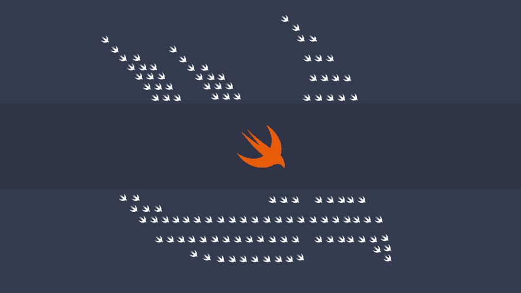

# Swift 中的适配器模式

> 原文：<https://dev.to/mrcflorian/the-adapter-pattern-in-swift-449g>

在 [iOS 应用程序模板](https://www.iosapptemplates.com)，我们正在构建用 Swift 编写的完全编码的移动模板，以帮助开发者和企业家更快地创建他们的最小可行产品。我们的部分使命是提供高度模块化的源代码，以便开发人员可以轻松定制和调整我们的代码，以满足他们的需求。在本文中，我们将讨论适配器模式，这是我们在 Xcode 项目中广泛使用的模式。

[](https://res.cloudinary.com/practicaldev/image/fetch/s--Pj2tZzLF--/c_limit%2Cf_auto%2Cfl_progressive%2Cq_auto%2Cw_880/https://thepracticaldev.s3.amazonaws.com/i/sf2az5da4p4bq1yea8tf.png)

# Swift 中的适配器模式

在软件工程中，适配器模式是一种软件设计模式(也称为包装器，与装饰器模式共享的替代命名)，它允许将现有类的接口用作不同的接口。它通常用于使现有的类相互协作，而无需修改它们的源代码。查看 [Wikipedia](https://en.wikipedia.org/wiki/Adapter_pattern) 以获得关于适配器模式的技术定义的更多信息。

适配器模式允许两个对象理解彼此的 API，并在它们之间交换消息。将 Cocoa DataSource 协议实现到 ViewController 中是使用适配器模式的最简单的例子。实现数据源协议的专用对象是 UITableView/UICollectionView 的适配器。类似地，为了实现 UITableViewDelegate，我们的视图控制器(在大多数情况下)正在修改关于用户和表视图的 UI 部分之间的交互的信息。

在我们的 [Swift 项目](https://www.iosapptemplates.com/templates)中，我们为每个(模型、单元)对创建一个专门的适配器。这样，我们可以从任何数据源(磁盘、网络、模拟数据等)获取任何模型，并且可以在任何 UI 单元中显示它。这样，我们可以对所有的屏幕只使用一个通用的视图控制器。太棒了，对吧？

# 实现示例

我们将给出一个适配器模式的简明例子。让我们假设我们想要构建一个应用程序来管理来自我们的任务管理器工具的任务。我们有一个类似这样的 API 结构:

```
struct APITask: Decodable {
    let id: String
    let createdAt: TimeInterval
    let createdBy: String
    let developedBy: String
    let finishedAt: TimeInterval?
} 
```

Enter fullscreen mode Exit fullscreen mode

在应用程序中，我们不想依赖于 API 模型，所以我们需要使用一个协议来采用这个对象:

```
protocol Task {
    var id: String { get }
    var createdAtDate: Date { get }
    var author: String { get }
    var finishedAtDate: Date? { get }
} 
```

Enter fullscreen mode Exit fullscreen mode

最后，同样重要的是，我们需要修改 APITask 以符合任务协议:

```
extension APITask: Task {
    var author: String { return createdBy }
    var createdAtDate: Date { return Date(timeIntervalSince1970: createdAt) }
    var finishedAtDate: Date? { return finishedAt.map { Date(timeIntervalSince1970: $0) } }
} 
```

Enter fullscreen mode Exit fullscreen mode

在这个例子中，APITask 扩展使 APITask 具体对象适应通用任务协议。现在，任何处理符合 Task 的通用对象(例如，视图)的类也可以处理 APITask，甚至没有意识到它这样做了。这里的主要好处是我们从模型层(APITask)中完全解耦了那个类(比如一个视图控制器)。

适配器模式可以以不同的方式实现，因此它肯定也可以通过具体的对象而不是协议来应用。我们将把它作为一个练习留给读者。

我们希望您会发现 Swift 中的适配器模式非常有用。苹果在 Cocoa 中广泛使用它，一旦你熟悉了它，它将帮助你在 iOS 应用程序开发中使用更健壮的架构方法。最好的部分是这个适配器模式可以在任何编程语言中使用，因为它不是 Swift 特有的。是的，它甚至可以在现代语言中工作，例如 [React Native](https://www.instamobile.io) 。

不要忘记通过分享这个教程来传播这个消息。谢谢大家！

本文原载于[手机 App 模板](https://www.iosapptemplates.com/templates)。