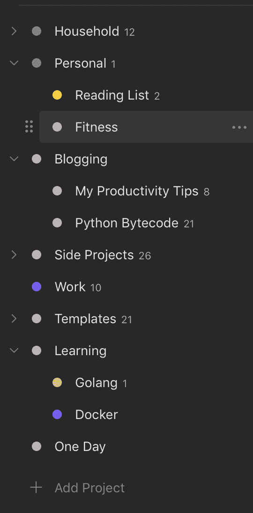
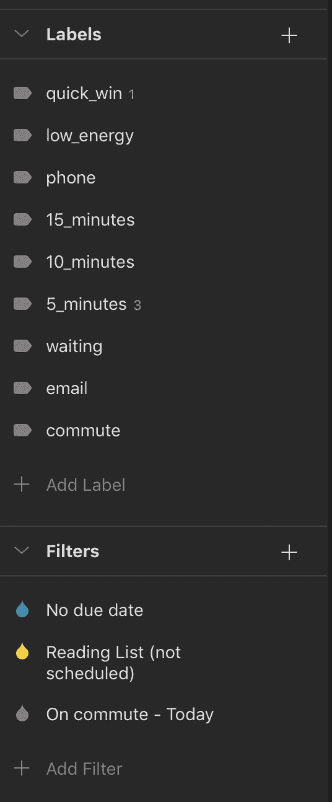

# 组织日常生活的实用方法

> 原文：<https://dev.to/lachlaneagling/a-pragmatic-approach-to-organising-everyday-life-5all>

*【蒂姆·高在 Unsplash 上拍摄的封面照片】*

你是否在努力处理生活中的日常任务，同时平衡工作、家庭或社会责任，然后努力适应你的个人目标或次要项目？放松，这是正常的，几乎影响到每个人。

这是我处理这种情况的务实方法，知道一切都在控制之中，出来时感到放松。

## 为目标划分优先级

任务应该首先被优先化以实现你的目标，这涉及到将你的目标分解成最小的工作单元，并优先化它们以获得最大的影响。

## 吞下那只青蛙

> 如果你早上做的第一件事是吃一只活青蛙，你就可以度过剩下的一天，知道最坏的事情已经过去了。

把你一天中最糟糕、最害怕的任务想象成青蛙，避免拖延，尽快完成。从那以后，你的一天只会变得更好，首先完成最糟糕的任务会让这一天变得轻松。

## 实事求是

避免仓促行事，为自己设定超出实际能力的任务。最终，这会让你颜面扫地，错失成就感，最终效率会大大降低。

为了克服这一点，重要的是要现实地看待自己该吃多少，并设定现实的期望。从每天/每周安排少量的项目开始，当你发现你正在应付当前的工作量时，逐步增加。

接受你不能完成所有的事情，你一天中只有那么多时间没有被工作、家庭或其他承诺所消耗。无情地剔除旧的或不相关的任务，重新安排那些你不可能在一天内完成的事情。

## 衡量&反映

在每周和每月结束时，我会进行每周和每月回顾，反思上一周/上一个月，评估我的成就，然后计划下一周/下一个月我想要实现的目标。

这包括回顾我在上一阶段设定的目标，将它们与我实际实现的目标进行比较，并确定哪里出了问题以及我在下一阶段可以改进的地方。

对我来说，这是保持最高生产力和实现生活中所有重要目标的关键因素之一。

## 未雨绸缪

与每天思考第二天、第一周需要做什么或应该做什么的斗争。在一个周日的晚上，我计划了下一周的计划。这包括我每周回顾的结果，以及将我的任务导向下周的目标。

简单地把所有这些从你的大脑中倾倒出来，放到下周的清单中，这种行为可以让你放松下来，不会下意识地去想它。

## 我的系统

对于日常任务管理和待办事项，我使用[来完成](https://todoist.com/)。简单干净的用户界面与强大的任务管理、过滤、标签和项目功能相结合，使它对我来说不需要动脑筋。

几乎所有我无法处理的事情都会直接进入 Todoist，分类到我建立的不同类别的项目中的一个。

 

<figure>

<figcaption>我的项目列表- Todoist</figcaption>

</figure>

我创建的任何重复性任务，如账单、家务、常规工作项目或个人任务。

为了充分利用我仅有的一点空闲时间，标签和过滤功能是我的可取之处。诸如通勤、quick_win、5 分钟、10 分钟、15 分钟等标签可以很容易地快速找到我在空闲时或在上下班途中可以找到的物品。将这与过滤器结合起来，我可以快速轻松地找出，例如，所有可以在上下班途中完成的五分钟任务，以及今天安排的任务。

 

<figure>

<figcaption>滤镜&标签- Todoist</figcaption>

</figure>

对于所有你想做的零零碎碎的事情，对未来项目的想法，或者只是不知道如何或何时可以完成，我用“一天”项目作为一个垃圾场。我下周/下个月计划过程的一部分包括回顾它们，或者安排它们，如果它们不再相关就删除它们，或者如果什么都没有改变就让它们保持原样。

在每周/每月结束时，我会回顾我已完成的任务，并与我本周的目标进行比较，以评估与我计划实现的目标相比，我实际做得有多好。