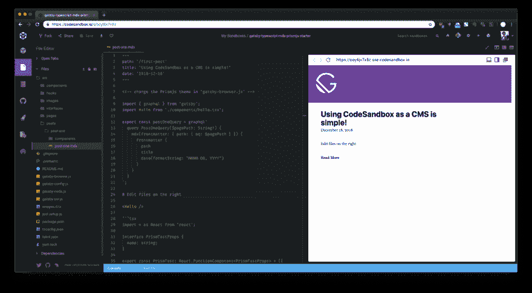

# 使用 CodeSandbox 作为内容管理系统，并为您的盖茨比博客提供实时预览

> 原文：<https://dev.to/whoisryosuke/using-codesandbox-as-a-cms-and-live-preview-for-your-gatsby-blog-1p10>

在过去的几个月里，GatsbyJS 已经在静态 JS 场景中爆炸了。各地的开发人员都在接受 Gatsby，因为它能够简化静态内容生成，并通过 GraphQL 聚合内容和资产。它们使得启动新项目和构建极快的静态反应应用程序变得更加容易。它已经成为我处理任何静态站点(如登录页面或博客)时的首选，在这些站点中，内容不是非常动态，并且受益于预处理。

尽管 GatsbyJS 很棒，但开始你的第一个项目可能需要一段时间。你必须下载并安装他们的 CLI，用`npx`引导一个新项目，或者克隆一个启动项目 repo。然后，您可以启动本地开发环境。这不是很多，但这是一种承诺，尤其是当你把它介绍给一个新的人的时候。你想要结果，而且要快。

## 炽热快速的地点——在一场爆炸中💣🔥

如果你只需点击一个链接，等待依赖项下载和编译，然后 **blam** - [你就拥有了一个盖茨比的博客，会怎么样？感谢像](http://codesandbox.io/s/github/gatsbyjs/gatsby-starter-blog) [CodeSandbox](http://codesandbox.io) 这样的平台，这就是我们生活的世界。

但是这让我想到，为什么不使用 CodeSandbox 作为你博客的 CMS 呢？因为它使用 Github，并且可以提交代码/拉请求，所以您可以编辑和创作任何您喜欢的内容(只要是静态的——比如 Markdown 或 JSON)。只需打开沙箱，创建一个新的 Markdown 文件，发出一个 pull 请求，就大功告成了！*(取决于你的构建过程)*

## 工作原理⚙️

CodeSandbox 在几个月前增加了 Gatsby、Node 和 Apollo 这样的服务器端平台。这使得任何人都可以旋转*(任何？)*盖茨比项目在**你的浏览器**。如果你还没有一个盖茨比的博客，现在没有借口了。

**只有要求？**

*   Github 帐户
*   CodeSandbox 帐户(使用 Github 登录)

**它大致是这样工作的:**

*   选择一个 Gatsby starter 模板,在本地提取内容(如文本、markdown、MDX 等)
*   在 CodeSandbox 上打开。*您可以使用`codesandbox.io/s/githubuser/reponame/`* 格式打开任何 Github 回购
*   创建新的页面或内容文件(如 MDX)。在 Gatsby 中，`/src/pages/`目录中的任何 React 组件都将是一个页面。对于内容网站(如 Markdown)，尝试找到一个例子。MD 张贴到副本。
*   Fork sandbox(单击顶部的按钮或在保存更改时自动发生)。
*   将新的回购保存到 Github。单击左侧的 Github 图标，使用 Github 登录，并在那里保存回购。
*   保存所有更改并提交代码(如果尚未提交)
*   在 Github 上合并拉取请求
*   使用 Netlify 这样的服务来构建您的代码。

你可以在你的机器上本地构建 Gatsby，但是本教程假设你试图在云中实现所有的东西。

> 一旦你在使用 Netlify，你也可以使用 Netlify CMS。然而，您无法获得 CodeSandbox 模拟的“本地开发环境”的好处，如实时预览、编辑 React 组件或 Gatsby 配置。

### 使用网络部署🚀

1.  [注册一个网络账户](https://app.netlify.com/signup)
2.  [从 Git 创建一个新站点](https://app.netlify.com/start)

Netlify 应该自动检测 Gatsby 并运行适当的构建脚本。如果没有(或者如果您有自定义/预构建脚本)，您可以在 Netlify 部署设置中更改它。

### 告诫🐛

我遇到的唯一一个*微小的* bug 涉及到将 MDX 与 Gatsby 一起使用(讽刺的是，这也是我选择的首发)。保存 MDX 文件时，更改不会立即在实时预览中传播。

MDX 的工作方式是为您导入的所有 JSX 组件编译静态资产，如 JS 文件，然后 Gatsby 显示这些内容。每次保存时，都会为任何已更改的 MDX 文件生成新的静态资产(而不是像大多数 CLI 那样使用热模块重载)。

这在 CodeSandbox 中有点笨拙，有时您不会立即看到更改(需要刷新实时预览窗口)。

## 为什么止步于博客？👨‍💻

如果你需要在云中创建一个快速的静态网站，这就是你的解决方案。这简化了设计冲刺:允许你直接跳到容易与合作者共享的代码，与 Git 同步，并通过 forks 毫不费力地迭代。无论你是在为你的下一次会议演讲 准备一个 **[登陆页面](https://www.gatsbyjs.org/starters/gillkyle/gatsby-starter-landing-page/)** 还是一个 **[甲板，Gatsby 都有足够多的启动程序让你更快地离开👍并且结合像从 Git 仓库部署的](https://www.gatsbyjs.org/starters/fabe/gatsby-starter-deck/) [Netlify](http://netlify.com) 这样的服务，您的工作流不会变得更快*(或者更安全！)*。**

如果你还没有探索过 [CodeSandbox](http://codesandbox.io) ，我强烈建议你去看看。这是一个非常有用的工具，不仅可以从头开始编码，还可以拉起任何 git 分支，这使得它非常适合创建示例或实时审查 PRs。如果你喜欢的话，现在也部署到[时代周刊的](https://zeit.co/now)🌚

希望这有所帮助！
良

* * *

**参考文献:**

*   [CodeSandbox](http://codesandbox.io)
*   [盖茨比](http://gatsbyjs.org)
*   [盖茨比首发](https://www.gatsbyjs.org/starters/)
*   [Gatsby Starter-MDX+prism js+Styled Components+TS](https://codesandbox.io/s/github/tylergreulich/gatsby-typescript-mdx-prismjs-starter)
*   [将 GatsbyJS 部署到 Github 页面](https://www.gatsbyjs.org/docs/how-gatsby-works-with-github-pages/)
*   [Netlify](http://netlify.com)