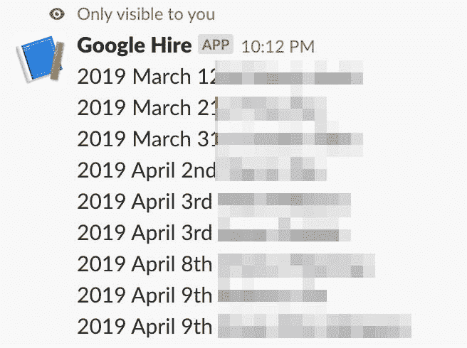

# Google Hire 有一个 API。最后。

> 原文：<https://dev.to/transposit/google-hire-has-an-api-finally-2g4e>

亚当·莱文塔尔写的

我们刚刚说服了种子投资者，让他们相信换位是个好主意。一个伟大的想法需要一个团队来实现，所以当第一轮结束时，我们开始雇佣这个团队。我们会与候选人交谈，写下我们的反馈，与团队分享。起初我们使用谷歌文档。价格是合适的(免费的)，但是我们很快就满足不了:我们需要更多的结构和访问控制。我在应用程序跟踪系统(ATS)方面的经验是，它们都以自己的方式令人恼火，将它们的结构强加于你的过程，而不是适应它。所以如果我们不能得到我们想要的，至少我们不想为此付出太多。

输入谷歌招聘。

<figure>[](https://res.cloudinary.com/practicaldev/image/fetch/s--qQzN-xrq--/c_limit%2Cf_auto%2Cfl_progressive%2Cq_auto%2Cw_880/https://cdn-images-1.medium.com/max/708/0%2AjYqchS6RTEicPQEa.jpg) 

<figcaption>地狱是别人…用无 API 套住你的数据</figcaption>

</figure>

正如预期的那样，谷歌招聘并不是我们想要的。尽管它很便宜。这不是一个可怕的产品；它只是没有按照我们想要的方式做任何事情。通过招聘人员筛选，移交候选人所有权，找到我们有一段时间没有联系的人——招聘人员没有做任何这些事情。

没问题吧？这就是 API 的用途。您的服务可能不适合我的需要，但是 API 让我可以避开我讨厌的部分，构建我需要的扩展。即使产品改进了以满足我们的需求，总会有下一个需求。但是——对于谷歌的产品来说令人惊讶的是——没有 API。

所以我们受苦了。与此同时，我们雇佣了我们的团队，并[开发了我们的产品](https://www.transposit.com),具有讽刺意味的是，这使得使用 API 变得很容易。一个令人高兴的巧合是，Google Hire 发布了他们的[测试版 API](https://developers.google.com/hire/tenants/guides/getting-started) ，正好在 Transposit 开放我们的测试版的时候。Transposit 在 API 前面放了一个 SQL 和 JS 接口，管理 auth，让构建 API 驱动的 API 变得很容易。以下是我对 Google Hire API 运行的前几个查询。(一旦谷歌给你 API 访问权，你就可以[在现场](https://console.transposit.com/t/ahl/hire)尝试一切。)

我可以列出我们正在追踪的所有候选人:

```
SELECT \* FROM google\_hire.list\_candidates
  WHERE tenant=‘my\_tenant’ 
```

我可以看到所有和我们交谈的人的前任雇主:

```
SELECT employmentInfo.employer FROM google\_hire.list\_candidates
  WHERE tenant=’my\_tenant’ EXPAND BY employmentInfo 
```

(有趣的是，在这篇文章中，最热门的是谷歌)

### 解决问题

在保持距离太久之后，我在探索新公开的(-ish[2]) API 时获得了很多乐趣。我想解决的第一个实际问题是显示我们最近没有 pinged 的候选人。为什么这个不是内置的？我不知道。用 Transposit 很容易做到。我们将每个 API 视为数据库中的视图或表格；获取我想要的数据相当于在候选人和应用程序表之间进行连接:

[https://medium . com/media/0103d 33 ee 62 c 48d 82 b 569 ab 9 af8 c 2747/href](https://medium.com/media/0103d33ee62c48d82b569ab9af8c2747/href)

```
[
  {
    "name": "tenants/abc/candidates/def",
    "job": "tenants/acb/jobs/ghi",
    "candidate": "tenants/abc/candidates/jkl",
    "createTime": "2019-04-02T00:31:48.630Z",
    "status": {
      "state": "ACTIVE",
      "processStage": {
        "stage": "Initial Screen",
        "reportingCategory": "SCREEN"
      },
      "updateTime": "2019-04-03T05:27:29.321Z"
    },
    "personName": {
      "givenName": "David",
      "familyName": "Lightman"
    },
... 
```

通过添加另一个 SQL 过滤器，我可以将重点放在特定的作业上:

[https://medium . com/media/1 F3 BAC 392 e 9 c 743010 c9b 25872 a 34158/href](https://medium.com/media/1f3bac392e9c743010c9b25872a34158/href)

…然后通过提取特定字段并添加订单来获取我想要的数据，方法是:

[https://medium . com/media/1b 85 f 16 BF 4 ff 02 fa 2 f 40 b 489465d 7810/href](https://medium.com/media/1b85f16bf4ff02fa2f40b489465d7810/href)

```
[
  {
    "updateTime": "2019-03-12T17:25:33.176Z",
    "givenName": "Michael",
    "familyName": "Jennings"
  },
  {
    "updateTime": "2019-03-21T20:33:08.454Z",
    "givenName": "Kate",
    "familyName": "Libby"
  },
... 
```

终于！自从我们开始使用 Hire 以来，我一直想要的数据！

### 向我们仁慈的懈怠统治者致敬

Slack 正迅速成为我们使用的众多工具的中心接口，所以我想把 Google Hire 的数据与 Slack 连接起来。构建 Slack slash 命令很容易([查看 Transposit Quickstart](https://docs.transposit.com/get-started/quickstart) )。你只需要将 Slack 指向一个返回你想要的数据的 webhook:

[https://medium . com/media/5 aed6a 0835 a 234647 aaba 99 de 0820 df 2/href](https://medium.com/media/5aed6a0835a234647aaba99de0820df2/href)

现在，当我担心我们已经放弃了候选人，而他们有一段时间没有收到我们的消息时，我只需键入我的 Slack slash 命令:

[](https://res.cloudinary.com/practicaldev/image/fetch/s--yz2WgFfW--/c_limit%2Cf_auto%2Cfl_progressive%2Cq_auto%2Cw_880/https://cdn-images-1.medium.com/max/656/1%2Aql4TpGbGHUYKdgE_pkJH5w.jpeg)

### 接下来

尽管我对 Google Hire API 感到兴奋，但第一个测试版中的端点还是相当基础的。当他们开放创建新候选人、在招聘流程的不同阶段之间转换候选人以及添加评论(我们用来在团队成员之间传递候选人的机制)等功能时，这将是非常强大的。

API 是我们使用的任何工具的关键特征；**我再也不会选择一个不允许我通过 API** 访问数据的工具了。Transposit 让我以交互方式探索 Google Hire API，检查数据，并在不同的端点进行探索。你可以[用 Hire API 或者它所连接的任何其他 API 来尝试一下](http://www.transposit.com)。如果这听起来像是你想参与的事情，[我们正在招聘](https://www.transposit.com/jobs/) :

```
SELECT title FROM google\_hire.list\_jobs
 WHERE tenant=’my\_tenant’
 AND filter=’state=OPEN’

[
  {
    "title": "Developer Advocate"
  },
  {
    "title": "Growth Marketing Manager"
  },
  {
    "title": "Product Marketing Manager"
  },
  {
    "title": "Senior Site Reliability Engineer"
  },
  {
    "title": "Software Engineer"
  }
] 
```

[1]我称之为谷歌的产品——我事先就知道这一点——但雇佣来自 Bebop 收购案，该案将黛安·格林带入了谷歌。我怀疑获得一个了不起的领袖来执掌 GCP 可能是首要目标。

【2】你需要[注册并获得谷歌雇佣 API](https://developers.google.com/hire/tenants/guides/getting-started) 的批准。我给我们的销售代表写了一封恳求但坚定的邮件来推动事情的进展。

* * *