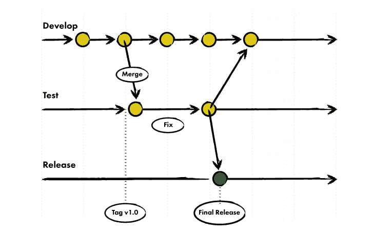
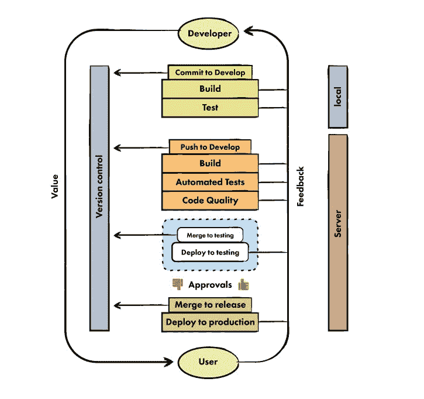

# 部署管道:成功软件开发的基础

> 原文：<https://dev.to/itemis/the-deployment-pipeline-the-basis-for-successful-software-development-34g3>

想象一下，你正在参观一家大型汽车制造商的生产线。你走进生产大厅，看不到装配线，没有制造机器人，没有质量保证:相反，每个人似乎都在修修补补。

经过几年的生产，各个零件组合成一辆车，交给厂长验收。他们试开了几米，然后车就熄火了。

幸运的是，汽车行业不是这样的——在软件开发中也不应该是这样的。

这是因为“装配线”、“制造机器人”和“质量保证”已经以**部署管道**、**构建自动化**和**自动化测试**的形式出现在软件开发的世界中。

## 部署管道

部署管道确保我们作为开发人员对软件所做的任何更改都能够尽快到达用户手中。

代码质量和功能在过程中被测试:在最好的情况下，这是完全自动化的。

重要的是，每一个变化都直接反馈到整个系统中。我们通过以下方式实现这一点。

## 配置管理

从构建脚本到测试文件的一切都使用版本控制系统(如 Git)来管理。

我们为什么要这样做？

因为它确保了所有的变更都是可追踪的，包括那些基础设施或构建过程的变更，并且任何东西都可以在任何地方按下按钮进行编辑。

简化的分支策略如下所示:

开发由*开发*分支显示。一旦发布待定，一个版本号被分配并合并到*测试*。这个分支仅用于测试目的:在软件通过自动化测试之后，它被交付给测试用户。

这个版本的问题和错误在这个分支上被专门解决，然后合并回*开发*。在*上，开发*分支的工作可以在下一个版本的新特性上并行进行。

如果测试阶段成功，那么*测试*分支将软件传递给*发布*分支，软件被交付给最终用户。

## 构建自动化

像 **Gradle** 和 **Maven** 这样的工具允许软件在构建服务器上本地和自动构建。每次代码更改后，都会触发一个构建过程，以确保更改成功编译。

这是变更进入测试之前的第一次测试。

## 自动化测试

[组件和集成测试](https://blogs.itemis.com/en/never-write-unit-tests)确保代码做它应该做的，并且不改变现有的功能。

任何新的功能都必须被测试所覆盖，以防止未来的变化无意中损害它们。自动化测试应该在最接近生产环境的环境中运行，手动测试应该保持在最低限度。

毕竟，谁愿意做手工测试呢？

Espresso (Android)和 SWTBot (Java)等框架可以去除大部分人工工作量。

## 交货

在代码成功通过测试后，它将被交付给用户，同样尽可能自动化。

例如，如果该软件是一个 Android 应用程序，它将被发布在 Play Store 上，用户将收到更新通知。

在 Eclipse 环境中，用户将通过相应的更新站点获得更新。

现在有足够的工具来帮助自动化交付:例如，Jenkins 和 Co 提供了各种插件来支持这一点。

基于分支策略，简化的部署管道可能如下所示:

向测试用户的交付显示为可选的。理想的情况是所有的功能都被自动化测试所覆盖，完全消除手工测试。

然而，图中最重要的是反馈回路。反馈确保我们总是知道我们是否在朝着正确的方向前进:反馈越快越好。

在本文开头虚构的汽车例子中，反馈来得太晚了，各个零件只是在最后才组装起来。这或多或少地确保了一个非功能性产品的交付。

## 结论

这里描述的这种部署管道允许我们实现在任何时候按下按钮发布软件的目标。

敏捷宣言很好地描述了这背后的基本思想:

> 我们最优先考虑的是通过尽早和持续交付有价值的软件来满足客户。

这是通过以下方式实现的:

*   连续累计
*   快速反馈
*   自动化
*   声音测试

“绿色”构建状态向我们保证一切都以最佳方式运行。这种保证完全取决于部署管道的结构和测试的质量。像[测试驱动开发](https://blogs.itemis.com/en/model-driven-software-development-meets-test-driven-development)这样的方法在这里会很有帮助。