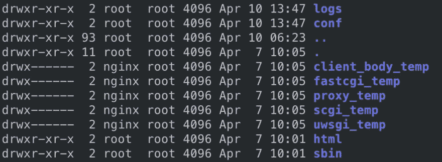

# 欢迎来到 Nginx！(第二部分)

> 原文：<https://dev.to/rshiva/welcome-to-nginx-part-ii-32km>

本帖是[第一部](https://dev.to/rshiva/welcome-to-nginx-part-i-58mn)的续篇。如果你还没有读过那篇文章，我推荐你读一下。

默认情况下，nginx 有一些文件夹和文件，如下所示。

[](https://res.cloudinary.com/practicaldev/image/fetch/s--64taAr0p--/c_limit%2Cf_auto%2Cfl_progressive%2Cq_auto%2Cw_880/https://thepracticaldev.s3.amazonaws.com/i/piaotz3mj3e1naeuu1at.png)

我们对两个主要文件夹感兴趣

1) /etc/nginx/conf -我们的大部分配置存放在那里
2) /etc/nginx/logs -服务器日志文件存放在那里。它们是 access.log 和 error.log 文件

让我们先进入 **conf 文件夹**。Conf 文件夹有很多。conf 文件如下所述，它们适用于不同的协议

I)fastcgi . conf——此配置用于 fastcgi 协议应用程序
ii)nginx . conf——这是我们感兴趣的配置，我们将分解此文件并详细了解配置情况
iii)scgi _ params——此文件用于将请求传递到 scgi 服务器
iv)uwsgi _ params——此文件用于处理对 uw SGI 应用程序的请求，例如与 python 应用程序
v)mime . types——具有支持电子邮件和 HTT 的格式列表的多互联网邮件扩展

**日志文件夹**有 error.log 和 access.log。每个请求都记录在 access log 中，每当请求抛出错误时，都会记录在 error.log 中

Nginx 配置文件由两个主要部分组成，指令和上下文。指令是简单的单行配置，以分号结束，上下文是与多个指令组合在一起的顶级指令。

指令示例有

```
user www-data;
include conf.d/first_nginx.conf; 
```

Enter fullscreen mode Exit fullscreen mode

有四种主要情况

1)事件-连接处理
2) http -用于服务 http/https 流量
3) mail -用于服务邮件流量
4) stream -用于流式传输 TCP 和 UDP 数据包

让我们创建一个简单的静态页面，并使用 nginx 对其进行配置，以便通过互联网进行访问。首先，让我们把我们的项目放在一个文件夹中，并创建一个 homepage.html

```
mkdir apps && cd apps && mkdir welcome
cd welcome && touch homepage.html 
```

Enter fullscreen mode Exit fullscreen mode