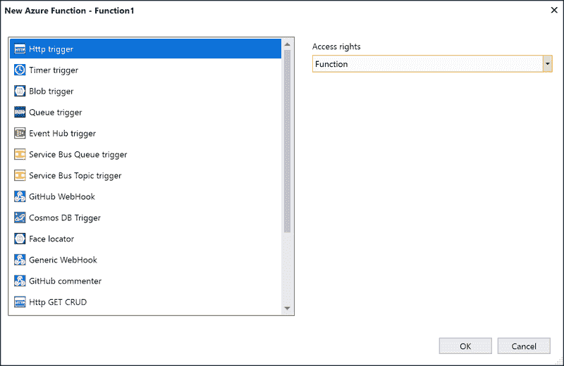
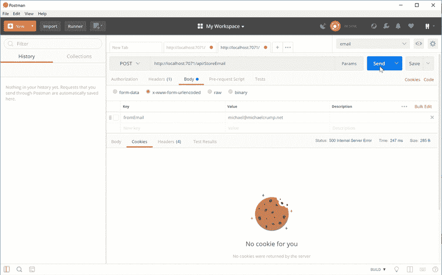

# 使用 Azure 功能创建电子邮件订阅-第 2 部分

> 原文：<https://dev.to/azure/create-an-email-subscription-with-azure-functions-part-2-3g4m>

*我们选择了由[迈克尔·克伦普](https://twitter.com/mbcrump)创造的我们最喜欢的技巧和诀窍，并在整个四月在 Azure 上提供新的技术内容！错过一天(或更多)？[赶上系列](https://dev.to/t/azureapril)。*

**没有天蓝色？** [抢免费订阅](https://azure.microsoft.com/en-us/free?&WT.mc_id=azureapril_devto-blog-cxa)。

这是关于如何用 Azure 功能构建无服务器电子邮件订阅服务的 4 篇系列文章中的第二篇。

完整源代码该应用的源代码可以在 [GitHub](https://github.com/mbcrump/EmailSubscription) 上找到

[第 1 部分——我们要构建什么以及如何构建](http://www.michaelcrump.net/azure-tips-and-tricks97/)
[第 2 部分——使用 Azure 表存储存储电子邮件](http://www.michaelcrump.net/azure-tips-and-tricks98/)
[第 3 部分——用 HTML5 和 jQuery 编写前端](http://www.michaelcrump.net/azure-tips-and-tricks99/)
[第 4 部分——用 Sendgrid 和 Azure 函数发送电子邮件](http://www.michaelcrump.net/azure-tips-and-tricks100/)

我们正在尝试建立一个类似下面的电子邮件订阅。

[](https://res.cloudinary.com/practicaldev/image/fetch/s--kj3ft86a--/c_limit%2Cf_auto%2Cfl_progressive%2Cq_auto%2Cw_880/https://thepracticaldev.s3.amazonaws.com/i/1i1bl0nqnic47xjf5bxd.png)

## 从我们停止的地方继续

我们最近创建了一个使用 Azure Functions 模板的 Visual Studio 项目。我们使用 NuGet 来获取对以下包的引用，我们将很快使用这些包:

*   `WindowsAzure.Storage`使用 Azure Table Storage。
*   为了隐藏我们的 API 密钥，Sendgrid 发送我们的电子邮件
*   使用 RSS 订阅源——使用预发布包来找到它

返回到我们昨天创建的项目，右键单击该项目并选择添加项目，然后选择 Azure Functions。现在给它起一个名字，比如 StoreEmail，并选择 Http Trigger 和如下所示的默认值。

[](https://res.cloudinary.com/practicaldev/image/fetch/s--mbVc1nqu--/c_limit%2Cf_auto%2Cfl_progressive%2Cq_auto%2Cw_880/https://thepracticaldev.s3.amazonaws.com/i/nr94fho3yr86rtmuse5y.png)

我们只需要这是一个 post 请求，因此修改 Run 方法的签名以匹配以下内容:

```
[HttpTrigger(AuthorizationLevel.Function, "post", Route = null)] 
```

请记住:与使用下面的代码相比，您可以使用输出绑定来提供一种声明性的方式，从您的代码内部连接到数据。感谢马特·霍尼卡特的评论。

由于我们将使用 Azure Table Storage，并且我更喜欢向您展示您可以在任何地方重用的代码，我们需要设置一个具有单个字段的类:

*   email address——为了存储用户输入的电子邮件，我们还将提供每次都相同的 PartitionKey，并为我们的 RowKey 使用 Guid。

```
class Email : TableEntity
{
    public string EmailAddress { get; set; }

    public EmailEntity(string email)
    {
        EmailAddress = email;
        PartitionKey = "SendEmailToReaders";
        RowKey = Guid.NewGuid().ToString();
    }

    public EmailEntity()
    {

    }
} 
```

我也有一个助手类，我们将使用它来存储数据，所以添加以下内容，这将允许我们传递一个表对象和一个新的电子邮件实例:

```
static void CreateMessage(CloudTable table, Email newemail)
{
    TableOperation insert = TableOperation.Insert(newemail);

    table.Execute(insert);
} 
```

最后，我们需要添加运行方法的代码:

```
public static async Task<HttpResponseMessage> Run([HttpTrigger(AuthorizationLevel.Function, "post", Route = null)]HttpRequestMessage req, TraceWriter log)
{

//(Block #1)
    var postData = await req.Content.ReadAsFormDataAsync();
    var missingFields = new List<string>();
    if (postData["fromEmail"] == null)
    {
        missingFields.Add("fromEmail");
    }

    if (missingFields.Any())
    {
        var missingFieldsSummary = String.Join(", ", missingFields);
        return req.CreateResponse(HttpStatusCode.BadRequest, $"Missing field(s): {missingFieldsSummary}");
    }
//(End Block #1)

//(Block #2)
    try
    {
        // the line below can be hardcoded if you aren't using AppSettings
        CloudStorageAccount storageAccount = CloudStorageAccount.Parse(ConfigurationManager.AppSettings["TableStorageConnString"]);

        CloudTableClient tableClient = storageAccount.CreateCloudTableClient();

        CloudTable table = tableClient.GetTableReference("MCBlogSubscribers");

        table.CreateIfNotExists();

        CreateMessage(table, new EmailEntity(postData["fromEmail"]));

        return req.CreateResponse(HttpStatusCode.OK, "Thanks! I've successfully received your request. "); //
    }
    catch (Exception ex)
    {
        return req.CreateResponse(HttpStatusCode.InternalServerError, new
        {
            status = false,
            message = $"There are problems storing your email address: {ex.GetType()}"
        });
    }
//(End Block #2)
} 
```

请记住，您需要使用我们之前添加的名称空间的引用。

块#1 是关于获取文章数据并检查是否有电子邮件地址被发送。如果是，那么它将发送一个缺少哪些字段的摘要。

块#2 试图通过我们创建的 Azure Table 存储帐户保存输入，如果保存成功，那么向客户端返回一切正常。否则，向客户端输出问题所在。请记住，我使用的是 ConfigurationManager，如果您愿意，您可以硬编码这个值。

点击 Visual Studio 中的运行按钮，您将看到以下内容:

[](https://res.cloudinary.com/practicaldev/image/fetch/s--PMdGBG_i--/c_limit%2Cf_auto%2Cfl_progressive%2Cq_auto%2Cw_880/https://thepracticaldev.s3.amazonaws.com/i/j44yvmi19cn9bjn0jye9.png)

记下它运行的本地主机，并使用类似 Postman 的东西来测试您的 POST 调用。

在下面的 gif 中，我将 Postman 配置为我的本地主机 URL，并提供了一个电子邮件地址。

我可以通过 1)不提供任何东西和 2)提供一个电子邮件地址来测试 Azure 函数。您将看到错误处理和成功消息返回给 Postman。

[](https://res.cloudinary.com/practicaldev/image/fetch/s--V3mQ4-8f--/c_limit%2Cf_auto%2Cfl_progressive%2Cq_66%2Cw_880/https://thepracticaldev.s3.amazonaws.com/i/oug2ifddlflt5bko7e7e.gif)

暂时就这样吧！我们明天做第三部分

想要更多 Azure 功能？查看我们的[快速入门和教程](https://docs.microsoft.com/azure/azure-functions/?WT.mc_id=azureapril_devto-blog-cxa)！

* * *

我们将在 4 月份每天发布文章，所以请继续关注或提前查看更多提示和技巧[现在](http://azuredev.tips)。