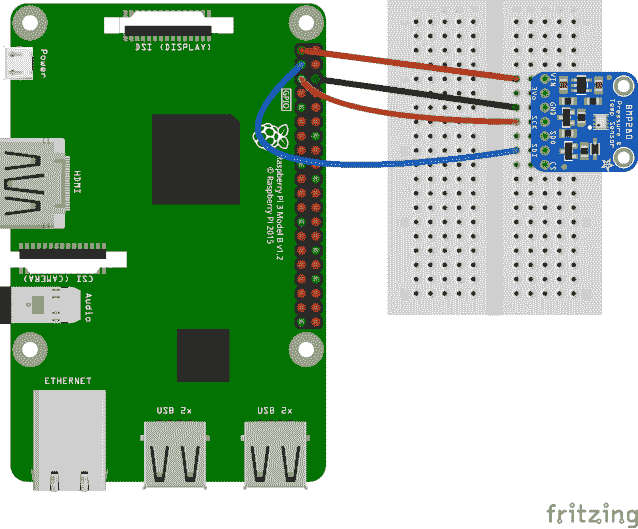
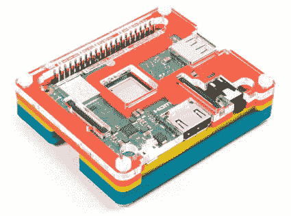
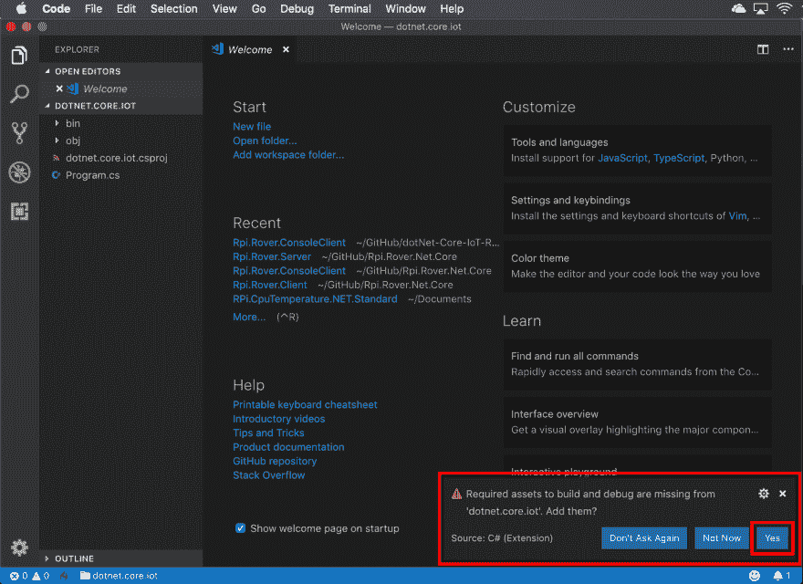
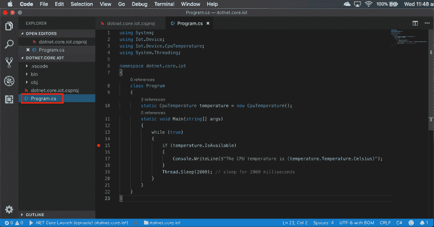
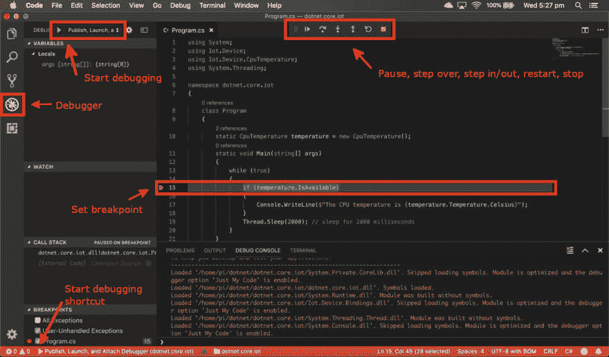

# 学习如何建造。用于 Raspberry Pi Linux 的 NET Core 物联网应用，并连接到 Azure 物联网中心

> 原文：<https://dev.to/azure/net-core-iot-raspberry-pi-linux-and-azure-iot-hub-learn-how-to-build-deploy-and-debug-d1f>

[](https://res.cloudinary.com/practicaldev/image/fetch/s--_eahdmG2--/c_limit%2Cf_auto%2Cfl_progressive%2Cq_auto%2Cw_880/https://raw.githubusercontent.com/gloveboxes/dotNET-Core-IoT-Raspberry-Pi-Linux.-How-to-Build-Deploy-and-Debug/master/docs/banner.png)

在 [Twitter](https://twitter.com/dglover) 上关注我。

* * *

## 源代码

可以在[这里](https://github.com/gloveboxes/dotNET-Core-IoT-Raspberry-Pi-Linux.-How-to-Build-Deploy-and-Debug)找到本演练的源代码和示例。

* * *

## 简介

的。NET Core 物联网库将您的应用连接到硬件。在本演练中，您将学习如何:

1.  开发一个 C#。来自 Linux、macOS 或 Windows 10 桌面的 NET Core 物联网应用，
2.  将应用程序部署到运行 Linux 的 Raspberry Pi(或另一个 Linux 板，如 BeagleBone Black)，
3.  调试并单步调试您的代码，
4.  向 [Azure 物联网中心](https://docs.microsoft.com/en-us/azure/iot-hub/about-iot-hub?WT.mc_id=devto-blog-dglover)传输遥测数据，
5.  如果你是一个惩罚的饕餮者，那么看看[F#。Net Core IoT]放在 [samples](https://github.com/gloveboxes/dotNET-Core-IoT-Raspberry-Pi-Linux.-How-to-Build-Deploy-and-Debug) 文件夹中。

* * *

## 为什么。网络核心

它被数百万开发者使用，它成熟、快速，支持多种编程语言(C#、F#和 VB。NET)，运行在多种平台上(Linux、macOS 和 Windows)，并且跨多种处理器架构受到支持。它用于构建设备、云和物联网应用。

[。NET Core](https://docs.microsoft.com/en-au/dotnet/core?WT.mc_id=devto-blog-dglover) 是一个[开源](https://github.com/dotnet/coreclr/blob/master/LICENSE.TXT)，由微软和微软维护的通用开发平台。在 [GitHub](https://github.com/dotnet/core) 上的网络社区。

* * *

## 这个。NET Core 物联网库开源项目

微软。NET 核心团队和开发者社区正在构建对物联网场景的支持。[。NET Core 物联网库](https://github.com/dotnet/iot)支持跨 ARM 和英特尔处理器架构的 Linux 和 Windows 物联网核心。参见[。NET Core 物联网库路线图](https://github.com/dotnet/iot/blob/master/Documentation/roadmap.md)了解更多信息。

### 系统。设备. Gpio

[系统。Device.Gpio](https://www.nuget.org/packages/System.Device.Gpio) 封装支持通用 I/O ( [GPIO](https://en.wikipedia.org/wiki/General-purpose_input/output) )引脚、PWM、I2C、SPI 及相关接口，用于与底层硬件引脚交互，控制单板计算机上的硬件传感器、显示器和输入设备；[树莓派](https://www.raspberrypi.org/)、[猎兔犬板](https://beagleboard.org/)、[蜂箱板](https://www.solid-run.com/nxp-family/hummingboard/)、 [ODROID](https://www.hardkernel.com/) 等支持 Linux 和 Windows 10 物联网内核的单板电脑。

### 物联网。设备.绑定

[。网络核心物联网储存库](https://github.com/dotnet/iot/tree/master/src)包含[物联网。Device.Bindings](https://www.nuget.org/packages/Iot.Device.Bindings) ，这是一组不断增长的由社区维护的物联网组件设备绑定，您可以使用。NET 核心应用程序。如果你找不到你需要的，那么把你自己的 C/C++驱动库移植到。NET Core 和 C#也非常简单。

存储库中的驱动程序包括示例代码和接线图。例如 [BMx280 -数字压力传感器 BMP280/BME280](https://github.com/dotnet/iot/tree/master/src/devices/Bmx280) 。

[](https://res.cloudinary.com/practicaldev/image/fetch/s--ky2B9zDk--/c_limit%2Cf_auto%2Cfl_progressive%2Cq_auto%2Cw_880/https://raw.githubusercontent.com/gloveboxes/dotNET-Core-IoT-Raspberry-Pi-Linux.-How-to-Build-Deploy-and-Debug/master/docs/rpi-bmp280_i2c.png)

* * *

## 为 Linux、macOS 和 Windows 10 桌面设置的软件

你可以创造。NET 核心物联网项目在 Linux，macOS 和 Windows 桌面上。你需要安装以下软件。

1.  [。网络核心](https://dotnet.microsoft.com/download?WT.mc_id=devto-blog-dglover)
2.  [Visual Studio 代码](https://code.visualstudio.com?WT.mc_id=devto-blog-dglover)

### Windows 10 软件的附加要求

1.  [Windows Linux 子系统(WSL)](https://docs.microsoft.com/en-us/windows/wsl/install-win10?WT.mc_id=devto-blog-dglover) 。建议你安装 Ubuntu 18.04 发行版。
2.  [PuTTY SSH 和 telnet 客户端](https://www.putty.org/)

* * *

## 设置您的树莓派

。Net Core 需要 AMR32v7 和更高版本的处理器，所以任何 Raspberry Pi 2 或更好的都可以。注意，Raspberry Pi Zero 是 ARM32v6 处理器，不支持。

如果你之前没有设置过树莓派，那么这是一个很好的指南。[无头树莓 PI 3 B+ SSH WIFI 设置(MAC + WINDOWS)](https://desertbot.io/blog/headless-raspberry-pi-3-bplus-ssh-wifi-setup) 。为 macOS 概述的指令将在 Linux 上工作。

**本演练假设默认 Raspberry Pi 网络名称为“raspberrypi.local”，默认密码为“Raspberry”。**

[](https://res.cloudinary.com/practicaldev/image/fetch/s--16Pw33PQ--/c_limit%2Cf_auto%2Cfl_progressive%2Cq_auto%2Cw_880/https://raw.githubusercontent.com/gloveboxes/dotNET-Core-IoT-Raspberry-Pi-Linux.-How-to-Build-Deploy-and-Debug/master/docs/raspberrypi-3a-plus.jpg)

* * *

## 配置连接到您的 Raspberry Pi

下面创建一个新的 SSH 密钥，将公钥复制到 Raspberry Pi，然后在 Raspberry Pi 上安装 Visual Studio 调试器。采用默认选项。

### 来自 Linux 和 macOS

打开一个新的终端，复制并粘贴以下命令。

```
ssh-keygen -t rsa && ssh-copy-id pi@raspberrypi.local && \
ssh pi@raspberrypi.local "curl -sSL https://aka.ms/getvsdbgsh | bash /dev/stdin -r linux-arm -v latest -l ~/vsdbg" 
```

### 来自 Windows 10

按 Windows 键
[](https://res.cloudinary.com/practicaldev/image/fetch/s--AUZFv5mB--/c_limit%2Cf_auto%2Cfl_progressive%2Cq_auto%2Cw_880/https://raw.githubusercontent.com/gloveboxes/dotNET-Core-IoT-Raspberry-Pi-Linux.-How-to-Build-Deploy-and-Debug/master/docs/windows-key-small.png) ，键入‘cmd’，然后按回车键打开 Windows 命令提示符。然后复制并粘贴以下命令。

这是必需的，因为 WSL 1 不解析。本地地址。WSL 2 中已经修复了这个问题。

```
ping raspberrypi.local 
```

将 xxx.xxx.xxx.xxx 替换为 Raspberry Pi 的 IP 地址，然后将以下命令复制并粘贴到 Windows 命令提示符中。

```
bash -c "ssh-keygen -t rsa && ssh-copy-id pi@xxx.xxx.xxx.xxx" && ^
plink -ssh -pw raspberry pi@raspberrypi.local "curl -sSL https://aka.ms/getvsdbgsh | bash /dev/stdin -r linux-arm -v latest -l ~/vsdbg" 
```

* * *

## 创造你的第一。网络核心物联网项目

打开命令提示符或终端窗口，并粘贴以下命令。它将创建项目目录，创建。NET 核心控制台 app，添加物联网。绑定包，然后启动 Visual Studio 代码。

```
mkdir dotnet.core.iot.csharp && cd dotnet.core.iot.csharp

dotnet new console --langVersion=latest && dotnet add package Iot.Device.Bindings --version 1.0.0

code . 
```

1.  添加 Visual Studio 代码生成和调试资产

[](https://res.cloudinary.com/practicaldev/image/fetch/s--1BXGBCqe--/c_limit%2Cf_auto%2Cfl_progressive%2Cq_auto%2Cw_880/https://raw.githubusercontent.com/gloveboxes/dotNET-Core-IoT-Raspberry-Pi-Linux.-How-to-Build-Deploy-and-Debug/master/docs/create-new-project.png)

1.  用以下代码替换 program.cs 文件中的代码。这段代码将读取 Raspberry Pi CPU 温度，并将其显示在系统控制台窗口中。

```
using System;
using Iot.Device.CpuTemperature;
using System.Threading;

namespace dotnet.core.iot
{
    class Program
    {
        static CpuTemperature temperature = new CpuTemperature();
        static void Main(string[] args)
        {
            while (true)
            {
                if (temperature.IsAvailable)
                {
                    Console.WriteLine($"The CPU temperature is {temperature.Temperature.Celsius}");
                }
                Thread.Sleep(2000); // sleep for 2000 milliseconds, 2 seconds
            }
        }
    }
} 
```

您的 Visual Studio 代码 **program.cs** 文件应该类似于下面的屏幕截图。

[](https://res.cloudinary.com/practicaldev/image/fetch/s--5Pb3p9sN--/c_limit%2Cf_auto%2Cfl_progressive%2Cq_auto%2Cw_880/https://raw.githubusercontent.com/gloveboxes/dotNET-Core-IoT-Raspberry-Pi-Linux.-How-to-Build-Deploy-and-Debug/master/docs/cpu-temperature-program.png)

* * *

## [T1】将项目部署到您的 Raspberry Pi](#deploying-the-project-to-your-raspberry-pi)

要将项目部署到您的 Raspberry Pi，您需要配置 Visual Studio 代码以针对 **linux-arm** 进行编译，如何将编译后的代码复制到 Raspberry Pi，以及如何附加调试器。

在这个演练中，我们将使用 [rsync](https://en.wikipedia.org/wiki/Rsync) 将程序文件复制到 Raspberry Pi。Rsync 是一种非常高效的文件传输协议，是 Linux、macOS 和安装了 [Windows 子系统 for Linux (WSL)](https://docs.microsoft.com/en-us/windows/wsl/install-win10?WT.mc_id=devto-blog-dglover) 的 Windows 的标准配置。

* * *

## 更新 Visual Studio 代码构建文件

我们需要用下面的代码更新 [launch.json](//?WT.mc_id=devto-blog-dglover) 和 [tasks.json](https://code.visualstudio.com/docs/editor/debugging?WT.mc_id=devto-blog-dglover) 文件。

[](https://res.cloudinary.com/practicaldev/image/fetch/s--mTIs1r6h--/c_limit%2Cf_auto%2Cfl_progressive%2Cq_auto%2Cw_880/https://raw.githubusercontent.com/gloveboxes/dotNET-Core-IoT-Raspberry-Pi-Linux.-How-to-Build-Deploy-and-Debug/master/docs/build-configuration.png)

**本演练假设默认 Raspberry Pi 网络名称为“raspberrypi.local”，默认密码为“Raspberry”。**

### [T1】launch . JSON](#launchjson)

launch.json 文件调用一个**Raspberry publish**pre launch 任务，该任务构建程序并将其复制到 Raspberry Pi，然后在 Raspberry Pi 上启动程序并连接调试器。

```
{  "version":  "0.2.0",  "configurations":  [  {  "name":  "Raspberry Pi Publish, Launch, and Attach Debugger",  "type":  "coreclr",  "request":  "launch",  "preLaunchTask":  "RaspberryPublish",  "program":  "~/${workspaceFolderBasename}/${workspaceFolderBasename}",  "cwd":  "~/${workspaceFolderBasename}",  "stopAtEntry":  false,  "console":  "internalConsole",  "args":  [  "https://your-dmx-function.azurewebsites.net/api"  ],  "pipeTransport":  {  "pipeCwd":  "${workspaceRoot}",  "pipeProgram":  "/usr/bin/ssh",  "pipeArgs":  [  "pi@raspberrypi.local"  ],  "debuggerPath":  "~/vsdbg/vsdbg"  },  "windows":  {  "pipeTransport":  {  "pipeCwd":  "${workspaceRoot}",  "pipeProgram":  "plink",  "pipeArgs":  [  "-ssh",  "-pw",  "raspberry",  "pi@raspberrypi.local"  ],  "debuggerPath":  "~/vsdbg/vsdbg"  }  }  }  ]  } 
```

### tasks.json

tasks.json 文件定义了如何为 linux-arm 编译项目，以及如何用 rsync 将程序复制到 Raspberry Pi。在 **Windows** 上，您必须显式指定 Raspberry Pi 的 **IP 地址**，因为 rsync 是通过 Bash 调用的，而 Linux 的 Windows 子系统无法解析。本地 DNS 名称。

```
{  "version":  "2.0.0",  "tasks":  [  {  "label":  "RaspberryPublish",  "command":  "sh",  "type":  "shell",  "problemMatcher":  "$msCompile",  "args":  [  "-c",  "\"dotnet publish -r linux-arm -o bin/linux-arm/publish",  "${workspaceFolder}/${workspaceFolderBasename}.csproj\"",  ";",  "sh",  "-c",  "\"rsync -rvuz ${workspaceFolder}/bin/linux-arm/publish/ pi@raspberrypi.local:~/${workspaceFolderBasename}\""  ],  "windows":  {  "command":  "cmd",  "args":  [  "/c",  "\"dotnet publish -r linux-arm -o bin\\linux-arm\\publish",  "${workspaceFolder}\\${workspaceFolderBasename}.csproj\"",  "&&",  "bash",  "-c",  "\"rsync -rvuz $(wslpath '${workspaceFolder}')/bin/linux-arm/publish/ pi@raspberrypi.local:~/${workspaceFolderBasename}\""  ]  }  }  ]  } 
```

* * *

## 设置 Visual Studio 代码默认的终端外壳

如果在 Windows 上，则将默认的 Visual Studio 代码默认 shell 设置为命令提示符。

1.  来自 Visual Studio 代码
2.  按下`F1`
3.  Type **Terminal:选择默认 Shell**
4.  选择**命令提示符**

* * *

## 构建、部署和调试您的。网芯物联网 App

如果您以前没有使用过调试器，请查看本 [Visual Studio 调试器指南](https://code.visualstudio.com/docs/editor/debugging?WT.mc_id=devto-blog-dglover)。

在代码中设置一个断点，例如在 15 处，从 Visual Studio 代码中单击活动栏上的调试图标，确保在下拉列表中选择了“**发布、启动和附加调试器**”，然后单击绿色的运行图标。

您的代码将被构建，它将被复制到您的 Raspberry Pi，调试器将被附加，您现在可以开始单步调试您的代码。

[](https://res.cloudinary.com/practicaldev/image/fetch/s--TWv4FJsM--/c_limit%2Cf_auto%2Cfl_progressive%2Cq_auto%2Cw_880/https://raw.githubusercontent.com/gloveboxes/dotNET-Core-IoT-Raspberry-Pi-Linux.-How-to-Build-Deploy-and-Debug/master/docs/build-deploy-debug.png)

* * *

## 将您的 Raspberry Pi 连接到 Azure 物联网中心

1.  遵循“[创建 Azure 物联网中心(免费)](https://docs.microsoft.com/en-us/azure/iot-hub/quickstart-send-telemetry-dotnet?WT.mc_id=devto-blog-dglover)”教程，直到“发送模拟遥测”部分。您将需要您创建的设备的连接字符串。

2.  添加 Azure 物联网中心和 JSON.NET 的包参考。这可以通过执行“dotnet add package”命令来完成，也可以通过直接在。csproj 文件。

打开 dotnet.core.iot.csharp.csproj 文件，并按如下方式更新该部分。

```
<ItemGroup>
    <PackageReference Include="Iot.Device.Bindings" Version="1.0.0" />
    <PackageReference Include="Microsoft.Azure.Devices.Client" Version="1.*" />
    <PackageReference Include="Newtonsoft.Json" Version="12.*" />  
</ItemGroup> 
```

1.  用以下代码替换 program.cs 文件中的代码，并添加您的设备连接字符串。

这段代码将读取 Raspberry Pi CPU 温度，显示它，然后将遥测数据发送到 Azure IoT Hub。

```
using System;
using Iot.Device.CpuTemperature;
using Newtonsoft.Json;
using Microsoft.Azure.Devices.Client;
using System.Text;
using System.Threading;
using System.Threading.Tasks;

namespace dotnet.core.iot
{
    class Program
    {
        const string DeviceConnectionString = "<Your Azure IoT Hub Connection String>";

        // Replace with the device id you used when you created the device in Azure IoT Hub
        const string DeviceId = "<Your Device Id>";
        static DeviceClient _deviceClient = DeviceClient.CreateFromConnectionString(DeviceConnectionString, TransportType.Mqtt);
        static CpuTemperature _temperature = new CpuTemperature();
        static int _msgId = 0;
        const double TemperatureThreshold = 42.0;

        static async Task Main(string[] args)
        {
            while (true)
            {
                if (_temperature.IsAvailable)
                {
                    Console.WriteLine($"The CPU temperature is {Math.Round(_temperature.Temperature.Celsius, 2)}");
                    await SendMsgIotHub(_temperature.Temperature.Celsius);
                }
                Thread.Sleep(2000); // sleep for 2000 milliseconds
            }
        }

        private static async Task SendMsgIotHub(double temperature)
        {
            var telemetry = new Telemetry() { Temperature = Math.Round(temperature, 2), MessageId = _msgId++ };
            string json = JsonConvert.SerializeObject(telemetry);

            Console.WriteLine($"Sending {json}");

            Message eventMessage = new Message(Encoding.UTF8.GetBytes(json));
            eventMessage.Properties.Add("temperatureAlert", (temperature > TemperatureThreshold) ? "true" : "false");
            await _deviceClient.SendEventAsync(eventMessage).ConfigureAwait(false);
        }

        class Telemetry
        {
            [JsonPropertyAttribute (PropertyName="temperature")] 
            public double Temperature { get; set; } = 0;

            [JsonPropertyAttribute (PropertyName="messageId")] 
            public int MessageId { get; set; } = 0;

            [JsonPropertyAttribute (PropertyName="deviceId")] 
            public string DeviceId {get; set;} = Program.DeviceId;
        }
    }
} 
```

## 将应用程序重新部署到树莓派

按 F5 运行当前的“发布、启动和附加调试器”生成任务。

* * *

## 监控 Azure 物联网中枢遥测

1.  安装 [Visual Studio 物联网中枢工具包](https://marketplace.visualstudio.com/itemdetails?itemName=vsciot-vscode.azure-iot-toolkit&WT.mc_id=devto-blog-dglover)。

2.  查看 [Visual Studio 物联网中心工具包](https://github.com/Microsoft/vscode-azure-iot-toolkit/wiki)Wiki，了解有关使用物联网中心工具包 Visual Studio 扩展的信息。

* * *

## 参考文献

[Linux Arm 上的远程调试](https://github.com/OmniSharp/omnisharp-vscode/wiki/Remote-Debugging-On-Linux-Arm)

的 Azure 物联网库。网络