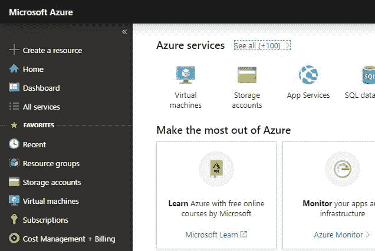
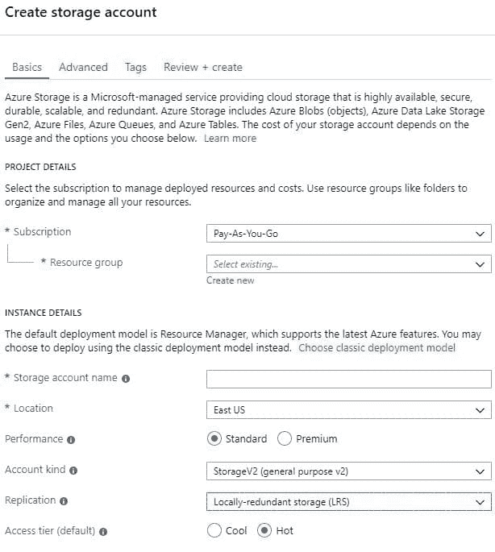
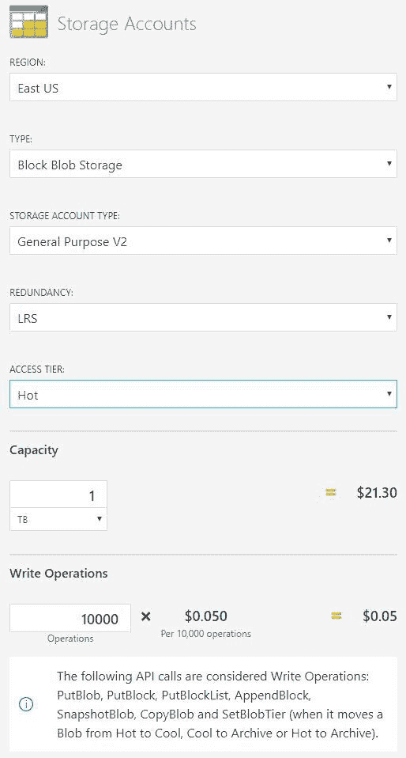

# Azure Facts:存储帐户和 Blobs

> 原文：<https://dev.to/mike_diiorio/azure-facts-storage-accounts-and-blobs-2fk0>

这是与 Microsoft Azure 中的各种组件和服务产品相关的一系列帖子中的第一篇。云计算的前景是巨大的，对于那些不熟悉这些概念的人来说，它可能会让人不知所措。通过 Azure Facts 系列，我希望能够消化整体景观中更小的片段，并简要研究如何利用它们。Azure Facts 系列的第一个主题将关注 Azure 存储帐户中的 Blob 存储。

## 什么是 blob？

在我深入描述 blob 存储之前，我想确保每个人都理解 blob 的概念。blob 这个术语是“一元”**B****L**arge**Ob**object 的首字母缩写，比“云计算”这个术语出现的时间还要长。blob 数据类型是在较旧的计算机系统中创建并普遍使用的，尤其是早期形式的关系数据库管理系统，当时需要存储大于最大允许字符串列长度的数据。简单地说，blob 是一大块非结构化的二进制数据，如图像、文档、视频或音频剪辑。

## 云存储很容易

过去的每一周，我都没有听说一家公司最近将资产转移到了云中，并面临着他们所认为的“买家后悔”。CFO 最终从他们的云提供商那里拿到了第一批发票，费用远远超出了他们的预期。大多数时候，他们被承诺以某种形式的“提升和转移”操作将他们的资产迁移到云中，从而节省大量成本。从技术实现的角度来看，将数据放入云中极其简单。对于许多企业来说，这通常是导致成本超支的第一个陷阱。当回顾主要云提供商的存储选项时，他们都以战略定位的价位提供了各种选择。并非所有存储都是相同的，调配云存储时做出的决策会对底线产生重大影响。让我们看看如何在 Microsoft Azure 中存储 blob 数据，并了解为什么云存储可能很容易，但在将任何东西移入云存储之前，有几个因素需要考虑。

_ **注意:** _ 如果你没有 Azure 账户订阅，你可以通过注册一个[免费 Azure 账户](https://azure.microsoft.com/en-us/free/)来开始。

## Azure 存储账户

在 Azure 中促进存储所需的核心组件称为存储帐户。在创建存储帐户的过程中，需要根据存储的使用方式设置几个参数。此时，了解哪些资产将存储在云中以及如何访问它们是至关重要的。让我们回顾一下存储帐户的创建过程，了解其中的一些细节。

[](https://mikediiorio.files.wordpress.com/2019/04/azureportaldashboard-2.jpg)

一旦我们通过 [Azure 门户](https://portal.azure.com/)登录到我们的 Microsoft Azure 账户，我们就会在用户界面的左侧窗格中看到整套服务。通过选择存储帐户，然后选择顶部导航中的“添加”选项，我们将看到一个新的信息页面，其中包含以下选项:

[](https://mikediiorio.files.wordpress.com/2019/04/azurecreatestorageaccount-2.jpg)

**订购**–将为服务付费的账户。在某些情况下，订阅在收取费用之前可能有免费的信用额度，但一切都是从被分配到某个逻辑单元来收取云资源消耗的费用开始的。

**资源组**——组织 Azure 工件的逻辑容器。资源组不是一种物理事物，而是一种将各种云资源(如存储、虚拟机、数据库等)组合在一起的方式。作为一个逻辑单元。考虑使用资源组的一种方法是为部署到云中的每个应用程序创建一个资源组。这样做，现在有一个非常简单的方法来浏览 Azure 门户中的资源组，并在一个视图中查看组成该应用程序的所有组件。资源组还使维护变得非常容易，因为我们可以删除资源组，删除操作将管理其中所有内容的处置，这对于演示、测试环境甚至灾难恢复都非常有效。

**存储帐户名称**–所有 Azure 存储帐户的唯一名称。关于 Azure 存储帐户，首先要理解的一件事是，它们通过 ReSTful APIs 公开所有的功能。选择的帐户名必须是唯一的，因为它被用作创建的主机名的第一段。最终，我们将能够通过一个类似于
的 URL 从世界任何地方访问 blob 存储

```
https://{StorageAccountName}.blob.core.windows.net 
```

**位置**–托管存储帐户的 Azure 数据中心区域。Azure 服务可从遍布全球的 [54 个地区](https://azure.microsoft.com/en-us/global-infrastructure/regions/)获得。位置属性使我们能够选择最能满足我们需求的地区。通常，我们会选择离我们最近的区域来最小化延迟。另一个要考虑的事项是什么数据存储在云中，以及数据将存储在哪个国家/地区的法律。根据开展的业务类型或存储的数据类型，有许多法律和财务方面的影响因素会影响这一决策。如果围绕数据驻留的法律有任何不确定性，或者如果组织必须遵守特定的行业法规，那么[信任中心](https://www.microsoft.com/en-us/trustcenter/cloudservices/azure)文档中的 Azure 指南可以提供额外的见解。

**性能**—标准或高级——这是列表中的第一个参数，根据所做的选择，资金将发挥作用。标准性能层由磁性驱动器提供支持，而高级性能层由固态驱动器提供支持。如果要求存储大量数据用于备份和归档，标准性能层将是合理的选择，因为速度不是主要使用情形。如果要求为将用作高性能 web 应用程序一部分的资产创建存储，而该应用程序需要一致的低延迟性能，则高级存储层是更好的选择。标准层比高级层便宜，但性能较差。

**账户类型**–存储 V1(不推荐)、存储 V2(推荐)、仅 Blob(特殊)–V1 和 V2 通用账户类型包含多种存储服务:Blob 存储、文件存储、队列存储和表格存储。我们将在其他帖子中讨论其他存储服务。目前，我们只关注 Blob 存储服务。如果存储帐户中不需要其他存储服务，还有一个仅 Blob 存储选项，但必须考虑与可存储的 Blob 类型相关的一些权衡。不应选择通用 V1 帐户类型，因为它将很快被弃用。Microsoft 建议使用通用存储 V2 选项以获得最大的灵活性。

**复制**–本地、区域、地理、读取访问地理–默认情况下，Azure 存储帐户中的数据在本地复制，以确保在给定数据中心内硬件中断时的可用性。正如预期的那样，列表中的每个连续选择都通过将数据从本地移动到同一地区的另一个区域或另一个地区的 Azure 数据中心来确保更高级别的可用性，从而完全防止灾难性的数据中心丢失。除了高级别的恢复能力之外，地理和读取访问地理复制选项还会产生额外的成本，以应对将数据复制到另一个区域的数据中心时发生的数据传输操作。

**访问层**–冷、热–冷选项基于数据访问频率较低的假设，提供了较低的存储价格。相反，热选项的存储价格更高，并且针对频繁的数据访问进行了优化。这里要考虑的要点是，如果数据放在冷层，就不应该频繁访问。否则，与将数据存储在价格较高、数据访问费用较低的热层相比，最终的总存储成本可能会更高。

## 估计入库成本

估算存储成本时需要理解的关键概念是，价格不仅仅是静态存储的固定费用，无论存储介质是什么。总存储成本只能通过考虑以下因素来估算:

**数据存储成本**(单价)+ **操作**(每次操作的读/写价格)+ **数据传输价格**(单价)= _ **总存储成本** _

回顾 Azure 文档中的[定价细节](https://azure.microsoft.com/en-us/pricing/details/storage/blobs/)，我们看到每一层都有与核心存储成本、读写操作、创建容器操作、数据检索等相关的不同价格。一些价位是根据针对存储帐户执行的交易数量来设置的，而其他价位是根据访问的数据大小来设置的。虽然这整个概念对于门外汉来说可能令人难以置信，但微软确实提供了一个工具，用 [Azure 计算器](https://azure.microsoft.com/en-us/pricing/calculator/?service=storage)来帮助可视化这些费用。将您的云使用参数输入到计算器中以获得每月存储成本的估计值是非常有用的。这里的数字显然只是一个非常粗略的估计，但它让我们可以看到各种参数，并在将数据迁移到云存储之前对我们的假设进行一些调整 _ **。**

[](https://mikediiorio.files.wordpress.com/2019/04/azurecalculator-1.jpg)

快速浏览上述选项后，一个关键的要点是，为不同的用途创建不同的储物账户是完全可以接受的，并建议这样做。创建一个具有高级访问权限的存储帐户作为您的关键、高性能网站的后备存储，同时使用同一个存储帐户保存很少访问的技术文档的备份版本，这样做没有多大意义。我看到的组织犯的常见错误是创建一个存储帐户，然后用各种 blob 容器分割它。一个存储帐户不应等同于在整个组织中为满足所有存储需求而共享的单个本地 SAN 磁盘阵列。存储帐户应该用于存储相似的数据，创建多个存储帐户是正常的做法，而不是例外。

## 工作更聪明，而不是更努力

微软最近宣布了一项新功能，允许用户管理存储在云中的资产的生命周期。我们大多数人都可以承认，我们的电脑上有些文件是多年前出于好意保存下来的，从那以后就再也没有动过。在许多情况下，我们可能会在几天甚至几个月内频繁地访问该文件，但过一段时间后，它就变得不那么相关了。正如我们在本文前面的存储帐户选项中所看到的，我们经常使用的资产从热层(较贵)开始，经过一段时间后将迁移到冷层(较便宜)，然后最终进入长期归档(非常便宜)，甚至在不再需要时删除(最便宜的)。这个“生命周期”正是最新产品想要解决的问题。通过在存储帐户上定义每天执行的策略，我们可以自动执行各种状态之间的数据转换，并可能看到更大的成本节约，因为该策略可以比人工管理员更高效地管理资产。要了解更多关于这个特性的信息，请访问 Azure 文档，了解如何管理 Azure Blob 存储生命周期。

## 结论

这是对如何估算和管理存储成本的简要介绍。最终，云存储易于使用，并且在大规模运行时极其强大，但我们必须更加警惕地确定如何调配和利用存储。当涉及到花公司的钱时，无知不是福。

在下一篇文章中，我们将创建一个存储帐户，并研究可用于将数据移入和移出云的各种技术。

## 资源链接

**蔚蓝账号注册**

【https://azure.microsoft.com/en-us/free/】T4

**蔚蓝门户**

【https://portal.azure.com/】T4

**Azure Regions**

[https://Azure . Microsoft . com/en-us/global-infra structure/Regions/](https://azure.microsoft.com/en-us/global-infrastructure/regions/)

**Azure 信任中心**

[https://www . Microsoft . com/en-us/Trust Center/cloud services/Azure](https://www.microsoft.com/en-us/trustcenter/cloudservices/azure)

**Blob 存储定价**

[https://azure . Microsoft . com/en-us/Pricing/details/Storage/blobs/](https://azure.microsoft.com/en-us/pricing/details/storage/blobs/)

**蔚蓝计算器**

【https://azure.microsoft.com/en-us/pricing/calculator/?】T4 服务=存储

**存储生命周期管理**

[https://docs . Microsoft . com/en-us/azure/Storage/blobs/Storage-life cycle-Management-concepts](https://docs.microsoft.com/en-us/azure/storage/blobs/storage-lifecycle-management-concepts)