# 2019 年值得关注的 13 款开源人工智能和机器学习工具

> 原文：<https://dev.to/promozseo/13-open-source-artificial-intelligence-and-machine-learning-tools-to-watch-in-2019-1hmc>

[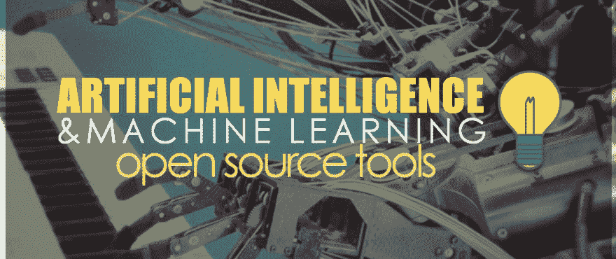](https://res.cloudinary.com/practicaldev/image/fetch/s--CBAb3vst--/c_limit%2Cf_auto%2Cfl_progressive%2Cq_auto%2Cw_880/https://thepracticaldev.s3.amazonaws.com/i/6gow231e3zpq7e8athvc.jpg)

人工智能和机器学习是当今科技界的热门词汇。人工智能已经影响了我们生活的许多方面，从智能手机中的语音识别系统到无人驾驶汽车和执行人工任务的机器人。

谷歌、脸书、IBM、微软和亚马逊等大公司正在利用这一快速增长的未来技术，并投资于自己的人工智能和机器学习研发。

在这篇文章中，我们提供了 13 个最佳开源人工智能和机器学习工具的列表，你可以用它们来构建你自己即将到来的项目。

## 咖啡馆

[**Caffe**](http://caffe.berkeleyvision.org/) (用于快速特征嵌入的卷积架构)是由柏克莱人工智能研究(BAIR)中心开发的基于开源人工智能的深度学习框架。这个强大的框架是用 C++编程语言编写的，并带有一个 Python 接口。

[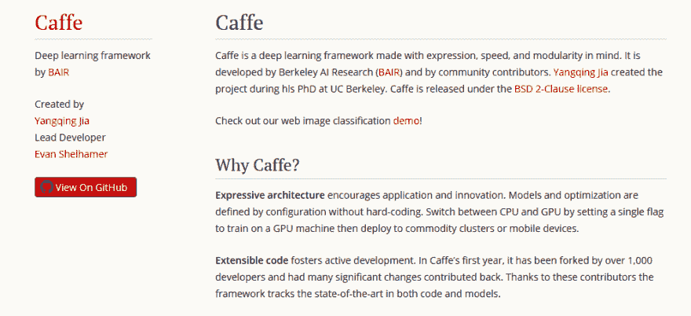](https://res.cloudinary.com/practicaldev/image/fetch/s--RfuR4E1P--/c_limit%2Cf_auto%2Cfl_progressive%2Cq_auto%2Cw_880/https://thepracticaldev.s3.amazonaws.com/i/g92qaztjlpjaody4iojx.jpg)

这个工具主要关注表现力、速度和模块化，是计算机视觉相关应用的流行选择。现在，Caffe 被广泛用于学术研究项目、创业原型，甚至大规模工业应用。

特点:

1.  其富有表现力的设计有助于快速处理数据，并鼓励应用和创新。
2.  凭借其令人印象深刻的架构，您可以轻松地在 CPU 和 GPU 之间切换。
3.  借助 NVIDIA K40 GPU，它每天能够处理超过 6000 万张图像。
4.  其广泛的代码促进了大量不同项目的积极开发和快速执行。
5.  速度是 Caffe 成为研究实验和工业应用的完美选择的主要因素之一。

## TensorFlow

[**TensorFlow**](https://www.tensorflow.org/) 是由谷歌的研究人员和工程师开发的开源机器学习框架。它是使用数据流图进行数值计算的最广泛使用的框架之一。其灵活的架构允许您使用单个 API 在多个 CPU 或 GPU 上执行计算。

[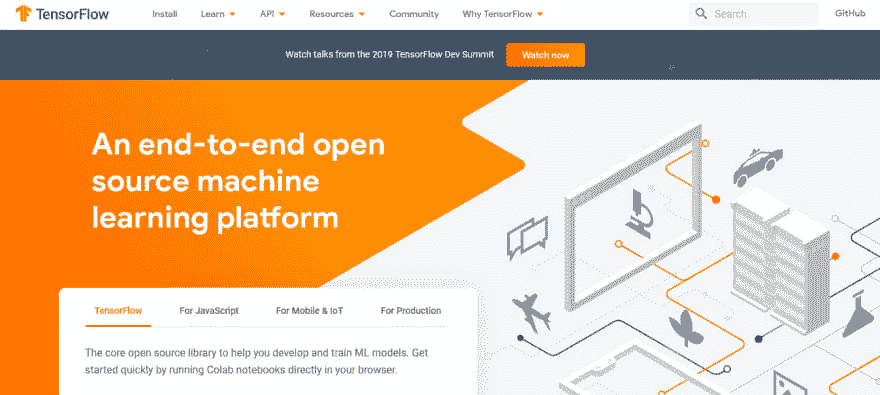](https://res.cloudinary.com/practicaldev/image/fetch/s--dacAj1Rv--/c_limit%2Cf_auto%2Cfl_progressive%2Cq_auto%2Cw_880/https://thepracticaldev.s3.amazonaws.com/i/aowzofht6w4vjkmvtfg6.jpg)

TensorFlow 在 C++、Java、Python 等各种编程语言上都有。你也可以找到其他第三方编程语言的包。TensorFlow 允许你开发神经网络，它现在被各种知名公司广泛使用，如 Twitter、Dropbox、易贝、英特尔和许多其他公司。

特点:

1.  使用 TensorFlow，您可以轻松检查模型图形的每个部分，并在调试时进行必要的更改。
2.  TensorFlow 的操作非常灵活，这意味着它为您提供了模块化选项，以及您希望独立的部分。
3.  它让您使用流程图开发深度学习神经网络，使模型对于大规模项目更有效。
4.  TensorFlow 具有在原始数据和估计值之间工作的功能列，用于发送或接收模型的输入数据。
5.  通过它的 LSTM(长短期记忆)模型，你可以自动生成电子邮件回复。

## 阿帕奇看象人

[**Apache Mahout**](https://mahout.apache.org/) 是一个开源的机器学习框架，主要用于创建可扩展的机器学习算法。这个工具是由 Apache 软件基金会设计的，它建立在一个叫做 Mahout Hadoop 的平台上。它主要致力于简化涉及统计和线性代数的常见数学问题，并帮助数学家、统计学家和数据科学家快速实现他们自己的算法。

[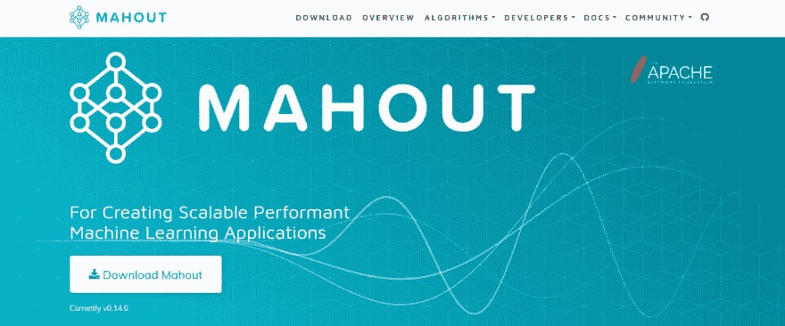](https://res.cloudinary.com/practicaldev/image/fetch/s--un797rDc--/c_limit%2Cf_auto%2Cfl_progressive%2Cq_auto%2Cw_880/https://thepracticaldev.s3.amazonaws.com/i/0bsk169a35rjmvl76hi4.jpg)

它有助于在 Mahout Hadoop 分布式文件系统中处理和分组大数据。它有一个跨平台的操作系统，给你一个类似 R 语法的环境。像 Adobe、Accenture、Foursquare、LinkedIn、Twitter 和其他公司都在使用 Mahout。

特点:

1.  这些算法是在 Hadoop 之上编写的，因此它在分布式环境中运行良好。
2.  Mahout 为您提供了一个现成的框架，用于在大量数据上执行数据挖掘任务。
3.  它让应用程序能够快速有效地分析大规模数据。
4.  它包括矩阵和向量库。
5.  它为 Spark、H2O、Apache Flink 等工具提供了各种各样的预制算法。
6.  它包括各种支持 Map-Reduce 的聚类实现，如 k 均值、模糊 k 均值、Canopy、Dirichlet 和均值漂移。
7.  它支持分布式朴素贝叶斯以及互补的朴素贝叶斯分类实现。

## 深度学习 4j

[**Deeplearning4j**](https://deeplearning4j.org/) 是另一个众所周知的基于开源 AI 的 Java 虚拟机(JVM)深度学习工具。它是由旧金山和东京的一组人工智能研究人员在 Apache License 2.0 下开发的。

[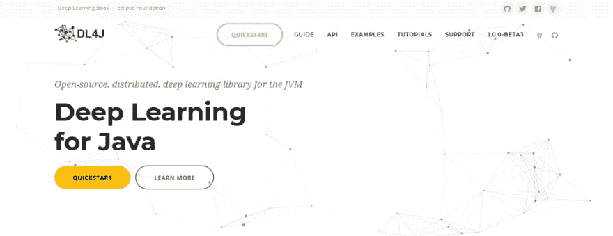](https://res.cloudinary.com/practicaldev/image/fetch/s--Gdl8GLLG--/c_limit%2Cf_auto%2Cfl_progressive%2Cq_auto%2Cw_880/https://thepracticaldev.s3.amazonaws.com/i/hqvjc7y1igo7abbom11g.jpg)

Deeplearning4j 可以使用不同的 API 语言，如 Python 和 Clojure，并且可以与 Hadoop 和 Apache Spark 集成。这个框架用于构建神经网络，它包含许多高级可视化工具。Deeplearning4j 在基于研究的项目以及网络安全、欺诈检测和图像识别领域有许多不同的学术应用。

特点:

1.  它与分布式 CPU 和 GPU 一起工作。
2.  它可以用于多种 API 语言，包括 Java、Scala、Python、Clojure 和 Kotlin。
3.  它可以从 Keras、Tensorflow、Theano 和 CNTK 等 Python 框架中导入模型。
4.  Deeplearning4j 已经与 RapidMiner、Prediction.io 和 Weka 等其他机器学习平台集成。
5.  Deeplearning4j 允许配置深度神经网络，并且兼容 Java、Scala 和其他 Java 虚拟机语言。

## Apache SystemML

[**Apache SystemML**](https://systemml.apache.org/) 是一个灵活的开源人工智能工具，由 IBM 的一群研究人员创建。SystemML 专注于大数据，旨在简化复杂的数学问题。

[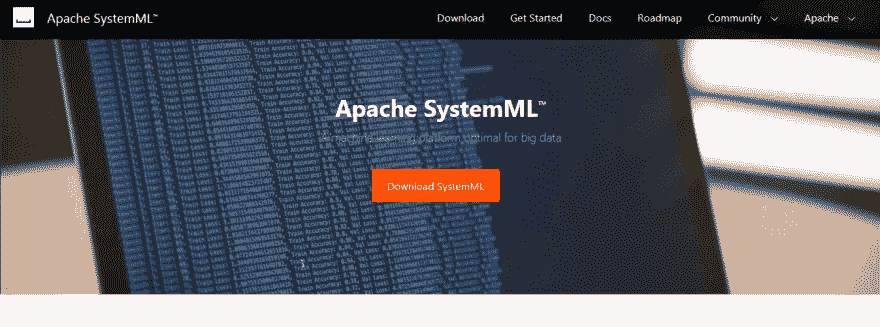](https://res.cloudinary.com/practicaldev/image/fetch/s--KWbqc6Yg--/c_limit%2Cf_auto%2Cfl_progressive%2Cq_auto%2Cw_880/https://thepracticaldev.s3.amazonaws.com/i/k6zwu31csymyad2htdex.jpg)

它运行在类似 R 和类似 Python 的语言上，并自动逐行缩放您的数据，以及确定您的代码应该运行在驱动程序上还是 Apache Spark 集群上。目前，这个工具正被汽车或机场交通控制等企业所使用。

特点:

1.  它具有基于数据和集群特征的自动优化功能，可确保效率和可扩展性。
2.  Apache SystemML 有多种执行模式，如 Spark MLContext、Spark Batch、Hadoop Batch、Standalone 和 JMLC (Java 机器学习连接器)。
3.  SystemML 被认为是机器学习的 SQL，SystemML 的最新版本(1.0.0)支持 Python 2.7/3.5+，Hadoop 2.6+，Java 8+，Scala 2.11+和 Spark 2.1+。

## H20

[**H20**](https://www.h2o.ai/) 是一个基于人工智能的开源深度学习平台，由 H2O.ai 设计，该工具由开发人员和人工智能研究人员使用，帮助他们从数据中做出决策并得出见解。H2O 有两个开源版本，一个是标准 H2O，另一个是付费版本苏打水。

[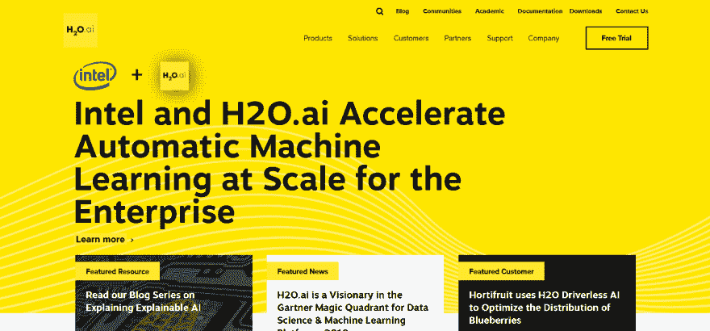](https://res.cloudinary.com/practicaldev/image/fetch/s---MwJjI-n--/c_limit%2Cf_auto%2Cfl_progressive%2Cq_auto%2Cw_880/https://thepracticaldev.s3.amazonaws.com/i/fjzmjb894zmgsvun2eqa.jpg)

该工具有两个开源版本，可用于风险和欺诈分析、预测建模、广告技术、保险分析、客户智能和医疗保健。

特点:

1.  它支持各种操作系统，如 Microsoft Windows、Linux 和 MacOS。
2.  熟悉且易于使用的 web UI 和界面。
3.  实时数据评分。
4.  它可以分析存在于云和 Apache Hadoop 文件系统中的数据。
5.  附带了同类最佳的开源技术。
6.  高度可扩展的大数据分析系统。
7.  它为所有常见的数据库和文件类型提供数据诊断支持。

## MLlib

[**MLlib**](https://spark.apache.org/mllib/) 是 Apache Spark 推出的用于学习算法的开源机器学习库。该工具使用不同的编程语言，如 Scala、Java、R、Python，并运行在许多不同的平台上，如 Kubernetes、Hadoop 或 Cloud。

[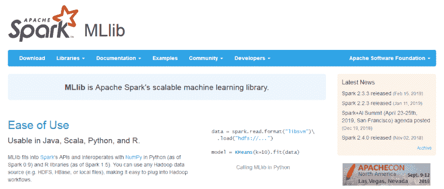](https://res.cloudinary.com/practicaldev/image/fetch/s--Mnoip8eU--/c_limit%2Cf_auto%2Cfl_progressive%2Cq_auto%2Cw_880/https://thepracticaldev.s3.amazonaws.com/i/dpslzoeqjuohcev4faj8.jpg)

该库包含许多深度学习和核心机器学习算法，用于分类、推荐、决策树、聚类、主题建模、回归、模型评估、特征转换、ML 持久性、ML 管道构建和生存分析。

特点:

1.  ML 算法是 MLlib 的核心，它包括常见的学习算法，如聚类分类、回归和协同过滤。
2.  Pipelines 提供了构建、评估和调优 ML 管道的工具。
3.  持久性帮助您保存和加载算法、模型和管道。
4.  特征化包括特征提取、降维、变换和选择。
5.  实用程序为线性代数、统计和数据处理提供支持。

## OpenCyc

[**OpenCyc**](http://www.cyc.com/opencyc/) 是 Cycorp 推出的开源常识数据库，让文本理解成为可能。OpenCyc 被设计成确保用户可以不受限制地访问知识库，并且可以在不同的应用程序中使用它。

[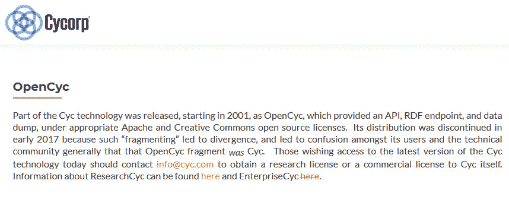](https://res.cloudinary.com/practicaldev/image/fetch/s--UeAohORP--/c_limit%2Cf_auto%2Cfl_progressive%2Cq_auto%2Cw_880/https://thepracticaldev.s3.amazonaws.com/i/fsmgjdb795fveigdc4k4.jpg)

OpenCyc 使应用程序能够浏览大型数据库并处理相关信息，以得出准确的结果。它与 Apache 及其内置的 HTTP 服务器兼容。

特点:

1.  它有助于丰富的领域建模、文本理解、语义数据集成、特定领域专家系统 AI 游戏等。
2.  这个人工智能工具对于进行智力竞赛、理解文本和学习特定领域的知识是有价值的。
3.  它有助于区分特定关键词的相关词和同义词，并通过显示人类的认知能力来确保应用程序像人一样运行。

## OpenNN

[**OpenNN**](http://www.opennn.net/) (开放神经网络)是另一个用 C++编程语言编写的用于深度学习的开源类库。它用于创建神经网络，这是机器学习研究的主要领域。

这个开源库用于物流和营销领域，它允许高性能计算，因为它具有更高的处理速度。

特点:

1.  OpenNN 包含许多函数的数据挖掘算法。
2.  OpenNN 基于多层感知器。
3.  它使用机器学习技术来解决能源、化学和工程等不同领域的数据挖掘和预测分析任务。
4.  为了提高计算机性能，它允许通过 OpenMP 进行多处理编程。

## 火炬

于 2002 年推出的 [**Torch**](http://torch.ch/) 是一个机器学习库，提供了广泛的深度学习算法。它是用快速脚本语言 LuaJIT 编写的，底层的 C/CUDA 实现使它易于使用。

这个开源框架在处理机器学习项目时为您提供了优化的速度和灵活性，而不会导致过程的复杂性。Torch 被各种受欢迎的公司使用，如脸书、IBM、Yandex 和 Idiap 研究所。现在它已经扩展到在 Android 和 iOS 设备上使用。

特点:

1.  自带强大的 N 维数组。
2.  数值优化程序。
3.  它由许多用于索引、切片、转置等的例程组成。
4.  神经网络和基于能量的模型。
5.  快速高效的 GPU 支持。
6.  可嵌入 iOS 和 Android 后端的端口。

## [努匹](#nupic)

[**NuPIC**](https://numenta.org/implementations/)(Numenta Platform for Intelligent Computing)是一个开源的人工智能项目，基于一种叫做分级时间记忆(HTM)的理论。NuPIC 是由机器智能公司 Numenta 开发的，该公司基于新大脑皮层的原理开发了技术和应用程序。

[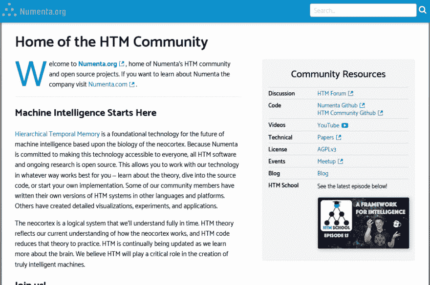](https://res.cloudinary.com/practicaldev/image/fetch/s--5_C1Dw5l--/c_limit%2Cf_auto%2Cfl_progressive%2Cq_auto%2Cw_880/https://thepracticaldev.s3.amazonaws.com/i/33p65s9k2c7sgw7ny4xx.jpg)

NuPIC 是一个人工智能学习框架，可以用各种编程语言实现，如 C++、Java、Python、Clojure、Go 或 JavaScript。它从实时数据流中收集分析数据，是检测实时数据中不一致性的完美工具。

特点:

1.  grok–检测 IT 服务器的不一致性。
2.  cortical . io–该功能用于高级自然语言处理。
3.  HTM 工作室-这个工具可以发现时间序列中的不规则现象。
4.  Numenta 异常基准–它将 HTM 与其他异常检测技术进行比较。

## 分布式机器学习工具包

[**分布式机器学习工具包**](http://www.dmtk.io/) 是微软开发的开源项目。该工具包旨在分析大数据应用程序，并更快地运行人工智能系统。它由三个关键组件组成，如 LightLDA 主题模型算法、DMTK 框架和分布式(多义)单词嵌入算法。

[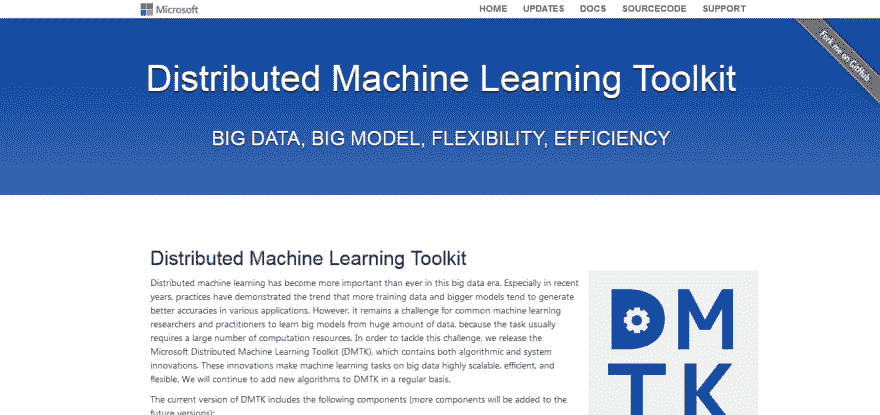](https://res.cloudinary.com/practicaldev/image/fetch/s--Xq4pMXNF--/c_limit%2Cf_auto%2Cfl_progressive%2Cq_auto%2Cw_880/https://thepracticaldev.s3.amazonaws.com/i/pug47y9vspgd4wxz20b9.jpg)

微软的分布式机器学习工具包(DMTK)包含算法和系统创新。这些创新使得大数据上的机器学习任务高度可扩展和高效。

特点:

1.  LightLDA 是一个非常快速和可扩展的模型算法，具有 O(1) Gibbs 采样器和高效的分布式实现。
2.  分布式(多意义)单词嵌入是自然语言处理的高质量单词特征。
3.  LightGBM 是一个非常高性能的梯度提升树框架，支持不同的算法，如 GBDT、GBRT、GBM 和 MART。

## ONNX

[**ONNX**](https://onnx.ai/) (开放神经网络交换)是一个开源的 AI 工具，被 AI 研究人员广泛用于深度学习模型。它主要是一个由微软和 AWS 支持的脸书开源项目。借助 ONNX，AI 开发人员可以轻松地在最先进的工具之间移动模型，并选择最适合他们的组合。

[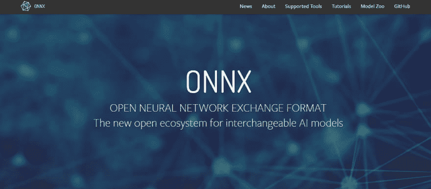](https://res.cloudinary.com/practicaldev/image/fetch/s--RaMOpEmb--/c_limit%2Cf_auto%2Cfl_progressive%2Cq_auto%2Cw_880/https://thepracticaldev.s3.amazonaws.com/i/5mvxmddiol7mktagpv7f.jpg)

特点:

1.  ONNX 使模型能够在一个框架中训练，并转移到另一个框架中进行推理。
2.  该工具允许您应用创新内容，如可扩展计算图模型，并且您可以根据需求对其网络进行更改。
3.  其兼容的运行时和库旨在最大限度地发挥业界一些最佳硬件的性能。

### 结论:

上述人工智能和机器学习工具的使用正在快速变革各种行业。在互联网营销培训、教育、T2 服务、就业、医药、T4 医疗保健、食品、环境、机器人、金融交易等等领域，这些开源工具有着广阔的应用前景。毫无疑问，AI & ML 为您提供了最非凡的可能性，让您在全球范围内扩展它，并利用现代技术和发展的未开发潜力。