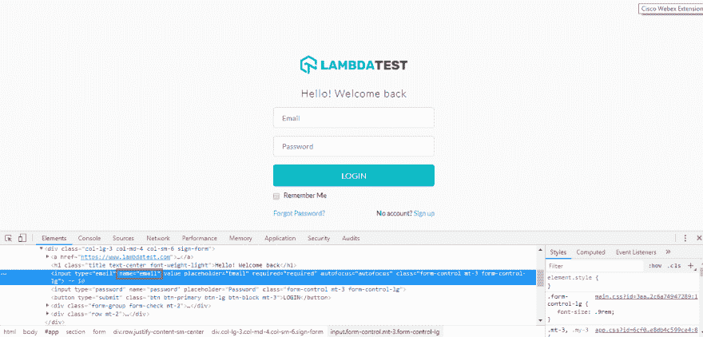

# 如何在 Selenium 自动化脚本中使用名称定位器？

> 原文：<https://dev.to/lambdatest/how-to-use-name-locator-in-selenium-automation-scripts-59jg>

Selenium 中的定位器在自动化工程师的生活中扮演着重要的角色。根据您定位元素的熟练程度，使用 Selenium 进行自动化测试的稳定性和效率是成正比的。利用 Selenium 中的定位器在页面上查找元素有多种方式，但是决定哪种方式是正确的，这很重要。在本文中，我将介绍如何在 Selenium 自动化脚本中使用 by.name locator。

如果你是硒的新手，并且想知道它是什么，那么我们建议查看我们的指南— [什么是硒？](https://www.lambdatest.com/selenium?utm_source=devto&utm_medium=organic&utm_campaign=aug30_sd&utm_term=sd&utm_content=webpage)

如果你是一个高级或中级硒从业者，那么你可以在上面提到的专门文章卡盘。并获取我们的完整指南，帮助您说明 Selenium 中 CSS locator 的实际演示。

## 了解 DOM(文档对象模型)

文档对象模型(DOM)定义了由各种标签元素及其相应属性组成的网页结构。例如，下面显示了 LambdaTest 登录页面:

[](https://res.cloudinary.com/practicaldev/image/fetch/s--58JTJYc6--/c_limit%2Cf_auto%2Cfl_progressive%2Cq_auto%2Cw_880/https://cdn-images-1.medium.com/max/2738/0%2AMLjARKX1YsXcOeE0.png)

在上面的截图中，我们试图找到“电子邮件”字段。电子邮件字段的 DOM 结构如下所示:

< input type="email" name="email" value="" placeholder="Email" required="required" autofocus="autofocus" class="form-control mt-3 form-control-lg" >

上述 DOM 结构的属性是:

*   类型

*   名字

*   价值

*   占位符

*   需要

*   自（动）调焦装置

*   班级

***嘿！对于[硒测试工具](https://www.lambdatest.com/selenium-automation?utm_source=devto&utm_medium=organic&utm_campaign=aug30_sd&utm_term=sd&utm_content=webpage)，点击这里。在 3000+桌面&手机浏览器的 Selenium 网格云上测试。***

## 了解 Selenium 中的 By.name 定位器

By.name Selenium 定位器用于识别网页的元素。该属性可以作为多个标签的一部分，如< input >、< button >、< select >等。与 ID 不同，这可能是也可能不是一个页面所独有的。一个网页可能包含多个具有相同 By.name 属性值的标签。在这种情况下，如果您打算选择想要的元素，Selenium 中的 By.name 定位器可能不是正确的选择。

需要注意的一个关键点是，当您倾向于选择一个具有所需 name 属性值的元素时，它将选择它遇到的第一个元素。您可能会遇到另一种情况，您希望选择具有相同 name 属性值的元素，在这种情况下，Selenium 中的 **By.name** 定位器可以使用 **findElements** 语法工作。在本文中，我将在代码中展示这两种场景的示例。

为了通过 Selenium 中的 By.name 定位器定位元素，我们使用下面的命令:

driver.findElement(By.name("元素名"))；

让我们深入代码片段，了解 By.namelocator 的用法。

[](https://res.cloudinary.com/practicaldev/image/fetch/s--ERNawtDn--/c_limit%2Cf_auto%2Cfl_progressive%2Cq_auto%2Cw_880/https://cdn-images-1.medium.com/max/2000/0%2AzIT0OX_SuZzX3b4i.png)

该认证是为那些希望在硒自动化测试领域保持领先地位的专业人士准备的。

以下是来自 LambdaTest 的 Selenium 101 认证的简要介绍:

[https://www.youtube.com/embed/qx9FPFfJm7E](https://www.youtube.com/embed/qx9FPFfJm7E)

***如何选择合适的[自动化测试工具](https://www.lambdatest.com/blog/automation-testing-tools/?utm_source=devto&utm_medium=organic&utm_campaign=aug30_sd&utm_term=sd&utm_content=blog)？看看这个博客，为自动化测试选择合适的工具。***

## Selenium 中 By.nameLocator 的测试场景 1

在下面的代码示例中，我们登录到 LambdaTest 平台。在这里，我们将使用 By.name 属性找到“电子邮件”和“密码”字段。

```
package Chromedriver;

import org.openqa.selenium.By;
import org.openqa.selenium.WebDriver;
import org.openqa.selenium.WebElement;
import org.openqa.selenium.chrome.ChromeDriver;

public class Name_Locator {

public static void main(String[] args) {

        //Setting up chrome using chromedriver by setting its property
        System.setProperty("webdriver.chrome.driver", "C:\\Users\\navyug\\workspace\\Lambdatest\\src\\Chromedriver\\chromedriver.exe"); 

        //Opening browser
        WebDriver driver= new ChromeDriver() ;

        //Opening window tab in maximize mode
        driver.manage().window().maximize();

        //Opening application
        driver.get("[https://accounts.lambdatest.com/login](https://accounts.lambdatest.com/login)");

        //Locating the email field element via Name tag and storing it in the webelement
        WebElement email_field=driver.findElement(By.name("email"));

        //Entering text into the email field
        email_field.sendKeys("[sadhvisingh24@gmail.com](mailto:sadhvisingh24@gmail.com)");

        //Locating the password field element via Name tag and storing it in the webelement
        WebElement password_field=driver.findElement(By.name("password"));

        //Entering text into the password field
        password_field.sendKeys("LoremIpsum");

        //Clicking on the login button to login to the application
        WebElement login_button=driver.findElement(By.xpath("//button[text()='LOGIN']"));

        //Clicking on the 'login' button
        login_button.click();

        //Closing the window
        driver.close();
        }
} 
```

Enter fullscreen mode Exit fullscreen mode

***嘿！在此处对 [Safari for windows](https://www.lambdatest.com/safari-browser-for-windows?utm_source=devto&utm_medium=organic&utm_campaign=aug30_sd&utm_term=sd&utm_content=webpage) 进行实时交互式跨浏览器测试。***

## Selenium 中按名称定位符的测试场景 2

在下面的代码示例 post-log in 中，在菜单栏的 automation 部分下，我们有一个页面，其中包含单选按钮的两个 web 元素具有与 radio 相同的 By.name 属性值。我们打算在这两个按钮之间切换。下面是这两个元素的 DOM 结构:

```
&lt; div class="TimelineTab_viewRadioButton__18Zf3"&gt;
&lt; label &gt;<input type="radio" name="radio" value="build_view"><span class="TimelineTab_labelText__2DZ00 TimelineTab_font14__2K4jw">Build View</span>
<!-- label-->&lt; label&gt;&lt; input type="radio" name="radio" value="test_view"&gt;
<span class="TimelineTab_labelText__2DZ00 TimelineTab_font14__2K4jw">Test View<!-- span--><!-- label -->&lt; /div &gt;</span> 
```

Enter fullscreen mode Exit fullscreen mode

下面的代码片段:

```
package Chromedriver;

import java.util.List;
import java.util.concurrent.TimeUnit;

import org.openqa.selenium.By;
import org.openqa.selenium.WebDriver;
import org.openqa.selenium.WebElement;
import org.openqa.selenium.chrome.ChromeDriver;

public class Multiple_Name_Values {

public static void main(String[] args) {

//Setting up chrome using chromedriver by setting its property
                System.setProperty("webdriver.chrome.driver", "C:\\Users\\navyug\\workspace\\Lambdatest\\src\\Chromedriver\\chromedriver.exe"); 

                //Opening browser
                WebDriver driver= new ChromeDriver() ;

                //Opening window tab in maximize mode
                driver.manage().window().maximize();

                //Maintaining an implicit wait for the entire application in case of throttling network or DOM not loaded
                driver.manage().timeouts().implicitlyWait(20, TimeUnit.SECONDS);
                //Opening application
                driver.get("[https://accounts.lambdatest.com/login](https://accounts.lambdatest.com/login)");

                //Locating the email field element via Name tag and storing it in the webelement
                WebElement email_field=driver.findElement(By.name("email"));

                //Entering text into the email field
                email_field.sendKeys("[sadhvisingh24@gmail.com](mailto:sadhvisingh24@gmail.com)");

                //Locating the password field element via Name tag and storing it in the webelement
                WebElement password_field=driver.findElement(By.name("password"));

                //Entering text into the password field
                password_field.sendKeys("LoremIpsum");

                //Clicking on the login button to login to the application
                WebElement login_button=driver.findElement(By.xpath("//button[text()='LOGIN']"));

                //Clicking on the 'login' button
                login_button.click();

                //Click on the Automation menu link on the sidebar
                driver.findElement(By.xpath("//*[[@id](http://twitter.com/id)='app']/header/aside/ul/li[4]/a/span")).click();

//Finding all the webelement on the page with name attribute value as radio
                List<webelement> radio_button=driver.findElements(By.name("radio"));

                //Click on the test view of the element
                radio_button.get(1).findElement(By.xpath("//span")).click();

                //Closing the driver
                driver.close();
    }
}
</webelement> 
```

Enter fullscreen mode Exit fullscreen mode

正如您在上面两个例子中看到的，我们以不同的方式使用了 By.name 定位器。一个是通过 **findElement** ，另一个是通过 **findElements 命令**。在一个示例中，我们的目标是定位一个元素，而在另一个示例中，我们定位了多个具有相同 By.name 的元素，并试图切换到其中一个元素。因此，根据定义的需求和业务，我们可以使用 By.name 定位器。按名称定位易于使用和维护，诀窍在于识别它们的正确用法。

您也可以阅读我以前的文章，在那里我解释了 Selenium WebDriver 中所有定位器的演示。我还将写下一系列专门的文章来详细演示 Selenium 的每个定位器的完整用法。敬请期待！🙂