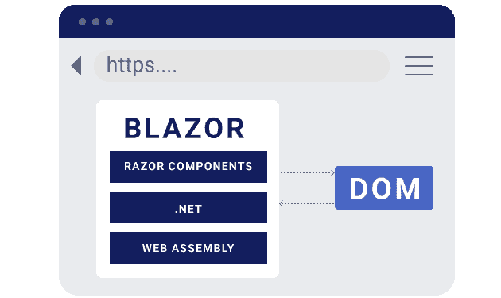
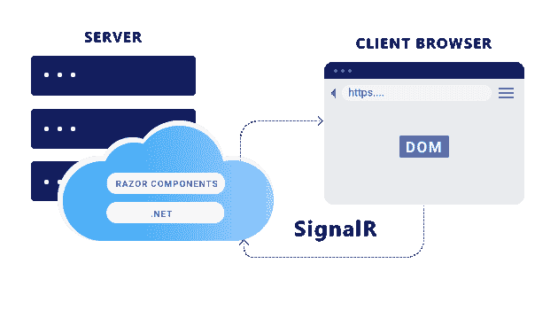
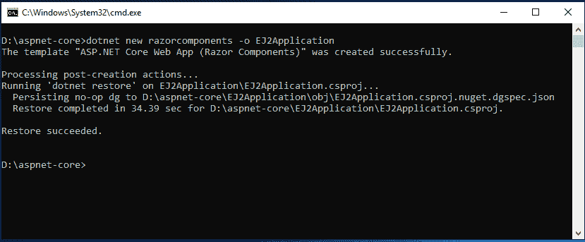
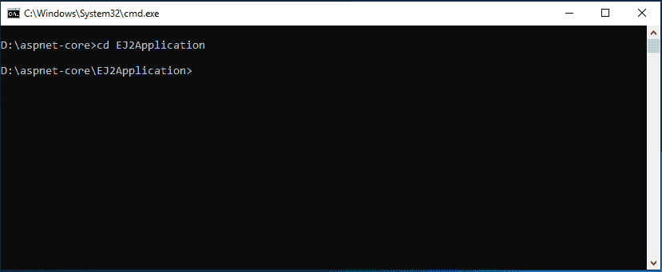
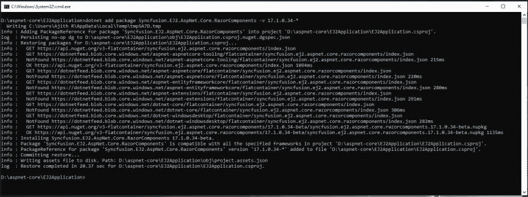
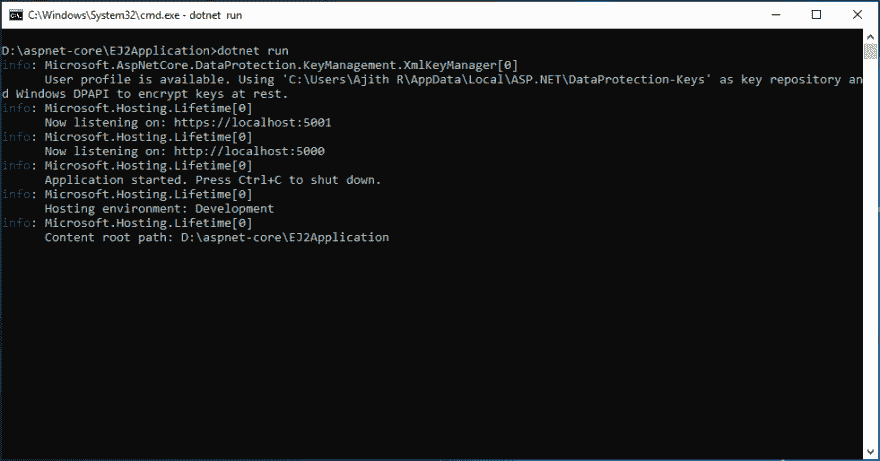
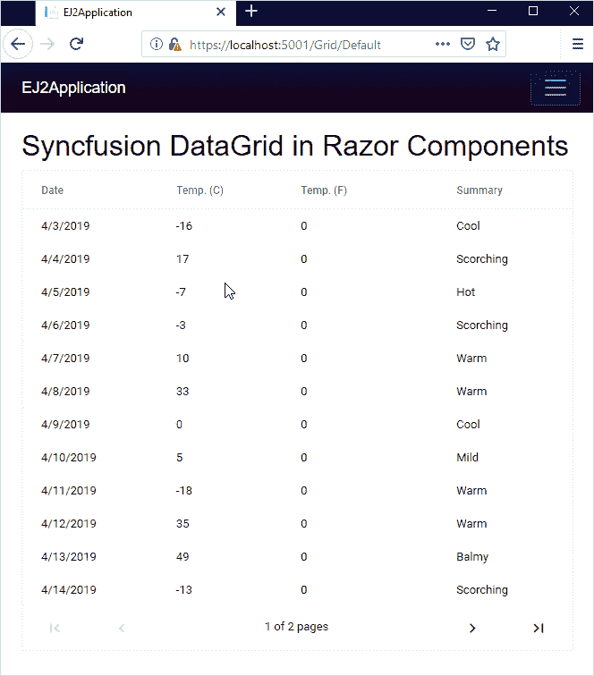

# 介绍 Syncfusion 的 ASP.NET 核心 Blazor / Razor 组件

> 原文：<https://dev.to/syncfusion/introducing-syncfusion-s-asp-net-core-blazor-razor-components-37o2>

像其他人一样，我们对即将到来的`Microsoft ASP.Net Core 3.0 framework`感到兴奋。我们特别渴望尝试[`Blazor`/`Razor Components`/](https://docs.microsoft.com/en-us/aspnet/core/razor-components/?view=aspnetcore-3.0)，它们有可能让 web 开发更加转向强类型`C#`和`WebAssembly`。Syncfusion 激动地宣布，针对`ASP.NET Core Blazor /` `Razor Components` 的 [UI 控件的预览版现已推出。在本帖中，我们将简单介绍一下`Blazor` / `Razor Components`。](https://www.syncfusion.com/aspnet-core-blazor-razor-components)

#### Blazor 简介

Blazor 是下一代单页应用程序(SPA ),用于使用. NET 构建客户端 web 应用程序。它支持编写 C#代码，而不是使用 JavaScript 来构建客户端 web 应用程序。WebAssembly 用于构建。NET C#代码，无需任何附加插件。

[](https://res.cloudinary.com/practicaldev/image/fetch/s--Gwhs-Z8T--/c_limit%2Cf_auto%2Cfl_progressive%2Cq_auto%2Cw_880/https://blog.syncfusion.com/wp-content/uploads/2019/03/blazor-1.png) 

<figcaption>*`Blazor runs .NET code in the browser with WebAssembly.`*</figcaption>

Blazor 应用程序在 web 浏览器中构建和运行时会处理以下功能:

1.  Blazor 应用程序将 C#代码和 Razor 文件编译成一个. NET 程序集。
2.  客户端 web 浏览器下载程序集文件。
3.  WebAssembly 将在客户端加载下载的程序集文件。
4.  Blazor 处理 DOM 操作并触发浏览器 API。

Blazor 是 Razor 组件的实验性客户端托管模型。

#### Razor 组件介绍(服务器端 Blazor)

Razor Components 是一个新的 web 框架，用`.NET`构建交互式 web UI。它被设计为在 web 浏览器中的客户端运行在一个`Blazor`应用程序上。

现在，`.NET Core 3.0`通过使用一个`ASP.NET Core`应用程序从服务器端提供托管`Razor Components`的支持。`SignalR`连接处理从服务器到客户机和从客户机到服务器的 UI 更新。

[](https://res.cloudinary.com/practicaldev/image/fetch/s--eZ6tPjWo--/c_limit%2Cf_auto%2Cfl_progressive%2Cq_auto%2Cw_880/https://blog.syncfusion.com/wp-content/uploads/2019/03/razor-components.png) 

<figcaption>*`Razor Components runs .NET code on the server and interacts with the DOM in the client over a SignalR connection.`*</figcaption>

## sync fusion ASP.NET 核心 Blazor / Razor 组件

用于`ASP.NET Core Razor Components` 的 [Syncfusion UI 控件是用于`Blazor`框架的超过 60 个 UI 控件的完整套件，它构建在我们流行的`Essential JS 2 JavaScript`框架之上。从应用程序开发人员的角度来看，我们投入了大量精力来确保包装组件的行为与本机`Razor Components`完全一样。应用程序开发人员将能够用`C#`编写他们所有的代码，而不必编写一行`JavaScript`代码。](https://www.syncfusion.com/aspnet-core-blazor-razor-components)

我们本可以采用使用`C#,`从头开始构建原生`Razor Components`的方法，但最终结果将与我们在`Essential JS 2`基础上构建的结果几乎没有什么不同。我们目前的方法使我们能够在第一个版本中发布超过 60 个组件，并且随着时间的推移，随着`Essential JS 2`自身的扩展，框架只会变得更加丰富。我们相信`Blazor`框架和`WebAssembly`本身的目标不是杀死`JavaScript,`，而是为应用程序开发人员提供用他们最喜欢的语言编写所有应用程序代码的选项，我们的组件有助于实现这一点。

## 渲染一个 ASP.NET 核心 Razor 组件中的 Syncfusion UI 控件

现在，我们已经了解了`Blazor` / `Razor Components`的基本行为。让我们使用`.NET Core CLI`来练习一下 [Syncfusion DataGrid 控件](https://www.syncfusion.com/aspnet-core-ui-controls/grid)与`ASP.NET Core Razor Components`的服务器端托管模型:

*   安装所需软件，[。NET Core SDK 3.0 预览版](https://dotnet.microsoft.com/download/dotnet-core/3.0)，开始实现。
*   通过从命令提示符运行以下命令行来创建一个新的`Razor Components`应用程序。

```
dotnet new razorcomponents -o EJ2Application 
```

[](https://res.cloudinary.com/practicaldev/image/fetch/s--gjQ2D8Nu--/c_limit%2Cf_auto%2Cfl_progressive%2Cq_auto%2Cw_880/https://blog.syncfusion.com/wp-content/uploads/2019/03/dotnet-new.png)

<figcaption>*`Creating a ASP.NET Core Razor Components application`*</figcaption>

*   这将在 **EJ2Application** 文件夹中创建一个新的`ASP.NET Core Razor Components`应用程序。从命令提示符导航到应用程序，并在`Visual Studio Code`或任何代码编辑器中打开应用程序。

```
cd EJ2Application 
```

[](https://res.cloudinary.com/practicaldev/image/fetch/s--Wth-be1v--/c_limit%2Cf_auto%2Cfl_progressive%2Cq_auto%2Cw_880/https://blog.syncfusion.com/wp-content/uploads/2019/03/app-navigation.png)

<figcaption>*`Navigate to the application folder`*</figcaption>

*   现在，添加 [Syncfusion。EJ2 . aspnet . core . razor components](https://www.nuget.org/packages/Syncfusion.EJ2.AspNet.Core.RazorComponents/)`NuGet`包到新的应用程序中，并使用下面的命令行来恢复这些包。

```
dotnet add package Syncfusion.EJ2.AspNet.Core.RazorComponents -v 17.1.0.34-* 
```

[](https://res.cloudinary.com/practicaldev/image/fetch/s--WBtDqt4f--/c_limit%2Cf_auto%2Cfl_progressive%2Cq_auto%2Cw_880/https://blog.syncfusion.com/wp-content/uploads/2019/03/syncfusion-razor-install.png) 

<figcaption>*`Installing Syncfusion ASP.NET Core Razor Components NuGet package`*</figcaption>

*   打开**~/Components/_ view imports . cs html**文件，导入* *Syncfusion。EJ2.RazorComponents ** 结尾。

```
@addTagHelper *, Syncfusion.EJ2.RazorComponents 
```

*   在 **~/Pages/index.cshtml** 文件的`<head>`元素中添加所需的客户端资源作为`CDN`引用。

```
<head> 
..... 
..... 
<link href="https://cdn.syncfusion.com/ej2/material.css" rel="stylesheet" />
<script src="https://cdn.syncfusion.com/ej2/dist/ej2.min.js"></script>
<script src="https://cdn.syncfusion.com/ej2/dist/ejs.introp.min.js"></script>
</head> 
```

*   在**~/Components/Pages/ 内创建一个名为 **Grid **的文件夹，并添加* *Default.razor ** 文件来呈现 DataGrid 组件。**
*   `Razor Components`应用程序本身有用于数据绑定的**天气预报服务**。一旦应用程序在 web 浏览器中运行，就可以在链接`<localhost>/fetchdata`中对其进行验证。我们使用相同的服务将数据绑定到 Syncfusion DataGrid 组件。

```
@page "/Grid/Default"

@using EJ2Application.Services
@inject WeatherForecastService ForecastService 
@using Syncfusion.EJ2.RazorComponents.Grids 

<h2>Syncfusion DataGrid in Razor Components</h2> 

<EjsGrid id="Grid" DataSource="@forecasts" AllowPaging="true" AllowSorting="true"> 
<GridColumns> 
<GridColumn Field=@nameof(WeatherForecast.Date) HeaderText="Date" Format="yMd" Type="date" Width="130"></GridColumn> 
<GridColumn Field=@nameof(WeatherForecast.TemperatureC) HeaderText="Temp. (C)" Width="120"></GridColumn> 
<GridColumn Field=@nameof(WeatherForecast.TemperatureF) HeaderText="Temp. (F)" Width="150"></GridColumn> 
<GridColumn Field=@nameof(WeatherForecast.Summary) HeaderText="Summary" Width="130"></GridColumn> 
</GridColumns> 
</EjsGrid> 

@functions { 
WeatherForecast[] forecasts; 

protected override async Task OnInitAsync() { 
forecasts = await ForecastService.GetForecastAsync(DateTime.Now); 
} 
} 
```

*   现在，使用下面的命令行运行应用程序，它将在特定的`<localhost>`端口中运行。比如:`http://localhost:5000`。

```
dotnet run 
```

[](https://res.cloudinary.com/practicaldev/image/fetch/s--6Otg7JCV--/c_limit%2Cf_auto%2Cfl_progressive%2Cq_auto%2Cw_880/https://blog.syncfusion.com/wp-content/uploads/2019/03/dotnet-run-1.png)

<figcaption>*`Running the application`*</figcaption>

*   最后，导航到链接`<localhost>/Grid/Default`，Synfusion DataGrid 在`Razor Components`中的最终输出如下所示。

[](https://res.cloudinary.com/practicaldev/image/fetch/s--z2L8N3OU--/c_limit%2Cf_auto%2Cfl_progressive%2Cq_66%2Cw_880/https://blog.syncfusion.com/wp-content/uploads/2019/04/blazor.gif) 

<figcaption>*`The Final output of Syncfusion DataGrid in Razor Components`*</figcaption>

这个应用程序可以在 [GitHub](https://github.com/SyncfusionExamples/EJ2-Grid-in-ASP.NET-Core-Razor-Components) 资源库中找到，以供参考。

## 总结

在这篇博客中，我们学习了`Blazor /` `Razor Components`，以及在`ASP.NET Core Razor Components`中渲染一个 Syncfusion UI 控件。Blazor 仍然是一个实验项目。所以它还不能生产。我们急切地等待在 Syncfusion UI 控件中集成对`Blazor / Razor Components`的完整支持。目前，我们已经在组件中提供了大部分的基本支持。我们将在即将发布的 2019 年第 2 卷中实现更多功能。请随意[下载](https://www.syncfusion.com/downloads/aspnet-core-blazor-razor-components/confirm)并测试我们的 Razor 组件预览版([演示](https://ej2.syncfusion.com/aspnet-core-razor-components/)、[文档](https://ej2.syncfusion.com/aspnet-core-razor-components/documentation/)、 [GitHub](https://github.com/syncfusion/ej2-aspnet-core-razor-components-samples) )，并在[支持事件](http://syncfusion.com/support)页面或[反馈](https://www.syncfusion.com/feedback/aspnet-core-blazor-razor-components)页面分享您的反馈。

介绍 Syncfusion 的 ASP.NET 核心 Blazor / Razor 组件的帖子[首先出现在](https://blog.syncfusion.com/post/introducing-syncfusions-asp-net-core-blazor-razor-components.aspx) [Syncfusion 博客](https://blog.syncfusion.com)上。