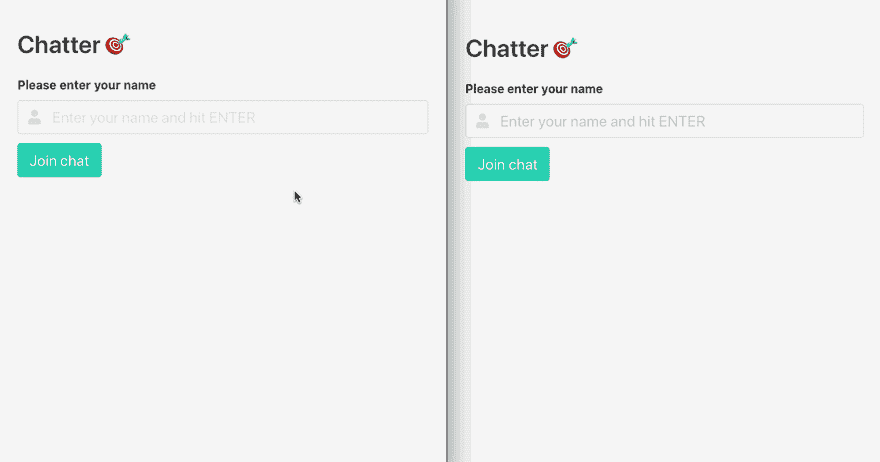

# 在 Dart 中构建一个聊天应用程序(第 3 部分)

> 原文：<https://dev.to/graphicbeacon/build-a-chat-application-in-dart-part-3-1bm5>

在[第 2 部分](https://creativebracket.com/build-a-chat-application-in-dart-3/)中，我们重构了我们的解决方案，将登录和聊天室逻辑分成`View`类，构建了一个`Router`对象来在屏幕间转换。我们将通过实现 WebSocket 连接和管理聊天室中的每个聊天者来完成整个流程。在本教程结束时，我们将有一个功能的聊天应用程序。

* * *

## 1。创建 WebSocket 对象

为了让消息从一个用户转发到其他用户，我们需要建立一个持久的、双向的服务器连接。这将允许使用基于事件的架构在服务器和客户端之间来回发送消息。这是通过 WebSocket 协议实现的， **dart:io** 和 **dart:html** 库为其提供了类。*所以不需要外部包装！*

让我们从客户端开始，编写一个类来负责实例化一个`WebSocket`对象并在其上实现各种事件监听器。这个类将代表一个用户到我们聊天室服务器的连接。

### 建立聊天室主题

在目录`lib/src`中创建一个`chat_room_subject.dart`文件，并为我们的`ChatRoomSubject` :
实现这个类

```
// lib/src/chat_room_subject.dart

import 'dart:html';

class ChatRoomSubject {
  ChatRoomSubject(String username) {}

  final WebSocket socket;
} 
```

Enter fullscreen mode Exit fullscreen mode

因为我们已经将我们的`socket`实例变量标记为 **final** ，这要求我们在初始化阶段，也就是在运行我们的构造函数的`{}`部分之前，给它赋值。因此，让我们创建我们的`WebSocket`实例，并将 URL 传递给我们的服务器:

```
ChatRoomSubject(String username)
  : socket = WebSocket('ws://localhost:9780/ws?username=$username') {} 
```

Enter fullscreen mode Exit fullscreen mode

当我们的`WebSocket`类被实例化时，将建立一个到 URL 的连接，作为它的`String`参数。我们还将用户名值作为`WebSocket` URL 的查询字符串的一部分传入。

我们现在能够监听我们的`WebSocket`上的几个事件，即**打开**、**消息**、**错误**和**关闭**。

```
// ..
class ChatRoomSubject {
  // ..
  // ..
  _initListeners() {
    socket.onOpen.listen((evt) {
      print('Socket is open');
    });

    // Please note: "message" event will be implemented elsewhere

    socket.onError.listen((evt) {
      print('Problems with socket. ${evt}');
    });

    socket.onClose.listen((evt) {
      print('Socket is closed');
    });
  }
} 
```

Enter fullscreen mode Exit fullscreen mode

我们需要调用`_initListeners()`方法:

```
ChatRoomSubject(String username)
  : socket = WebSocket('ws://localhost:9780/ws?username=$username') {
  _initListeners(); // <-- Added this line
} 
```

Enter fullscreen mode Exit fullscreen mode

我们需要能够向我们的聊天室服务器发送消息，并关闭 WebSocket 连接，有效地离开聊天室。将这些方法添加到我们的`_initListeners()` :
之前的`ChatRoomSubject`类中

```
send(String data) => socket.send(data);
close() => socket.close(); 
```

Enter fullscreen mode Exit fullscreen mode

### 将`ChatRoomSubject`整合到`ChatRoomView`类中

将我们刚刚从 web/views/chat_room.dart 创建的 dart 文件直接导入到我们的`// Absolute imports` ( `dart_bulma_chat_app`是对 pubspec.yaml 文件中 name 值字段的引用，它指向`lib/`目录):

```
// web/views/chat_room.dart

// Absolute imports
import 'dart:html';
import 'dart:convert';

// Package imports
import 'package:dart_bulma_chat_app/src/chat_room_subject.dart'; // <-- Added this line 
```

Enter fullscreen mode Exit fullscreen mode

然后我们将如下实例化这个类:

```
// ..
// ..
class ChatRoomView implements View {
  ChatRoomView(this.params)
      : _contents = DocumentFragment(),
        _subject = ChatRoomSubject(params['username']) // <-- Added this line
  {
    onEnter();
  }

  /// Properties
  final ChatRoomSubject _subject;
  // ..
  // ..
} 
```

Enter fullscreen mode Exit fullscreen mode

如果你看看`ChatRoomSubject`中的`_initListeners()`方法，你会注意到我们没有为 web socket“**消息**事件实现监听器。我们将在`ChatRoomView`中这样做，因为我们可以访问`WebSocket`实例:

```
// ..
// ..
class ChatRoomView implements View {
  // ..
  // ..
  void _addEventListeners() {
    // ..
    // ..
    _subject.socket.onMessage.listen(_subjectMessageHandler);
  }

  void _subjectMessageHandler(evt) {
    chatRoomLog.appendHtml(evt.data + '<br />');
  }
} 
```

Enter fullscreen mode Exit fullscreen mode

最后，让我们修改`_sendBtnClickHandler(e)`以从输入字段向聊天服务器发送消息，清空消息输入字段值并重置其焦点:

```
void _sendBtnClickHandler(e) {
  _subject.send(messageField.value);

  // Resets value and re-focuses on input field
  messageField
    ..value = ''
    ..focus();
} 
```

Enter fullscreen mode Exit fullscreen mode

## 2。将传入请求升级到 WebSocket 连接

为了让一个基本的例子工作，让我们写一些服务器端的逻辑来维护我们的聊天室会话。

为我们的`ChatRoomSession` :
创建`lib/src/chat_room_session.dart`并实现类

```
import 'dart:io';
import 'dart:convert';

class Chatter {
  Chatter({this.session, this.socket, this.name});
  HttpSession session;
  WebSocket socket;
  String name;
}

class ChatRoomSession {
  final List<Chatter> _chatters = [];

  // TODO: Implement addChatter method
  // TODO: Implement removeChatter method
  // TODO: Implement notifyChatters method
} 
```

Enter fullscreen mode Exit fullscreen mode

这里我们有两个不同的类。`Chatter`类代表每个参与者。该参与者包含其当前会话、WebSocket 连接和名称。`ChatRoomSession`类管理我们的参与者列表，包括促进他们之间的交流。

下面是`addChatter()`方法的实现。这将传入的请求升级为 WebSocket 连接，构建一个`Chatter`对象，创建事件监听器并将其添加到`_chatters`列表:

```
class ChatRoomSession {
  final List<Chatter> _chatters = [];

  addChatter(HttpRequest request, String username) async {
    // Upgrade request to `WebSocket` connection and add to `Chatter` object
    WebSocket ws = await WebSocketTransformer.upgrade(request);
    Chatter chatter = Chatter(
      session: request.session,
      socket: ws,
      name: username,
    );

    // Listen for incoming messages, handle errors and close events
    chatter.socket.listen(
      (data) => _handleMessage(chatter, data),
      onError: (err) => print('Error with socket ${err.message}'),
      onDone: () => _removeChatter(chatter),
    );

    _chatters.add(chatter);

    print('[ADDED CHATTER]: ${chatter.name}');
  }

  // TODO: Implement _handleMessage method
  _handleMessage(Chatter chatter, String data) {}
} 
```

Enter fullscreen mode Exit fullscreen mode

当消息通过连接发送到服务器时，我们通过调用`_handleMessage()`来处理，同时将`Chatter`对象和`data`作为参数传递给它。

让我们通过实现`_handleMessage()` :
来划掉`// TODO:`

```
_handleMessage(Chatter chatter, String data) {
  chatter.socket.add('You said: $data');
  _notifyChatters(chatter, data);
} 
```

Enter fullscreen mode Exit fullscreen mode

让我们实现`_notifyChatters()` :

```
_notifyChatters(Chatter exclude, [String message]) {
  _chatters
    .where((chatter) => chatter.name != exclude.name)
    .toList()
    .forEach((chatter) => chatter.socket.add(message));
} 
```

Enter fullscreen mode Exit fullscreen mode

并且当参与者离开时也移除`Chatter`对象:

```
_removeChatter(Chatter chatter) {
  print('[REMOVING CHATTER]: ${chatter.name}');
  _chatters.removeWhere((c) => c.name == chatter.name);
  _notifyChatters(chatter, '${chatter.name} has left the chat.');
} 
```

Enter fullscreen mode Exit fullscreen mode

### 实例化我们的`ChatRoomSession`类

转到`bin/server.dart`并创建我们的实例:

```
import 'dart:io';
import 'dart:convert';

import 'package:dart_bulma_chat_app/src/chat_room_session.dart'; // <-- Added this line

main() async {
  // TODO: Get port from environment variable
  var port = 9780;
  var server = await HttpServer.bind(InternetAddress.loopbackIPv4, port);
  var chatRoomSession = ChatRoomSession(); // <-- Added this line
  // ..
  // ..
} 
```

Enter fullscreen mode Exit fullscreen mode

向下滚动到`case '/ws':`部分，调用`addChatter()`方法，向其传递请求和用户名:

```
// ..
// .. 
  case '/ws':
    String username = request.uri.queryParameters['username'];
    chatRoomSession.addChatter(request, username);
    break;
// ..
// .. 
```

Enter fullscreen mode Exit fullscreen mode

因此，当我们将`?username=$username`传递给在`ChatRoomSubject`中为`WebSocket`实例定义的 URL 时，我们从查询参数中检索到了**用户名**。

让我们检验一下我们现在拥有的。打开终端会话并实例化服务器:

```
dart bin/server.dart 
```

Enter fullscreen mode Exit fullscreen mode

并在另一个终端会话上运行 web 应用:

```
webdev serve --live-reload 
```

Enter fullscreen mode Exit fullscreen mode

完全遵循这一点应该给你下面的图像结果:

[](https://res.cloudinary.com/practicaldev/image/fetch/s--RhYeYgRQ--/c_limit%2Cf_auto%2Cfl_progressive%2Cq_66%2Cw_880/https://thepracticaldev.s3.amazonaws.com/i/g3ospivocfhlo0w1p36v.gif)

如果你已经走了这么远，那么干得好！！！

## 3。实现一些助手功能

我们需要一种方法来对发送到聊天服务器的消息类型进行分类，并做出相应的响应。当一个参与者加入聊天时，最好发送一个通知来欢迎这个新参与者，并通知新 chatter 上的其他参与者。我们将创建一个枚举类型，其中将包含这个聊天应用程序将有特定类型的消息。

遵循完整的教程，其中包括整理聊天消息的外观和感觉以及实现注销功能。

→ [**阅读我博客上的完整教程**](https://creativebracket.com/build-a-chat-application-in-dart-3/)

* * *

## 分享是关爱🤗

如果你喜欢读这篇文章，请通过各种社交渠道分享。我正在寻找一些赞助人来保持这些详细的文章来。 [**成为今天的守护神**](https://patreon.com/creativebracket) ...这会让我非常开心。或者，你可以 [**给我买杯咖啡**](https://ko-fi.com/creativebracket) 来代替。

在 Egghead.io 和 [**上观看我的**](http://eepurl.com/gipQBX)**[免费**Dart**入门课程](https://egghead.io/courses/get-started-with-dart)订阅我的电子邮件简讯** 下载我的 35 页免费**Dart**入门电子书，并在新内容发布时得到通知。

**喜欢、分享和[关注我](https://twitter.com/creativ_bracket)T3】😍有关 Dart 的更多内容。**