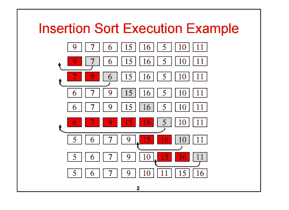
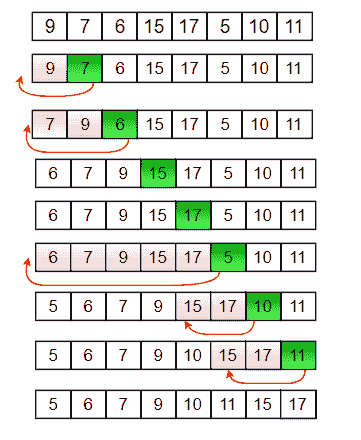

# 第 1 部分:排序算法

> 原文：<https://dev.to/yogeswaran79/part-1-sorting-algorithm-101>

### 选择排序

选择排序算法通过从未排序的部分中重复查找最小元素并将其放在开头来对数组进行排序。该算法在给定的阵列中保持两个子阵列。

1.  子数组已经排序。
2.  未排序的剩余子数组。在选择排序的每次迭代中，从未排序的子数组中选取最小元素，并将其移动到排序的子数组中。

```
import sys
A = [55, 30, 15, 22, 9]
for i in range(len(A):
    min_idx = i
    for j in range(i+1, len(A)):
        if A[min_idx] > A[j]:
            min_idx = j

    A[i], A[min_idx] = A[min_idx], A[i]

print("Sorted Array")
for i in range(len(A))
    print("%d" %A[i])

# Output Sorted array
9 15 22 30 55 
```

### 冒泡排序

冒泡排序是最简单的排序算法，如果相邻元素的顺序不对，它会重复交换相邻元素。

```
def bubbleSort(arr):
    n = len(arr)
    for i in range(n):
        for j in range(0, n-i-1):
            if arr[j] > arr[j+1]:
                arr[j], arr[j+1] = arr[j+1], arr[j]

arr = [73, 34, 27, 12, 22, 10, 110]
bubbleSort(arr)
print("Sorted array")
for i in range(len(arr)):
    print("%d", %arr[i])

# Output Sorted array
10 12 22 27 34 73 110 
```

**还有递归版的冒泡排序**
如何实现递归冒泡排序？
递归冒泡排序没有性能或实现上的优势，但是可以作为一个很好的问题来检验自己对冒泡排序和递归的理解。
**递归思想**

1.  基本情况:如果数组大小为 1，则返回。
2.  进行一次正常的冒泡排序。此过程修复当前子数组的最后一个元素。
3.  除当前子数组的最后一个元素外，对所有元素重复出现。

```
def bubble_sort(listx):
    for i, num in enumerate(listx):
        try:
            if listx[i+1] < num:
                listx[i] = listx[i+1]
                listx[i+1] = num
                bubble_sort(listx)
        except IndexError:
            pass
    return listx

listx = [60, 36, 25, 13, 23, 10, 99]
bubble_sort(listx)
print("Sorted array")
for i in range(0, len(listx)):
    print(listx[i], end=' ')

# Output Sorted array
10 13 23 25 36 60 99 
```

### 快速排序

快速排序是一种分治算法。它选取一个元素作为轴心，并在选取的轴心周围划分给定的数组。快速排序有许多不同的版本，以不同的方式选择 pivot。

1.  总是选择第一个元素作为轴心。
2.  总是选择最后一个元素作为轴心。
3.  选择一个随机元素作为轴心。
4.  选择中间点作为枢轴。

快速排序的关键过程是 partition()。分区的目标是，给定一个数组和数组的元素 x 作为支点，将 x 放在排序数组中的正确位置，并将所有较小的元素放在 x 之前，将所有较大的元素放在 x 之后。所有这些都应在线性时间内完成。

```
def partition(arr,low,high):
    i = (low-1)
    pivot = arr[high]
    for j in range(low, high):
        if arr[j] <= pivot:
            i = i+1
            arr[i], arr[j] = arr[j], arr[i]
    arr[i+1], arr[high] = arr[j], arr[i+1]
    return (i+1)

def quickSort(arr,low,high):
    if low < high:
        pi = partition(arr,low,high)
        quickSort(arr,low,pi-1)
        quickSort(arr,pi+1,high)

arr = [10, 8, 7, 5, 9, 1]
n = len(arr)
quickSort(arr,0,n-1)
print("Sorted array")
for i in range(n):
    print("%d" %arr[i])

# Output Sorted array
1 5 7 8 9 10 
```

递归快速排序实现可以通过多种方式进行优化。

1.  递归快速排序实现使用最后一个索引作为枢纽。这会导致已经排序的数组出现最坏的情况，这是一种常见的情况。该问题可以通过为枢轴选择随机索引或者选择分区的中间索引或者为枢轴选择分区的第一、中间和最后元素的中间值来解决。
2.  为了减少递归深度，首先递归数组的较小的一半，并使用尾部调用递归到另一半。
3.  插入排序更适合小的子数组。插入排序可以用于这种小型数组的调用。

下面是典型的递归快速排序实现。

```
def partition(arr,low,high):
    i = (low-1)
    pivot = arr[high]
    for j in range(low,high):
        if arr[j] <= pivot:
            i += 1
            arr[i], arr[j] = arr[j], arr[i]
    arr[i+1], arr[high] = arr[high], arr[i+1]
    return (i+1)

def quickSort(arr,low,high):
    if low < high:
    pi = partition(arr,low,high)
    quickSort(arr,low,pi-1)
    quickSort(arr,pi+1,high)

if __name__ == '__main__':
    arr = [4, 2, 6, 9, 2]
    n = len(arr)
    quickSort(arr, 0, n-1)
    for i in range(n):
        print(arr[i], end=" ")

# Output 2 2 4 6 9 
```

下面提到的针对递归快速排序的优化也可以应用于迭代版本。

1.  递归和交互的分区过程是相同的。选择最佳支点的相同技术也可以应用于迭代版本。
2.  要减小堆栈大小，首先将索引推小一半。
3.  当大小减少到低于实验计算的阈值时，使用插入排序。

```
def partition(arr,l,h):
    i = (l-1)
    x = arr[h]
    for j in range(l,h):
        if arr[j] <= x:
            i = i+1
            arr[i], arr[j] = arr[j], arr[i]
    arr[i+1], arr[h] = arr[h], arr[i+1]
    return (i+1)

def quickSortIterative(arr,l,h):
    size = h-l+1
    stack = [0]*(size)
    top = -1
    top = top+1
    stack[top] = 1
    top = top+1
    stack[top] = h
    while top >= 0:
        h = stack[top]
        top = top-1
        l = stack[top]
        top = top-1
        p = partition(arr,l,h)
        if p-1 > 1:
            top = top+1
            stack[top] = p+1
            top = top+1
            stack[top] = h

arr = [4, 3, 5, 2, 1, 3, 2, 3]
n = len(arr)
quickSortIterative(arr,0,n-1)
print("Sorted array")
for i in range(n):
    print("%d" %arr[i])

# Output Sorted array
1 2 2 3 3 3 4 5 
```

### 插入排序

插入排序是一种简单的排序算法，它的工作原理就像我们手中的扑克牌排序一样。

[](https://res.cloudinary.com/practicaldev/image/fetch/s--Vr9KedHO--/c_limit%2Cf_auto%2Cfl_progressive%2Cq_auto%2Cw_880/https://thepracticaldev.s3.amazonaws.com/i/q88cu6s74c0b4j9rcz46.png)T3】

```
def insertionSort(arr):
    for i in range(1, len(arr)):
        key = arr[i]
        j = i-1
        while j >= 0 and key < arr[j]:
            arr[j+1] = arr[j]
            j -= 1
        arr[j+1] = key

arr = [12, 11, 13, 5, 6]
insertionSort(arr)
for i in range(len(arr)):
    print("%d" %arr[i])

# Output 5 6 11 12 13 
```

<figure>[](https://res.cloudinary.com/practicaldev/image/fetch/s--7utvWaDX--/c_limit%2Cf_auto%2Cfl_progressive%2Cq_auto%2Cw_880/https://thepracticaldev.s3.amazonaws.com/i/m95qazd45u4vukuj95lv.png) 

<figcaption>递归插入排序的例子</figcaption>

</figure>

**如何递归实现插入排序？**
递归插入排序没有性能或实现上的优势，但可以是检验一个人对插入排序和递归的理解的好问题。如果我们仔细看看插入排序算法，我们保持已处理元素的排序，并在插入的数组中一个接一个地插入新元素。
**递归思想**

1.  基本情况:如果数组大小为 1 或更小，则返回。
2.  递归排序前 n-1 个元素。
3.  在排序后的数组中正确的位置插入最后一个元素。

```
def insertionSortRecursive(arr,n):
    if n<=1:
        return
    insertionSortRecursive(arr,n-1)
    '''Insert last elements at its correct position in sorted array'''
    last = arr[n-1]
    j = n-2
    while (j>=0 and arr[j]>last):
        arr[j+1] = arr[j]
        j = j-1
    arr[j+1] = last

def printArray(arr,n):
    for i in range(n):
        print arr[i],
arr = [12, 11, 13, 5, 6]
insertionSortRecursive(arr,n)
printArray(arr,n)

# Output 5 6 11 12 13 
```

别忘了加入我的[电报社区](https://t.me/theprogrammersclub)

页（page 的缩写）学生:将会有 7 大算法系列的几个部分。