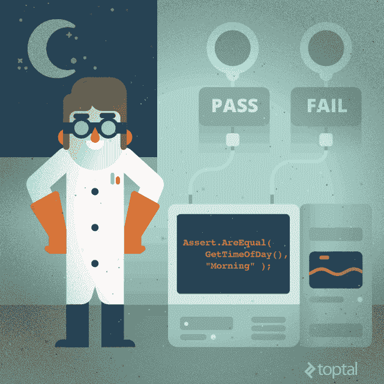

# 为什么要写单元测试？

> 原文：<https://dev.to/ujwaldhakal/why-should-we-write-unit-test-4o38>

> 当我第一次开始做单元测试时，我的问题是“当我知道我的代码运行良好时，为什么我还需要单元测试？”

**我将使用 PHP 语言& laravel 框架进行演示**

单元测试基本上是对应用程序的较小组件的测试，因此代码必须始终按照编写时的方式工作。让我们看一个例子

假设我们正在构建一个库存应用程序

```
 namespace App\Http\Controllers;

use App\Inventory;
use Illuminate\Http\Request;

class InventoryController extends Controller
{
    private $inventory;
    private $request;

    public function __construct(Inventory $inventory, Request $request)
    {
        $this->inventory = $inventory;
        $this->request = $request;
    }

    public function create()
    {

        if ($this->request->has('name')) {
            if ($this->inventory->create($this->request->all())) {
                return response(['status' => 'success']);
            }
        }

        return response(['status' => 'error']);

    }

} 
```

Enter fullscreen mode Exit fullscreen mode

> 这段代码的作用是，接受用户的请求，验证请求并发送响应(成功或错误)。
> 让我们想象一个场景,“如果将来你需要额外的库存项目字段(如名称、价格、标签等),修改响应标准(状态、消息、数据等),或者通知管理员(发送电子邮件)有人添加了一个项目，该怎么办?”。如果你不在那里，其他开发商不得不接管它怎么办？因此，除了你之外，没有人会知道代码的整体含义(如果你有非常好的记忆力，能像 git 一样记住所有代码:)，现在我们开始面临问题。那么我们能做些什么来克服这些问题呢？

单元测试将是你的救星我们可以写类似
的东西

```
 namespace Tests\Unit\Controllers;

use App\Http\Controllers\InventoryController;
use App\Inventory;
use Illuminate\Http\Request;
use Mockery;

class InventoryControllerTest extends \Tests\TestCase
{
    protected $inventoryController;
    protected $request;
    protected $inventory;

    public function setUp()
    {
        parent::setUp();
        $this->inventoryController = Mockery::mock(InventoryController::class)->makePartial();
        $this->request = Mockery::mock(Request::class)->makePartial();
        $this->inventory = Mockery::mock(Inventory::class)->makePartial();
    }

    public function makePropertyAccessible(&$object, $property, $value, $class)
    {
        $reflection = new \ReflectionClass($class);
        $property = $reflection->getProperty($property);
        $property->setAccessible(true);
        $property->setValue($object, $value);
    }

    public function testIfCreateIsWorkingWhenDetailsAreCorrect()
    {
        $this->request->shouldReceive('all')->andReturn(['name' => 'desk']);

$this->inventory->shouldReceive('create')->andReturn(true);
        $this->makePropertyAccessible($this->inventoryController, 'inventory', $this->inventory, InventoryController::class);
        $this->makePropertyAccessible($this->inventoryController, 'request', $this->request, InventoryController::class);
        $reponse = json_decode($this->inventoryController->create()->getContent(), true);

 $this->assertSame($reponse, ['status' => 'success']);
    }

} 
```

Enter fullscreen mode Exit fullscreen mode

看起来一个外星人给我们加密了一些东西，让我来给你解开这个密码

```
$this->inventoryController = Mockery::mock(InventoryController::class)->makePartial(); 
```

Enter fullscreen mode Exit fullscreen mode

这段代码使得一个副本 **inventoryController** 类(你是上帝&可以对方法(受保护的& public)和属性)的功能做任何事情；

```
method makePropertyAccessible() 
```

Enter fullscreen mode Exit fullscreen mode

这种方法通常会覆盖期望的期望、方法的结果或模拟类的属性。

```
public function testIfCreateIsWorkingWhenDetailsAreCorrect()
    {
        $this->request->shouldReceive('all')->andReturn(['name' => 'desk']);

$this->inventory->shouldReceive('create')->andReturn(true);
$this->makePropertyAccessible($this->inventoryController, 'inventory', $this->inventory, InventoryController::class);
$this->makePropertyAccessible($this->inventoryController, 'request', $this->request, InventoryController::class);
$reponse = json_decode($this->inventoryController->create()->getContent(), true);

 $this->assertSame($reponse, ['status' => 'success']);
    }

} 
```

Enter fullscreen mode Exit fullscreen mode

让我们进一步分解这个方法

```
$this->request->shouldReceive('all')->andReturn(['name' => 'desk']); 
```

Enter fullscreen mode Exit fullscreen mode

每当调用$this->request->all()时，它将返回数组['name' => 'desk']

```
$this->inventory->shouldReceive('create')->andReturn(true);v 
```

Enter fullscreen mode Exit fullscreen mode

每当调用$this->inventory->create()时，我们都希望返回 true，因为我们不想连接数据库，因为假设数据在验证后会在表中创建一行。如果您仍然怀疑是否可以在测试时使用数据库，我更喜欢 sqlite，因为它是轻量级的，适合 CI/CD 部署。

```
$this->makePropertyAccessible($this->inventoryController, 'inventory', $this->inventory, InventoryController::class); 
```

Enter fullscreen mode Exit fullscreen mode

这基本上是用我们的模拟类覆盖了 inventoryController 类的属性，因此这样做之后，无论何时从 inventoryController 触发库存模型的 create 方法，它都将返回 true。

```
$response = json_decode($this->inventoryController->create()->getContent(), true);

 $this->assertSame($response, ['status' => 'success']); 
```

Enter fullscreen mode Exit fullscreen mode

这最后一段代码断言，每当创建成功时，它总是以相同的格式返回响应，如['status' => 'success']。

在您的控制台中运行测试 vendor/bin/phpunit。您将看到类似这样的内容:

> 塞巴斯蒂安博格曼和贡献者的 PHPUnit 6.5.11。
> … 3 / 3 (100%)
> 时间:311 ms，内存:14.00MB
> OK (3 次测试，5 次断言)

好了，一天之后，我们为这个写了方法 create-:

```
public function create()
{

    if ($this->request->has('name') && $this->request->has('price')) {
        if ($this->inventory->create($this->request->all())) {

            event(new NotifyAdmin($this->inventory));

            return response(['status' => 'success','message' => 'item has been successfully added']);
        }
    }

    return response(['status' => 'error','message' => 'item name or price is missing']);

} 
```

Enter fullscreen mode Exit fullscreen mode

需要价格和名称属性，触发通知事件，并在回应中添加额外字段。每当我们现在运行测试时

> 有 1 个失败:
> 1)Tests \ Unit \ controllertest \ InventoryControllerTest::testicreateisworkingwhentdetailsarecorect
> 未能断言数组&0(
> ' status ' =>' success '
> )与数组&0(
> ' status ' =>' success '
> ' message ' =>'项已成功添加'
> )。
> /var/www/tests/Unit/Controllers/inventorycontrollertest . PHP:44

现在我们将在测试中涵盖这些变化

```
public function testIfCreateIsWorkingWhenDetailsAreCorrect()
{
    Event::fake();
    $this->request->shouldReceive('all')->andReturn(['name' => 'desk','price' => 2]);
    $this->inventory->shouldReceive('create')->andReturn(true);
    $this->makePropertyAccessible($this->inventoryController, 'inventory', $this->inventory, InventoryController::class);
    $this->makePropertyAccessible($this->inventoryController, 'request', $this->request, InventoryController::class);
    $response = json_decode($this->inventoryController->create()->getContent(), true);
    Event::assertDispatched(NotifyAdmin::class);
    $this->assertSame($response, ['status' => 'success','message' => 'item has been successfully added']);
} 
```

Enter fullscreen mode Exit fullscreen mode

[](https://res.cloudinary.com/practicaldev/image/fetch/s--KU6OLwMM--/c_limit%2Cf_auto%2Cfl_progressive%2Cq_66%2Cw_880/https://cdn-images-1.medium.com/max/800/1%2ATmiX7ATMCzxwdbmwEe6RXA.gif)

**结论**

让我们来回答我们的问题“当我知道我的代码运行良好时，为什么我还需要单元测试？”

我们正在编写的测试是为了将来万一下次你需要修改你的响应标准，在库存中创建项目之前和之后处理其他事情。作为一名开发人员，我们不会知道在应用程序中改变代码的每一个含义。

因此，通过编写测试，你可以看到你的代码在应用程序中的含义，这意味着每当你发布下一个模块时，你将很容易知道哪些东西将会爆发。如果我们要为许多类使用相同的组件，这可以保持事情的轨迹，因此改变一个类会影响整个其他类，我们可以在一分钟内立即知道其含义。

大多数语言都有自己的测试框架，你需要做的就是做好准备，谷歌一下，写一些失败的测试。

在 [github](https://github.com/ujwaldhakal/phpunit-test/commit/f2e33f7ecd29c754db30e94e9fbe15505a7a87a6) 可以看到完整的代码。