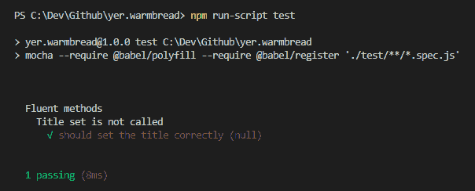

# 尝试使用 Mocha & Chai 对 ES6 进行单元测试。

> 原文：<https://dev.to/yerac/attempting-to-use-mocha-chai-to-unit-test-es6-3fcm>

在这篇文章中，我将介绍如何使用 Mocha (JS 测试框架)和 Chai(BDD 语法)在 VS 代码中对 ES6 Javascript 进行单元测试。

我开始做一个小的副业，不为别的，就是为了玩玩 ES6+。这是一个(另一个)相对简单的 toast 库，用尽可能多的普通 JS 编写，以避免对库和包的依赖。

我让代码工作了，但是我不能证明函数工作了。我过去使用 qUnit 测试 JavaScript，但老实说，我的 JavaScript 测试知识有点欠缺。

我的目标是为我的一个主类获得一些单元测试，在那里我可以直接针对 ES6 测试**，而不是针对编译后的 ES5 代码。我希望测试能清楚他们在做什么。我在做的事情一点都不新鲜，图书馆也不新鲜！我只是想记录下我第一次是如何做到的。**

**免责声明:**这绝不是一个全面的指导或演练，只是我在学习新东西的同时，看看是否能得到我想要的结果的结果！

## 回车，摩卡

我决定使用 [Mocha](https://mochajs.org/) 来做我的单元测试，选择它纯粹是因为它看起来与 ES6 代码配合得很好(使用 Babel)。稍后我将介绍我是如何同时使用 [Chai](https://www.chaijs.com/) 来使用 BDD 风格的语法提供更好、更流畅的断言的。

首先，我必须安装摩卡。

```
> npm install --save-dev mocha 
```

Enter fullscreen mode Exit fullscreen mode

然后在一个新的根文件夹“test”下，我创建了一个 bread . spec . js——这里的“bread”是我正在测试的类的名称。

此时，创建一个简单的测试相当容易，就像这样。

```
import {Bread} from "../src/bread";
var assert = require('assert');
describe('Fluent methods', function() {
  describe('Title set is not called', function() {
    it('should set the title correctly (null)', function() {
        let options = [... code to get options ...]     
        let b = new Bread(0,"Foo", options);       
      assert.equal(b.Title, null);
    });
  });
}); 
```

Enter fullscreen mode Exit fullscreen mode

然后，我将适当的脚本添加到 **package.json** 中，以允许我们运行测试。

```
"test": "mocha --require @babel/polyfill --require @babel/register './test/**/*.spec.js'" 
```

Enter fullscreen mode Exit fullscreen mode

运行方式:

```
npm run-script test 
```

Enter fullscreen mode Exit fullscreen mode

<figure>[](https://res.cloudinary.com/practicaldev/image/fetch/s--SNquTTYT--/c_limit%2Cf_auto%2Cfl_progressive%2Cq_auto%2Cw_880/https://i1.wp.com/yer.ac/blog/wp-content/uploads/2019/04/image.png%3Fw%3D840) 

<figcaption>输出上面的运行命令。
</figcaption>

</figure>

这个脚本声明它将在 JS 文件以“. spec.js”结尾的测试目录下的所有文件上运行 Mocha。然后，我必须添加 2 个要求，使 Mocha 能够直接调用 ES6，而不必使用 transpiled 版本。如果不能满足这些要求，意味着 Mocha 将无法运行，因为它无法解析 ES6。

## 使用 Chai 进行 BDD 语法

在上面，我导入了我的类，然后创建了一个“测试集”。在这个测试集中，我有一个单独的测试，检查标题是否自动设置。实现测试的目的是相当容易的，但是还可以更清楚。这就是我决定用柴的地方。Chai 将允许我编写一个 BDD 风格的测试，它更接近于简单的英语。Mocha 确实支持其中的一些(在我写这篇文章的时候),但是 Chai 更接近于我所习惯的 BDD 风格的语法。

要使用 Chai，我需要安装软件包:

```
npm install --save-dev chai 
```

Enter fullscreen mode Exit fullscreen mode

然后从框架中导入“expect”模块，并重构该方法，看起来有点像这样:

```
import { expect } from "chai";
import {Bread} from "../src/bread";
describe("Fluent methods", () => {
    describe("Title set is not called", () => {
        it("should set the title correctly (null).", () => {
            var options = getValidOptions();            
            let b = new Bread(0,"Foo", options);
            expect(b.Title).to.equal(null);
        });
    });  
)}; 
```

Enter fullscreen mode Exit fullscreen mode

运行测试将会产生和以前一样的结果，但是现在可读性更好了(在我看来！)

真的没什么可补充的了。Mocha 和 Chai 都有很好的文档可以阅读。我遇到的唯一困难是让 Mocha 直接运行 ES6，因为网上关于这方面的很多信息都已经过时了(我发现…)

更新:我也在这里发布了关于使用 ES6 Mocha 测试进行调试的文章

帖子[试图用摩卡&柴对 ES6 进行单元测试。](http://yer.ac/blog/2019/04/08/attempting-to-use-mocha-chai-to-unit-test-es6/)最早出现在 [yer.ac |一个开发者的冒险，等等。](http://yer.ac/blog)。