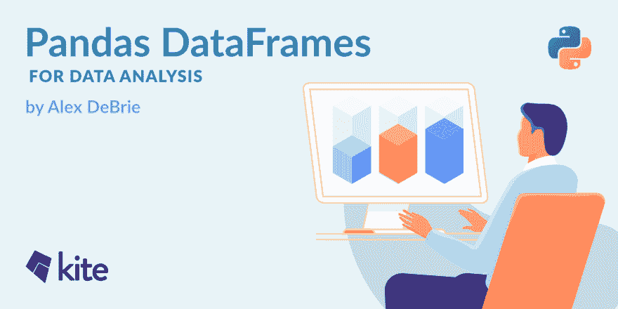

# 指南:用于数据分析的 Python 数据框架

> 原文：<https://dev.to/kite/guide-python-dataframes-for-data-analysis-1g8>

Pandas 的核心数据结构是一个数据帧。数据帧是由列和行组成的二维数据结构

如果您有统计编程语言 R 的背景知识，DataFrame 是按照 R 中的 data.frame 对象建模的。

Pandas DataFrame 结构将低级语言的速度与高级语言的易用性和表现力结合在一起。

数据帧中的每一行都构成一条单独的记录——想象一下 SaaS 应用程序的一个用户，或者某个股票代码的单日股票交易摘要。

数据帧中的每一列代表数据帧中每一行的观察值。数据帧可以有多个列，每个列都有一个定义的类型。

例如，如果您有一个包含某个股票代码的每日交易摘要的数据框架，您可能有一个类型为 float 的列来指示收盘价，而另一个类型为 int 的列来指示当天的总交易量。

DataFrames 构建在 NumPy 之上，NumPy 是一个速度极快的库，它使用 C/C++和 Fortran 进行快速、高效的数据计算。

现在，我们已经了解了数据帧背后的基础知识，让我们开始创建和查看数据帧。

在这里阅读更多！