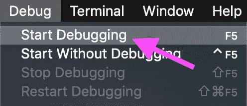
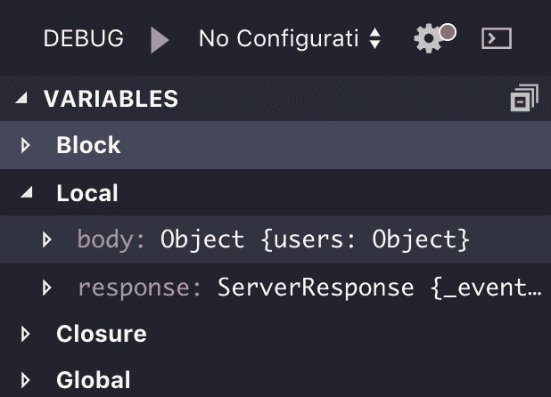
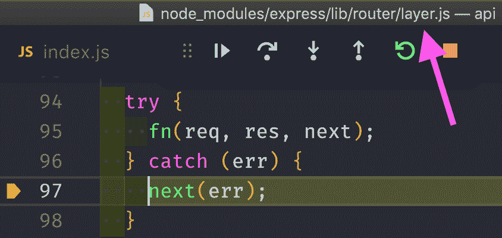
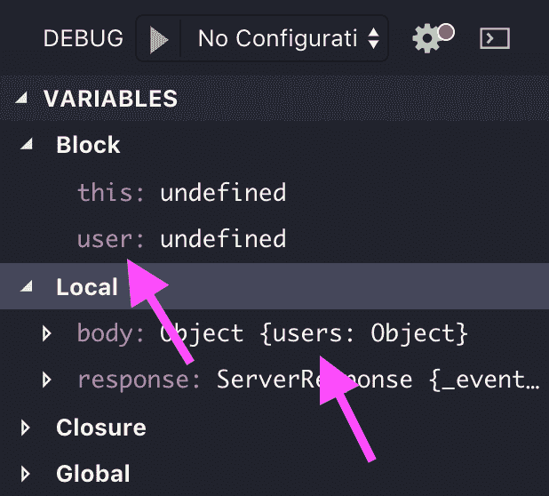

# 在 VSCode 调试器中调试 Node.js Express API

> 原文：<https://dev.to/moesif/debugging-a-node-js-express-api-in-vscode-debugger-2261>

*[Flickr 上哈拉尔德·戴辛格的封面图片。](https://www.flickr.com/photos/deischi/)T3】*

## 为什么

当我们创建软件时，我们很少做到没有错误。API 的创建也不例外，所以我们迟早会调试它。在 JavaScript 中，调试任务的第一站通常是*登录到控制台*，但是使用调试器可以给我们更完整的体验。

在本教程中，我们将学习*如何在 Visual Studio 代码*的帮助下调试一个[基于 Express 的 API](https://www.moesif.com/blog/api-guide/development/api-resources-for-nodejs-developers/) 。

## 什么

[Express](https://expressjs.com/) 是一个*“node . js 的极简 web 框架”*。它允许我们**将函数直接链接到 API 端点**，这是一种快速简单的构建 API 的方法。

[Visual Studio Code](https://code.visualstudio.com/) 是一个*“流线型代码编辑器，支持开发操作，如**调试**，任务运行和版本控制。”*

我们还将使用 [cURL](https://curl.haxx.se/) 向我们的 API 发送请求。

## 如何

我们将使用 Express framework 创建一个简单的 API，然后尝试借助 VSCodes 调试功能而不是控制台来调试它。

### API 设置

首先，我们创建一个新的 Node.js 项目并安装我们的依赖项。

```
$ mkdir api
$ cd api
$ npm init
$ npm i express body-parser 
```

Enter fullscreen mode Exit fullscreen mode

接下来，我们创建一个`index.js`文件，它将作为我们的主服务器脚本。

```
const express = require("express");
const bodyParser = require("body-parser");

const users = [{ id: 0, name: "admin" }];

const server = express();
server.use(bodyParser.json());

server.get("/users", (_, response) => response.send({ users }));
server.get("/users/:id", ({ params: { id } }, response) => {
  const user = users[id];
  response.send({ user });
});
server.post("/users", ({ body }, response) => {
  const { user } = body;
  user.id = users.length;
  users.push(user);
  response.send({ user });
});

server.listen(9999, () =>
  console.log("API running on http://localhost:9999")
); 
```

Enter fullscreen mode Exit fullscreen mode

我们使用`users`数组作为内存中的数据存储。它由管理员用户初始化。

接下来，我们创建我们的 Express `server`并使用`bodyParser`包的 JSON 中间件；它允许我们访问存储在`POST` HTTP 请求体中的 JSON 字符串的值。

然后，我们创建三个 API 端点。两个`GET`端点，因此我们可以请求一个所有用户和一个特定用户的 ID 列表，以及一个`POST`端点来创建一个新用户。

让我们用下面的命令启动 API！

```
$ node .
API running on http://localhost:9999 
```

Enter fullscreen mode Exit fullscreen mode

### 使用 API

既然我们的 API 已经启动并运行，我们可以尝试用 cURL 查询它。为此，我们需要打开一个新的终端窗口并执行以下命令。

创建用户:

```
$ curl -H "Content-Type:application/json" -d '{"user":{"name": "kay"}}' localhost:9999/users
{"user":{"id":1,"name":"kay"}} 
```

Enter fullscreen mode Exit fullscreen mode

列出所有用户:

```
$ curl localhost:9999/users
{"users":[{"id":0,"name":"admin"},{"id":1,"name":"kay"}]} 
```

Enter fullscreen mode Exit fullscreen mode

列出一个用户:

```
$ curl localhost:9999/users/1
{"user":{"id":1,"name":"kay"}} 
```

Enter fullscreen mode Exit fullscreen mode

创建另一个用户:

```
$ curl -H "Content-Type:application/json" -d '{"users":{"name": "xing"}}' localhost:9999/users
<!DOCTYPE html>
<html lang="en">
<head>
<meta charset="utf-8">
Error
... 
```

Enter fullscreen mode Exit fullscreen mode

*哦不！*我们的 JSON 里有个错别字，`users`而不是`user`。由于我们没有在我们的`POST /users`端点中处理这个问题，Express 只是用一个 HTML 格式的错误来响应。

这是一个简单的问题示例，可以很容易地修复，但是让我们使用它来启动 VSCodes 调试器，这样我们就可以在运行时直接调查出了什么问题。

### 使用 VSCodes 调试器

用 VSCode 调试 Node.js APIs 非常容易。

我们检查想要调试哪个端点，并在端点触发的函数中设置一个断点。这是通过左击行号来完成的。让我们在第 15 行的*上找到它，这应该是我们的`POST /users`端点函数的第一行。*

[](https://res.cloudinary.com/practicaldev/image/fetch/s--bKvX-kFQ--/c_limit%2Cf_auto%2Cfl_progressive%2Cq_auto%2Cw_880/https://thepracticaldev.s3.amazonaws.com/i/hwea4hlx4mpuxiorl8i5.png)

然后我们通过点击顶部菜单的*调试- >开始调试*或者按下 *F5* 来启动调试器。

[](https://res.cloudinary.com/practicaldev/image/fetch/s--KKW4kC9N--/c_limit%2Cf_auto%2Cfl_progressive%2Cq_auto%2Cw_880/https://thepracticaldev.s3.amazonaws.com/i/xryi7bsg4mq36z7gbxpl.jpg)

VSCode 将为我们启动应用程序和调试器。它还将通过 Node.js 的调试协议将两者联系在一起。

然后我们重新发送导致 cURL 错误的请求，并尝试找出发生了什么。

```
$ curl -H "Content-Type:application/json" -d '{"users":{"name": "xing"}}' localhost:9999/users 
```

Enter fullscreen mode Exit fullscreen mode

该请求将运行链接到`POST /users`的函数，并在其第一行的断点处停止。

如果我们看一下代码左边的侧栏，我们可以看到一个*变量*类别，以及各种子类别，如*块*和*局部*。我们打开*本地*看看里面有什么。

[](https://res.cloudinary.com/practicaldev/image/fetch/s--G2jXWLYU--/c_limit%2Cf_auto%2Cfl_progressive%2Cq_auto%2Cw_880/https://thepracticaldev.s3.amazonaws.com/i/lrme7tpuudstyedo9r79.png)

正如我们所看到的，我们有两个局部变量，`body`是类型`Object`和`response`是类型`ServerResponse`。

让我们用 *F10* 进入下一行，看看会发生什么。

一切似乎都像预期的那样工作。

让我们再看下一行。

**轰！**

不知何故，我们在代码库的一个完全不同的地方结束了？

[](https://res.cloudinary.com/practicaldev/image/fetch/s--eIt0rZaI--/c_limit%2Cf_auto%2Cfl_progressive%2Cq_auto%2Cw_880/https://thepracticaldev.s3.amazonaws.com/i/ue0jlgrlsx4iucfs5uw5.png)

似乎我们通过设置我们的`user`对象的`id`创建了一个错误，这是怎么发生的？

让我们再次打开我们的`index.js`，将断点移动到*第 16 行*，并通过按 *F5* 让调试器运行到事件循环的末尾。

然后用 cURL 重新发送请求，看看在我们试图设置`user.id`之前发生了什么。

当我们查看*变量/块*类别中的侧栏时，我们可以看到我们的`user`对象实际上是`undefined`！如果我们打开*变量/局部*类别，也能看出原因。

[](https://res.cloudinary.com/practicaldev/image/fetch/s--y7DUhDr1--/c_limit%2Cf_auto%2Cfl_progressive%2Cq_auto%2Cw_880/https://thepracticaldev.s3.amazonaws.com/i/20mb40i9vq8a220jqg0f.png)

我们的`body`有一个`users`属性，但是我们试图在*第 15 行*中从它那里析构一个`user`变量，这导致我们试图在*第 16 行*中写`user.id`时出错。

现在我们知道了问题所在，让我们停止调试器并修复它。

```
server.post("/users", ({ body }, response) => {
  const { user } = body;

  if (!(user instanceof Object))
    return response.send({ error: '"user" object missing in JSON!' });

  user.id = users.length;
  users.push(user);
  response.send({ user });
}); 
```

Enter fullscreen mode Exit fullscreen mode

让我们重启我们的服务器，让它运行新代码:

```
$ node .
API running on http://localhost:9999 
```

Enter fullscreen mode Exit fullscreen mode

并重新发送我们有问题的请求:

```
$ curl -H "Content-Type:application/json" -d '{"users":{"name": "xing"}}' localhost:9999/users
{"error":"\"user\" object missing in JSON!"} 
```

Enter fullscreen mode Exit fullscreen mode

最后，我们得到一个有用的 JSON 格式的错误消息。

## 结论

借助 VSCodes 集成调试器调试基于 Node.js 的 API 是一项简单的任务。我们只需要设置一个断点，不需要额外的代码。

它为我们提供了许多现成的运行时洞察力，包括:

*   当前变量的值
*   观察单个变量的能力
*   当前调用堆栈
*   当前加载的脚本

* * *

*Moesif 是最先进的 API 分析平台，支持 REST、GraphQL、Web3 Json-RPC 等。超过 2000 家公司通过 Moesif 处理数十亿次 API 调用，以深入了解他们的平台。* **[了解更多](https://moesif.com/features?int_source=blog)**

* * *

*最初发表于[www.moesif.com](http://www.moesif.com)T3】*