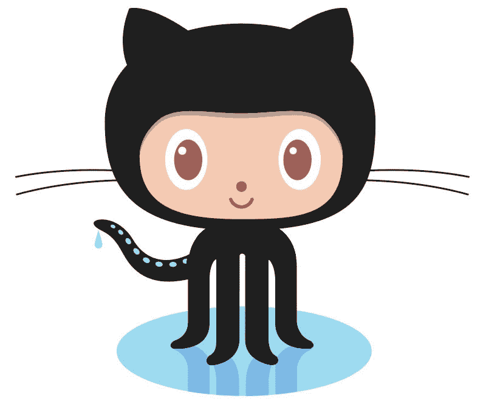
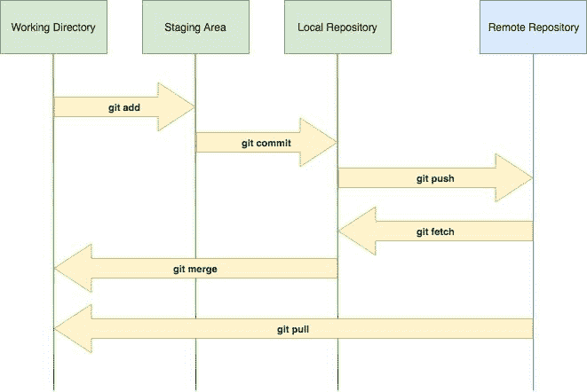

# 制作 Git，Lit(版本控制的有趣介绍)

> 原文：<https://dev.to/billywitherspoon/making-git-lit-471k>

注意:所有引用的命令都是在 Mac OS X 终端上使用 Bash 的。Github 作为一个版本控制平台的例子。

项目。项目-最终。专题-期末-期末。project-please-let ' s this be the last version。项目-意大利面。项目-完成-完成-提交。

眼熟吗？也许你已经走上了这条恐惧之路。你不知疲倦地工作，害怕失去你辛苦赚来的工作。也许你是在冒险，不想为了子孙后代而丢失当前的版本。

*你在生活中需要版本控制*

> *“嘿 Max？能把更新后的文件发给我吗？”*

> *“我没有，斯蒂芬妮目前正在做”*

> *“嗨，梅根，我刚把我的修改发给你了”*

> *“是吗？麦克斯刚刚告诉我，斯蒂芬妮应该在处理文件"*

眼熟吗？生产力的下降，通信和人工变化的持续循环。

*生活中需要版本控制。*

#### **输入 Github**

Github 是一个版本控制平台，允许多个用户无缝地同时处理同一组文件和目录。沿途存储版本的面包屑。

### 快速定义

让我们浏览一组定义。不要跳过这些！

**目录:**一个文件夹

**项目**:在这篇文章中，指的是一组嵌套在目录中的文件。

**仓库**:存放项目的地方(提示:可以存放在多个地方)。通常被称为回购。

**本地**:你的机器，你的电脑，只有你的电脑。

**远程**:不是你机器的地方。

**分支:**链接到主存储库的存储库。可以是本地的或远程的。

**工作目录:**你的工作区。创建本地存储库后，您可以在其中访问和编辑项目目录和文件。

### 检察官在哪？

好了，你有一个项目。你有项目吗？没有吗？那就开始吧！

#### 构建您的项目目录

这是你的项目目录，添加你的文件，你的代码，你的图片，你的迷因，你的遗嘱，以及任何其他看起来谨慎的东西。

好了，你的项目已经准备好了。现在怎么办？在 Github 上启动一个新的存储库！

#### 创建 Github 远程存储库

转到 Github.com，创建一个新的存储库。这将是版本控制的中心点。这不会是唯一的存储库，但却是最重要的。这个库被认为是远程的，因为它由 Github 托管。

接下来，您有两个选项来创建工作目录:

*   克隆您的存储库
*   构建您的目录，初始化本地存储库，链接到您的远程存储库

#### **选项 1:克隆您的存储库**

**克隆**

命令:`git clone ssh/https_link_to_github_repository`

克隆需要三个主要步骤:

1.  克隆会在本地机器上创建一个链接到本地存储库的工作目录。将您的项目目录迁移到这个新目录。
2.  克隆会在您的机器上创建一个本地存储库，它是您刚刚在 Github 上创建的存储库的副本(克隆)。当单个文件在你的本地存储库时，你通常不会看到它们的内容。
3.  克隆会创建一个到本地存储库和之前创建的远程存储库的链接。稍后，您将能够使用某些命令更新远程存储库。

#### 
**选项 2:** 初始化一个本地存储库，链接到你的远程存储库

您当前有一个项目目录。让我们用它来创建一个本地存储库，然后将它链接到远程存储库。您不需要用这个选项移动您的项目目录，它将简单地成为您的工作目录。

**初始化**

命令:`git init`

首先，确保您在项目目录中。然后运行`git init`。这将在您的本地机器上创建一个链接到您的工作目录的本地存储库。您的项目目录现在已经成为您的工作目录，并且链接到这个新的存储库。

**添加遥控器**

命令:`git remote add origin ssh/https_link_to_github_repository`

这将您的本地存储库链接到您的 Github 远程存储库。

#### **让萨曼莎参与进来**

现在已经创建了两个存储库。Github 概要文件上的远程存储库和您机器上的本地存储库。

为了好玩，让我们再创建一个。假设你的同事萨曼莎想做一个恶心的实验。她将简单地使用选项 1 来克隆您的 Github 库。别忘了把萨曼莎加为 Github 上的合作者。也就是说，如果你信任萨曼莎。从冰箱里偷吃别人食物的员工仍未被抓…

**现在我们有三个存储库:**

1.  Github 个人资料上的远程存储库。
2.  您机器上的本地存储库。
3.  萨曼莎机器上的本地存储库。

### 添加它，提交它，推动它，

嘶。Pssssst。PSSSSST。嘿醒醒。这是重要的一点。保存您的文件，并准备好把它们扔到遥控器上。

让我们开始吧，这些是您将要用来将本地存储库同步到远程存储库的命令。*注意:所有 git 命令前面都有* *`git`。*

1.  **添加**

命令:`git add file_name or git add .`

通过暂存文件来准备您的文件。在这种情况下，暂存它们仅仅意味着将它们收集到一个暂存区。您可以使用`git add .`按文件名逐个添加文件或添加工作目录中的所有文件

暂存区充满了一些文件，你想发送到更大更好的东西。

2.**提交**

命令:`git commit -m &quot;summarize your changes&quot`；

你已经准备好了，真的。你已经准备好了你的更新文件。现在提交它们。提交会将这些坏男孩移动到您的本地存储库中。

恭喜你，你和 Github 建立了忠诚的关系。现在，您已经更新了本地存储库。

3.**按下**

命令:`git push`

让他们上来！您可以通过将名称附加到`git push`来指定您想要推送的特定远程存储库，否则它将使用您当前的远程存储库。

推送文件会用您更改的文件更新远程存储库。恭喜你。您刚刚更新了您的存储库和远程存储库！这三个步骤是 Github 的核心，你会经常用到它们。

### 拉它，拿它，分支它

**4。获取**

命令:`git fetch`

CRSHKKBRRTCKK 错误错误

尝试推送时可能会出现错误。该错误可能会指出合并冲突。

在你和 Github 还不能接受你的文件之前，Samantha 发送了一些文件。别担心，我们去把它们拿来，把它修好。

`git fetch`将文件从远程存储库下载到本地存储库。但是，您仍然无法在您的工作目录中看到它们。是时候将它们合并到您的工作目录中了。

**5。合并**

命令:`git merge`

将文件从本地存储库合并到工作目录。

当您运行`git merge`时，您的文本编辑器很可能会提示您修复您的文件和您刚刚下载的文件之间存在的冲突。

一旦你解决了这些问题，重复步骤 1 到 3。对于第二次提交，您通常可以只使用命令`git commit -m “merged”`。

**4。拉取(获取+合并)**

命令:`git pull`

“拉”是从远程存储库中取出这些文件并将其合并到您的工作目录中的行为。在这种情况下，这些是 Samantha 已经推送到远程存储库的更新文件。

拉是两个 git 命令`git fetch`和`git merge`的组合。

**5。分支**

命令:git branch branch_name 和`git checkout branch_name`

假设你想在你的项目中尝试一些时髦的东西，但同时保留你当前的版本。最好的方法是创建一个新目录。您已经拥有的目录被预先指定为主目录。您可以通过命令`git branch`看到这一点。

分支是链接到您已经创建的主目录的新目录。创建新分支可让您编辑项目，而无需更改您的母版。

`git branch branch_name`将创建一个新的分支。`git checkout branch_name`将切换到该目录下工作。现在，当您在步骤 1 和 2 中执行`git add`和`git commit`时，它们将只影响这个新目录。

如果您希望将新目录/分支中的这些更改与主目录/分支合并，请运行以下序列:

git 结帐主交换机回到您的主分支

将那个分支合并到你的主目录中

### 这是个派对这是个派对

你做到了！现在你和萨曼莎可以作为一个团队来解决这个问题，并有更多的时间来庆祝！

