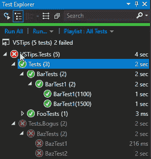
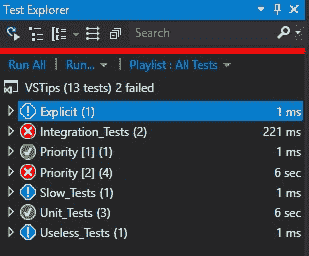
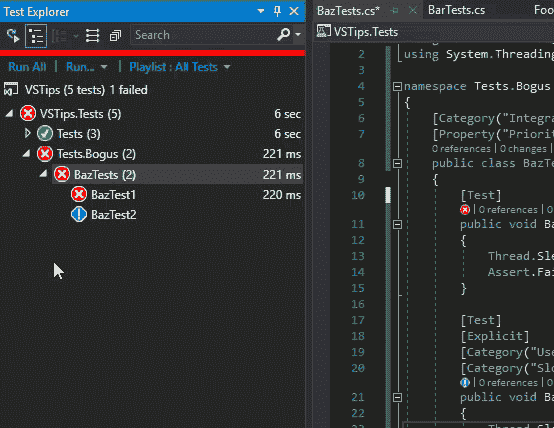

# Visual Studio 提示-测试资源管理器

> 原文：<https://dev.to/hutchcodes/visual-studio-tips-test-explorer-2ik7>

测试资源管理器有很强的能力以多种不同的方式过滤测试，所以当你只是在做一些只影响少数测试的事情时，你不必运行整个测试套件。

首先，当运行测试时，记住一些方便的键盘快捷键

*   `Ctrl+R,T` -运行所有测试
*   `Ctrl+R,Ctrl+T` -调试所有测试
*   `Ctrl+R,L` -重新运行上一次测试运行
*   `Ctrl+R,Ctrl+L` -调试最后一次测试运行

如果您不想花时间过滤您的测试运行，重新运行上一次测试运行的能力会非常方便。您可以右键单击并运行有意义的测试或测试组，然后使用键盘快捷键重新运行那组测试，直到您准备好继续。

### 分组依据

默认情况下，测试资源管理器窗口使用“测试层次结构”视图，该视图显示基于项目、命名空间、类、测试、测试用例的测试。如果关闭“测试层次”视图，您可以选择将分组更改为以下视图之一:

*   Class -根据类、测试、测试用例对测试进行分组。虽然没有显示名称空间，但是不同名称空间中同名的类是分开显示的。
*   持续时间——将测试分成 3 组。快速(<100ms), Medium, Slow (> 1s)
*   名称空间——按名称空间、类、测试、测试用例分组
*   项目-按项目、测试、测试用例分组(忽略名称空间)
*   结果-按通过、失败和未运行对测试进行分组。当您试图修复一些失败的测试时，这是很方便的。
*   特征组测验是由关于测验的各种特征组成的。测试可以在此多次列出，并与过滤器结合，这可以是一个非常强大的视图。

[](https://res.cloudinary.com/practicaldev/image/fetch/s--cC0MYEds--/c_limit%2Cf_auto%2Cfl_progressive%2Cq_66%2Cw_880/https://thepracticaldev.s3.amazonaws.com/i/vq21ywjnwyiogq38awv5.gif)

### 特质

如何为测试分配特征取决于您选择的单元测试框架。这个例子展示了 nUnit 的一些基本特征。

```
[Category("Integration_Tests")]
[Property("Priority", 2)]
public class BazTests
{
    [Test]
    public void BazTest1()
    {
        Thread.Sleep(200);
        Assert.Fail();
    }

    [Test]
    [Explicit]
    [Category("Slow_Tests")]
    [Category("Useless_Tests")]
    public void BazTest2()
    {
        Thread.Sleep(2000);
        Assert.Fail();
    }
} 
```

我已经将 TestClass 中的所有测试分配到‘Integration _ Tests’类别，并将其标记为‘Priority 2’。`BazTest2`测试也被标记为`Explicit`，并被分配到“慢速测试”和“无用测试”类别。

现在，当我从测试浏览器中查看我的测试套件时，它看起来像这样

[](https://res.cloudinary.com/practicaldev/image/fetch/s--oDpgwNO6--/c_limit%2Cf_auto%2Cfl_progressive%2Cq_auto%2Cw_880/https://thepracticaldev.s3.amazonaws.com/i/7awlgh0d9d8281qk7reh.jpg)

然后，我可以对该视图应用过滤器来缩小范围。假设我只想查看‘Integration _ Tests ’,我可以将`Trait:"Integration_Tests"`过滤器添加到测试浏览器的搜索区域。这就删除了所有不符合标准的测试，还剩下 2 个测试，但是它仍然显示了与这些测试相关的其他`Traits`。我只需右键单击“Slow_Tests”节点，然后选择“Run Selected Tests ”,就可以运行 BazTest2 了。

### 播放列表

播放列表允许您根据自己决定的标准创建自定义的测试组。也许您有一组测试，当您处理代码的某个部分时，您希望运行这些测试。您可以将这些测试添加到播放列表中，然后选择播放列表来过滤您的测试。您也可以签入这些播放列表供他人使用。

[](https://res.cloudinary.com/practicaldev/image/fetch/s--VCaIU6Nw--/c_limit%2Cf_auto%2Cfl_progressive%2Cq_66%2Cw_880/https://thepracticaldev.s3.amazonaws.com/i/k0tpc89v6stk40dm2sbp.gif)

### 构建后运行测试

一旦你按照你想要的方式过滤了你的测试列表，我建议你点击‘构建后运行测试’按钮，以确保你的过滤测试列表在每次构建后运行(标有`Explicit`的测试将不运行)。

[](https://res.cloudinary.com/practicaldev/image/fetch/s--zflGkUaG--/c_limit%2Cf_auto%2Cfl_progressive%2Cq_auto%2Cw_880/https://thepracticaldev.s3.amazonaws.com/i/hseml7afnubwy1ss806i.jpg)

根据您的过滤列表中有多少测试，它们的性能以及它们的隔离程度，您可能还想让它们并行运行。

[](https://res.cloudinary.com/practicaldev/image/fetch/s--GHHLHdD9--/c_limit%2Cf_auto%2Cfl_progressive%2Cq_auto%2Cw_880/https://thepracticaldev.s3.amazonaws.com/i/nrh11gq331u9zhpahipw.jpg)