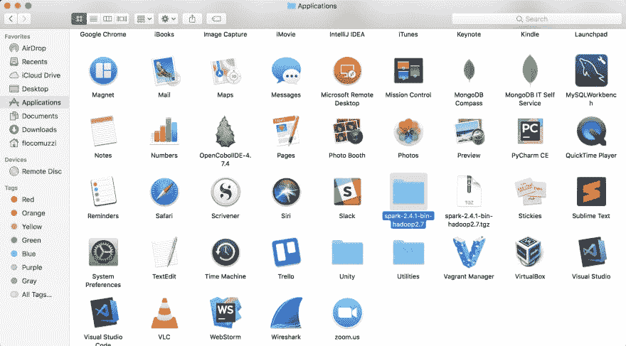

# 我学习 Spark 时的现场笔记

> 原文：<https://dev.to/flopi/live-notetaking-as-i-learn-spark-odj>

# 这是什么？

我很想了解其他开发者的想法。我想看看他们如何思考，我想看看他们如何现场学习。所以，**这是一个实验。**

> 我有一个有点模糊的目标:学习 Spark 的理论基础，这样我就可以研究一个程序并优化它。

我走的时候会把笔记放在这里。我希望能从这些笔记中发现一些规律。例如，到目前为止，我已经注意到我对我的问题进行分类，并定义我遇到的不理解的概念，有时推迟定义它们，因为我想先理解一个更大的概念。这对我来说是有价值的信息，因为我想以最有效的方式学习！我对很多事情都很好奇。我想充实地生活，探索能给我快乐的话题。

这个实验的灵感来自 Jessie Frazelle 的博客文章[挖掘 RISC-V 和我如何学习新东西](https://blog.jessfraz.com/post/digging-into-risc-v-and-how-i-learn-new-things/)。我的意思是，当我读这篇文章时，我感受到了和我刚开始学习编码时一样的兴奋。它带回了那种惊奇和崇敬的感觉。浪漫不死:p

如果你感到筋疲力尽，或者觉得自己的工作无关紧要，我建议你跳出眼前的情况(不管是糟糕的工作还是繁重的课业)，去了解你感兴趣的领域。看看其他人是如何学习的。尝试新事物。寻找灵感。

* * *

[](https://res.cloudinary.com/practicaldev/image/fetch/s--XMCqvCTU--/c_limit%2Cf_auto%2Cfl_progressive%2Cq_auto%2Cw_880/https://i.pinimg.com/originals/ae/d4/c0/aed4c059070ab79839312466a5172808.jpg)

# 备注

## 安装

来自 Spark:权威指南(推荐给我！)

*   如果您想在本地下载并运行 Spark，第一步是确保您的机器上安装了 Java(可作为`java`获得)，如果您想使用 Python，还需要一个 Python 版本。接下来，访问项目的官方下载页面，选择“为 Hadoop 2.7 及更高版本预建”的包类型，然后点击“直接下载”。这将下载一个压缩的 TAR 文件，或者说 tarball，然后您将需要提取它。
    *   我已经安装了 2.9 的预建版本
    *   我将未压缩的文件夹移动到我的应用程序文件夹，但无法通过终端找到该文件夹。我做了什么?

### 小混乱

有文件夹:
[](https://res.cloudinary.com/practicaldev/image/fetch/s--Fp7UjSyV--/c_limit%2Cf_auto%2Cfl_progressive%2Cq_auto%2Cw_880/https://thepracticaldev.s3.amazonaws.com/i/kh2r2xedk7dvp1qfsk6n.png)

但是，当我通过终端看不到文件夹中的任何内容时:

```
$ ls ~/Applications/
Chrome Apps.localized 
```

Enter fullscreen mode Exit fullscreen mode

所以，我谷歌了一下，发现 Mac 上的[应用程序是根](https://apple.stackexchange.com/questions/44475/access-applications-directory-in-terminal)，我一直在看我用户的应用程序。

*   Spark 可以在本地运行，无需任何分布式存储系统，如 Apache Hadoop，所以我不会安装 Hadoop，因为上次我在我的机器上安装它时慢得令人难以置信。(尽管我用的是另一台规格更差的机器)

> “您可以使用 Python、Java、Scala、R 或 SQL 中的 Spark。Spark 本身是用 Scala 编写的，运行在 Java 虚拟机(JVM)上，因此要在笔记本电脑或集群上运行 Spark，您只需要安装 Java。如果要使用 Python API，还需要 Python 解释器(2.7 版或更高版本)。”

我会用 PySpark。我使用`pyenv`来管理 Python 的安装并创建虚拟环境。我发现我需要一个虚拟环境，因为书上说，“在 Spark 2.2 中，开发人员还增加了通过`pip install pyspark`为 Python 安装 Spark 的能力。这一功能是在本书写作时推出的，因此我们无法包含所有相关说明。”所以我知道我需要一个虚拟环境，因为我想按项目管理`pyspark`的版本，而不是在全球范围内安装。我现在也知道，我可能需要做更多的谷歌搜索，因为这本书没有我可能需要的所有说明。我不知道具体有多少指令丢失了——希望这不会让我脱轨太久。虽然我期待着它，但我想知道这是否会妨碍我推进其他项目。

这是我如何安装`pyspark` :

```
$ mkdir spark-trial
$ cd spark-trial/
$ python --version
Python 2.7.10
$ pyenv local 3.6.5
$ python -m venv venv
$ source venv/bin/activate
$ python --version
Python 3.6.5
$ pip install pyspark
$ pip freeze > requirements.txt
$ cat requirements.txt 
py4j==0.10.7
pyspark==2.4.1 
```

Enter fullscreen mode Exit fullscreen mode

现在，我想确保我能运行它。书上说从 Spark 安装的主目录运行下面的代码:`$ ./bin/pyspark`。然后，键入“spark”并按回车键。您将看到 SparkSession 对象被打印出来。

所以我回到安装 Spark 的目录并运行这些命令。这是输出:

```
Python 3.6.5 (default, Nov 20 2018, 15:26:21) 
[GCC 4.2.1 Compatible Apple LLVM 10.0.0 (clang-1000.10.44.4)] on darwin
Type "help", "copyright", "credits" or "license" for more information.
WARNING: An illegal reflective access operation has occurred
WARNING: Illegal reflective access by org.apache.spark.unsafe.Platform (file:/Applications/spark-2.4.1-bin-hadoop2.7/jars/spark-unsafe_2.11-2.4.1.jar) to method java.nio.Bits.unaligned()
WARNING: Please consider reporting this to the maintainers of org.apache.spark.unsafe.Platform
WARNING: Use --illegal-access=warn to enable warnings of further illegal reflective access operations
WARNING: All illegal access operations will be denied in a future release
19/04/06 12:44:10 WARN NativeCodeLoader: Unable to load native-hadoop library for your platform... using builtin-java classes where applicable
Using Spark's default log4j profile: org/apache/spark/log4j-defaults.properties
Setting default log level to "WARN".
To adjust logging level use sc.setLogLevel(newLevel). For SparkR, use setLogLevel(newLevel).
Welcome to
      ____              __
     / __/__  ___ _____/ /__
    _\ \/ _ \/ _ `/ __/  '_/
   /__ / .__/\_,_/_/ /_/\_\   version 2.4.1
      /_/

Using Python version 3.6.5 (default, Nov 20 2018 15:26:21)
SparkSession available as 'spark'.
>>> spark
<pyspark.sql.session.SparkSession object at 0x10e262ac8> 
```

Enter fullscreen mode Exit fullscreen mode

我不知道为什么它运行的是 Python 3.6.5，尽管系统默认运行的是 2.7。我知道`pyenv`通过创建一个`.python-version`文件来管理为项目设置的 Python 版本，所以我将退出这个 shell 并在这个 spark 目录中查找该文件。

当我从安装 Spark 的同一个目录运行`python --version`时，我看到版本是 3 . 6 . 5——与我的虚拟环境的版本相同。我设置了这个 bash 主题，在虚拟环境被激活时显示这个:

```
○ flo at MacBook-Pro in .../-2.4.1-bin-hadoop2.7 using virtualenv: venv $ python --version
Python 3.6.5 
```

Enter fullscreen mode Exit fullscreen mode

忘了我上面创建的虚拟环境是激活的。我认为`pyenv`是通过读取`.python-version`文件来确定哪个 Python 版本是为一个项目设置的，但是我没有把 Python 虚拟环境是如何工作的放在一起...虚拟环境中的`activate`脚本是做什么的？在查看了脚本之后，我看到它将`VIRTUAL_ENV`环境变量设置为这个虚拟环境的路径，将`VIRTUAL_ENV`添加到系统`PATH`，并且如果设置了`PYTHONHOME`则取消设置，以便系统在调用 Python 时找到的第一个 Python 版本是激活的虚拟环境的 Python。酷！

## 星火架构

> “单台机器没有足够的能力和资源来对大量信息进行计算(或者用户可能没有时间等待计算完成)。一个*集群*或一组计算机，将许多机器的资源汇集在一起，使我们能够使用所有累积的资源，就像它们是一台计算机一样。现在，一组机器本身并不强大，你需要一个框架来协调它们之间的工作。Spark 正是这样做的，它管理和协调计算机集群中数据任务的执行。”点燃明确的指南

我有一本教科书《分布式系统》,作者是 Andrew Tanenbaum(我最喜欢的教科书作者——是的，我有一个最爱！).今天早上，我读到了不同类型的分布式计算，如集群计算与网格计算，所以我将回到这本书来澄清上面引用的*集群*是否与*集群计算*有联系，或者它是否是一个过载的术语。

分布式系统有许多种类；一类分布式系统用于**高性能计算任务**。该类别中有两个子组:

*   集群计算:
    *   底层硬件由通过高速**局域网**由紧密连接的**相似工作站**或**个人电脑组成**
    *   每个节点运行相同的操作系统
*   网格计算:
    *   通常构建为计算机系统的联合，其中每个系统可能属于不同的管理域，并且在硬件、软件和部署的网络技术方面可能非常不同

我只在单个公司里接触过 Spark，我想每个公司都有一个单独的网络？？？所以现在我假设 Spark 属于集群计算。

分布式系统教科书然后进入集群计算机的例子。比如 *MOSIX 系统*。MOSIX 试图提供一个集群的**单系统映像**，这意味着一个集群计算机试图作为一个进程的单个计算机出现。我遇到了我的第一个分布式系统 gem:不可能在所有情况下都提供单一的系统映像。

我终于开始将 Spark 和分布式系统概念联系起来。我将回到课本《分布式系统的设计目标》,以学习更多关于透明性的知识，并在我的笔记中增加一个叫做设计目标的部分，因为我现在已经了解了这些设计目标的全部内容。

回到火花，

> “Spark 用来执行任务的机器集群由一个集群管理器管理，如 Spark 的独立集群管理器、YARN 或 Mesos。然后，我们向这些集群管理器提交 Spark 应用程序，集群管理器将向我们的应用程序授予资源，以便我们能够完成工作。”

### 集群管理器

集群管理器控制物理机器并为 Spark 应用程序分配资源。

### 火花应用

Spark 应用程序由一个*驱动程序进程*和一组*执行程序进程*组成。驱动程序和执行程序仅仅是进程，这意味着它们可以生活在同一台机器上，也可以生活在不同的机器上。在本地模式下，驱动程序和执行器(作为线程)在您的个人计算机上运行，而不是在群集上运行。

#### 司机

*   叫做`SparkSession`
*   1:1 `SparkSession`至火花应用
*   运行`main()`功能
*   位于集群中的节点上
*   负责三件事:
    *   在应用程序的生命周期内维护关于 Spark 应用程序的信息
    *   响应用户的程序或输入
    *   在执行者之间分析、分配和调度工作

#### 执行者

*   只负责两件事:
    *   执行由驱动程序分配给它的代码
    *   将该执行器上的计算状态报告回驱动程序节点

我学了很多概念。我渴望在我的注意力动摇之前建造它。文本中仍有一些我认为重要的部分，所以我会继续下去，希望能尽快完成。否则，我会自己旋转。

# 火花 API

*   语言 API 和结构化与非结构化 API
*   每种*语言* API 都维护相同的核心概念(驱动程序、执行器等)。？).
    *   有一个`SparkSession`对象可供用户使用，是运行 Spark 代码的入口点。
    *   使用 Python 或 R 的 Spark 时，不写显式 JVM 指令；相反，**您编写 Python 和 R 代码，Spark 将其翻译成代码，然后它可以在 executor JVMs 上运行。**

启动 Spark shell 是我向 Spark 发送命令的方式，这样 Spark 就可以向执行者发送命令。因此，启动 Spark shell 就创建了一个交互式 Spark 应用程序。shell 将以独立模式启动。我还可以使用`spark-submit`进程将独立的应用程序发送到 Spark，从而将预编译的应用程序提交给 Spark。

## 分布式采集数据

*   核心数据结构*是不可变的*,因此它们在创建后不能改变

### DataFrames

*   包含行和列的数据表
*   *模式*是列和类型的列表
*   数据帧的各个部分可以驻留在不同的机器上
    *   一个*分区*是一组*行*的集合，它们位于集群中的一台物理机上。数据帧的分区表示数据在执行期间如何在机器集群中物理分布。
*   Python/R 数据帧主要存在于单个机器上，但是可以转换成 Spark 数据帧
*   Python 中的`myRange = spark.range(1000).toDF("number")`创建一个数据帧，其中一列包含 1000 行，值从 0 到 999。这个数字范围代表一个分布式集合。在集群上运行时，这个数字范围的每一部分都存在于不同的执行器上。这是一个火花数据帧。
*   最高效、最易于使用

### 变换

*   窄:每个输入分区只贡献给一个输出分区的那些
    *   Spark 将自动执行一个叫做*流水线*的操作，这意味着如果我们在数据帧上指定多个过滤器，它们都将在内存中执行。
*   宽:宽依赖(或宽转换)风格的转换将使输入分区贡献给许多输出分区，也称为*混洗*
    *   当执行洗牌时，Spark 将结果写入磁盘

### 动作

## 理论基础

### 设计目标

*   使分布透明/不可见:隐藏进程和资源在多台计算机上的物理分布
    *   访问:隐藏数据表示和进程或资源访问方式的差异
    *   位置:隐藏进程或资源的位置
    *   重定位:隐藏正在使用的资源或进程可能被移动到另一个位置
    *   迁移:隐藏资源或进程可能移动到另一个位置
    *   复制:隐藏资源或进程被复制
    *   并发性:隐藏资源或进程可能被几个独立的用户共享
    *   失败:隐藏资源或流程的失败和恢复

分布式系统的主要问题是什么？

*   多组
*   工作集:在给定的时间间隔内，一个进程需要的内存量，通常所讨论的信息单元被认为是内存页面。这被认为是该进程将在未来访问的页面集合的近似值，并且更具体地被认为是应该在主存储器中保留哪些页面以允许在该进程的执行中取得最大进展的指示。
*   集群计算范例
*   分布式共享存储器

建筑基础

*   RDD:弹性分布式数据集，一个分布在机器集群上的只读数据项集合，以容错方式维护
*   Dataframe API 是作为 RDD 之上的抽象发布的，随后是 Dataset API。在 Spark 1.x 中，RDD 是主要的应用程序编程接口(API ),但是从 Spark 2.x 开始，鼓励使用数据集 API。

集群计算范例

MapReduce 集群计算模式的局限性

*   Spark 及其 rdd 于 2012 年开发，以应对
*   MapReduce 集群计算范例在分布式程序上强制使用特定的线性数据流结构:
    *   MapReduce 程序从磁盘读取输入数据
    *   跨数据映射函数
    *   缩小地图的结果
    *   将缩减结果存储在磁盘上
*   Spark 的 rdd 作为分布式程序的工作集，提供了一种(有意的)受限形式的分布式共享内存。
*   Spark 有助于实现迭代算法(在循环中多次访问数据集)和交互式/探索性数据分析(即重复的数据库式数据查询)。与 Apache Hadoop MapReduce 实现相比，此类应用的延迟可能会减少几个数量级。

Apache Spark 要求:

*   集群管理器:独立的(本地 Spark 集群)、Hadoop YARN、Apache Mesos
*   分布式存储系统:Alluxio，HDFS，MapR-FS，Cassandra，OpenStack Swift，亚马逊 S3，Kudu，一个定制的解决方案，伪分布式本地模式，其中不需要分布式存储，可以使用本地文件系统来代替(Spark 在单个机器上运行，每个 CPU 内核一个执行器)

为什么使用 rdd？rdd 是较低层次的抽象，因为它们向最终用户揭示了物理执行特性，如分区。可能使用 rdd 来并行化存储在驱动程序机器的内存中的原始数据。

Scala RDDs 是**而不是**等同于 Python RDDs。

* * *

Chapter 4: Structured API Overview

Spark 是一个分布式编程模型，用户在其中指定转换。

> Spark 是一个分布式编程模型，用户在其中指定转换。多重转换建立了指令的有向无环图。动作通过将指令分解为要在集群中执行的阶段和任务，开始了作为单个作业执行指令图表的过程。我们通过转换和操作操纵的逻辑结构是数据帧和数据集。要创建新的数据帧或数据集，需要调用转换。要开始计算或转换为本族语言类型，您需要调用一个操作。