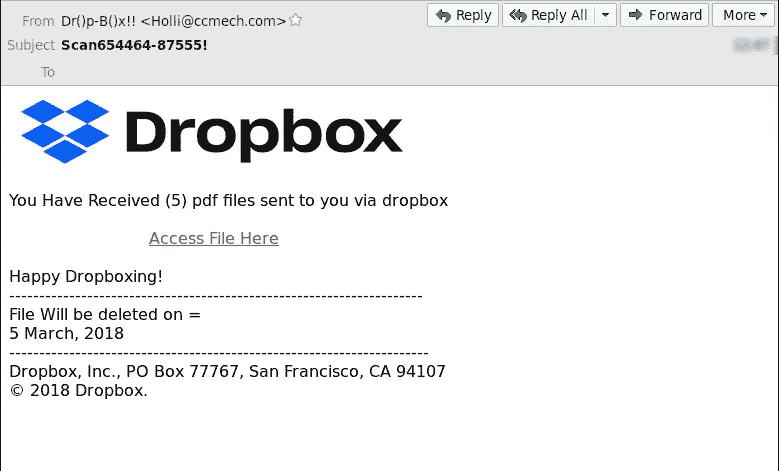
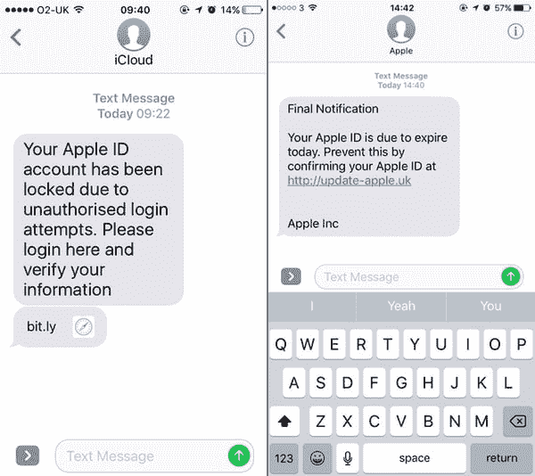

# 保护自己免受社会工程

> 原文：<https://dev.to/ctrlshifti/protect-yourself-from-social-engineering-3ihk>

作为开发者，我们是社交工程骗局的主要目标。黑客攻击人比黑客攻击基础设施要容易得多，开发者可以接触到对攻击者特别有吸引力的东西。

虽然这篇文章严格来说并不是关于编码，甚至根本不是关于计算机！-每个开发人员都应该知道如何避免社会工程骗局，以保证他们自己和他们的项目的安全。

*目标受众:*

*   *开发者*
*   *其他人也一样*

### 在社交媒体上分享时要小心

这条推文看起来有什么问题吗？

如果你猜“回答这个问题相当于给了黑客重置你的密码所需要的一切”——那么是的。正确。

精通技术的人避免任何在线身份的日子已经一去不复返了。现在，你的 Twitter 名就是你的全名，你的工作地点就在你的简历里(因为什么样的 dev 不爱炫耀呢？).有了你的名字和工作地点，攻击者就能猜出你的工作邮件。如果你开始透露个人信息，比如安全问题的答案，那就完了。

即使你的工作场所没有安全问题，*你的密码也可能是基于你的个人信息，比如宠物的名字*。 [79%的用户承认他们的密码中有个人信息](https://www.csoonline.com/article/2126506/79-percent-of-users-put-personal-info-in-passwords.html)...这只是那些承认的人。

[看看 CUPP](https://github.com/Mebus/cupp) 。CUPP 是一个工具，你可以输入某人的名字，昵称，孩子的名字，出生日期等。并生成潜在密码的列表。它工作了。很好。

简而言之:小心你在网上分享的信息！

### 启用 2FA 并将其集成到您的项目中

只要有可能，在你使用的服务上启用 2FA，比如你的 Google 账户，银行账户，Slack 等等。[虽然 2FA 并不完美](https://threatpost.com/charming-kitten-iranian-2fa/139979/)，但也很接近了。

如果你正在做一个需要个人登录和处理任何敏感信息的项目，请考虑在你的应用程序中编码一个 2FA 选项。以下是一些资源:

*   [用谷歌签到代替就行了，可能？](https://developers.google.com/identity/)
*   [谷歌认证器](https://github.com/google/google-authenticator)
*   [Authy](https://www.twilio.com/docs/authy)
*   发展自己的 2FA 的陷阱

### 不要被钓鱼

网络钓鱼仍然是最流行的社会工程形式。 [92%的恶意软件通过电子邮件发送](https://blog.alertlogic.com/must-know-phishing-statistics-2018/)，而 [95%的企业网络攻击是鱼叉式网络钓鱼成功的结果](https://www.networkworld.com/article/2164139/how-to-blunt-spear-phishing-attacks.html)。

许多开发者仍然抱着陈旧的观念，认为钓鱼邮件写得很差，语法很糟糕，而且明显是伪造的。不幸的是，在过去的几年里，网络钓鱼邮件有了很大的发展。现在，许多钓鱼邮件写得非常好，几乎与合法邮件没有区别。

以下是最近一些最常见的网络钓鱼诈骗:

#### 鱼叉网络钓鱼

鱼叉式网络钓鱼有选择地瞄准员工，[而开发人员尤其容易受到攻击](https://www.teiss.co.uk/threats/developers-vulnerable-phishing-attacks/)。网络钓鱼者会发现您的信息，然后有选择地利用这些信息来对付您。

鱼叉式网络钓鱼最经典的例子之一是向财务团队的人发送假发票。然而，最近，攻击者已经通过种植员工的社交媒体帐户并向他们发送定制的电子邮件诈骗来扩大他们的影响范围。

这里有一个有趣的故事。

> 所以，我不得不请一天假带我的狗去看兽医。这个团队已经人手不足了，所以我有点内疚。我在 Instagram 上贴了一张我的狗的照片，标题是*“今天带露西去看兽医。不过，我对错过工作感到内疚！”*
> 
> 大约一个小时后，我收到了老板的这封邮件:
> 
> *“你好【我的名字】，*
> 
> *希望 Lucy 没事！但是如果你再错过一天工作，我可能不得不解雇你。LOL。*
> 
> *请在今天 COB 前给这个客户汇 15000 美元。*
> *【客户详情】*
> 
> *问候，*
> 
> *【老板姓名】*
> 
> 我本来是打算转账的，但是一天下来就完全忘了。我惊慌失措地给老板打电话，为没有及时付款给客户道歉。他问我到底在说什么。

很可怕，对吧？

鱼叉式网络钓鱼有多种形式，并且随着社交媒体的兴起变得越来越复杂。

要防止鱼叉式网络钓鱼，请考虑以下几点:

*   我在等这个人发来的邮件吗？我们以前是否通过其他渠道讨论过此事？
*   邮件传达了一种紧迫感吗？
*   这封邮件需要我采取行动吗？
*   我可以通过其他渠道确认这封邮件的真实性吗？

此外，检查发件人的电子邮件地址是否有任何潜在的拼写错误，例如，将“I”替换为“l”，或将“m”替换为“rn”。即使电子邮件地址是完美的，记住欺骗地址是简单的，并不能保证电子邮件来自显示的来源。

#### 模拟服务

这是最常见的网络钓鱼形式。它包括伪装成一家企业，通常将电子邮件设计成该企业通常会发送的样子。下面是 Dropbox 的一个例子:

 
*来源:[https://www.mailguard.com.au/blog/dropbox-phishing-180302](https://www.mailguard.com.au/blog/dropbox-phishing-180302)*

有趣的事实:这种网络钓鱼就是黑客如何进入约翰·波德斯塔的电子邮件账户的！

为了保护自己免受此类网络钓鱼的侵害，请考虑以下几点:

*   邮件是否传达了一种紧迫感，或者要求我采取行动？
*   寄件人有什么可疑之处吗？
*   当我将鼠标悬停在电子邮件中的链接上时，弹出框会显示它们指向一个陌生的位置吗？

#### 错过

 
*来源:[https://www . welive security . com/2016/11/10/apple-id-smishing-evolutions-lure-victors/](https://www.welivesecurity.com/2016/11/10/apple-id-smishing-evolves-lure-victims/)*

短信钓鱼(SMS phishing)类似于标准的网络钓鱼电子邮件，但是通过 SMS。短信通常会冒充公司，鼓励你点击链接或泄露你的个人信息。

恶意攻击很难被发现，这就是为什么一般的建议是永远不要跟随你在文本上收到的链接。

#### 视觉

视觉(“语音”和“网络钓鱼”)包括通过电话进行的网络钓鱼。当然，这对于我们来说并不是什么大事，因为现在什么样的开发者会认真接电话？给我发个短信，FFS。

大多数伪装依赖于欺骗来电显示看起来像一个合法的来源。在最近的一个骗局中，[攻击者一直在假冒苹果](https://krebsonsecurity.com/2019/01/apple-phone-phishing-scams-getting-better/)。来自这些骗子的电话看起来完全合法，以“苹果公司”作为来电者的名字，甚至显示苹果的标志。受害者将被提示分享他们的个人信息，并可能进行信用卡购物。

为避免目测，请考虑:

*   我在等这个电话吗？
*   电话传达了一种紧迫感，还是要求我采取行动？
*   打电话的人在问我的个人信息吗？

#### 社交活动

好吧，这个词是我编的。但是社交媒体钓鱼开始成为一个大问题。以下是一些需要警惕的战术:

**LinkedIn 联系人妥协:**
在这次攻击中，黑客已经妥协了你的一个联系人。通过联系，他们利用你的信任，给你发信息让你点击链接。

**臭名昭著的视频:**
一个被攻破的联系人，通常在脸书，会给你发一条带有链接的消息。他们会声称这个链接是你做尴尬事情的视频，有很高的点击率。如果你点击链接，它会把你重定向到一个伪造的脸书登录页面。

**Twitter 诱饵:**
攻击者会发现一个合法公司正在与一些用户互动的 Twitter 评论线程。攻击者将设置与公司相同的显示名称和个人资料图片，然后将自己插入到线程中，通常会鼓励用户点击恶意链接。

### 自动化，自动化，自动化

> ...软件应用程序的安全性不应该完全委托给开发者。相反，正如 Podjarny 所说，公司应该将自动化引入安全控制，实施自动恶意软件检测扫描、多因素身份验证和自动过期访问令牌，以确保攻击者无法访问敏感软件程序或将恶意软件注入其中。

在可能的情况下，尝试将自动化集成到您的安全实践中。人类只能意识到这一点，有很多很棒的应用程序可以帮助填补空白。启用 2FA，安装一个密码管理器(如果你还没有的话),并定期扫描你的网络。

### 注意安全！

这个世界很可怕，每个人都想抓住你。尽量了解最新的网络钓鱼诈骗，因为攻击者在不断学习，他们永远不会离我们太远。

黑客快乐！

*本帖最初发表于[explainhownow.com](https://www.explainhownow.com/)T3】*