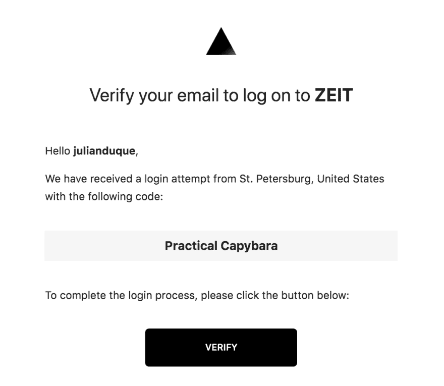
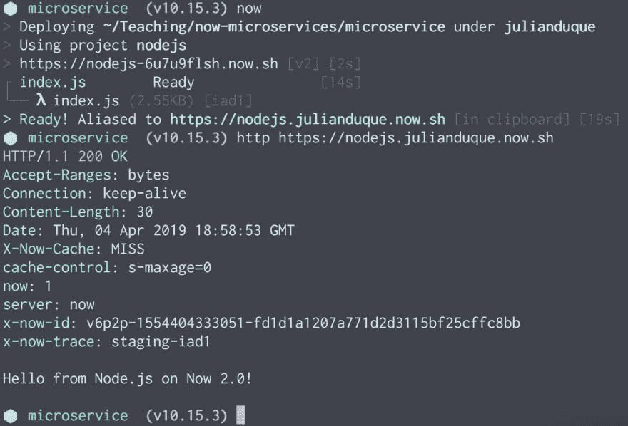

# 现在将 Node.js 微服务部署到 ZEIT

> 原文：<https://dev.to/julianduque/deploying-node-js-microservices-to-zeit-now-54j7>

[ZEIT Now](https://zeit.co/now) 是一个部署无服务器应用程序的云平台，我现在最喜欢的一点是他们的 DX(开发者体验)，它让将微服务部署到云上变得非常愉快。

在本文中，我们将学习如何使用一个命令`now`立即安装和开始部署。

## 先决条件

*   Node.js 10 LTS 已安装
*   一个终端
*   您选择的代码编辑器
*   一个 ZEIT Now 账户，你可以免费注册[这里](https://zeit.co/signup)

## 安装

首先，让我们通过运行以下命令从`npm`安装`now`CLI:

```
$ npm install -g now 
```

Enter fullscreen mode Exit fullscreen mode

## 登录

接下来，我们需要在平台中标识我们自己，`now` CLI 提供了一种简单的方法，通过运行:

```
$ now login 
```

Enter fullscreen mode Exit fullscreen mode

这将要求您的电子邮件，并会向您发送一封验证电子邮件，只需点击验证将登录您的平台，这就像魔术一样🔮！

<figure>

[](https://res.cloudinary.com/practicaldev/image/fetch/s--FOYAgVGX--/c_limit%2Cf_auto%2Cfl_progressive%2Cq_auto%2Cw_880/https://cldup.com/w7l9-mQIOU.png)

<figcaption>Verifying email</figcaption>

</figure>

<figure>

[](https://res.cloudinary.com/practicaldev/image/fetch/s---TusSfQW--/c_limit%2Cf_auto%2Cfl_progressive%2Cq_auto%2Cw_880/https://cldup.com/6qew2zrzkK.png)

<figcaption>Successful login from Terminal</figcaption>

</figure>

## 打造您的首个微服务

我们已经准备好开始创建我们的第一个`microservice`(或者无服务器应用程序，随便你怎么说)。

现在提供了一个[示例列表](https://zeit.co/examples/)，在我们的练习中，我们将使用 Node.js ⬢，但是嘿！，现在也支持其他语言和平台，只需用您最喜欢的语言试一试😉

从 Node.js 模板开始，让我们运行下面的命令:

```
$ now init nodejs microservice 
```

Enter fullscreen mode Exit fullscreen mode

这将使用 Node.js 模板创建一个名为`microservice`的文件夹。

**现在**是时候将我们的示例部署到云中了，让我们转到该文件夹并执行`now`来看看会发生什么！

```
$ cd microservice
$ now 
```

Enter fullscreen mode Exit fullscreen mode

<figure>

[](https://res.cloudinary.com/practicaldev/image/fetch/s--mRQsjELH--/c_limit%2Cf_auto%2Cfl_progressive%2Cq_auto%2Cw_880/https://cldup.com/Mitp20os7X.png)

<figcaption>Deploying to Now and running our microservice</figcaption>

</figure>

[](https://i.giphy.com/media/3o7TKP9ln2Dr6ze6f6/giphy.gif)

在继续我们的下一个技巧之前，让我们探索一下我们正在部署的文件:

### `index.js`

它包含一个简单的函数，带有 Node.js 中的`request`和`response`对象，这将在对我们的微服务的每个请求上执行。

<figure>

```
module.exports = (req, res) => {
  res.end(`Hello from Node.js on Now 2.0!`);
}; 
```

Enter fullscreen mode Exit fullscreen mode

<figcaption>index.js</figcaption>

</figure>

### `now.json`

它是[部署配置](https://zeit.co/docs/v2/deployments/configuration/)文件，用于指定我们项目的名称、我们将要使用的构建器的类型、路线等等。更多信息可以在他们的[文档](https://zeit.co/docs/v2/deployments/basics/)中找到。

<figure>

```
{  "version":  2,  "name":  "nodejs",  "builds":  [  {  "src":  "*.js",  "use":  "@now/node"  }  ]  } 
```

Enter fullscreen mode Exit fullscreen mode

<figcaption>now.json</figcaption>

</figure>

## Monorepo

到目前为止，我们所看到的似乎很简单，但是，`now`的真正威力来了，我们可以在一个 [`monorepo`](https://en.wikipedia.org/wiki/Monorepo) 中混合搭配不同的微服务来创建一个完整的无服务器项目。

对于我们的下一个技巧，我们将创建一个 [Nuxt.js](https://nuxtjs.org/) 静态应用程序，它将向 Node.js 微服务发出 API 请求，两者都将使用`monorepo`方法部署到`now`。

让我们创建一个`monorepo`文件夹，然后运行`create-nuxt-app`，这将为您创建一个基本的 Nuxt.js 应用程序，只要确保在特性部分选择`Axios`支持，我们稍后会用到它😉。

```
$ mkdir monorepo
$ cd monorepo
$ npx create-nuxt-app www 
```

Enter fullscreen mode Exit fullscreen mode

<figure>

[](https://res.cloudinary.com/practicaldev/image/fetch/s--WpJGbDK0--/c_limit%2Cf_auto%2Cfl_progressive%2Cq_auto%2Cw_880/https://cldup.com/5Bm-3oazw0.png)

<figcaption>create-nuxt-app</figcaption>

</figure>

我们已经几乎准备好了我们的前端应用程序，我们将需要添加一个 API 到我们的`monorepo`项目，让我们创建一个`api`文件夹，并在那里添加一个 Node.js `microservice`(不需要创建`now.json`，我们将稍后处理)。

让我们创建一个`bands`微服务:

```
$ mkdir api
$ touch api/bands.js 
```

Enter fullscreen mode Exit fullscreen mode

### `api/bands.js`

```
module.exports = (req, res) => {
  const bands = [
    {
      name: 'Dio',
      genre: 'Heavy Metal'
    },
    {
      name: 'Anthrax',
      genre: 'Trash Metal'
    },
    {
      name: 'Tenebrarum',
      genre: 'Gothic Metal'
    }
  ]
  res.end(JSON.stringify(bands))
} 
```

Enter fullscreen mode Exit fullscreen mode

是的，我喜欢金属🤘

让我们创建一个部署配置文件来连接 monorepo 中的两个项目。

### `now.json`

```
{  "version":  2,  "name":  "monorepo",  "builds":  [  {  "src":  "www/package.json",  "use":  "@now/static-build"  },  {  "src":  "api/*.js",  "use":  "@now/node"  }  ],  "routes":  [  {  "src":  "/api/(.*)",  "dest":  "/api/$1"  },  {  "src":  "/(.*)",  "dest":  "/www/$1"  }  ]  } 
```

Enter fullscreen mode Exit fullscreen mode

在他们的[文档](https://zeit.co/docs/v2/deployments/routes/)中有更多关于路由如何工作的信息。

这里，我们使用两个不同的无服务器应用程序在一个 repo 中创建 API 和 Web 项目，一个由`@now/node`提供服务，另一个由`@now/static-build`构建。

在部署之前，让我们将以下内容添加到我们的`www`项目中:

*   向`package.json`文件添加一个`now-build`脚本，如下所示:

```
"now-build": "API_URL=https://monorepo.julianduque.now.sh npm run generate" 
```

Enter fullscreen mode Exit fullscreen mode

这将设置`Axios`在正确的 URL 中发现我们的 API 端点(确保在这里使用您的别名)，并将告诉`now`如何为 Nuxt 生成一个静态站点。

*   让我们更新我们的`pages/index.vue`页面来执行我们用 Node.js 实现的 Bands 微服务

```
export default {
  components: {
    Logo
  },
  data: function () {
    return {
      bands: []
    }
  },
  methods: {
    async loadBands () {
      try {
        this.bands = await this.$axios.$get('/api/bands.js')
      } catch (err) {
        console.error(err)
      }
    }
  }
} 
```

Enter fullscreen mode Exit fullscreen mode

*   向`<template>`添加一个按钮，并用 Vue.js 呈现项目

```
<a v-on:click="loadBands">Load Bands</a>
<ul v-bind:key="band.name" v-for="band in bands">
  <li>{{ band.name }} - {{ band.genre }}</li>
</ul> 
```

Enter fullscreen mode Exit fullscreen mode

瞧啊。现在，我们已经将两个无服务器应用程序连接到一个 monorepo 中！

[](https://i.giphy.com/media/3o8dFn5CXJlCV9ZEsg/giphy-downsized.gif)

我希望你喜欢这个教程，如果你会说西班牙语，让我邀请你参加我在[Twitch](https://twitch.tv/julianduque)-[Node.js En Vivo 上的半周一次的 node . js 秀！](https://www.youtube.com/user/julianduquej)💜