# 如何从您的个人博客自动交叉发布到媒体和开发者

> 原文：<https://dev.to/brandonskerritt/how-to-auto-crosspost-to-medium-and-dev-to-from-your-personal-blog-3mn5>

这是通过 RSS 提要和 Zapier 的混合来实现的。这将花费您大约 3 - 5 分钟来设置。

首先，在 [Zapier](https://zapier.com) 上创建一个账户。

你在 WordPress 或者 Ghost 上有博客吗？如果是这样，扎皮尔已经为你准备好了。创建一个新的 Zap，看看你的博客是否在上面。

我用的是 Ghost，但是我这里要用 RSS。几乎所有的博客都有 RSS 提要。如果你使用 Wordpress 或 Ghost，请在这里使用它们。我还将展示 Ghost 中的工作原理。

你的下一步是连接它到媒体。

[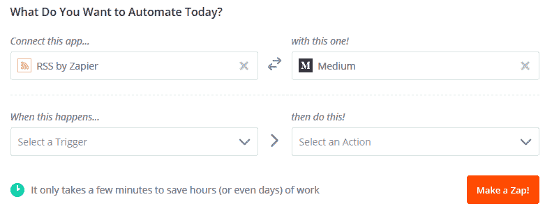](https://res.cloudinary.com/practicaldev/image/fetch/s--cnRAz89i--/c_limit%2Cf_auto%2Cfl_progressive%2Cq_auto%2Cw_880/https://skerritt.blog/conteimg/2019/04/image-1.png)

我们想把你个人博客的内容自动发布到媒体上。然后我们会自动将它从 Medium 发布到 Dev.to(或者从你的博客发布到 Dev.to)

[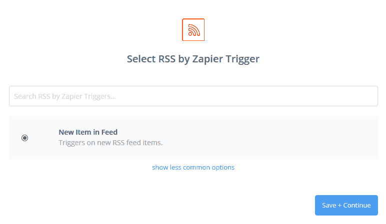](https://res.cloudinary.com/practicaldev/image/fetch/s--wY9BSKN9--/c_limit%2Cf_auto%2Cfl_progressive%2Cq_auto%2Cw_880/https://skerritt.blog/conteimg/2019/04/image-2.png)

当一个新的条目出现在 feed 中时，我们希望交叉发布到 Medium。如果你正在使用 Ghost 或 Wordpress 触发器，你会想在一个新故事发布时激活它。如果您使用的是 Ghost，请点击此处:

[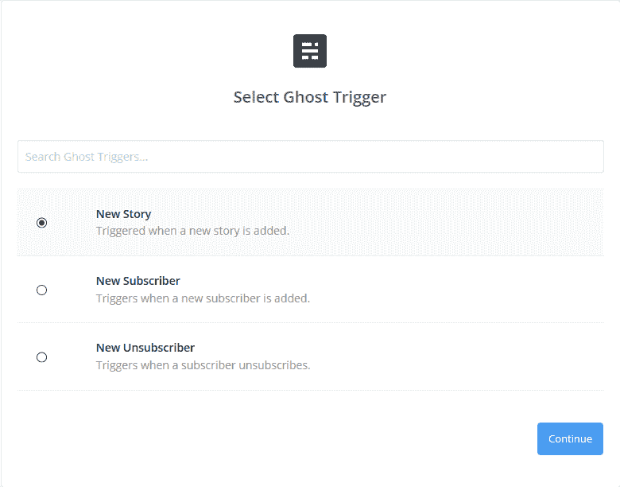](https://res.cloudinary.com/practicaldev/image/fetch/s--w2ov8bJZ--/c_limit%2Cf_auto%2Cfl_progressive%2Cq_auto%2Cw_880/https://skerritt.blog/conteimg/2019/04/image-4.png)

在这里登录你的 Ghost / Wordpress 帐户。现在，回到 RSS。

[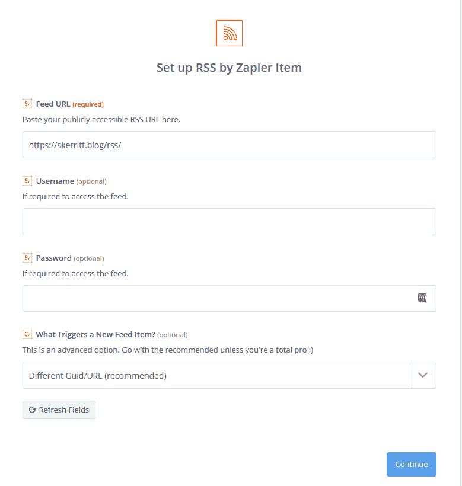](https://res.cloudinary.com/practicaldev/image/fetch/s--Zm_czsZQ--/c_limit%2Cf_auto%2Cfl_progressive%2Cq_auto%2Cw_880/https://skerritt.blog/conteimg/2019/04/image-3.png)

我们在这里输入 RSS 提要。

现在设置事物的中间面

[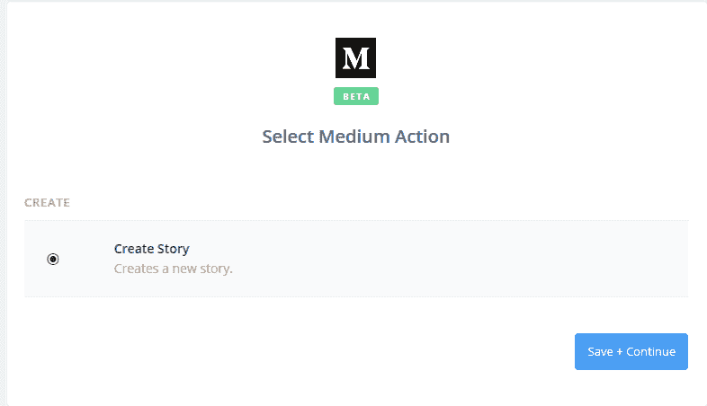](https://res.cloudinary.com/practicaldev/image/fetch/s--p8vRlLNw--/c_limit%2Cf_auto%2Cfl_progressive%2Cq_auto%2Cw_880/https://skerritt.blog/conteimg/2019/04/image-6.png)

你想用媒介创造一个新的故事。它会要求你登录。

[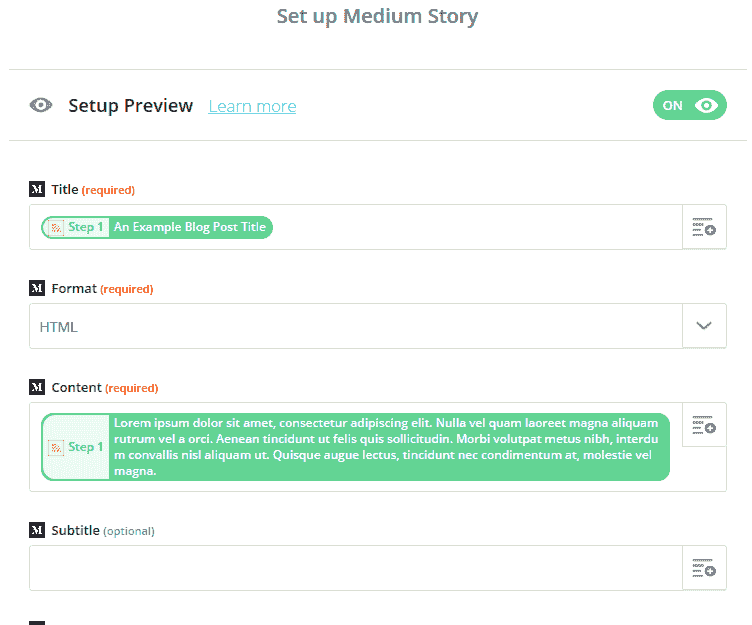](https://res.cloudinary.com/practicaldev/image/fetch/s--Sr3pAo1X--/c_limit%2Cf_auto%2Cfl_progressive%2Cq_auto%2Cw_880/https://skerritt.blog/conteimg/2019/04/image-7.png)

RSS 中的内容称为“描述”。我的 RSS 订阅源会发布整篇文章，你的可能不会。再次检查以防万一。在 Ghost 中，这看起来像:

[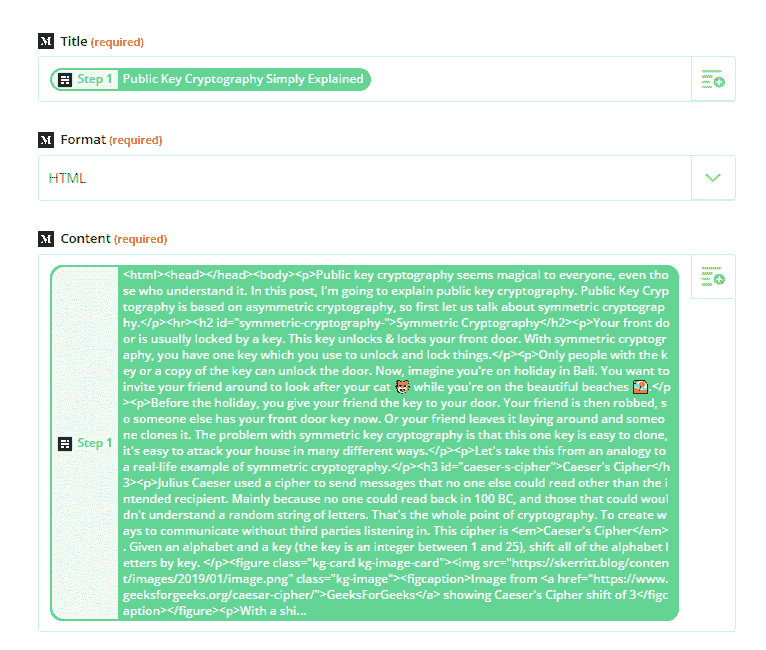](https://res.cloudinary.com/practicaldev/image/fetch/s--1gpT5MZT--/c_limit%2Cf_auto%2Cfl_progressive%2Cq_auto%2Cw_880/https://skerritt.blog/conteimg/2019/04/image-8.png)

接下来，添加一些标签，并填写其余的信息。

[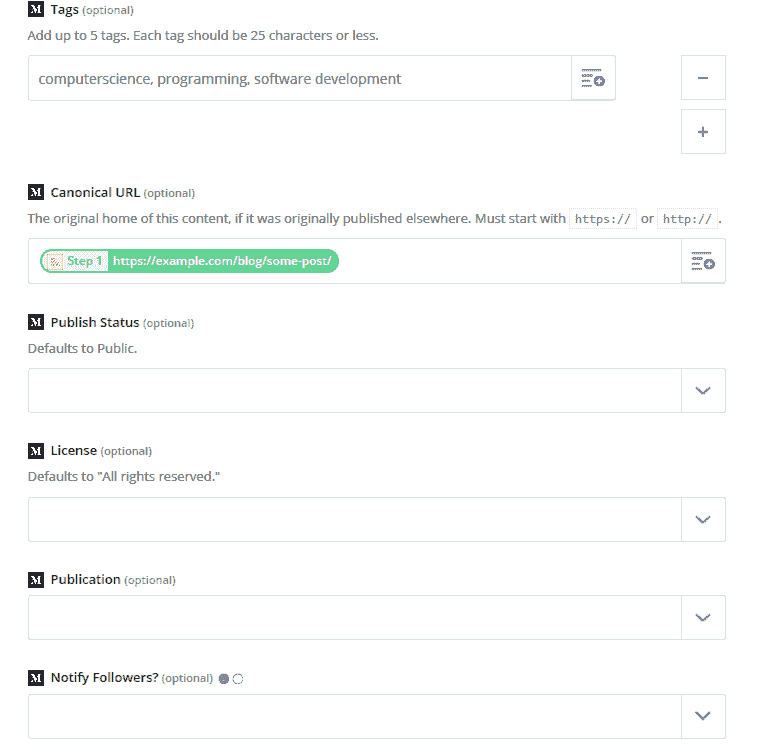](https://res.cloudinary.com/practicaldev/image/fetch/s--_RQwoQV2--/c_limit%2Cf_auto%2Cfl_progressive%2Cq_auto%2Cw_880/https://skerritt.blog/conteimg/2019/04/image-9.png)

确保将规范链接设置为 blogpost 的链接。这意味着每当搜索引擎在 Medium / Dev.to 上找到你的博客文章时，它会将你的博客文章在这些平台上的所有受欢迎程度归因于你在自己网站上的原创文章。

您可以将其设置为自动发布，或者只创建草稿。我选择在这里创建草稿，因为这种方法并不完美，有时会导致一些视觉问题。

您可以选择要发布到的出版物。我是 Hackernoon 的撰稿人，所以我在那里发表文章。这是我剩下的幽灵>中型 zap:

[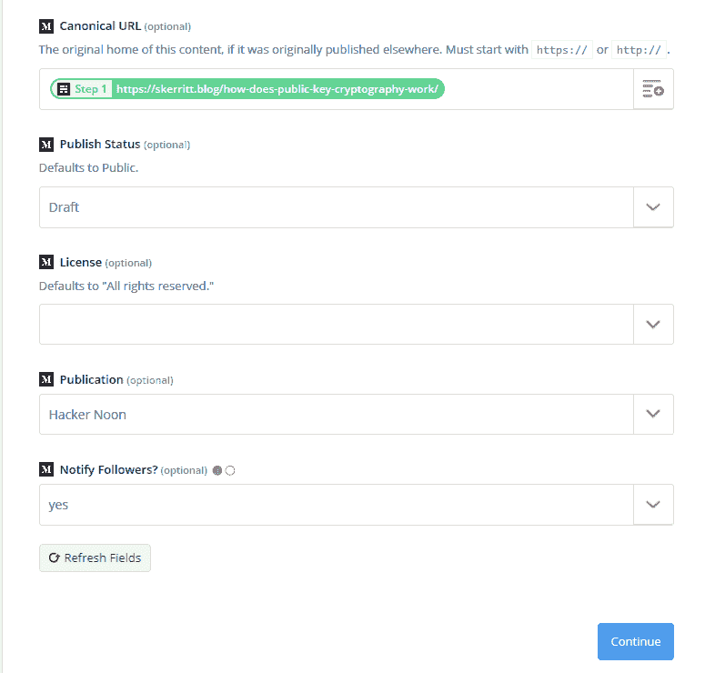](https://res.cloudinary.com/practicaldev/image/fetch/s--hBDIltuf--/c_limit%2Cf_auto%2Cfl_progressive%2Cq_auto%2Cw_880/https://skerritt.blog/conteimg/2019/04/image-10.png)

现在，你应该有一张从你自己的博客到媒体的自动交叉海报，如果你愿意，甚至可以把它添加到出版物中。

# 开发到

进入您在 Dev.to 上的设置

[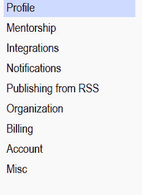](https://res.cloudinary.com/practicaldev/image/fetch/s--pRQlXnkg--/c_limit%2Cf_auto%2Cfl_progressive%2Cq_auto%2Cw_880/https://skerritt.blog/conteimg/2019/04/image-11.png)

单击“从 RSS 发布”。

[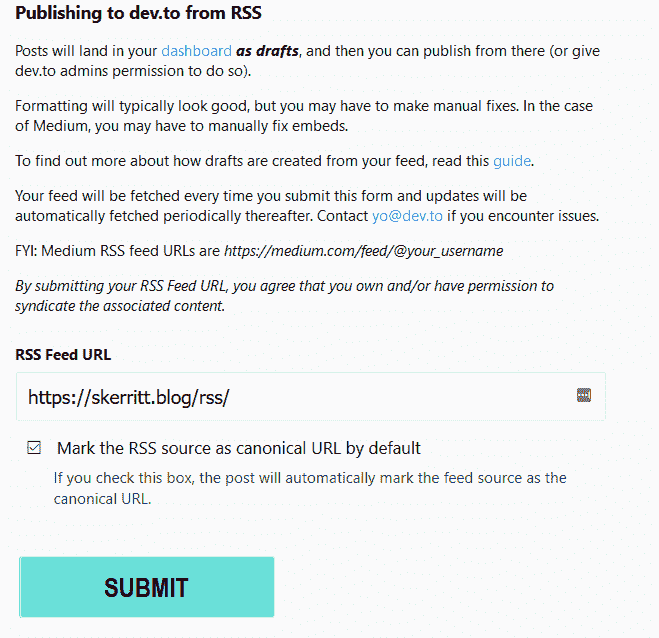](https://res.cloudinary.com/practicaldev/image/fetch/s--r3NQ-CT8--/c_limit%2Cf_auto%2Cfl_progressive%2Cq_auto%2Cw_880/https://skerritt.blog/conteimg/2019/04/image-13.png)

我在这里使用我的 Ghost 博客的 RSS 提要，但是如果你愿意，你也可以在这里使用你的中型 RSS 提要。

确保勾选“默认情况下将 RSS 源标记为规范 URL”。如果你使用你的中型 RSS 源，那么所有的内容都将归于你的中型博客文章。这就是为什么我在这里使用我的普通 RSS 源。

我们完了！您现在可以从您的个人博客自动交叉发布到 Medium 和 Dev.to。如果你在个人博客上使用 Mathjax，Medium 会自动把这个转换成图片(多漂亮！).有时会有一些视觉上的小问题，所以一定要仔细检查你发布的所有文章。

您正在阅读的这篇文章是自动交叉发布到 dev.to 的💓✨