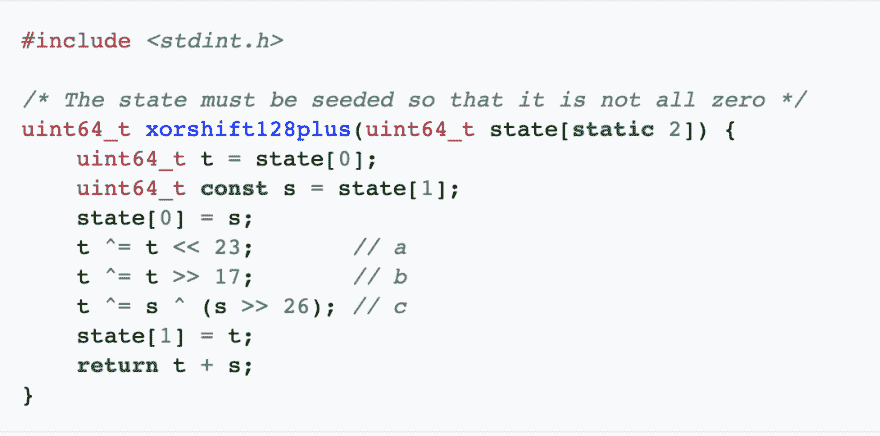
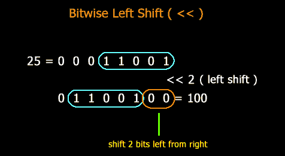
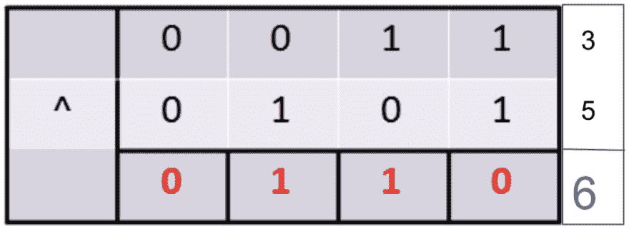

# “随机”博客

> 原文：<https://dev.to/kwmcminn/random-topic-3pbk>

就在上周，在我在西雅图熨斗学校的第三个项目中，我和我的同学 [Billy Witherspoon](https://dev.to/billywitherspoon) 一起创建了一个 21 点应用程序(如果你想尝试一下，你可以在这里玩。我们使用 JavaScript 的 Math.random()内置方法在我们的应用程序中加入了一个洗牌功能。这让我开始思考...如果一台计算机被设计成具有极强的可预测性，并且完全按照它被告知的那样去做，那么计算机是如何产生一个随机数的呢？不可能真的是随机的，对吧？我决定研究 Math.random()函数来揭示幕后发生的事情。

#### Math.random()

剧透！Math.random()函数不生成随机数。虽然在编程中没有真正的随机数生成器，但是 JavaScript(实际上是浏览器)在模拟随机数方面做得非常好。那么在做什么呢？归根结底是 JavaScript 定义了规则，由浏览器决定如何生成数字。这些是 ECMAScript 列出的规则

*[Math.random]使用依赖于实现的算法或策略，返回一个大于或等于 0 但小于 1 的带正号的数值，该数值是随机或伪随机选择的，在该范围内近似均匀分布。这个函数没有参数。
为不同代码领域创建的每个 Math.random 函数必须从连续调用中产生不同的值序列。*

#### XORshift

直到 2015 年，不同的浏览器使用不同的算法来符合 ECMAScript 设定的标准。2015 年，各大浏览器都采用了一种名为 xorshift128+的伪随机数生成器(PRNG)。

[T4】](https://res.cloudinary.com/practicaldev/image/fetch/s--TR64Ql0V--/c_limit%2Cf_auto%2Cfl_progressive%2Cq_auto%2Cw_880/https://thepracticaldev.s3.amazonaws.com/i/vw1e6twd07wnsg9sqpnc.png)

那么这个函数到底发生了什么呢？无需深入细节，本质上这个函数接受两个种子值并在比特级别执行移位。 *< <* 和 *> >* 运算符分别为左移和右移。在一个示例中，种子值可以是 25 < < 2，计算机取 25 的二进制表示，然后将其向左移位 2 位，得到新的数(100)。你可以想象下面的例子。

你可能也想知道=^符号代表什么。这是 XOR 赋值运算符。XOR(意味着异或)比较两个数的二进制表示，并在对应的位匹配时输出 0，或在位不同时输出 1。因此，它接受我们的两个种子值二进制表示，并将其通过 XOR 逻辑门，根据移位的种子值产生一个新数。
[T3】](https://res.cloudinary.com/practicaldev/image/fetch/s--n9ht2SvA--/c_limit%2Cf_auto%2Cfl_progressive%2Cq_auto%2Cw_880/https://thepracticaldev.s3.amazonaws.com/i/nxiizjmyxt3xodvpdldl.png)

为简单起见，该算法采用浏览器确定的两个种子值，用'<> '运算符对它们进行切换，以产生两种不同的二进制表示，然后通过 XOR 逻辑门发送这两个二进制数，以产生我们最终的“随机”数。尽管它不是真正的随机的，但它通常能满足程序员的需求。如果你试图生成一个真正的数字，你需要用一个在计算机外生成的数字作为种子值...例如用户动作发生的准确时间，一个例子是他们点击按钮后的 0.3567 秒。这使得该过程非常不可预测，并且不可能进行逆向工程。

#### 总结

*   JavaScript 定义了 Math.random()的规则，然后由浏览器决定如何完成。
*   大多数现代浏览器使用 xorshift128+方法来生成一个随机数
*   xorshift 方法接受两个种子值，将它们转换为二进制，在它们的值周围移动，然后将这些新值通过 XOR 门，以产生我们的最终随机数。
*   要生成真正的随机数，种子值必须在计算机外部生成。