# Python 版本随时间的共享，4

> 原文：<https://dev.to/hugovk/python-version-share-over-time-4-26hm>

为了庆祝 [Python 3.7.3](https://www.python.org/downloads/release/python-373/) 于 2019 年 3 月 25 日[发布](https://www.python.org/dev/peps/pep-0537/)，在[Python 2](https://python2woop.pw/)发布不到九个月的时候，这里有一些统计数据显示过去三年中使用了多少不同的 Python 版本。

以下是 2016 年 1 月至 2019 年 3 月期间 [Python 包索引(PyPI)](https://pypi.org/) 中所有包的 pip 安装:

[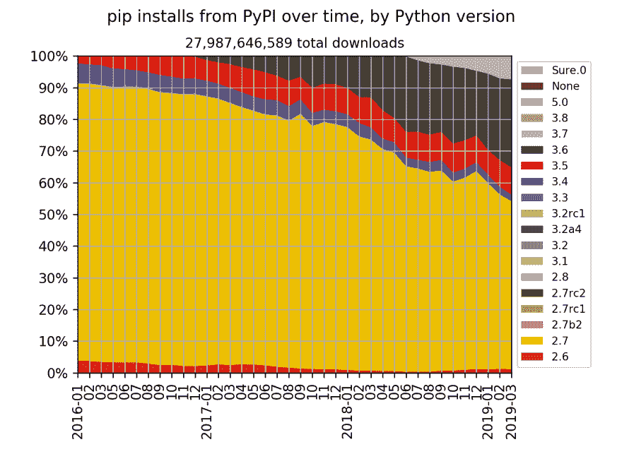](https://res.cloudinary.com/practicaldev/image/fetch/s--ENuEFafK--/c_limit%2Cf_auto%2Cfl_progressive%2Cq_auto%2Cw_880/https://thepracticaldev.s3.amazonaws.com/i/4wqa702ngppsv6dxh3zq.png)

### [皮普](https://github.com/pypa/pip)

软件包安装程序

[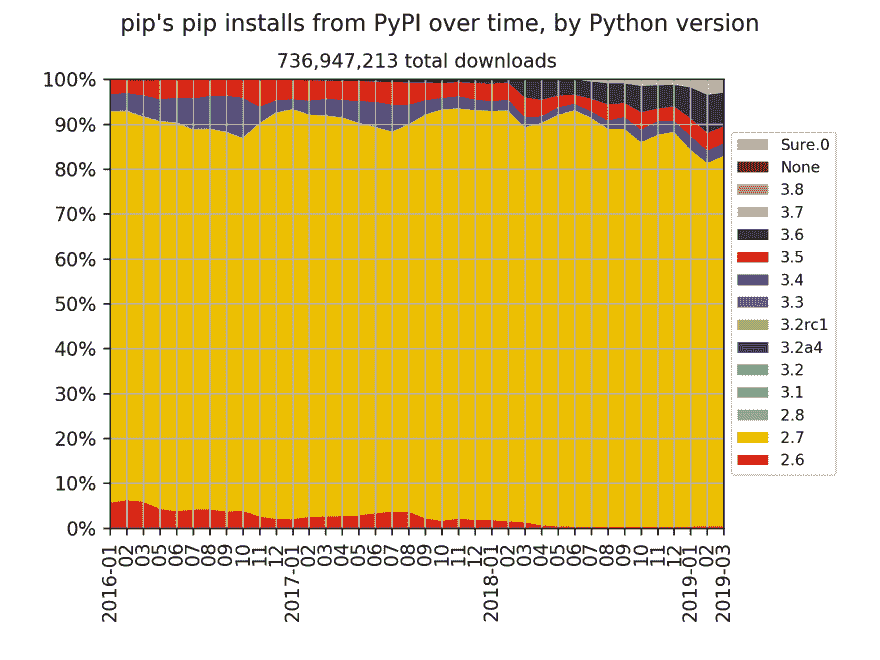](https://res.cloudinary.com/practicaldev/image/fetch/s--0EGXYw1w--/c_limit%2Cf_auto%2Cfl_progressive%2Cq_auto%2Cw_880/https://thepracticaldev.s3.amazonaws.com/i/2kncm0d1gnytc8dox1vr.png)

### [六](https://github.com/benjaminp/six)

Python 2 和 3 兼容性库

[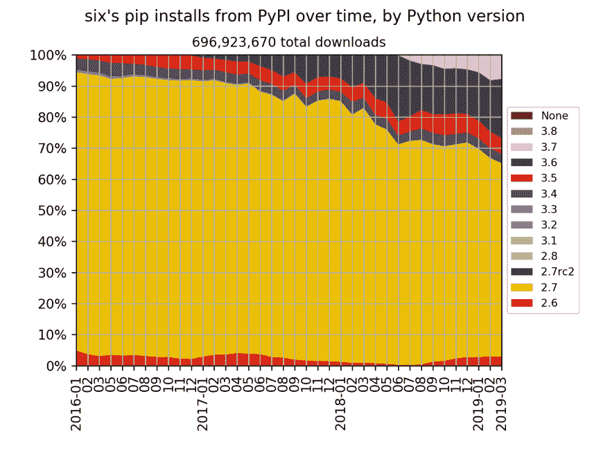](https://res.cloudinary.com/practicaldev/image/fetch/s--7La3674F--/c_limit%2Cf_auto%2Cfl_progressive%2Cq_auto%2Cw_880/https://thepracticaldev.s3.amazonaws.com/i/2s8ienw3purly7d563g3.png)

### [NumPy](https://github.com/numpy/numpy)

科学计算图书馆

[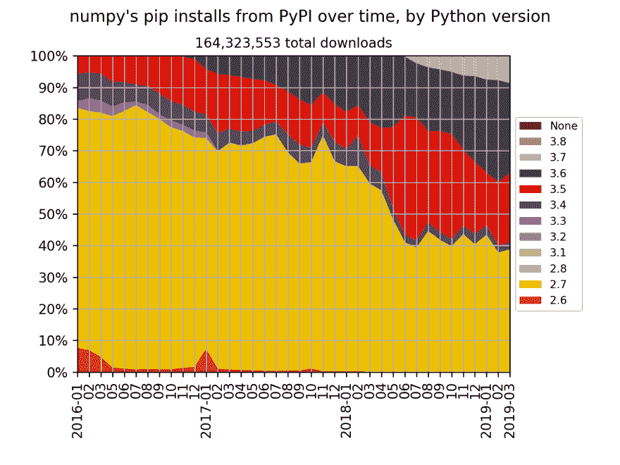](https://res.cloudinary.com/practicaldev/image/fetch/s--_Le1qmtk--/c_limit%2Cf_auto%2Cfl_progressive%2Cq_auto%2Cw_880/https://thepracticaldev.s3.amazonaws.com/i/slcl0es81ltkdlduthea.png)

### [pytest](https://github.com/pytest-dev/pytest)

测试框架

[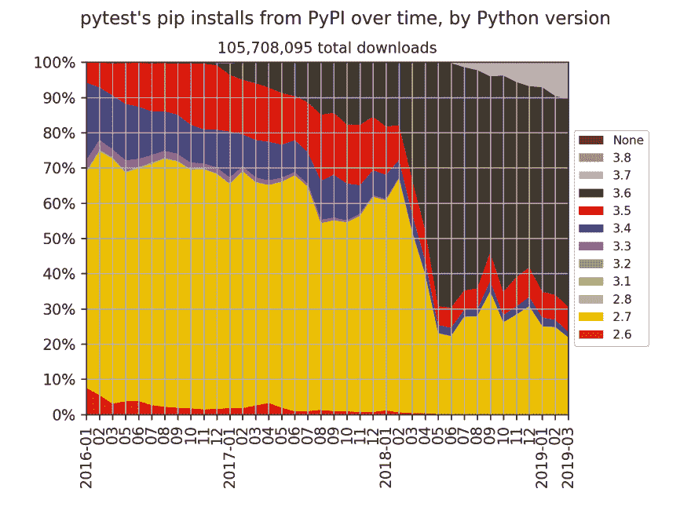](https://res.cloudinary.com/practicaldev/image/fetch/s--dTqcrHe5--/c_limit%2Cf_auto%2Cfl_progressive%2Cq_auto%2Cw_880/https://thepracticaldev.s3.amazonaws.com/i/x9u45cebj930u52lhob2.png)

### [Coverage.py](https://github.com/nedbat/coveragepy)

代码覆盖测试

[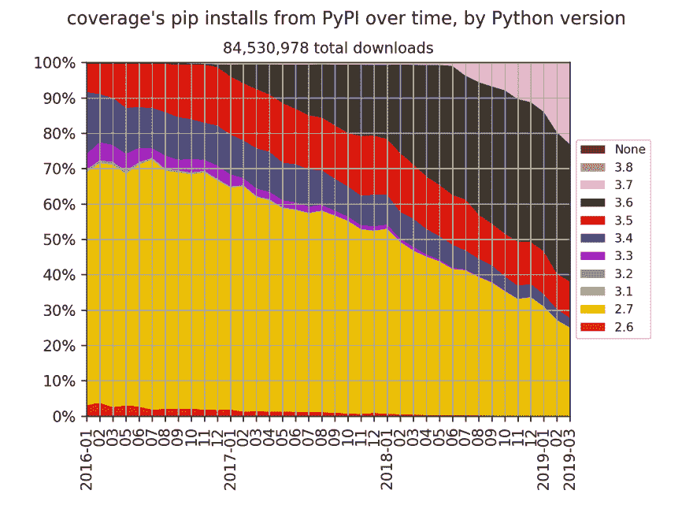](https://res.cloudinary.com/practicaldev/image/fetch/s--x5OfNFsq--/c_limit%2Cf_auto%2Cfl_progressive%2Cq_auto%2Cw_880/https://thepracticaldev.s3.amazonaws.com/i/lacortkwvi92z4zw0m6b.png)

### [枕头](https://github.com/python-pillow/Pillow)

图像库

[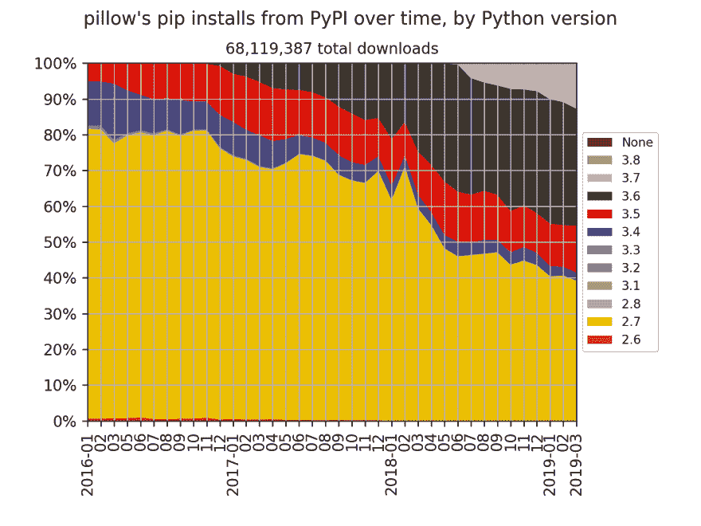](https://res.cloudinary.com/practicaldev/image/fetch/s--36pNFJTV--/c_limit%2Cf_auto%2Cfl_progressive%2Cq_auto%2Cw_880/https://thepracticaldev.s3.amazonaws.com/i/msqm643wek2w0qmgdxlu.png)

### [姜戈](https://github.com/python-pillow/Pillow)

Web 框架

[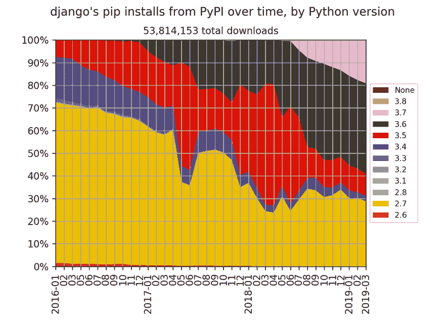](https://res.cloudinary.com/practicaldev/image/fetch/s--V1bPLI-i--/c_limit%2Cf_auto%2Cfl_progressive%2Cq_auto%2Cw_880/https://thepracticaldev.s3.amazonaws.com/i/omjea829j1h83fxp65ge.png)

### [【matplot lib】](https://github.com/matplotlib/matplotlib)

2D 绘图图书馆

[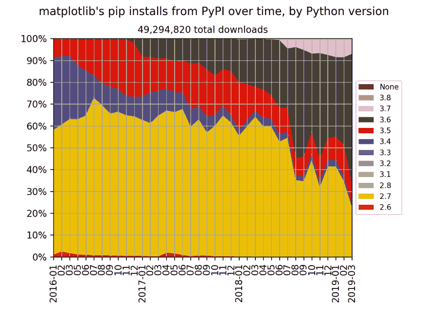](https://res.cloudinary.com/practicaldev/image/fetch/s--1RFKqBB4--/c_limit%2Cf_auto%2Cfl_progressive%2Cq_auto%2Cw_880/https://thepracticaldev.s3.amazonaws.com/i/7kqrb64d2lmrnm2jw2lu.png)

### [Flake8](https://gitlab.com/pycqa/flake8)

棉绒

[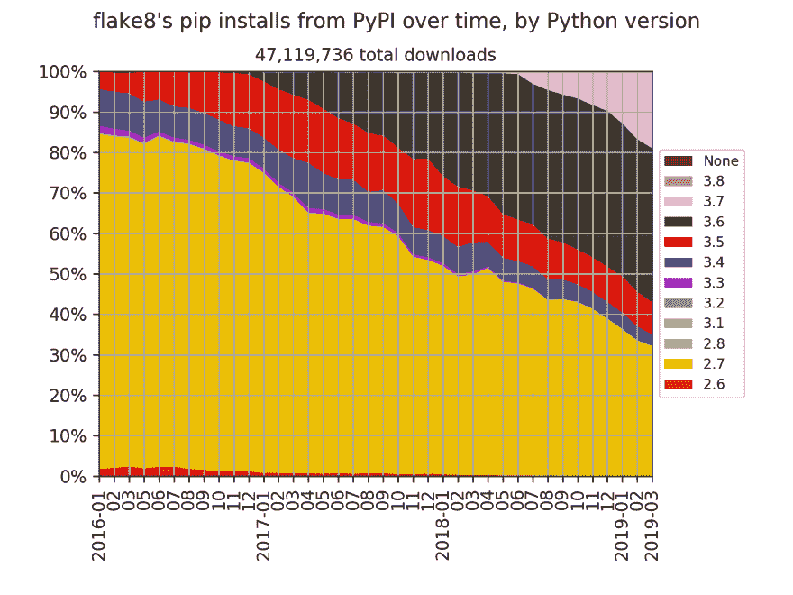](https://res.cloudinary.com/practicaldev/image/fetch/s--yqNkUZkv--/c_limit%2Cf_auto%2Cfl_progressive%2Cq_auto%2Cw_880/https://thepracticaldev.s3.amazonaws.com/i/102lu27lpme6gtdb3q9i.png)

### [桥台](https://github.com/PyCQA/pylint/)

棉绒

[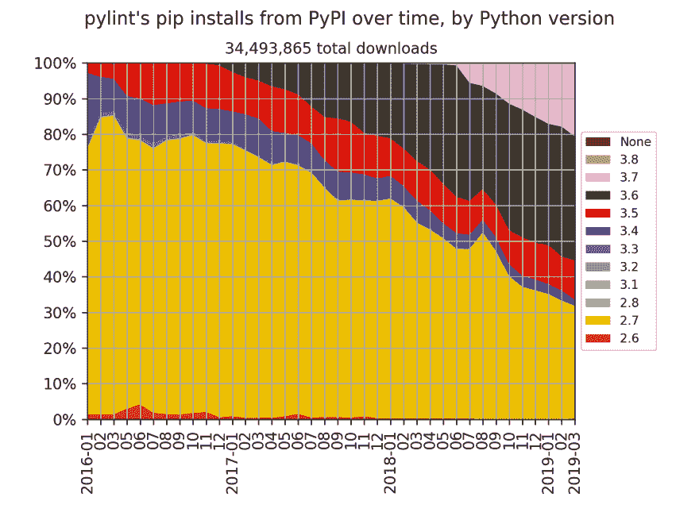](https://res.cloudinary.com/practicaldev/image/fetch/s--V7aUFhgF--/c_limit%2Cf_auto%2Cfl_progressive%2Cq_auto%2Cw_880/https://thepracticaldev.s3.amazonaws.com/i/yxc1911cdltvfrjs0eop.png)

### [皮拉斯特](https://github.com/pylast/pylast)

Last.fm 的接口

[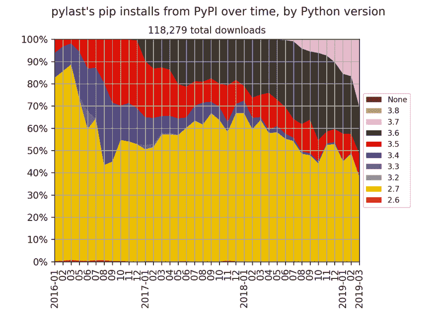](https://res.cloudinary.com/practicaldev/image/fetch/s--xP88IBNj--/c_limit%2Cf_auto%2Cfl_progressive%2Cq_auto%2Cw_880/https://thepracticaldev.s3.amazonaws.com/i/ulztdisgv3zmuzif8nbf.png)

## 如何

使用 [pypi-trends.py](https://github.com/hugovk/pypi-tools/blob/master/pypi-trends.py) 收集统计数据，pypi-trends.py 是一个包装 [pypinfo](https://github.com/ofek/pypinfo) 的包装器，用于从 Google BigQuery 上的 pypi 数据库中获取所有每月下载数据，并将它们保存为 JSON 文件。数据是在几天内下载的，因为获取所有月份的数据会消耗掉大量的免费 BigQuery 配额。然后 [jsons2csv.py](https://github.com/hugovk/pypi-tools/blob/master/jsons2csv.py) 使用 [matplotlib](https://github.com/matplotlib/matplotlib) 绘制图表。原始 JSON 数据在 [repo](https://github.com/hugovk/pypi-tools/tree/master/data) 中。

## 亦见

*   [使用 PyPI 下载统计数据的数据驱动决策](https://langui.sh/2016/12/09/data-driven-decisions/)
*   [Python 版本分享时间，1](https://medium.com/@hugovk/python-version-share-over-time-cf4498822650)(2016 年 1 月—2018 年 6 月)
*   [Python 版本分享随时间推移，2](https://medium.com/@hugovk/python-version-share-over-time-2fcffac73203)(2016 年 1 月—2018 年 10 月)
*   [Python 版本分享随时间推移，3](https://medium.com/@hugovk/python-version-share-over-time-3-1a2f2449efb2)(2016 年 1 月—2018 年 12 月)
*   [PyPI Stats](https://pypistats.org/) :查看过去 180 天的包下载数据，无需注册 BigQuery
*   pypistats :从 pypistats 访问数据的命令行工具