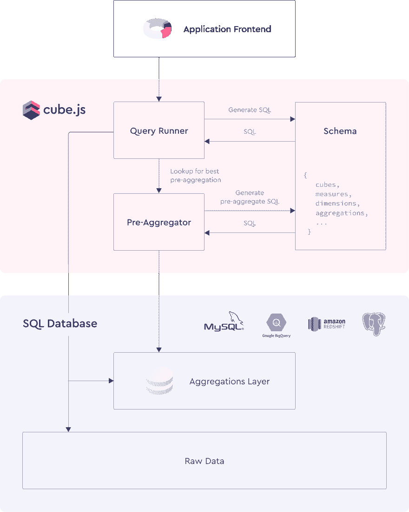

# 使用 Cube.js 预聚合的高性能数据分析

> 原文：<https://dev.to/cubejs/high-performance-data-analytics-with-cube-js-pre-aggregations-3305>

这是一个高级教程。如果你刚刚开始使用 Cube.js，我建议你先查看[这个教程](https://cube.dev/blog/cubejs-open-source-dashboard-framework-ultimate-guide/)，然后再回到这里。

[Cube.js](https://github.com/cube-js/cube.js) 最强大的特性之一是预聚合。与[数据模式相结合，](https://cube.dev/docs/getting-started-cubejs-schema)它消除了在使用 Cube.js 之前对数据进行组织、反规范化和转换的需要。预聚合引擎在运行时在您的数据库中构建一个聚合数据层，并保持其最新。

[](https://res.cloudinary.com/practicaldev/image/fetch/s--_LCBno3t--/c_limit%2Cf_auto%2Cfl_progressive%2Cq_auto%2Cw_880/https://raw.githubusercontent.com/statsbotco/cube.js/master/docs/pre-aggregations-schema.png)

在收到请求时，Cube.js 将首先查找相关的预聚合。如果找不到，它将建立一个新的。一旦构建了预聚合，所有后续请求都将转到预聚合层，而不是访问原始数据。它可以将响应时间提高几百倍甚至几千倍。

预聚合是作为表保存的物化查询结果。为了开始使用预聚合，Cube.js 应该对存储预聚合表的`stb_pre_aggregations`模式具有写访问权限。

Cube.js 还负责保持预聚合是最新的。它会执行刷新检查，如果发现预聚合已过时，它会安排在后台进行刷新。

## 创建简单的预聚合

让我们看一下如何使用预聚合来提高查询性能的例子。

出于测试目的，我们将使用 Postgres 数据库，并使用 [generate_series](https://www.postgresql.org/docs/11/functions-srf.html) 函数生成大约一千万条记录。

```
$ createdb cubejs_test 
```

Enter fullscreen mode Exit fullscreen mode

下面的 SQL 创建了一个表`orders`，并将生成的记录样本插入其中。

```
CREATE TABLE orders (
  id SERIAL PRIMARY KEY,
  amount integer,
  created_at timestamp without time zone
);
CREATE INDEX orders_created_at_amount ON orders(created_at, amount);

INSERT INTO orders (created_at, amount)
SELECT 
  created_at, 
  floor((1000 + 500*random())*log(row_number() over())) as amount 
FROM generate_series
  ( '1997-01-01'::date
  , '2017-12-31'::date
  , '1 minutes'::interval) created_at 
```

Enter fullscreen mode Exit fullscreen mode

接下来，如果您没有任何应用程序，请创建一个新的 Cube.js 应用程序。

```
$ npm install -g cube.js
$ cubejs create test-app -d postgres 
```

Enter fullscreen mode Exit fullscreen mode

将项目文件夹中`.env`的内容更改为以下内容。

```
CUBEJS_API_SECRET=SECRET
CUBEJS_DB_TYPE=postgres
CUBEJS_DB_NAME=cubejs_test 
```

Enter fullscreen mode Exit fullscreen mode

最后，为`orders`表生成一个模式并启动 Cube.js 服务器。

```
$  cubejs generate -t orders
$  npm run dev 
```

Enter fullscreen mode Exit fullscreen mode

现在，我们可以向 Cube.js 发送一个查询，将`Orders.count`度量和`Orders.createdAt`时间维度的粒度设置为`month`。

```
curl \
 -H "Authorization: EXAMPLE-API-TOKEN" \
 -G \
 --data-urlencode 'query={
  "measures" : ["Orders.amount"],
  "timeDimensions":[{
    "dimension": "Orders.createdAt", 
    "granularity": "month", 
    "dateRange": ["1997-01-01", "2017-01-01"]
  }]
}' \
 http://localhost:4000/cubejs-api/v1/load 
```

Enter fullscreen mode Exit fullscreen mode

Cube.js 将用 [Continue wait](https://cube.dev/docs/rest-api#prerequisites-continue-wait) 进行响应，因为这个查询需要 5 秒以上的时间来处理。让我们看看 Cube.js 日志，看看 Postgres 执行这个查询到底花了多长时间。

```
Performing query completed:
{  
   "queueSize":2,
   "duration":6514,
   "queryKey":[  
      "
        SELECT   
          date_trunc('month', (orders.created_at::timestamptz at time zone 'UTC')) \"orders.created_at_month\",
          sum(orders.amount) \"orders.amount\" FROM     
            public.orders AS orders 
        WHERE ( 
          orders.created_at >= $1::timestamptz 
          AND   orders.created_at <= $2::timestamptz
        ) 
        GROUP BY 1 
        ORDER BY 1 ASC limit 10000
      ",
      [  
         "2000-01-01T00:00:00Z",
         "2017-01-01T23:59:59Z"
      ],
      []
   ]
} 
```

Enter fullscreen mode Exit fullscreen mode

Postgres 执行上述查询花费了 6，514 毫秒(6.5 秒)。尽管我们在`created_at`和`amount`列上有一个索引，但是在这个特殊的例子中它没有太大的帮助，因为我们几乎查询了所有的日期。如果我们查询一个更小的日期范围，索引会有所帮助，但仍然是几秒钟的事情，而不是几毫秒。

我们可以通过添加预聚合层来显著加快速度。为此，将下面的`preAggregations`块添加到`src/Orders.js` :

```
 preAggregations: {
    amountByCreated: {
      type: `rollup`,
      measureReferences: [amount],
      timeDimensionReference: createdAt,
      granularity: `month`
    }
  } 
```

Enter fullscreen mode Exit fullscreen mode

当同时请求“Orders.amount”度量和“Orders.createdAt”时间维度(粒度为“月”)时，上面的块指示 Cube.js 构建并使用预聚合的[汇总类型](https://cube.dev/docs/pre-aggregations#rollup)。你可以在[文档参考中了解更多关于预聚合选项的信息。](https://cube.dev/docs/pre-aggregations#top)

现在，一旦我们发送相同的请求，Cube.js 将检测预聚合声明并开始构建它。一旦构建完成，它将查询并发回结果。所有后续查询都将转到预聚合层。

以下是查询预聚合在 Cube.js 日志中的样子:

```
Performing query completed: 
{  
   "queueSize":1,
   "duration":5,
   "queryKey":[  
      "
        SELECT \"orders.created_at_month\"  \"orders.created_at_month\", 
          sum(\"orders.amount\") \"orders.amount\" FROM 
          stb_pre_aggregations.orders_amount_by_created
        WHERE ( \"orders.created_at_month\" >= ($1::timestamptz::timestamptz AT TIME ZONE 'UTC') 
          AND \"orders.created_at_month\" <= ($2::timestamptz::timestamptz AT TIME ZONE 'UTC')
        )
        GROUP BY 1 ORDER BY 1 ASC LIMIT 10000
      ",
      [  
         "1995-01-01T00:00:00Z",
         "2017-01-01T23:59:59Z"
      ],
      [
        [
          "
            CREATE TABLE 
                stb_pre_aggregations.orders_amount_by_created 
            AS SELECT
                date_trunc('month', (orders.created_at::timestamptz AT TIME ZONE 'UTC')) \"orders.created_at_month\", 
                sum(orders.amount) \"orders.amount\" FROM
                public.orders AS orders  
            GROUP BY 1
          ",
          []
        ]
      ]
   ]
} 
```

Enter fullscreen mode Exit fullscreen mode

如你所见，现在只需要 5 毫秒(快了 1300 倍)就可以获得相同的数据。
此外，您可以注意到 SQL 已经更改，现在它查询来自`stb_pre_aggregations.orders_amount_by_created`的数据，这是由 Cube.js 生成的表，用于存储该查询的预聚合。第二个查询是这个预聚合表的 DDL 语句。

## 预聚合刷新

Cube.js 还负责保持预聚合最新。每两分钟一个新的请求 Cube.js 将启动刷新检查。

您可以使用 [refreshKey](https://cube.dev/docs/pre-aggregations#refresh-key) 设置自定义刷新检查策略。默认情况下，预聚合每小时刷新一次。

如果刷新检查的结果与上次不同，Cube.js 将在后台启动预聚合的重建，然后热交换旧的结果。

## 下一步

本指南是了解预聚合以及如何在项目中开始使用它们的第一步。但是你可以用它们做更多的事情。[您可以在这里找到预聚合文档参考。](https://cube.dev/docs/pre-aggregations#top)

此外，这里有一些有用的链接，可以帮助你一路走来。

### 跨多个多维数据集预聚合查询

预聚合不仅适用于单个多维数据集中的度量值和维度，也适用于多个联接的多维数据集中的度量值和维度。如果您有[连接的多维数据集，](https://cube.dev/docs/joins)您可以从连接树的任何部分引用度量和维度。下面的例子显示了如何将`Users.country`尺寸用于`Orders.count`和`Orders.revenue`测量。

```
cube(`Orders`, {
  sql: `select * from orders`,

  joins: {
    Users: {
      relationship: `belongsTo`,
      sql: `${CUBE}.user_id = ${Users}.id`
    }
  },

  // …

  preAggregations: {
    categoryAndDate: {
      type: `rollup`,
      measureReferences: [count, revenue],
      dimensionReferences: [Users.country],
      timeDimensionReference: createdAt,
      granularity: `day`
    }
  }
}); 
```

Enter fullscreen mode Exit fullscreen mode

### 动态生成预聚合

由于预聚合是数据模式的一部分，而数据模式基本上是一段 Javascript 代码，因此您可以动态创建所有需要的预聚合。本指南介绍了如何动态生成 Cube.js 模式。

### 时间分区

您可以使用`partitionGranularity`选项指示 Cube.js 按时间划分预聚合。Cube.js 不会为整个预聚合生成单个表，而是一组更小的表。例如，在 BigQuery 的情况下，它可以减少刷新时间和成本。

[时间划分文档参考。](https://cube.dev/docs/pre-aggregations#rollup-time-partitioning)

```
 preAggregations: {
    categoryAndDate: {
      type: `rollup`,
      measureReferences: [count],
      timeDimensionReference: createdAt,
      granularity: `day`,
      partitionGranularity: `month`
    }
  } 
```

Enter fullscreen mode Exit fullscreen mode

### 数据立方体点阵

Cube.js 可以自动构建汇总预聚合，而无需指定要使用的度量和维度。它从查询历史中学习，并为给定的查询选择一组最佳的度量和维度。在幕后，它使用了[数据立方体网格方法。](https://web.eecs.umich.edu/~jag/eecs584/papers/implementing_data_cube.pdf)

如果您需要大量的预聚合，并且事先不知道具体是哪些预聚合，那么这将非常有用。使用`autoRollup`将使您免于手动编码所有可能的聚合。

你可以在这里找到自动汇总的文档。

```
cube(`Orders`, {
  sql: `select * from orders`,

  preAggregations: {
    main: {
      type: `autoRollup`
    }
  }
}); 
```

Enter fullscreen mode Exit fullscreen mode