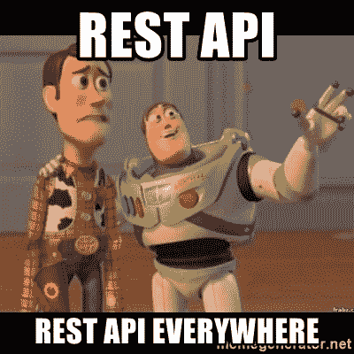

# 5 分钟内用节点和 Express 休息 API

> 原文：<https://dev.to/lennythedev/quick-rest-api-with-node-and-express-in-5-minutes-336j>

*Node+Express 系列第二部分*

现在我们有了来自[第一部分](https://dev.to/lenmorld/quick-server-with-node-and-express-in-5-minutes-17m7)
的第一个 Node + Express 服务器，我们可以休息一下了！

安息吧🛌😴？？？
不是其他，而是 **REST** (表述性状态转移)，它基本上是通过 HTTP 方法向客户端提供一个 API。

[](https://res.cloudinary.com/practicaldev/image/fetch/s--GKk-_wE5--/c_limit%2Cf_auto%2Cfl_progressive%2Cq_auto%2Cw_880/https://memegenerator.net/img/instances/400x/66287620/rest-api-rest-api-everywhere.jpg)

**剧透警报**😱😜
我们可以将 CRUD 这样的基本操作映射到某些 HTTP 方法。
如果你不喜欢剧透或者看表格会让你困惑，请跳过😵。

| CRUD 操作 | HTTP 方法 | 统一资源定位器 | URL params | 请求正文 | 例子 |
| --- | --- | --- | --- | --- | --- |
| 创造 | 邮政 | `/items` |  | `body: {...}` | `POST /items body: {...}` |
| 红色的 | 得到 | `/items/:id` | `:id`(项目 id) |  | `GET /items/123` |
| 亲爱的大家 | 得到 | `/items` |  |  | `GET /items` |
| 更新 | 放 | `/items/:id` | `:id`(项目 id) | `body: {...}` | `PUT /items/123 body:{...}` |
| 删除 | 删除 | `/items/:id` | `:id`(项目 id) |  | `DELETE /items/123` |

请注意，这是一种常见的方式，但是您也可以实现，比如说 POST for UPDATE 和 DELETE。查看休息中的[幂等性](https://restfulapi.net/idempotent-rest-apis/)以了解详细信息。

## 我们开始吧！

### 样本数据

首先，我们需要一些样本数据。让我们用一些电影🎞️在 IMDB 的前 250 名中，因为我的电影选择可能不可靠🤪

创建`data.js`文件。请随意添加项目和项目细节。

```
// data.js
module.exports = [
    { "id": "tt0110357", "name": "The Lion King", "genre": "animation"},
    { "id": "tt0068646", "name": "The Godfather", "genre": "crime"},
    { "id": "tt0468569", "name": "The Dark Knight", "genre": "action"},
]; 
```

Enter fullscreen mode Exit fullscreen mode

> 向其他文件公开该数组

在我们的`server.js`文件
中导入文件

```
// server.js
let data = require('./data');
...

// our API routes go here 
```

Enter fullscreen mode Exit fullscreen mode

## 得到

获取所有物品
*获取/物品*

```
server.get("/items", (req, res) => {
   res.json(data);
}); 
```

Enter fullscreen mode Exit fullscreen mode

获取一个由`:id`
*标识的项目 GET /items/:id*

我们使用`Array.find`获取第一个符合条件的条目，如果没有找到，
则显示一条消息。

注意，项目 id 是一个字符串，例如`tt0110357`，所以我们可以直接使用`===`进行比较。
如果你使用一个整数 id，你必须在比较前解析。

```
server.get("/items/:id", (req, res) => {
   const itemId = req.params.id;
   const item = data.find(_item => _item.id === itemId);

   if (item) {
      res.json(item);
   } else {
      res.json({ message: `item ${itemId} doesn't exist`})
   }
}); 
```

Enter fullscreen mode Exit fullscreen mode

```
$ curl http://localhost:4000/items
[{"id":"tt0110357","name":"The Lion King","genre":"animation"},{"id":"tt0068646","name":"The Godfather","genre":"crime"},{"id":"tt0468569","name":"The Dark Knight","genre":"action"}]

$ curl http://localhost:4000/items/tt0110357
{"id":"tt0110357","name":"The Lion King","genre":"animation"}

$ curl http://localhost:4000/items/blahblah
{"message":"item blahblah doesn't exist"} 
```

Enter fullscreen mode Exit fullscreen mode

## 岗位

为了在 POST 消息中编码客户端发送的请求主体，我们需要`body-parser`中间件。
这允许我们在路由处理器
中使用`req.body`

```
npm install body-parser 
```

Enter fullscreen mode Exit fullscreen mode

然后我们进口使用。我们现在只接受 JSON 编码的主体。

```
// server.js

const body_parser = require('body-parser');

// parse JSON (application/json content-type)
server.use(body_parser.json()); 
```

Enter fullscreen mode Exit fullscreen mode

张贴一个项目
*张贴/项目*

这里，我们从`req.body`获取整个项目，因为它与我们的数据
相匹配，但是请注意，也可以只获取，例如`req.body.name`

```
// server.js

...
server.post("/items", (req, res) => {
   const item = req.body;
   console.log('Adding new item: ', item);

   // add new item to array
   data.push(item)

   // return updated list
   res.json(data);
}); 
```

Enter fullscreen mode Exit fullscreen mode

```
$ curl -X POST -H "Content-Type: application/json" --data '{"id": "tt0109830", "name": "Forrest Gump", "genre": "drama"}' http://localhost:4000/items

[..., {"id":"tt0109830","name":"Forrest Gump","genre":"drama"}] 
```

Enter fullscreen mode Exit fullscreen mode

## 放

要更新一个项目，我们希望客户端在 URL 参数(`req.params.id` )
中传递项目 id，并在主体(`req.body`)中传递更新的对象

这里我们简单地使用`forEach`替换旧的，但是您可以应用您自己的
算法来替换对象数组中的一个对象或一个对象的属性。

```
 // update an item
server.put("/items/:id", (req, res) => {
   const itemId = req.params.id;
   const item = req.body;
   console.log("Editing item: ", itemId, " to be ", item);

   const updatedListItems = [];
   // loop through list to find and replace one item
   data.forEach(oldItem => {
      if (oldItem.id === itemId) {
         updatedListItems.push(item);
      } else {
         updatedListItems.push(oldItem);
      }
   });

   // replace old list with new one
   data = updatedListItems;

   res.json(data);
}); 
```

Enter fullscreen mode Exit fullscreen mode

假设你真的认为《黑暗骑士》是一部剧😢不是行动，...

```
$ curl -X PUT -H "Content-Type: application/json" --data '{"id": "tt0468569", "name": "The Dark Knight", "genre": "drama"}' http://localhost:4000/items/tt0468569

...{"id":"tt0468569","name":"The Dark Knight","genre":"drama"}... 
```

Enter fullscreen mode Exit fullscreen mode

[](https://i.giphy.com/media/otP85UTRethni/giphy.gif)

## 删除

最后，对于删除，我们只需要来自客户端的`id` URL 参数。
我们过滤数组，排除要删除的项目。

```
// delete item from list
server.delete("/items/:id", (req, res) => {
   const itemId = req.params.id;

   console.log("Delete item with id: ", itemId);

   // filter list copy, by excluding item to delete
   const filtered_list = data.filter(item => item.id !== itemId);

   // replace old list with new one
   data = filtered_list;

   res.json(data);
}); 
```

Enter fullscreen mode Exit fullscreen mode

```
$ curl -X DELETE http://localhost:4000/items/tt0468569

[{"id":"tt0110357","name":"The Lion King","genre":"animation"},{"id":"tt0068646","name":"The Godfather","genre":"crime"}] 
```

Enter fullscreen mode Exit fullscreen mode

### 完成本环节的代码

[带节点+ Express 的快速休息 API](https://github.com/lenmorld/devto_posts/tree/master/quick_node_express)

[](https://i.giphy.com/media/gGuOldphm6vzW/source.gif)

## “好的，很好。但是我能用这个做什么呢？”

再添加一些 CRUD 路径，您就有了一个很好的面向客户的 REST API！

但是，您可能已经注意到，当服务器重新启动时，这些更改还没有持久化。😱

我们将在关于文件读/写和 MongoDB 的后续文章中讨论这一点。敬请关注。

## 接下来:

## 文章不再可用

这篇文章是我正在撰写的 Node+Express 系列文章的一部分。

与此同时，如果您对 Node+Express 还不满意🤓，
查看我的节点研讨会(Gihub repo 和幻灯片):

## /[节点 _ 车间](https://github.com/lenmorld/node_workshop)

### 使用 Node、Express 和 MongoDB 为您的下一个 web 应用程序构建服务器和 API

<article class="markdown-body entry-content container-lg" itemprop="text">

# 节点车间

> 为您的下一个 web 应用程序创建一个 server + REST API！

在本次研讨会中，我们将讨论概念并通过活动将它们付诸实践，所有这些都是关于 web 服务器的。这里的代码和概念将是您下一个 web 项目的良好基础。主题包括但不限于:

*   使用 Node 和 Express 构建 web 服务器和 REST API
*   了解路由、请求和响应
*   用 HTTP 方法实现 CRUD
*   使用模板构建服务器渲染的网站
*   连接到云 NoSQL 数据库:MongoDB Atlas DB
*   使用会话、cookies 和令牌进行用户身份验证
*   使用外部 API，如 Github Jobs、Giphy、Spotify

## 以前的事件

*   [节点研讨会-2020 年 8 月 27 日](https://www.facebook.com/events/1125391177830448/)

    *   [欠邮](https://dev.to/lennythedev/node-workshop-free-online-workshop-by-scs-concordia-3dc5)
*   [节点研讨会-2020 年 7 月 16 日](https://www.facebook.com/events/751112552346326/)

    *   [欠邮](https://dev.to/lennythedev/node-workshop-part-2-free-online-workshop-by-scs-concordia-4e37)

# 材料

预览幻灯片: [Google Drive 文档](https://drive.google.com/file/d/11-HTDPgCY-ZNEIqddwQbn_4PDCa14C2R/view?usp=sharing)

素材:[观念链接](https://www.notion.so/lennythedev/Node-workshop-Homepage-56f2822d63e549b286c76102e6ea6b28)

# 密码

### 参加研讨会:

```
$ git checkout dev
$ node server.js 
```

### 到最新开发

```
$ git checkout master

$
```

…</article>

[View on GitHub](https://github.com/lenmorld/node_workshop)

Here we discussed:

*   使用节点和 Express
*   路由、请求和响应
*   构建 REST API
*   服务器呈现的模板
*   连接到 NoSQL (mongo)数据库
*   使用外部 API，如 Spotify
*   还有更多！

* * *

发球快乐！

现在，是时候好好休息一下了。
别忘了多买些！🛌😴

[](https://i.giphy.com/media/6Umkh0GwRYhfG/giphy.gif)