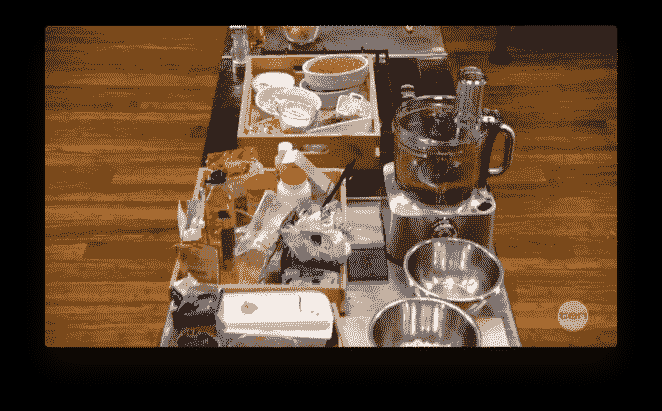

# 像厨师一样编码

> 原文：<https://dev.to/mokagio/code-like-a-chef-3955>

这是我的博客[mokacoding.com](https://www.mokacoding.com/blog/code-like-a-chef/)的一篇交叉文章。

在这期精彩的 Ruby 测试播客中，主持人 T2 和 T4 讨论了 TDD 和重构。除此之外，他们还对编码和烹饪进行了比较。干净的工作空间对这两种职业都很有价值。

烹饪的比喻引起了我的共鸣。我妻子是烹饪节目的超级粉丝，所以我也看了不少。她最喜欢的是[澳洲厨艺大师](https://tenplay.com.au/channel-ten/masterchef)。在 2015 赛季的大结局中，两位参赛者的最后一项挑战是重现由[赫斯顿·布鲁门塔尔](https://en.wikipedia.org/wiki/Heston_Blumenthal)设计的甜点。

在测试过程中，赫斯顿走向决赛选手乔治亚，她开始感到压力，并告诉她:

> 如果你不小心的话，你最终会变得如此混乱，以至于最终你会被赶上。

乔治亚最终输掉了决赛，她的菜和另一位选手比莉不在一个水平上。有趣的是，在整个赛季中，特别是在这最后一关，比莉很冷静，也很有条理。她给赫斯顿留下了深刻的印象，以至于在这一集的结尾，他当场给了她一份工作。

在同一期《厨艺大师》的早些时候，安娜·波洛伊维奥也谈到了整洁的价值。
在她的*压力测试*挑战中，她一直推着选手费欧娜保持她的工作台干净:

> 不是给我的，是给你的。因为它会影响你的最终产品。

菲奥娜接着为自己辩护说:

> 当然，我的长凳很乱，但我真的没有时间打扫，我需要组装蛋糕。

菲奥娜输了比赛，回家了。

比较菲奥娜和乔治亚与主厨和厨艺大师评委[加里梅希根](https://en.wikipedia.org/wiki/Gary_Mehigan)。当加里在一个节目*的大师班*做饭时，你可以看到他几乎是强迫性地擦拭长凳，保持它一尘不染。

## 保持你的板凳干净！

“保持你的工作台干净”原则在构建软件时和在烹饪菜肴时一样有效。

如果你的代码库杂乱无章，完成任务会越来越难。你将花时间破译不可读的代码，滚动通过无尽的文件，浏览深层文件夹层次结构。你的工作站也是如此。如果你的电脑和桌子不整洁，上面所有不必要的东西都会吸引你的注意力，让你更难找到你想要的东西。

我们如何保持我们的长凳干净？这是一个小习惯的问题。这里有一些。

## 先清理

在播客中 Jason 和 Chris 的烹饪之旅中，Chris 提到了他是多么喜欢这种 [mise en place](https://en.wikipedia.org/wiki/Mise_en_place) 烹饪技术，即事先准备好一道菜的所有食材，并把它们放在碗里。

当处理代码时，在开始特性工作之前花时间清理你将要接触的区域*可以节省你之后的时间。用[肯特·贝克的话说](https://twitter.com/KentBeck/status/250733358307500032)“对于每一个想要的改变，让改变变得容易(警告:这可能很难)，然后做出容易的改变。”*

## 找到不用的代码就删除

未使用的代码会降低您的速度。保存未使用的代码对你的项目的影响就像永远不要扔掉任何东西对你的房子的影响一样，它会让你的房子变得凌乱不堪。一旦你发现未使用或不必要的代码，你应该删除它。

这有时被称为童子军规则,*总是让露营地比你发现它的时候更干净。*“如果你发现地上一片狼藉，你会清理干净，不管是谁弄的。

当您删除未使用的代码时，您应该在专用的提交中执行更改，这将我们带到下一个技巧。

## 做小原子提交

原子提交只做一件事，即构建代码和通过测试。原子提交非常棒，因为它们使代码库处于稳定状态。如果您签出一个，您将能够立即运行该软件。它们也很容易恢复，因为它们所做的更改是孤立和独立的。

除了保持提交的原子性之外，还要尽量保持它们的小。提交和存储成本都很低。能够看着一个提交，并在脑海中适应它所做的一切，这是更有价值的。

变量重命名可以是专用的提交。缩进修复可以是专用的提交。
打字错误修复可以是专门的提交。

将这些清理更改保存在专用提交中还可以更容易地查看拉请求中其他提交的差异，因为它们不会受到干扰。

## 从不提交注释代码

注释代码毫无理由地扰乱了你的代码库。这使得浏览文件变得更加困难，并且在进行文本搜索时会产生误报。

如果一个内心的声音低声说“你可能以后会需要它”，对着它尖叫“ [YAGNI](https://en.wikipedia.org/wiki/You_aren%27t_gonna_need_it) ”。

另外，即使你删除了那段代码，Git 也会记住的。不要注释代码，在一个专用的原子提交中删除它，用一个清晰的标题和一条解释你为什么删除它的消息。如果你真的觉得你需要再次使用它[标记提交](https://git-scm.com/book/en/v2/Git-Basics-Tagging)，或者在某个地方写它的 [SHA](https://schacon.github.io/gitbook/1_the_git_object_model.html) 。
Git 会帮你保存到那时候。

## 保持你的方法、类和文件简短

在[干净代码](https://geni.us/cz8vB5)中，鲍勃大叔写道:

> 函数的第一条规则是它们应该很小。函数的第二个规则是*它们应该比*小。

他建议函数“不要超过 20 行”

干净的代码是用 Java 编写的。取决于你使用的语言，20 行可能会很长。事实上，一些 Ruby 开发者甚至遵循[更严格的规则](https://robots.thoughtbot.com/sandi-metz-rules-for-developers)，这些规则[桑迪·梅茨](http://www.sandimetz.com/)曾经推荐给一个试图超越他们遗留代码库的团队。

*   类不能超过一百行代码。
*   方法不能超过五行代码。
*   向一个方法传递不超过四个参数。哈希选项是参数。
*   控制器只能实例化一个对象。因此，视图只能知道一个实例变量，并且视图应该只向该对象发送消息(`@object.collaborator.value`是不允许的)。

小函数和对象的好处是它们更容易阅读、推理和移动。我宁愿[跳过](http://xcodetips.com/tips/ctrl-cmd-j-jump-to-definition.html)许多更容易操作的小功能，而不是在阅读一个长代码时，让我的大脑费力地试图在工作记忆中保存几十行代码。

## 使用样式向导

让代码遵循一个风格指南会使编写和阅读变得更容易。开发人员不必考虑大括号放在哪里，或者应该使用多少换行符来分隔代码块。

代码库的风格越相似，使用起来就越容易。如果所有的代码看起来都一样，你就不必花时间在不同的风格之间转换，而是能够直接理解代码做什么。

风格指南非常适合这一点。它们还消除了在代码评审期间就代码看起来如何进行对话的需要。如果它不遵循风格指南，它应该被改变。如果开发人员认为风格指南中的某个规则可以改进，他们可以在风格指南中创建一个公关案例。

大多数编程语言都有 linters，可以按照特定的风格规则自动执行代码检入过程。像 [Hound CI](https://www.houndci.com/) 这样的工具可以在违反样式指南规则时自动在 pull 请求中进行注释。

你知道什么比在你的工作流程中集成一个 linter 更好吗？
使用自动格式化程序，比如[更漂亮的](https://prettier.io/)。这种工具获取您编写的代码，并通过应用给定的样式指南对其进行重新格式化。

我喜欢 linters 和 formatters，因为它们帮助我坚持一个风格指南，而不必一次记住所有内容。我不相信我的大脑，我能卸下的越多越好。

* * *

对于软件开发人员来说，照看代码库就像厨师保持工作台清洁一样重要。最好的厨师对他们工作场所的状况一丝不苟。我们应该采用同样的纪律。

软件开发人员有一个在厨房工作的人没有的额外挑战。一个凌乱的工作台对肉眼来说是显而易见的，一个混乱的代码库不会立即转化为一个混乱的用户界面。更难理解保持代码整洁的价值。然而，随着时间的推移，一个凌乱的代码库对你来说将是灾难性的，就像混乱的长椅对 Fiona 和 Georgia 一样。

*这篇文章最初写于 2015 年 8 月，之后一直在编辑和更新。*