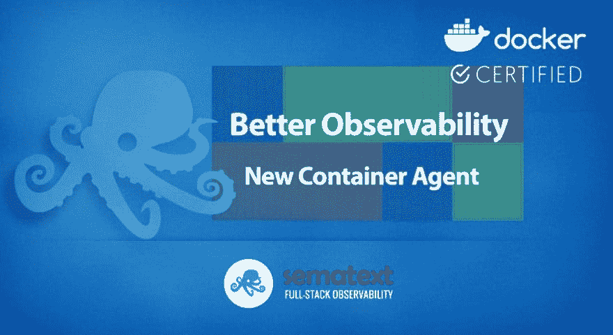
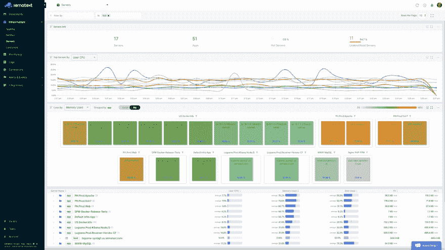
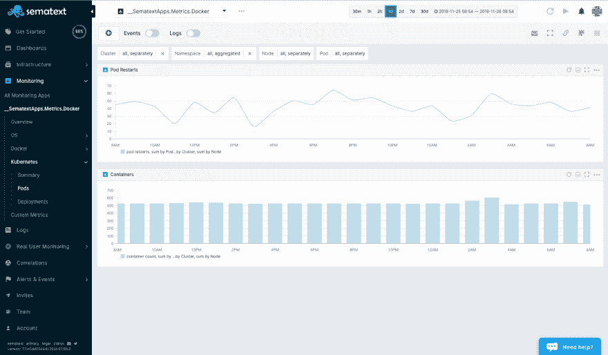
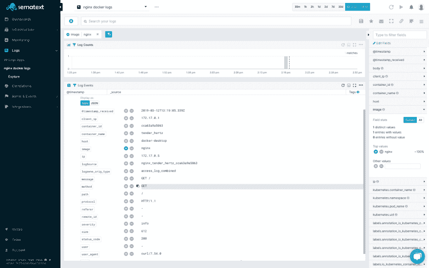
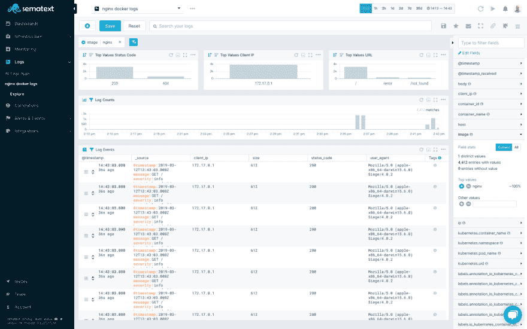
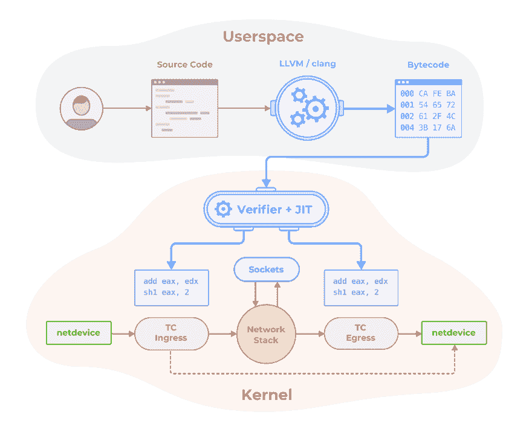
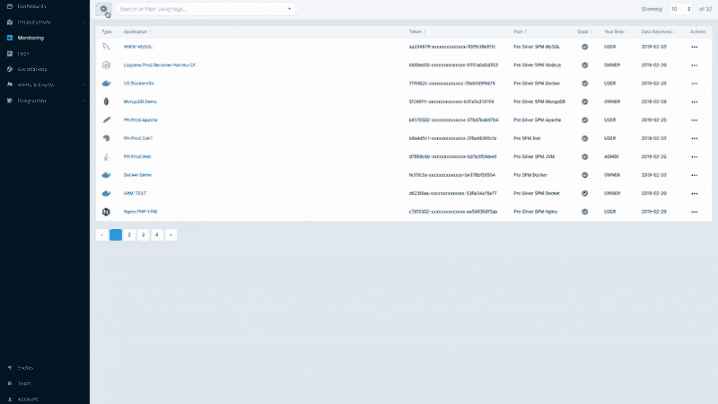

# 新容器代理具有更好的可观察性

> 原文：<https://dev.to/sematext/better-observability-with-new-container-agents-16c>

[](https://res.cloudinary.com/practicaldev/image/fetch/s--Qen8oCXr--/c_limit%2Cf_auto%2Cfl_progressive%2Cq_auto%2Cw_880/https://sematext.com/wp-content/uploads/2019/04/V2_better-observability-new-monitoring-agent-FI-1024x560.jpg)

## 为什么要换一个新的码头工人代理？

如果你喜欢 Sematext Docker 代理，你会喜欢我们新的 Docker 监控代理，它可以让你更深入地了解你的 Docker、Kubernetes 和 Swarm 集群。由于其功能强大、占用空间小以及易于安装，旧的 Sematext Docker 代理受到了 Docker DevOps 社区的广泛采用。

一个一体化的 Docker 监控工具，自 2015 年以来一直由 Docker 认证，它可以[监控所有关键的 Docker 指标](https://sematext.com/blog/top-docker-metrics-to-watch/)，容器事件，以及[收集和解析日志](https://sematext.com/docs/logagent/parser/)。然而，容器技术正在快速发展——Docker Enterprise 和 Kubernetes 越来越受欢迎，像谷歌 GKE 这样的云容器平台也是如此。是时候更新了。只不过，我们不只是更新了它。我们改写了它，使它变得更小、更模块化、更强大。新的 Sematext 代理不仅可以监控 Docker 容器，还可以查看容器内部。它拥有[一流的 Kubernetes 监控](https://sematext.com/blog/streamlined-kubernetes-cluster-agent/)支持和[内核追踪](https://sematext.com/blog/linux-kernel-observability-ebpf/)能力，都具有超低的 CPU 和内存占用。

为了更好地满足高级监控和高级日志功能的需求，我们将代理一分为二。这使得每个特定用例的发布周期更快，部署更容易——包括容器化的架构和编排工具。有两个独立的映像，但重要的是，您仍然可以通过 Kubernetes 上的 Helm 从单一部署中受益。

以下新图像取代了旧的 Sematext Docker 代理:

*   [sema text/agent](https://hub.docker.com/r/sematext/agent)–容器监控、基础设施监控、集群监控以及来自容器引擎和编排工具的事件
*   [sema text/log agent](https://hub.docker.com/r/sematext/logagent/)–容器的日志收集、日志解析、日志丰富和日志传送
*   两幅图像都经过 [Docker 认证](https://hub.docker.com/publishers/sematext)

与新的监控代理一起，我们引入了新的仪表板来显示收集的数据，如[容器基础设施监控](https://sematext.com/blog/docker-container-monitoring-with-sematext/)和 Kubernetes 集群指标。

[](https://res.cloudinary.com/practicaldev/image/fetch/s--QRjE3bbF--/c_limit%2Cf_auto%2Cfl_progressive%2Cq_auto%2Cw_880/https://sematext.com/wp-content/uploads/2019/04/server-monitoring-2-1.png)

*使用热图监控集装箱*

[](https://res.cloudinary.com/practicaldev/image/fetch/s--gIWIXYiT--/c_limit%2Cf_auto%2Cfl_progressive%2Cq_auto%2Cw_880/https://sematext.com/wp-content/uploads/2019/04/Screen-Shot-2018-11-26-at-14.55.15.png)

*Kubernetes 仪表板—*跟踪部署状态和 Pod 随时间的重新启动

那么下面就给大家介绍一下 sema text/log agent & sema text/agent。

## 用 Logagent 处理容器日志

[Logagent](https://sematext.com/logagent/) 是一个通用的开源日志发送器。[日志代理 Docker 镜像](https://hub.docker.com/_/logagent)是为容器平台上的[日志收集预先配置的。它在每个 Docker 主机上作为一个小容器运行，并收集所有集群节点及其容器的日志。所有容器日志都增加了 Kubernetes、Docker Enterprise 和 Docker Swarm 元数据。](https://sematext.com/blog/docker-container-monitoring-with-sematext/#toc-container-logs-0)

Logagent 的部署与 Sematext Docker 代理的部署非常相似，并且完全兼容其针对日志的所有[配置选项。](https://sematext.com/docs/logagent/installation-docker/#configuration-parameters)[日志解析器模式](https://sematext.com/docs/logagent/parser/)的格式也保持不变。Logagent 和它的前身一样，开箱即可识别各种应用程序/官方图像的日志格式。

下面的小例子展示了在 Sematext 中部署 Logagent、运行 web 服务器和获取 web 分析的结构化 web 服务器日志是多么容易。

```
 # Start Logagent
docker run -d --restart=always -e LOGS_TOKEN=YourLogsToken \
-v /var/run/docker.sock:/var/run/docker.socksematext/logagent
# Start Nginx web server
docker run -d -p 8081:80 nginx
# Access the web server
curl http://127.0.0.1:8081 
```

几秒钟后，我们在 Sematext 中看到结果，这是一个漂亮的结构化 web 服务器日志，包含容器元数据。

[](https://res.cloudinary.com/practicaldev/image/fetch/s--DFtpkNvu--/c_limit%2Cf_auto%2Cfl_progressive%2Cq_auto%2Cw_880/https://sematext.com/wp-content/uploads/2019/04/Screen-Shot-2019-03-12-at-14.35.26.png)

*带有容器元数据的结构化 web 服务器日志*

只需点击几下，我们就可以添加小部件来创建 web 服务器日志仪表板，显示热门 IP 地址和热门 URL 或容器。

[](https://res.cloudinary.com/practicaldev/image/fetch/s--r7DRAqVK--/c_limit%2Cf_auto%2Cfl_progressive%2Cq_auto%2Cw_880/https://sematext.com/wp-content/uploads/2019/04/Screen-Shot-2019-03-12-at-14.43.56.png)

*Sematext UI，包含各种日志字段的前 N 个小部件*

这对于日志来说很容易，所以让我们来看看新的 Docker 监控代理。

## 用语义代理监控容器

[Sematext Agent](https://sematext.com/docs/containers/sematext-agent/) 收集关于主机(CPU、内存、磁盘、网络、进程)、容器和 orchestrator 平台的指标，并将其发送到 [Sematext Cloud](https://sematext.com/cloud) 。为了深入了解 Linux 内核，Sematext 代理依赖 eBPF 在内核函数上植入插装点(将 eBPF 程序附加到 kprobes 上)。使用 Linux 内核工具使 Sematext 代理成为一种非常有效和强大的系统探测方法。它能够自动发现部署在物理机、虚拟主机和容器上的服务，以及收集[基础设施清单](https://sematext.com/inventory-monitoring)信息的机制。它还收集来自不同来源的事件，如 OOM 通知、容器或 Kubernetes 事件。

收集的大量信息为您提供了应用、服务和基础设施的完整堆栈可观察性，这些信息整齐地组织在仪表板中，用于[基础设施监控](https://sematext.com/spm)、[集装箱监控](https://sematext.com/docker)和 [Kubernetes 集群监控](https://sematext.com/kubernetes)。

### **用 eBPF 进行内核追踪**

许多传统的监控代理基于定期运行的检查。这种检查运行脚本，甚至可能使用类似“ps -efa”的命令来发现正在运行的进程。定期检查有几个缺点。例如，定期检查可能会遗漏短期运行的流程。根据检查的频率，他们有自己的开销。另一方面，使用 eBPF 的 Linux 内核可观察性可以跟踪用户空间中的任何内核函数调用。使用 eBPF 可以自动发现新流程，而无需定期检查。eBPF 能做的还有很多。例如，它还可以发现所有进程(包括容器)的任何文件系统更改或网络活动。

[](https://res.cloudinary.com/practicaldev/image/fetch/s--uRDyfgqw--/c_limit%2Cf_auto%2Cfl_progressive%2Cq_auto%2Cw_880/https://sematext.com/wp-content/uploads/2019/04/image8.png)

*eBPF 架构——来源:**[https://github.com/cilium/cilium/](https://github.com/cilium/cilium/#what-is-ebpf-and-xdp)*

新的语义代理大量使用 eBPF 来自动发现进程及其活动。要做到这一点，Sematext 代理在内核的各个钩子点附加字节码来检测:

——进程的创建和终止

*   套接字监听/接受
*   信号
*   内存不足错误
*   文件系统活动

因为 eBPF 在较旧的 Linux 内核中不可用，所以代理还具有回退机制，如轮询/procfs。如果您想知道 eBPF 在您的机器上是否可用，可以看看 Sematext 中新的[库存监控](https://sematext.com/inventory-monitoring)，因为它显示了您的基础设施中使用的所有 Linux 内核版本。

### **低 CPU &内存占用**

节省云资源是每个将应用程序部署到云的公司的热门话题。对于任何想要在当今市场上保持竞争力的公司来说，降低成本都是必须的。我们非常清楚这一点，因为我们是一个完全自力更生、注重成本的组织。Sematext 代理是一个本机二进制文件。因此，它没有 JVM、Ruby、Python 等运行时环境的开销。此外，我们在分析和最小化 Sematext 代理内存和 CPU 占用方面做了大量工作，使它在您的基础设施上运行时几乎不可见。

### **集装箱和 Kubernetes 监控**

集装箱监控新代理的优势是什么？

首先，Docker 远程 API 仅限于 Docker 环境，而 Kubernetes 是最流行的编排工具。此外，市场上越来越多的替代容器运行时可用。因此，新的 Sematext 代理采用了一种容器运行时不可知的方法来监控容器。

*   容器运行时不可知的发现和监控
    *   自动容器发现
    *   支持[码头](https://www.docker.com/)和[码头](https://github.com/rkt/rkt)集装箱发动机
*   容器指标
    *   CPU 使用率
    *   磁盘空间使用和 IO 统计
    *   内存使用、内存限制和内存失败计数器
    *   网络 IO 统计
*   主机清单信息
    *   主机内核版本和其他系统信息，如发行版、架构、CPU 数量等。
    *   关于已安装软件包的信息
*   容器元数据
    *   容器名称
    *   映像名
    *   集装箱网络
    *   集装箱容积
    *   集装箱环境
    *   包含业务流程相关信息的容器标签
    *   Kubernetes 元数据，如 Pod 名称、UUID、名称空间
    *   Docker 群组元数据，例如服务名称、群组任务等。
*   容器事件的集合
    *   Docker 事件，如启动/停止/芯片/卷安装等。
    *   Kubernetes 事件，如部署、销毁等 Pod 状态更改。
*   随着时间的推移跟踪部署状态和 Pod 重启
*   CPU 使用率、内存使用率和磁盘 IO 等流程指标

让我们看看 Sematext 代理是如何部署的。

### 语义代理入门

要运行 Sematext 代理，您需要一个 Docker 应用程序令牌。如果你还没有任何 Docker 应用，你可以[现在](https://apps.sematext.com/ui/integrations)创建一个。

sema text UI[显示 Docker、Docker Enterprise/Swarm、Kubernetes DaemonSets 或 Helm charts 的各种部署方式的复制和粘贴指令](https://apps.sematext.com/ui/howto/docker/overview)。

[](https://res.cloudinary.com/practicaldev/image/fetch/s--kWiDolk1--/c_limit%2Cf_auto%2Cfl_progressive%2Cq_66%2Cw_880/https://sematext.com/wp-content/uploads/2019/04/ezgif-4-9c0c90a37622-1.gif)

[Sematext 代理文档](https://sematext.com/docs/containers/sematext-agent/)包含所有配置选项。过一会儿，你会在基础设施监控、Docker 和 Kubernetes 报告中看到集装箱信息。

## **迁徙**

当迁移到新代理时，您可以通过首先删除旧代理，然后快速设置新代理来进行简单的“几乎就地替换”。在删除旧的 Sematext Docker 代理和设置新的代理之间，这可能会导致您的度量和日志中出现一些间隙，但是切换到新的代理应该只需要几分钟。如果这种短暂的数据间隔是不可接受的，但一点数据重复是可以接受的，那么您可以改变操作的顺序-首先设置新的代理，然后删除旧的代理。

请阅读带有 Sematext 的 [Monitoring Docker，它显示了所有详细信息、代理部署的有用选项、日志搜索提示、警报规则定义等。](https://sematext.com/blog/docker-container-monitoring-with-sematext/)

## **近期还有什么计划？**

新的 Sematext 代理能够自动发现容器内部的运行。一旦发现的服务在 Sematext 中公开，Sematext 代理将使您能够无缝地开始监控您在容器中运行的应用程序。自动部署将在裸机和虚拟机服务器、Docker Enterprise 和 Kubernetes 上运行。

Logagent 将增加其受支持的日志格式和插件的[开源存储库](https://github.com/sematext/logagent-js),用于自动日志收集和解析。

新代理包括进程监控和包库存收集功能，这些功能将很快在 Sematext UI 中显示出来，所以如果您还没有新代理，现在是升级 Sematext 代理的好时机！

帖子[与新集装箱代理](https://sematext.com/blog/better-observability-new-container-agents/)更好的可观察性首先出现在[的语义](https://sematext.com)上。