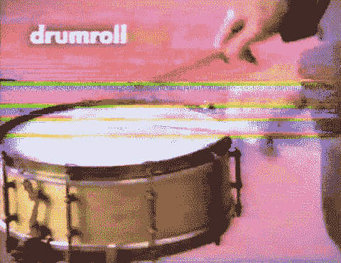
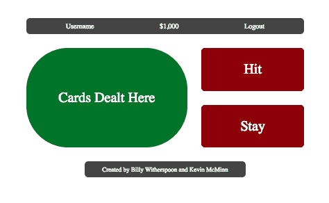
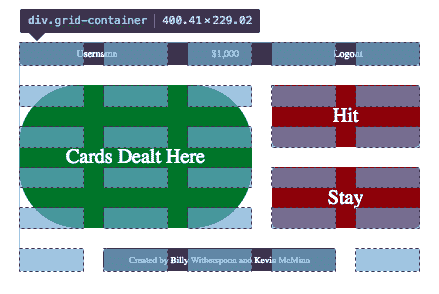

# 你应该使用网格还是 Flexbox...还是两者都有？

> 原文：<https://dev.to/billywitherspoon/should-you-use-grid-or-flexbox-or-both-280h>

## 答案是...

<figure> 

<figcaption></figcaption>

</figure>

很可能两者都有！

太棒了。考虑一下这篇文章。祝你有一个美好的编码日。或者，继续读下去，找出原因！

## 背景

CSS 灵活框(Flexbox)和 CSS 网格布局(Grid)是 CSS 模块，旨在使 HTML 中的布局和定位更加容易。它使用户能够在不使用 CSS 浮动和定位的情况下布局元素。

Flexbox 于 2009 年首次推出，此后逐渐成为万维网联盟(W3C)的候选推荐标准。

网格最初是由微软在 2011 年向 CSS 工作组提出的。类似于 Flexbox，它也是 W3C 的候选推荐标准。

## 相似之处

#### 设置

Flexbox 和 Grid 都通过设置容器来工作，容器中的元素将被“弯曲”或“网格化”。*请注意:我刚刚编造了这些词*。

在容器的类或 id 的样式表中，可以使用以下代码将其设置为受 flexbox 控制或受网格控制:

`display: flex`或`display: grid`

请注意，您不能同时伸缩和网格一个容器。然而，这并不是说你不能嵌套容器来获得最大功率。

#### 语法

属性语法也有相似之处。诸如 flex-start 和 grid-column-start 之类的行使用定位关键字，将元素放在其容器的开头。

## 差异

#### 维度

Grid 和 Flexbox 之间的主要区别是 Grid 在二维空间(即列和行)中工作得最好，而 Flexbox 在一维空间(即列或行)中工作得最好。

这通常导致网站布局的较大容器由 Flexbox 容器中的网格和嵌套元素定义。然而，这并不是一个硬性规定。

* * *

# 二十一点举例

<figure> 

<figcaption>不要看太久</figcaption>

</figure>

我最近参与的一个小团队项目是创建一个 21 点游戏。对于那个项目，我们选择使用 CSS 框架引导。但是，让我们深入一下我如何使用 Grid 和 Flexbox 定义某些页面元素。

## 网格测量

顾名思义，网格的基础首先是通过网格的行数和列数来定义网格。您可以进一步调整这些行和列的大小和位置来创建。这可以用多种方法来完成。

这是我们 21 点游戏自上而下的愿景:

<figure> 

<figcaption>我们最终设计的预览</figcaption>

</figure>

*   一种标题，具有水平均匀显示的名称、余额和注销按钮。
*   一张 21 点的桌子和一些并排的赌博行为。将有两个下注动作(点击和停留)叠加在一起。
*   带有居中元素的页脚，显示游戏的创建者

所以我们来数一下行数和列数。好像是三排，对吗？没那么快！当然，页眉和页脚是一行。但是，下注操作区域至少嵌套了两行。为了可伸缩性，我们把它设为 4。请注意，21 点表也将包含在这些行中。

因此，1 行用于标题，4 行用于牌桌/下注动作，1 行用于页脚。

**6 排！**

好的，列怎么样？标题可能是一个候选，其元素需要均匀分布。然而，这是一个一维的行，所以它实际上是一个更适合 Flexbox 的任务。第 2 - 5 行看起来只有 2 列用于 21 点牌桌和一些下注活动。

带页脚的第 6 行看起来很有潜力。让它居中，但不要占据整个页面的宽度。

总共 5 列应该很好。在行 1 中，标题将占据所有 5 列。在行 2-5 中，21 点桌将占据 3 列，下注行为将占据 2 列。在第 6 行，页脚将占据中间的 3 列，两边各有一列空白。

**5 列！**

## 网格容器 CSS

所以我们知道我们需要一个 6 x 5 的 CSS 网格。让我们考虑一下行的大小。页眉和页脚应该各占页面垂直空间的 10%。剩下 80%用于牌桌和下注行动。

对于列的大小，我们不必担心大小。我们将规定每个元素占多少列。

我们的容器将有一个“网格容器”类。有很多方法可以写出网格。我强烈建议查看底部的链接，如网格花园，以开始这些。为了演示，我将使用%(容器的百分比)和 fr(容器的分数)。

`.grid-container {
display: grid;
grid-template-rows: 10% 1fr 1fr 1fr 1fr 10%;
grid-template-columns: 1fr 1fr 1fr 1fr 1fr;
}`

<figure> 

<figcaption>把自己网格化</figcaption>

</figure>

看起来棒极了！让我们继续定义元素在网格中的位置。

## 网格元素 HTML/CSS

*注意:下面演示的代码托管在这个[代码笔 repo](https://codepen.io/billywitherspoon/pen/VNLwaj) 上。请随意跟进，并在进行过程中对代码进行注释和取消注释。*

#### 表头

我们希望页眉在第一行横跨整个页面。因此它将占用所有列，并且只占用第 1 行。同样，有许多方法来写这个，所以我将保持每个元素的开始和结束点的明确性。记住 CSS 网格“最多”对齐一列。为了跨越两列，我们从 1 到 6。

`#header {
grid-row: 1;
grid-column: 1 / 6;
}`

#### 二十一点桌

在这里，表格应该跨越 4 行 3 列。这将使它水平占据页面的 3/5。

`#blackjack-table {
grid-row: 2 / 6;
grid-column: 1 / 4;
}`

#### 下注动作

点击按钮和停留按钮与 21 点牌桌对齐，点击按钮位于右栏的上两行，停留按钮位于其下。

`#hit-button {
grid-row: 2 / 4;
grid-column: 4 / 6;
}`

`#stay-button {
grid-row: 4 / 6;
grid-column: 4 / 6;
}`

#### 页脚

页脚位于最后一行，占据三个中间列。

`.footer {
grid-row: 6;
grid-column: 2 / 5;
}`

就是这样！我们已经对网格做了我们能做的一切！东西都在正确的地方。现在让我们清理元素/div 中的元素。

## 柔性箱的使用

Flexbox 非常适合处理具有一维子元素的元素。这可能是具有嵌套文本的 div，或者是具有嵌套行或嵌套列的 div。一行或一列是一个单独的维度，因此不需要创建新的网格。

我们可以直接跳到每个 div 元素的 CSS 中。对于牌桌、下注按钮和页脚，所有内容都将在每个方向上居中。这是 21 点桌的 CSS。

`#blackjack-table {
display: flex;
justify-content: center:
align-items: center;
}`

对于标题。我们知道我们希望三个嵌套元素(用户名、余额和注销按钮)在一行中右对齐。我们希望它们在标题中垂直居中。

如果没有任何 css，它们会在标题的左侧显示为一列，所以会有很大的变化。

`#header {
display: flex;
flex-direction: row;
justify-content: space-around:
align-items: center;
}`

## 总结

让我们检查一下我们的工作

[https://codepen.io/billywitherspoon/embed/VNLwaj?height=600&default-tab=result&embed-version=2](https://codepen.io/billywitherspoon/embed/VNLwaj?height=600&default-tab=result&embed-version=2)

看起来棒极了！

## 资源

CSS Grid 和 Flexbox 上的一些非常棒的资源

[Flexbox Froggy(带着好玩的互动网站学习 CSS Flexbox)](https://flexboxfroggy.com/)

[GridGarden(通过有趣的互动网站学习 CSS 网格)](http://cssgridgarden.com/)

[Youtube 上 Academind 的 CSS Grid vs CSS Flexbox](https://www.youtube.com/watch?v=RSIclWvNTdQ)

[带预建网格的 Codepen，用于在周围玩耍](https://codepen.io/rachelandrew/pen/BNXyQa)

[hacker noon 上有更多很酷的背景、链接、信息、教程和文章](https://hackernoon.com/getting-started-with-css-grid-layout-8e00de547daf)