# 2019 年 PostgreSQL 趋势报告:私有云与公共云、迁移、数据库组合和使用的主要原因

> 原文：<https://dev.to/scalegrid/2019-postgresql-trends-report-private-vs-public-cloud-migrations-database-combinations-top-reasons-used-jea>

PostgreSQL 是一个开源的对象关系数据库系统，在过去的 30 年里，它因其活跃、忠诚和不断增长的社区而广受欢迎。根据 DB-Engines 专家发布的[年度数据库管理系统](https://db-engines.com/en/blog_post/79 "DBMS of the Year: PostgreSQL")报告，PostgreSQL 连续第二年保持世界上增长最快数据库的头衔。那么是什么让 PostgreSQL 如此特别，它现在是如何被使用的呢？我们在三月份的 [Postgres 会议](https://postgresconf.org/)上找到了答案，在那里我们调查了 PostgreSQL 用户、贡献者以及 SQL 和 NoSQL 数据库管理员。在这份免费的 [PostgreSQL 趋势报告](https://scalegrid.io/blog/2019-postgresql-trends-report-private-vs-public-cloud-migrations-database-combinations-top-reasons-used/)中，我们详细介绍了 [PostgreSQL 托管](https://scalegrid.io/postgresql.html "PostgreSQL hosting")在公共云与私有云与混合云之间的使用、最受欢迎的云提供商、迁移趋势、与 PostgreSQL 的数据库组合，以及为什么 PostgreSQL 优于流行的 RDBMS 替代方案。

## 私有云、公共云和混合云

那么，PostgreSQL 用户如何选择托管支持其应用程序的集群呢？59.6%的受访者在本地私有云中托管 PostgreSQL，其中只有 34.8%使用公共云。这些结果与 Uptime Institute 的 2017 年调查[相当，该调查发现 65%的企业工作负载仍在这些企业拥有和运营的数据中心中运行。](https://www.networkworld.com/article/3192988/65-of-enterprise-workloads-still-in-on-premises-data-centers-study-finds.html)

然而，我们惊讶地发现，只有 5.6%的受访者采用了混合云战略。混合云是第三方公共云和内部私有云的混合，以支持您在这两种计算环境中利用的工作负载需求。RightScale 最近的一份[报告](https://www.rightscale.com/blog/cloud-industry-insights/cloud-computing-trends-2019-state-cloud-survey)发现，69%的企业通过结合公共云和私有云采用了混合云战略。

[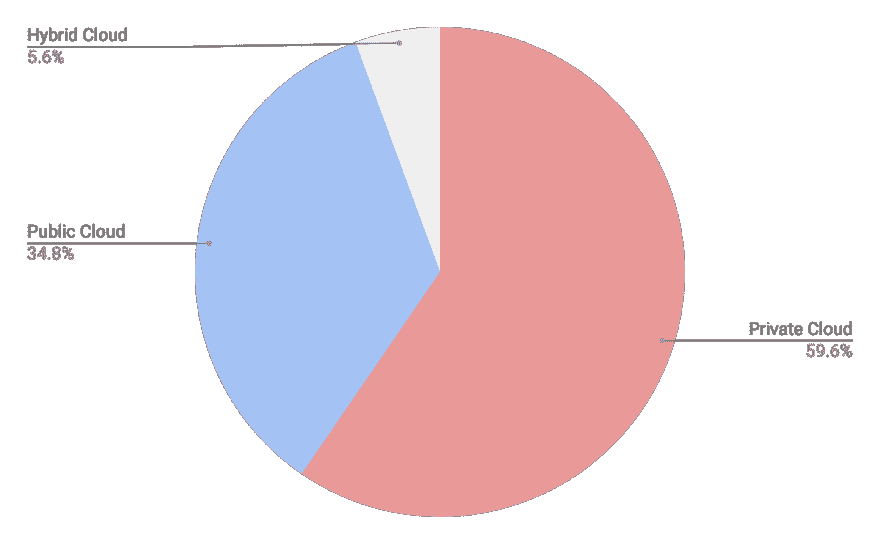](https://scalegrid.io/blog/wp-content/uploads/2019/03/PostgreSQL-Trends-Report-Private-Cloud-vs-Public-Cloud-vs-Hybrid-Cloud.png)

### PostgreSQL 最受欢迎的云提供商

由于近 40%的 PostgreSQL 用户在公共或混合云中托管，我们选择了这些组织用来托管其集群的最受欢迎的云提供商。在一项可预测的发现中，我们发现亚马逊 Web 服务(AWS)在公共云环境中的所有 PostgreSQL 托管活动中占据了 55%的使用量。

微软 Azure 和谷歌云平台在 PostgreSQL 公共云用户中各占 17.5%，不分上下。其他类别中剩余的 10%由 DigitalOcean、IBM Cloud、Rackspace 和阿里巴巴组成。

[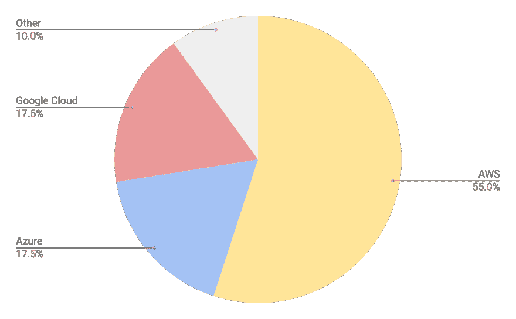](https://scalegrid.io/blog/wp-content/uploads/2019/03/PostgreSQL-Trends-Report-Most-Popular-Cloud-Providers-AWS-Azure-GCP.png)

许多 PostgreSQL 部署也通过数据库即服务(DBaaS)解决方案托管和管理，这些解决方案利用或由这些云提供商提供，您可以查看此[比较 PostgreSQL 提供商](https://scalegrid.io/postgresql/hosting-comparison.html)页面，了解各自的优势。

### PostgreSQL 使用单个云与多个云的对比

既然我们已经知道了 PostgreSQL 托管策略和最常用的云提供商的分类，让我们来看看单个和多个云的使用情况。

托管在公共云中的 PostgreSQL 用户平均使用 1.3 个不同的云提供商来支持他们的应用程序。单一云的使用占主导地位，超过四分之三的受访者回答为 78.1%，而只有 21.9%的 PostgreSQL 部署采用了多云策略。

[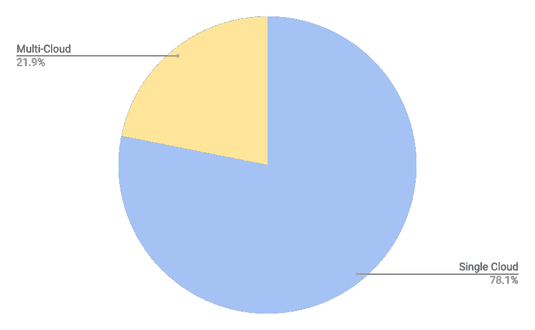](https://scalegrid.io/blog/wp-content/uploads/2019/03/PostgreSQL-Trends-Report-Single-Cloud-vs-Multi-Cloud-Use.png)

### PostgreSQL 的采用和迁移趋势

接下来，我们询问了受访者对 PostgreSQL 的使用情况，以了解用户的使用程度，他们是否正在进行迁移，或者是否正在探索 PostgreSQL 是否很适合他们的应用程序需求。

在 PostgresConf 中，我们毫不惊讶地发现大多数受访者已经在使用 PostgreSQL，比例为 74.4%。超过四分之一的受访者尚未在生产环境中部署 PostgreSQL，我们发现 11.5%的受访者正在迁移到 PostgreSQL，而最后 14.1%的受访者正在探索数据库，以便将来进行可能的迁移。查看下面的[PostgreSQL 优于其他 RDBMS 的主要原因](#WhyPostgres)分析，了解巩固其他 PostgreSQL 用户决策的优势。

[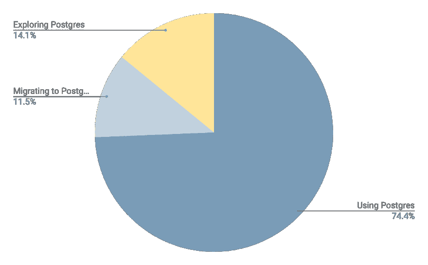](https://scalegrid.io/blog/wp-content/uploads/2019/03/PostgreSQL-Trends-Report-Using-vs-Migrating-vs-Exploring.png)

### 2019 年最受欢迎的数据库

当我们了解 PostgreSQL 的采用和迁移趋势时，我们还想了解在这次 Postgres 聚会中利用的数据库替代方案的受欢迎程度。

当然，PostgreSQL 在受访者中以 85.9%的使用率排名第一(无论是在生产中使用还是当前正在迁移到)，其次是 Oracle，占 43.59%，SQL Server 占 32.05%，MySQL 占 28.21%。MongoDB 和 DB2 以 14.10%并列第五，Redis 为 11.54%，Greenplum 和 SQLite 各以 5.13%并列第七。Cassandra、蟑螂、Cosmos DB、Elasticsearch、Teradata 和 TimescaleDB 并列第八，使用率均为 1.28%。

[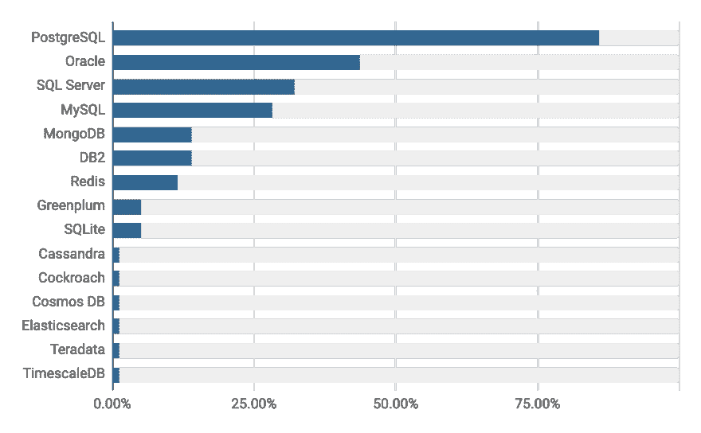](https://scalegrid.io/blog/wp-content/uploads/2019/03/PostgreSQL-Trends-Report-Most-Popular-Databases.png)

虽然上述结果非常偏向 PostgreSQL，但我们确实发现该数据库在我们于 3 月初发布的 [2019 年数据库趋势——SQL 与 NoSQL、顶级数据库、单数据库与多数据库使用的](https://scalegrid.io/blog/2019-database-trends-sql-vs-nosql-top-databases-single-vs-multiple-database-use/)报告中排名前三。这项调查是在 DeveloperWeek 上进行的，我们在那里与所有数据库类型的用户进行了联系，发现 MySQL 以 38.9%的响应率遥遥领先，其次是 MongoDB，为 24.6%。

[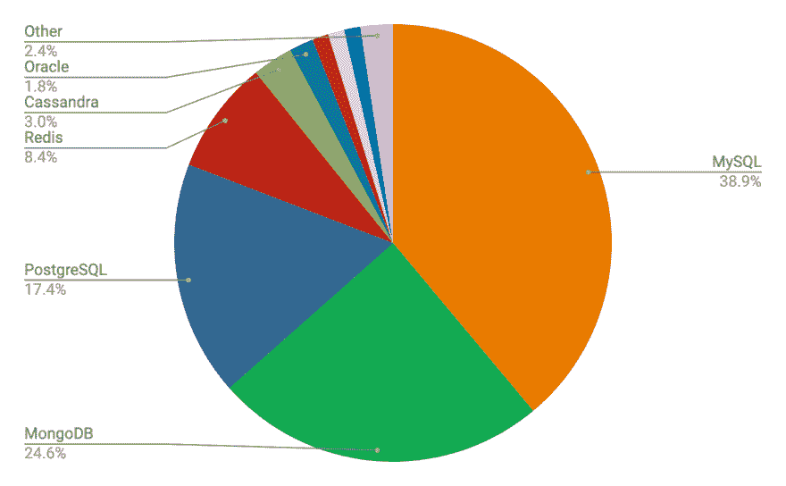](https://scalegrid.io/blog/wp-content/uploads/2019/02/Most-Popular-Databases-Used-MySQL-MongoDB-PostgreSQL-Redis-Cassandra-Oracle.png)

## 与 PostgreSQL 最流行的数据库组合

现在我们知道了哪些 DBMS 是最流行的(在 PostgreSQL 社区和整体上)，让我们来看看与 PostgreSQL 一起使用的最流行的数据库组合。

首先，我要分享的是，62.69%的 PostgreSQL 用户除了 PostgreSQL 之外还使用至少一个其他数据库，而 37.31%的用户将 PostgreSQL 作为他们应用程序的唯一数据库。

超过四分之一的 PostgreSQL 用户(27.3%)除了 PostgreSQL 之外还使用 Oracle，其次是 20.9%使用 SQL Server，17.3%使用 MySQL，10.0%使用 MongoDB，9.1%使用 DB2，7.3%使用 Redis，3.6%也使用 SQLite。后 4.5%使用 PostgreSQL 的数据库包括 Cassandra、蟑螂、Cosmos DB、Elasticsearch 和 Teradata。

[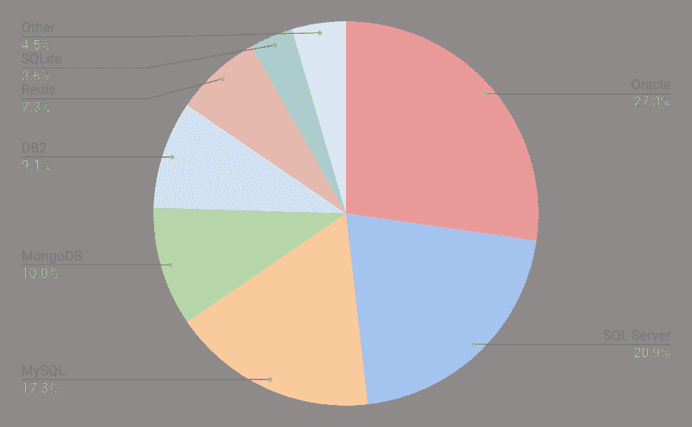](https://scalegrid.io/blog/wp-content/uploads/2019/03/PostgreSQL-Trends-Report-2019-Most-Popular-Databases.png)

### PostgreSQL 数据库组合:SQL 与 NoSQL

考虑到与 PostgreSQL 结合使用的数据库种类繁多，我们还分析了 PostgreSQL 与其他 SQL 和 NoSQL 数据库结合使用的趋势。SQL 是大多数，PostgreSQL 用户甚至有 80%的组合使用，只有 20%的组合使用与 NoSQL 数据库。

[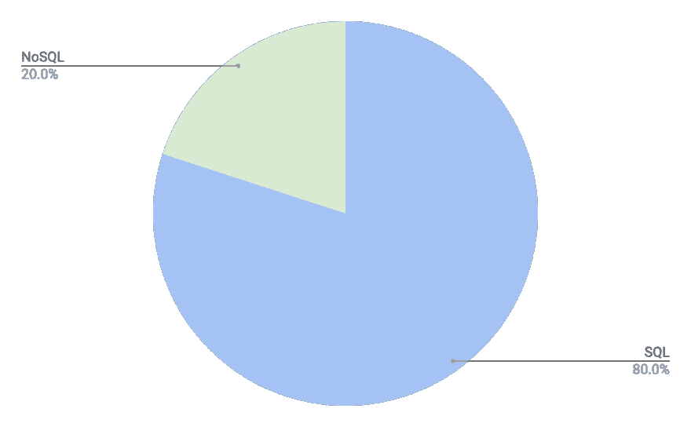](https://scalegrid.io/blog/wp-content/uploads/2019/03/PostgreSQL-Trends-Report-Database-Combinations-SQL-vs-NoSQL.png)

### PostgreSQL 用户使用的数据库类型数量

现在我们知道了 PostgreSQL 最常用的数据库，让我们深入了解一下 PostgreSQL 社区中用于支持其应用程序的数据库的平均数量。

平均而言，我们发现利用 PostgreSQL 的部署使用 2.56 个不同的数据库系统，包括 PostgreSQL 本身。这比我们在 2019 年数据库趋势报告中发现的数据低 17%以上，在该报告中，所有类型的数据库用户平均报告了 3 个数据库的组合使用。PostgreSQL 必须填补其他数据库所没有的空白。

正如您在下面所看到的，超过一半的 PostgreSQL 用户使用两个或更多的数据库，其中 9.0%使用两个数据库，14.1%使用三个数据库，17.9%使用四个数据库，11.5%使用五个数据库，还有令人震惊的 3.8%使用六个数据库来驱动一个应用程序。虽然组合占了大多数，但在我们的调查中，PostgreSQL 作为一个独立的数据库是最大的回应，占 43.6%。

[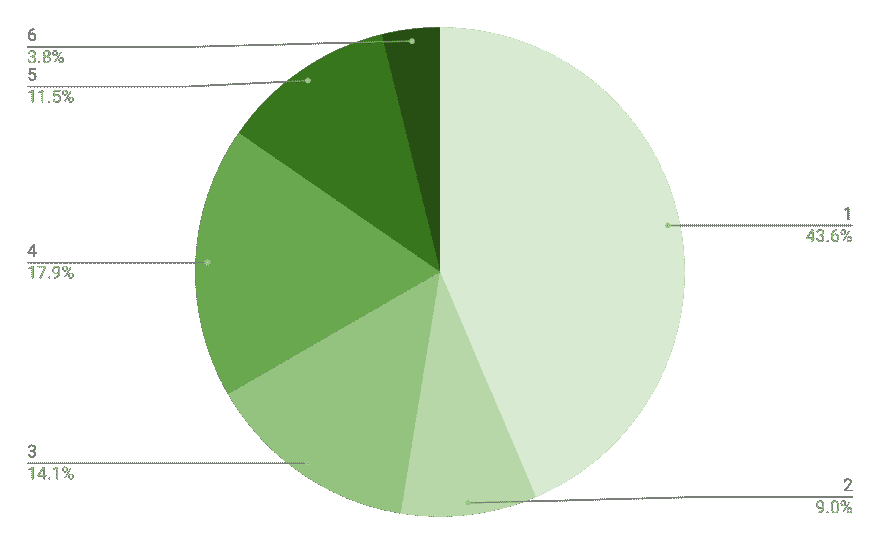](https://scalegrid.io/blog/wp-content/uploads/2019/03/PostgreSQL-Trends-Report-Number-of-Databases-Used.png)

## 在其他 RDBMS 上使用 PostgreSQL 的主要原因

我们终于来到了报告中的最后一个趋势分析，在这里，我们打破了我们的开放式问题“是什么让你决定使用或探索 PostgreSQL 而不是另一个 RDBMS”。

[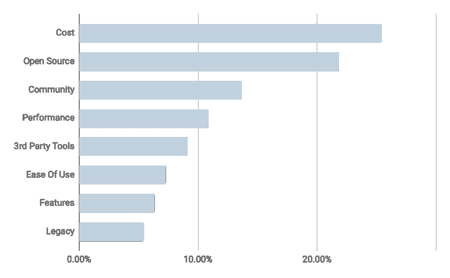](https://scalegrid.io/blog/wp-content/uploads/2019/03/PostgreSQL-Trends-Report-Top-Reasons-PostgreSQL-Is-Used-Over-Another-RDBMS.png)

成本是 PostgreSQL 优于其他 RDBMS 的首要原因，占 25.5%。这几乎直接关系到第二高的原因是 21.8%的开源，因为商业供应商的许可成本正在驱使他们的用户转向更免费的开源系统。正如您在下面的 DB-Engines [开源 DBMS 与商业 DBMS](https://db-engines.com/en/ranking_osvsc) 报告中所看到的，至少从 2013 年开始，开源就一直在稳步窃取商业供应商的市场份额。虽然商业软件仍然处于领先地位，但在未来 12 到 18 个月内，开源软件将成为主流。

[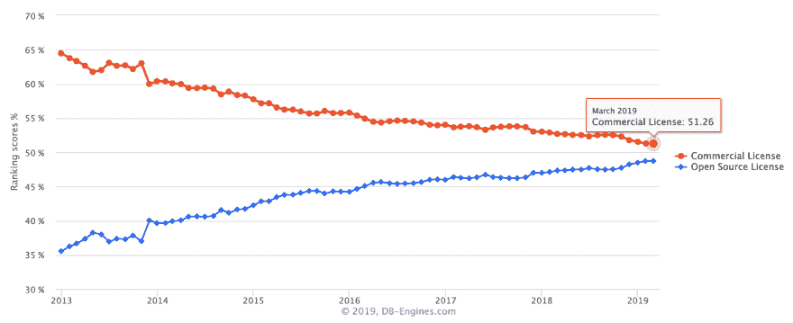](https://scalegrid.io/blog/wp-content/uploads/2019/03/PostgreSQL-Trends-Report-Open-Source-vs-Commercial-License.png)

社区以 13.6%的回应率排在第三位，尽管它是有史以来最活跃、参与度最高的开源 DBMS 社区之一，但从围绕调查的对话中可以明显看出，它对用户更有影响力。PostgreSQL 完全是社区驱动的，世界各地的开发人员免费提供支持，他们与其他用户分享他们的专业知识。

性能以 10.9%的响应率排在第四位，第三方工具以 9.1%的响应率排在第三位，因为它们经常被用来确保和维护 PostgreSQL 的高性能。同样，开源社区也是 PostgreSQL 的另一个成功之处，因为有数百个第三方开源(和一些商业)工具可用于您的部署。您可以在我们的 PostgreSQL 3 部分系列的[管理高可用性中了解更多关于一些开源解决方案的信息。](https://scalegrid.io/blog/managing-high-availability-in-postgresql-part-1/)

PostgreSQL 的易用性因其简单灵活的设计排名第六，占 7.3%，其高级功能集排名第七，占 6.4%。最后但并非最不重要的是 legacy，在八个公司中占 5.5%，这些受访者在已经使用 PostgreSQL 的公司中进入他们的职位，并在经历了上述所有内容后迅速爱上了它。

如果你喜欢 2019 年 PostgreSQL 趋势报告，你会想看看我们之前对该数据库的调查分析，[最新 PostgreSQL 趋势:最耗时的任务&跟踪的重要指标](https://scalegrid.io/blog/latest-postgresql-trends-most-time-consuming-tasks-important-metrics-to-track/)。您还可以访问我们的 [PostgreSQL on Azure](https://scalegrid.io/postgresql/azure.html) 和 [PostgreSQL on AWS](https://scalegrid.io/postgresql/aws.html) 页面，了解更多关于在云中自动化部署管理、监控和维护的信息。