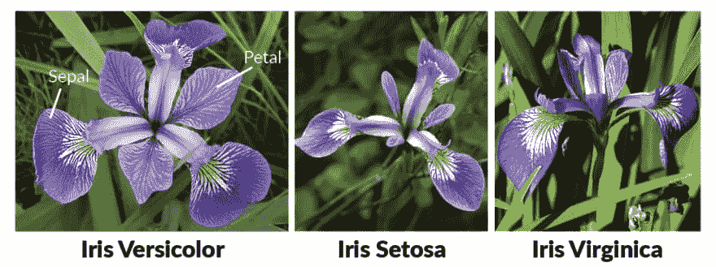
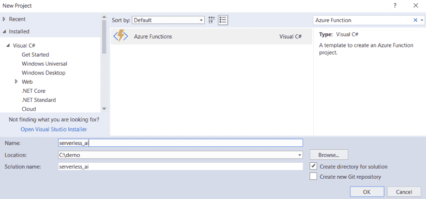
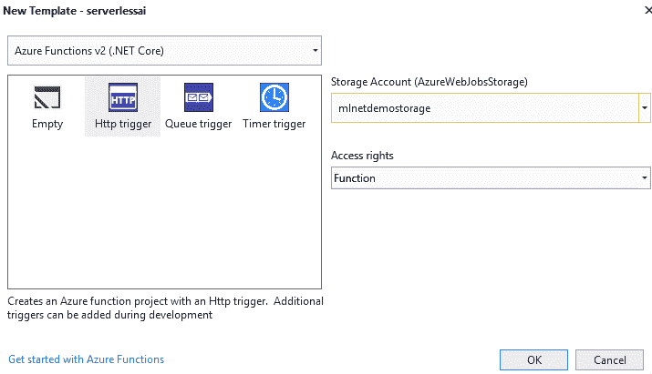
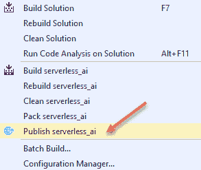
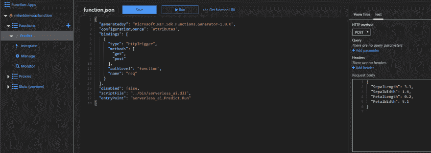

# Azure 中的机器学习

> 原文：<https://dev.to/azure/machine-learning-in-azure-1b84>

*我们选择了由[迈克尔·克伦普](https://twitter.com/mbcrump)创造的我们最喜欢的技巧和诀窍，并在整个四月在 Azure 上提供新的技术内容！错过一天(或更多)？[赶上系列](https://dev.to/t/azureapril)。*

*也感谢[路易斯·金塔尼拉](https://twitter.com/ljquintanilla)用他在 ML.NET 和 Azure 函数上的工作启发了我们。*

**没有天蓝色？** [抢免费订阅](https://azure.microsoft.com/en-us/free?&WT.mc_id=azureapril_devto-blog-cxa)。

* * *

机器学习可能很棘手。甚至这个名字都让我紧张。喜欢...我该如何*教*一台*机器*？！

幸运的是，Azure 正在想办法让开发者更容易进入机器学习。[ML.NET](https://azure.microsoft.com/en-us/updates/ml-net/)是微软研究院专门为其打造的机器学习框架。这样你就可以在 Visual Studio 里面做任何事情。

当你准备好部署你的 ML.NET 算法时，你可以通过 Azure 函数使用无服务器架构。你可以把它想成“别担心！”当您想要启动并运行一个应用程序，但又不一定想对服务器、容器和基础设施动手脚时，可以选择这个选项。

> [查看更多 ML 快速入门和教程](https://docs.microsoft.com/azure/machine-learning/?WT.mc_id=azureapril_devto-blog-cxa)！

## 无服务器机器学习

这是从 Luis Quintanilla 的文章中得到的灵感，这篇文章是关于使用 Azure 功能的 ML.NET，他将这两个伟大的想法结合在一起。

在您学习本教程的过程中，您将在本地使用 model 来训练您的机器学习模型。然后，您将创建一个 Azure 环境，其中包含一个存储帐户和一个 Azure 函数来托管您的机器学习应用程序。最后一步是构建一个使用你的模型的应用程序。

我们开始吧！

## 创建你的模型

对于这个快速项目的 ML.NET 部分，让我们从[10 分钟 ML.NET 入门教程](https://dotnet.microsoft.com/learn/machinelearning-ai/ml-dotnet-get-started-tutorial/intro?WT.mc_id=azureapril_devto-blog-cxa)开始构建虹膜分类模型。作为先决条件，你需要安装 [Azure CLI 2.0](https://docs.microsoft.com/cli/azure/install-azure-cli?view=azure-cli-latest&WT.mc_id=https://docs.microsoft.com/cli/azure/install-azure-cli?view=azure-cli-latest&WT.mc_id=azureapril_devto-blog-cxa) 、 [Azure Functions 核心工具](https://docs.microsoft.com/azure/azure-functions/functions-run-local?WT.mc_id=azureapril_devto-blog-cxa)和最新版本的[。网芯](https://dotnet.microsoft.com/download/dotnet-core/2.2?WT.mc_id=azureapril_devto-blog-cxa)。

[](https://res.cloudinary.com/practicaldev/image/fetch/s--sg2VT2Rj--/c_limit%2Cf_auto%2Cfl_progressive%2Cq_auto%2Cw_880/https://microsoft.github.io/AzureTipsAndTricks/files/iris-machinelearning.png)

打开命令提示符，为您的 ML.NET 项目创建一个新文件夹。

```
> mkdir demo
> cd demo 
```

接下来，创建一个新的解决方案和一个新的控制台项目，并安装 ML.NET 包。

```
> dotnet new solution
> dotnet new console -o model
> dotnet sln add model/model.csproj
> cd model
> dotnet add package Microsoft.ML --version 0.4.0
> dotnet restore 
```

在模型下创建一个数据目录。

```
> mkdir data 
```

打开 [UCI 机器学习库:虹膜数据集](https://archive.ics.uci.edu/ml/machine-learning-databases/iris/iris.data)，将数据复制粘贴到 VS 代码，或者 TextEdit 或 Notepad，在`data`目录下另存为`iris-data.txt`。

现在是时候写一些代码了。在 Visual Studio 代码中打开您的项目，并创建两个数据结构类:`IrisData.cs`和`IrisPrediction.cs`。

```
using Microsoft.ML.Runtime.Api;

        public class IrisData
        {
            [Column("0")]
            public float SepalLength;

            [Column("1")]
            public float SepalWidth;

            [Column("2")]
            public float PetalLength;

            [Column("3")]
            public float PetalWidth;

            [Column("4")]
            [ColumnName("Label")]
            public string Label;
        }

        public class IrisPrediction
        {
            [ColumnName("PredictedLabel")]
            public string PredictedLabels;
        } 
```

添加一个模型类来执行机器学习训练。

```
using System.Threading.Tasks;
using Microsoft.ML;
using Microsoft.ML.Data;
using Microsoft.ML.Trainers;
using Microsoft.ML.Transforms;

    class Model
    {
        public static async Task<PredictionModel<IrisData, IrisPrediction>> Train(LearningPipeline pipeline, string dataPath, string modelPath)
        {
            // Load Data
            pipeline.Add(new TextLoader(dataPath).CreateFrom<IrisData>(separator: ','));

            // Transform Data
            // Assign numeric values to text in the "Label" column, because
            // only numbers can be processed during model training
            pipeline.Add(new Dictionarizer("Label"));

            // Vectorize Features
            pipeline.Add(new ColumnConcatenator("Features", "SepalLength", "SepalWidth", "PetalLength", "PetalWidth"));

            // Add Learner
            pipeline.Add(new StochasticDualCoordinateAscentClassifier());

            // Convert Label back to text
            pipeline.Add(new PredictedLabelColumnOriginalValueConverter() { PredictedLabelColumn = "PredictedLabel" });

            // Train Model
            var model = pipeline.Train<IrisData, IrisPrediction>();

            // Persist Model
            await model.WriteAsync(modelPath);

            return model;
        }
    } 
```

将您的逻辑放在`Program.cs`文件中以运行整个流程:

```
 class Program
    {
        static void Main(string[] args)
        {
            string dataPath = "/Users/mbcrump/Documents/demo/model/data/iris-data.txt";

            string modelPath = "/Users/mbcrump/Documents/demo/model/model.zip";

            var model = Model.Train(new LearningPipeline(), dataPath, modelPath).Result;

            // Test data for prediction
            var prediction = model.Predict(new IrisData()
            {
                SepalLength = 3.3f,
                SepalWidth = 1.6f,
                PetalLength = 0.2f,
                PetalWidth = 5.1f
            });

            Console.WriteLine($"Predicted flower type is: {prediction.PredictedLabels}");

        }
    } 
```

运行模型项目，在根目录下创建一个新的`model.zip`文件。下面是我得到的结果。

```
Michaels-MacBook-Pro:model mbcrump$ dotnet run
Automatically adding a MinMax normalization transform, use 'norm=Warn' or 'norm=No' to turn this behavior off.
Using 4 threads to train.
Automatically choosing a check frequency of 4.
Auto-tuning parameters: maxIterations = 9996.
Auto-tuning parameters: L2 = 2.668802E-05.
Auto-tuning parameters: L1Threshold (L1/L2) = 0.
Using best model from iteration 500.
Not training a calibrator because it is not needed.
Predicted flower type is: Iris-virginica 
```

恭喜你！你和 model 一起训练了一个机器学习模型，对虹膜进行分类。

> [查看更多 ML 快速入门和教程](https://docs.microsoft.com/azure/machine-learning/?WT.mc_id=azureapril_devto-blog-cxa)！

## 使用云外壳设置您的 Azure 环境

我们将使用 Azure Cloud Shell，它使用 [Azure CLI](https://docs.microsoft.com/cli/azure/install-azure-cli?view=azure-cli-latest&WT.mc_id=https://docs.microsoft.com/cli/azure/install-azure-cli?view=azure-cli-latest&WT.mc_id=azureapril_devto-blog-cxa) 来设置我们的 Azure 环境。最简单的方法就是登录你的 Azure 门户账户，点击下面显示的云 shell 图标，打开一个 bash shell，或者去 shell.azure.com 的。

登录后，在 bash shell 中为这个项目创建一个新的资源组(并用您自己的资源组替换`mlnetdemo`和位置)。

```
$ az group create --name mlnetdemo --location westus 
```

向该资源组添加存储。

> 注意:您必须将下面的名称改为一个独特的名称

```
$ az storage account create --name mlnetdemostorage --location westus --resource-group mlnetdemo --sku Standard_LRS 
```

创建你的 Azure 函数，并将其配置为使用支持。网芯。

> 注意:您必须将下面的名称改为一个独特的名称。

```
$ az functionapp create --name mlnetdemoazfunction1 --storage-account mlnetdemostorage1 --consumption-plan-location westus --resource-group mlnetdemo
$ az functionapp config appsettings set --name mlnetdemoazfunction1 --resource-group mlnetdemo --settings FUNCTIONS_EXTENSION_VERSION=beta 
```

## 部署你的机器学习模型

要将您的模型上传到服务器，您需要获得您的存储帐户的密钥。在 bash 窗口中使用下面的命令来获取它。

```
$ az storage account keys list --account-name mlnetdemostorage1 --resource-group mlnetdemo 
```

您将看到以下内容:

```
[
  {
    "keyName": "key1",
    "permissions": "Full",
    "value": "YOURKEY"
  },
  {
    "keyName": "key2",
    "permissions": "Full",
    "value": "NONEYOBUSINESS"
  }
] 
```

使用下面的命令创建一个名为`models`的新目录，使用您的帐户密钥放置您的模型(这可以在`Settings | Access keys`下的导航窗口中找到)。

```
$ az storage container create --name models --account-key YOURKEY --account-name mlnetdemostorage1 
```

[](https://res.cloudinary.com/practicaldev/image/fetch/s--TC5_K-EM--/c_limit%2Cf_auto%2Cfl_progressive%2Cq_auto%2Cw_880/https://microsoft.github.io/AzureTipsAndTricks/files/blob_model.png)

由于我们使用的是云壳，所以这一步使用 Azure 门户会更容易。如果您愿意，也可以使用 Azure CLI。

浏览到您的`mlnetdemo`资源组版本，并深入查看您之前创建的存储资源。进入 blobs，你会看到新的文件夹`models`子目录。

将硬盘上的`model.zip`上传到这里。

## 像机器人一样识别虹膜

> 注意:确保你已经安装了 Azure 工作负载来查看这个模板。

[](https://res.cloudinary.com/practicaldev/image/fetch/s--kWIefz2W--/c_limit%2Cf_auto%2Cfl_progressive%2Cq_auto%2Cw_880/https://microsoft.github.io/AzureTipsAndTricks/files/azurefunction.png)

使用名为`serverless_ai`的 Azure Functions 项目模板创建一个新项目。

[](https://res.cloudinary.com/practicaldev/image/fetch/s--4FfX5fEv--/c_limit%2Cf_auto%2Cfl_progressive%2Cq_auto%2Cw_880/https://microsoft.github.io/AzureTipsAndTricks/files/httptrigger.png)

出现提示时，选择`Http trigger`选项，并将其连接到项目的 Azure 存储帐户(本文中为`mlnetdemostorage1`)。

然后完成以下步骤:

*   使用 NuGet 添加 Microsoft。ML 包到您的项目中。
*   将 IrisData.cs 和 IrisPrediction.cs 文件从您的模型项目复制到 serverless_ai 项目。

你会再次需要它们。

将`Http trigger`类的名称`Function1`改为`Predict`，并复制以下代码:

```
using Newtonsoft.Json;
using Microsoft.ML;

namespace serverless_ai
{
    public static class Predict
    {
        [FunctionName("Predict")]
        public static IActionResult Run([HttpTrigger(AuthorizationLevel.Function, "get", "post", Route = null)]HttpRequest req,
        [Blob("models/model.zip", FileAccess.Read, Connection = "AzureWebJobsStorage")] Stream serializedModel,
        TraceWriter log)
        {
            if (typeof(Microsoft.ML.Runtime.Data.LoadTransform) == null ||
                typeof(Microsoft.ML.Runtime.Learners.LinearClassificationTrainer) == null ||
                typeof(Microsoft.ML.Runtime.Internal.CpuMath.SseUtils) == null ||
                typeof(Microsoft.ML.Runtime.FastTree.FastTree) == null)
            {
                log.Error("Error loading ML.NET");
                return new StatusCodeResult(500);
            }

            //Read incoming request body
            string requestBody = new StreamReader(req.Body).ReadToEnd();

            log.Info(requestBody);

            //Bind request body to IrisData object
            IrisData data = JsonConvert.DeserializeObject<IrisData>(requestBody);

            //Load prediction model
            var model = PredictionModel.ReadAsync<IrisData, IrisPrediction>(serializedModel).Result;

            //Make prediction
            IrisPrediction prediction = model.Predict(data);

            //Return prediction
            return (IActionResult)new OkObjectResult(prediction.PredictedLabels);
        }
    }
} 
```

这些行使用您的模型来评估新的虹膜数据，以做出预测。您的应用程序已准备好进行测试。

## 部署前本地测试

要在本地机器上测试 Azure Function 应用程序，请检查您的`local.settings.json`文件以确保`AzureWebJobsStorage`有一个与之关联的值。

这就是你的本地应用将如何在你的 Azure 存储帐户上找到你上传的模型。如果这有一个值(如果您在创建项目时将它绑定到您的帐户，它应该有)，您可以只`F5`这个`serverless_ai`项目来运行它。

现在打开 [Postman](https://www.getpostman.com/apps) (或者一个类似的 REST API 工具)并发送一个`POST`调用给

```
http://localhost:7071/api/Predict with the following body: 
```

```
{
 "SepalLength": 3.3,
 "SepalWidth": 1.6,
 "PetalLength": 0.2,
 "PetalWidth": 5.1
} 
```

如果一切正常，分类程序将返回`Iris-verginica`。

# 部署天网

…或者你从 Visual Studio 部署的任何 AI，到工具栏中你的构建设置。

[](https://res.cloudinary.com/practicaldev/image/fetch/s--KNKDOLiX--/c_limit%2Cf_auto%2Cfl_progressive%2Cq_auto%2Cw_880/https://microsoft.github.io/AzureTipsAndTricks/files/publish.png)

选择`Publish serverless_ai`部署你的 Azure Function app。

[](https://res.cloudinary.com/practicaldev/image/fetch/s--LTfPPfpd--/c_limit%2Cf_auto%2Cfl_progressive%2Cq_auto%2Cw_880/https://microsoft.github.io/AzureTipsAndTricks/files/test_in_portal.png)

为了测试 Azure 门户中的应用部署，在`mlnetdemo`下选择你的 Azure Function 应用(或者你给它起的名字)，然后在它下面选择`Predict`功能。使用屏幕右侧的`Test`面板查看您部署的应用程序的运行情况。

这将把你的 iris 分类器放到 Azure 上，供其他人试用。恭喜你！现在，您可以将人工智能部署到云中。

**想要 Azure 上更多的机器学习？**查看我们的 [ML 快速入门和教程](https://docs.microsoft.com/azure/machine-learning/?WT.mc_id=azureapril_devto-blog-cxa)！

* * *

[我们将在四月](https://dev.to/t/azureapril)每天发布文章，所以请继续关注或提前查看更多提示和技巧[现在](http://azuredev.tips)。