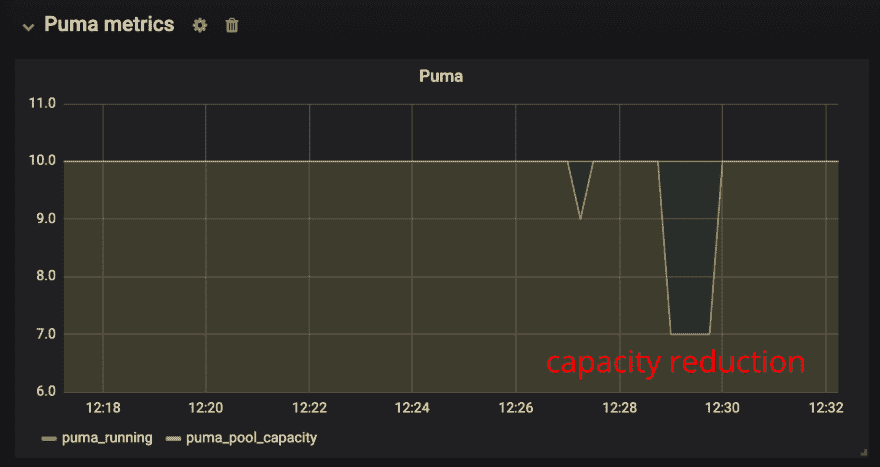
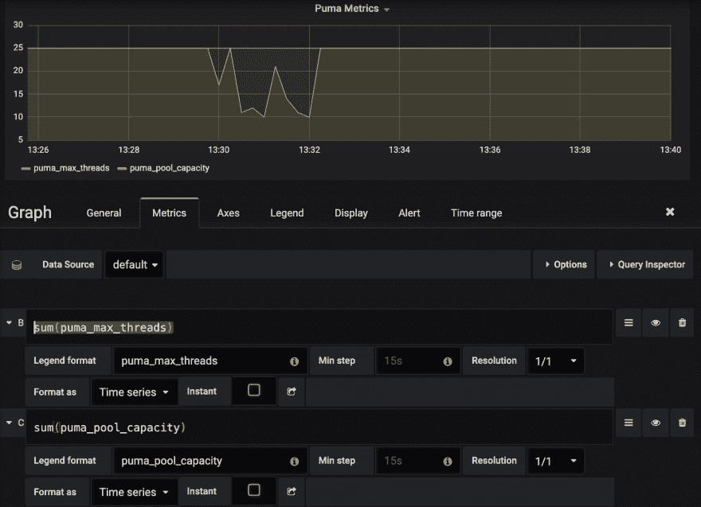
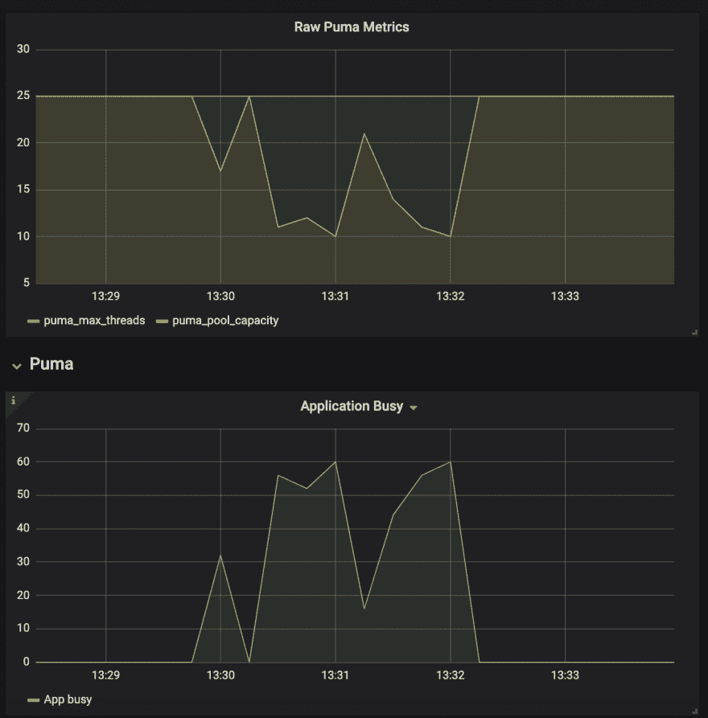

# 用 Prometheus 和 Grafana 监控 Puma web 服务器

> 原文：<https://dev.to/amplifr/monitoring-puma-web-server-with-prometheus-and-grafana-5b5o>

# 简介

在具有复杂基础设施的项目中，定位 web 应用程序性能问题和响应延迟可能是棘手的。

让**监控所有服务的**是非常重要的。

有时，由于 web 服务器容量不足，性能下降可能会比主应用程序提前*出现。由于运行 Ruby web 应用程序的最流行的 web 服务器是 **Puma** ，让我解释一下如何实现和调整对它的简单监控。*

# 彪马控制应用

Puma 有一个内置的控制应用程序,用于管理网络服务器并查询其内部统计数据。通过 Puma 配置文件`puma/config.rb` :
调用以下代码控制应用程序活动

```
activate_control_app('tcp://127.0.01:9000', auth_token: 'top_secret')
# or without any params, just activate_control_app 
```

Enter fullscreen mode Exit fullscreen mode

为了提供服务，Puma 使用特定的[机架后端应用程序](https://github.com/puma/puma/blob/master/lib/puma/app/status.rb)运行[单独的网络服务器实例](https://github.com/puma/puma/blob/master/lib/puma/runner.rb#L47)。

这个后端返回 JSON 格式的工人统计数据:

```
# GET /stats?secret=top_secret
{
  "workers"=>2,
  "phase"=>0,
  "booted_workers"=>2,
  "old_workers"=>0,
  "worker_status"=> [
    {
      "pid"=>13,
      "index"=>0,
      "phase"=>0,
      "booted"=>true,
      "last_checkin"=>"2019-03-31T13:04:28Z",
      "last_status"=>{
        "backlog"=>0, "running"=>5, "pool_capacity"=>5, "max_threads"=>5
       }
    },
    {
      "pid"=>17,
      "index"=>1,
      "phase"=>0,
      "booted"=>true,
      "last_checkin"=>"2019-03-31T13:04:28Z",
      "last_status"=>{
        "backlog"=>0, "running"=>5, "pool_capacity"=>5, "max_threads"=>5
      }
    }
  ]
} 
```

Enter fullscreen mode Exit fullscreen mode

确切的答案模式取决于 Puma 配置:当它处于集群模式时(有多个 worker)，输出描述每个 worker。
如果 Puma 处于非集群状态，则结果仅描述单个具有快速输出的工人:

```
{
  "backlog"=>0,
  "running"=>5,
  "pool_capacity"=>4,
  "max_threads"=>5
} 
```

Enter fullscreen mode Exit fullscreen mode

无论如何，有一些有意义的指标可用于监控目的，例如:

*   `max_threads` -预配置的最大工作线程数
*   `running` -任何 Puma 工作线程的运行线程(衍生线程)数量
*   `pool_capacity` -服务器现在能够处理的请求数量。更多细节在这里。
*   `backlog` -该工作线程的“todo”集中等待工作线程的连接数

使用它们，我们可以自动化监控系统，该系统定期检查任何 Puma 集群的值，并动态显示指标，如下所示:
[](https://res.cloudinary.com/practicaldev/image/fetch/s--CLQJ_DjY--/c_limit%2Cf_auto%2Cfl_progressive%2Cq_auto%2Cw_880/https://thepracticaldev.s3.amazonaws.com/i/kos2h1y1h4oe8tqvoyq2.png)

减少`pool_capacity`意味着增加服务器的负载。这是由于容量问题而增加请求处理时间延迟的起点。

## Yabeda 框架

对于 Ruby 世界，我们有收集和导出指标的可扩展框架，称为 [Yabeda](https://github.com/yabeda-rb/yabeda) 。

它提供了一个简单的 DSL 来描述指标，并用一个简单的 lambda 函数获取它们的值。

目前， [Yabeda 框架](https://evilmartians.com/chronicles/meet-yabeda-modular-framework-for-instrumenting-ruby-applications)提供开箱即用的 [Rails](https://github.com/yabeda-rb/yabeda-rails) 和 [Sidekiq](https://github.com/yabeda-rb/yabeda-sidekiq) 监控解决方案。

## 普罗米修斯

监控考虑定期存储度量值以供将来分析。最受欢迎和最合适的解决方案之一是普罗米修斯。当 Prometheus 实现“HTTP 拉模型”时，它希望可监视的主体以特定格式公开一些带有度量值的端点。

Yabeda 框架允许在 Prometheus Exporter 的帮助下导出指标。

## 矢必达为彪

现在我要介绍的是雅贝达家族又一个新的监控解决方案——[puma 监控插件](https://github.com/yabeda-rb/yabeda-puma-plugin)。

它只需要加载`yabeda-puma-plugin` gem 并[在`puma/config.rb`文件中用下面几行配置 Puma web 服务器](https://github.com/yabeda-rb/example-prometheus/blob/master/rails_app/config/puma.rb#L19-L20):

```
activate_control_app
plugin :yabeda 
```

Enter fullscreen mode Exit fullscreen mode

就是这样。Puma web 服务器启动后，插件将完成收集指标的所有工作。

# 把东西聚在一起

下面是 Puma 监控解决方案的整体架构:
[](https://res.cloudinary.com/practicaldev/image/fetch/s--ZqrNKdEu--/c_limit%2Cf_auto%2Cfl_progressive%2Cq_auto%2Cw_880/https://thepracticaldev.s3.amazonaws.com/i/ynq35hdihqs95nhweqol.png)

它从 Puma control 应用程序统计数据中获取所有指标，并将它们整合到 Yabeda 框架中。值可以由 Prometheus rack-middleware 导出，服务于 web 应用程序的`/metrics`路径，并以 Prometheus 友好的格式提供度量值。下面是 Puma 的度量端点的示例响应，配置了两个工作器:

```
GET /metrics

puma_backlog{index="0"} 0
puma_backlog{index="1"} 0
puma_running{index="0"} 5
puma_running{index="1"} 5
puma_pool_capacity{index="0"} 1
puma_pool_capacity{index="1"} 5
puma_max_threads{index="0"} 5
puma_max_threads{index="1"} 5
puma_workers 2
puma_booted_workers 2
puma_old_workers 0 
```

Enter fullscreen mode Exit fullscreen mode

## 可视化

根据您的需要，数据可以以多种方式可视化；下面是基本概括指标值的例子:
[](https://res.cloudinary.com/practicaldev/image/fetch/s--BLDf_i5l--/c_limit%2Cf_auto%2Cfl_progressive%2Cq_auto%2Cw_880/https://thepracticaldev.s3.amazonaws.com/i/q6c0umaqckyz1fs69r0f.png)

该图显示了所有 Puma 工作人员的总体指标值。此外，还可以为所有工作人员或所有 Puma 集群实例单独显示指示器。

## “应用程序繁忙”指标

查看所有原始的 Puma 度量标准可能在视觉上不太舒服，无法对系统进行总体的快速概述。更合适的方法是计算复合指标，用百分比来描述 web 服务器的总体工作负载。让我们称之为**“应用程序忙”**或者仅仅是**忙度量**。公式计算总工作量的百分比:

```
(1 - pool_capacity / max_threads) * 100 
```

Enter fullscreen mode Exit fullscreen mode

原来有这几个图表代替的只有:
[](https://res.cloudinary.com/practicaldev/image/fetch/s--XeTqMGR---/c_limit%2Cf_auto%2Cfl_progressive%2Cq_auto%2Cw_880/https://thepracticaldev.s3.amazonaws.com/i/ab9qkuewr8vc85yyrzpv.png)

**busy-metric** 看起来更能概括系统的健康状况。它以一种更友好的方式显示了整个 Puma 集群的实际工作负载。当 busy-metrics 上升时，意味着应用程序处于高负载状态，可能需要调优 Puma web 服务器。

**Busy-metric** 允许轻松确定问题状态，但是对于特定的事件调查，原始度量可能更有帮助和更可取。

# 度量操场

Yabeda framework 为示例项目提供了为[监控 Sidekiq、Rails 和 Puma](https://github.com/yabeda-rb/example-prometheus) 而设置的所有监控基础设施。用 docker-compose 很容易设置它。

# 总结

建立监控基础设施有助于构建更稳定、更易维护的软件，晚上也能安心睡觉。
有了 [Yabeda](https://github.com/yabeda-rb/yabeda) 框架，监控变得很容易。

检查 [yabeda-puma-plugin](https://github.com/yabeda-rb/yabeda-puma-plugin) 为监视 puma 做准备！