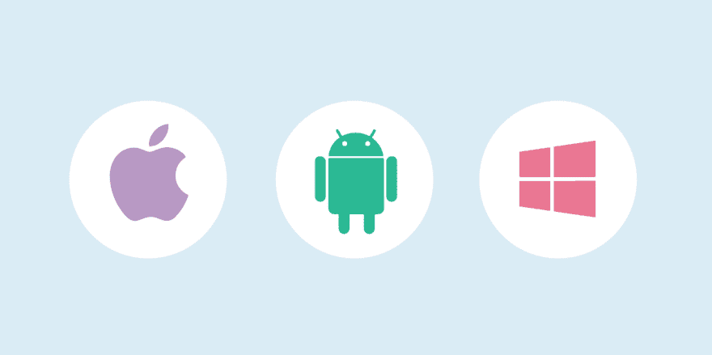
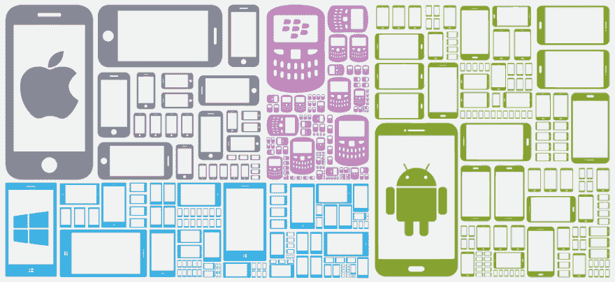
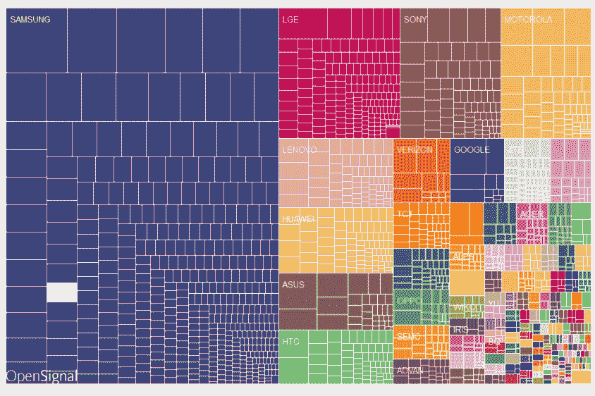
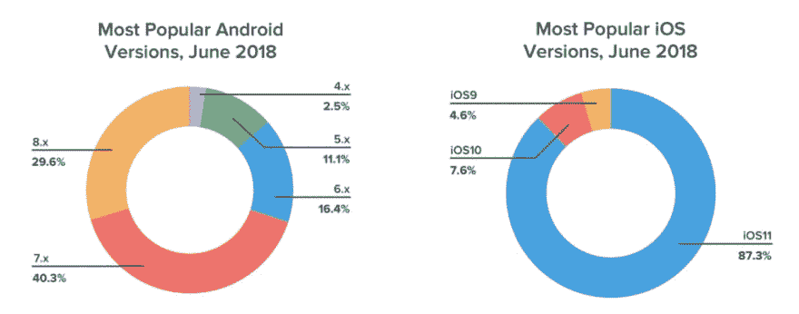
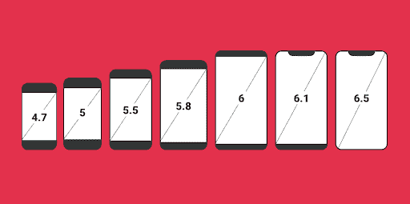

# 移动应用测试的挑战

> 原文：<https://dev.to/pcloudy/challenges-in-mobile-app-testing-330b>

今天，世界上有许多智能手机用户，移动应用程序也越来越受欢迎。为了有足够的竞争力，移动应用必须是独特的，并且应该提供最好的用户体验来增加用户群。随着用户变得越来越见多识广和聪明，构建的应用程序应该跟上步伐。为了做到无懈可击，移动应用程序应该经过严格的测试过程，在这个过程中，测试团队面临许多挑战，如下所述。

**不同的操作系统及其版本**

市场上有不同类型的操作系统，如 iOS、Android、Windows 等。此外，这些操作系统也有不同的版本。因此，在更短的时间内测试这么多版本的移动应用变得很有挑战性。在一种类型的操作系统中运行良好的应用程序在另一种操作系统中可能无法正常运行。用所有支持的平台及其版本测试应用程序是非常重要的，因为我们不知道用户将在哪里安装应用程序。根据研究，与 Android 相比，iOS 用户升级更快，但在 Android 中，设备碎片更大。这意味着开发人员必须支持旧版本，API 和测试人员也必须相应地进行测试。

**设备差异:基于屏幕尺寸**
Android 配备了各种功能，像素密度和比例也各不相同，每种屏幕尺寸都有所不同。即使在苹果公司，随着 iPhone 6 的推出，屏幕尺寸也有所增加。现在，它不仅仅是一个完美的屏幕设计，而是设计一个适应性的屏幕设计。屏幕尺寸如此多样，测试人员的角色变得很重要，因为他们需要检查所有功能在不同屏幕上是否工作良好，像素和纵横比是否保持良好。

**根据设备数量**
下图显示了市场上不同品牌的设备数量。设备制造商的数量增加了。根据 OpenSignal 的数据，仅安卓手机制造商就有大约 1294 家，想象一下如果我们加上其他品牌。这一数据增长的速度让测试人员有点担心，因为测试人员必须检查不同设备上的应用性能，他们可能需要一个设备库来做同样的事情。挑战仍然存在于触摸屏和键盘设备上的复杂用户交互等功能的上下文中。拥有一个设备库肯定是一件昂贵的事情，除非采用仿真，它可以模拟多种设备类型，并且测试可以在其上容易地运行。

各种网络
QA 团队在测试连接到不同网络的设备时也面临着挑战。一般有 2G，3G，4G 移动数据可用。这些提供不同的数据传输速度和传输。即使在今天，不同提供商提供的不同网速对测试人员来说仍然是一个挑战。在这种情况下，测试人员必须检查应用程序必须在不同的网络速度和连接质量下运行良好，并检查应用程序的带宽使用情况。这仍然是一个挑战，因为它是部分可控的，基于不同的网络提供商和不同地理位置的连接访问。

**频繁的操作系统发布**
移动操作系统不断变化。Android 和 iOS 都有超过 10 个版本的操作系统。为了更好的性能和用户体验，他们不断增强和更新他们的版本。这种频繁的操作系统发布带来了[测试挑战](https://www.pcloudy.com/5-best-practices-app-testing-companies-must-follow-for-success/)，因为测试人员需要用每个新的操作系统版本验证完整的应用程序。用最新的操作系统版本测试应用程序是非常重要的，否则应用程序的性能将是一个主要问题，并因此失去使用应用程序的用户。

**脚本执行**
[移动测试](https://www.pcloudy.com/start-to-end-guide-for-mobile-app-testing/)的另一个主要挑战是我们所说的脚本，定义测试的方法。脚本执行可以是手动的，也可以是自动的。您可以在文档中写下脚本，然后由测试工程师使用，他与测试环境手动交互以确定结果，或者您可以运行自动化脚本，进而驱动与设备和应用的交互，并记录结果。

自动化脚本需要远离设备才能真正发挥作用，因为有太多不同的设备具有不同的界面选项。在苹果 iPhone 上遵循严格按键的脚本不可能在三星设备上工作，因为 UI 是不同的。幸运的是，大多数真实设备自动化测试软件提供了在文本、图像或对象层操作的高级脚本。设备模拟器可以使用与设备无关的高级抽象脚本语言来自动执行测试。当您使用自动化脚本时，设置脚本的成本通常会高于一次手工执行测试的成本。但是如果它是您定期运行的测试脚本，那么每次您随后运行脚本时，您将节省更多的时间和精力。如果运行脚本的次数足够多，您最终会收回初始脚本的成本。

因此，总结一下，为了建立更好的用户体验，应用测试人员需要努力克服测试的[挑战。通过采用一些分析技巧和方法，测试人员可以真正应对这些情况。例如，只测试用户群最常用的应用程序和操作系统，采用强大的测试策略，根据具体情况做出决定，例如，决定何时选择自动化和手动测试。从战略上讲，这些挑战是可以克服的。](https://www.pcloudy.com/top-5-tips-for-successful-mobile-application-testing/)

**屏幕尺寸**
Android 世界并不简单。各种不同的宽高比和像素密度让人应接不暇。随着屏幕尺寸为 6.5 英寸的 iPhone Xs Max 的推出，苹果也为 iOS 世界带来了新的屏幕尺寸。尽管 iOS 开发者习惯于像素完美的屏幕设计，但他们现在需要改变思维模式，转而采用自适应屏幕设计。对于测试来说，这意味着我们需要在各种设备上检查所有必要的屏幕元素在不同的屏幕尺寸和纵横比下都是可访问的。2019 年还有很多屏幕尺寸为 5 英寸的手机仍然很受欢迎。

**安全问题**
像 selenium 和 QTP 这样的传统测试工具在设计时并没有考虑到跨平台。web 应用和移动应用的自动化工具是不同的。操作系统尤其是 Android 进一步增加了 API 级碎片的复杂性。移动 app 自动化测试最常见的自动化测试工具是 Appium 和 calabash。每个工具都有自己的优点和缺点，你需要根据你的应用程序的功能来选择。

薄弱的主机控制是最常见的问题之一。托管您的应用程序的服务器应该有安全措施来防止未经授权的用户弱加密可能会导致数据被盗，从而影响用户的信任度。大多数移动应用程序需要用户数据，如电子邮件 ID、密码、年龄、位置等。这些数据应该加密并以适当的安全方式存储。黑客经常利用这类数据从用户的网上账户中取钱。加密将使任何未经授权的人很难入侵和检索这些数据，而不是以纯文本的形式保存。

**功耗和电池寿命**
我们还没有看到移动电池有太多的创新，但移动电池的使用和规格正在迅速增加。如今，人们使用的应用程序越来越多，而且比以往任何时候都更加复杂。这就是为什么测试人员需要测试应用程序的功耗，因为如果应用程序使用大量的 CPU 周期，并且一些应用程序也将在后台运行，那么电池将很快耗尽。我们需要确保应用程序使用更少的电池电量，以便用户可以使用更长的时间。

**结论**
移动应用正随着设备技术和用户期望而发展。开发者强调减少应用程序的大小和电池的使用。测试人员的主要作用是确保应用程序运行顺畅，不会崩溃或出现错误。这就是为什么测试人员必须了解移动应用测试的最新趋势，以应对移动应用测试的挑战。