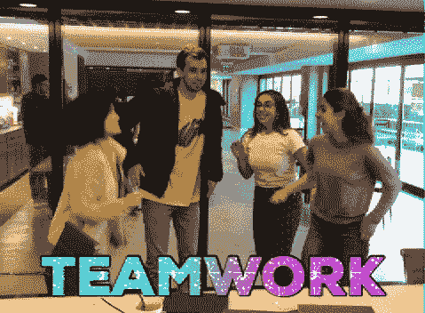

# 在你的软件开发旅程中寻找导师

> 原文：<https://dev.to/jasonbasuil/finding-mentors-in-your-software-development-journey-2fdo>

“你自己需要多长时间才能搞清楚一件事？一辈子。

*学习别人的经验需要多长时间？午餐。"*

作为开发者，我们喜欢偷懒。我们喜欢使用已经有效的工具，帮助我们更快地构建产品。我们不喜欢重新发明轮子。我们喜欢完成任务！技术领域已经发展得够快了，我们需要不断跟上当今的趋势。对于新开发人员来说，快速上手并最终获得第一份工作需要大量的努力、实践和失败。挑战和斗争是不可避免的，但最终的回报会变得更加甜蜜。

如果有一种方法可以快速跟踪你的学习、求职结果以及你的整体成长，那会怎么样？无论你是刚从大学毕业，还是刚从编码训练营毕业，你都需要所有你能得到的帮助来成为你能成为的最好的开发者。

这就是导师的用武之地。

## 什么是导师？

作为一个年轻的成年人，我学到了一个最快的方法去实现你的人生目标，那就是找到一个处在你想要的位置上的人，然后问他们是怎么做到的。导师只是一个能帮你指明正确方向的人。

## 导师以各种形式存在于我们周围

当你听到“导师”这个词时，往往会觉得这是导师和学员之间的正式关系。这绝对是真的，但是我们在日常生活中会受到各种人的指导:父母、老师、同学、同事和朋友。任何能对你的现状提供新观点的人都可以在某种程度上成为你的导师。他们可以帮助你形成决定、想法和观点，并教会你一些你自己可能想不出来的东西。

我个人认为，在与他人的关系中接受指导是被指导的最有力的方式之一。然而，如果你有问题或者想要新的观点，有大量的其他资源可以获得类似的见解。

*   书
*   博客
*   StackOverflow
*   教程
*   油管（国外视频网站）
*   在线社区
*   网络研讨会

今天你可以学任何你想学的东西。这就是谷歌为我们所做的。组织世界上的信息，并使其普遍可用和有用。

## 人们想帮助你

对开发人员的成长有害的一种心态是相信你应该自己想办法解决问题。或者认为如果你向某人寻求帮助，你要么在打扰他们，要么他们会认为你很愚蠢。胡说八道！

总的来说，如果你努力尝试自己解决问题，然后去找能帮你解决问题的人，他们会非常乐意帮忙(甚至受宠若惊)。

## 如何找到要联系的人

*   朋友/同事/同学
*   LinkedIn。推特。IG。你可以在网上找到任何人。
*   聚会/群组

小贴士:ABN(永远保持人际关系网)。你永远不知道你会遇到谁，通常在这种情况下，你会意外地遇到某个可能想要帮助你的人。

专业提示:准备好你的电梯间推介。

## 知道要找什么

**经历**

当你寻找潜在的联系人时，你应该考虑什么样的人对你的情况最有帮助。如果你是一个从编码训练营毕业的人，那么什么更有意义呢:联系工程副总裁，他是计算机科学学士/硕士毕业，有 20 年的行业经验，还是一个离开训练营 2-3 年，目前正在做第一份或第二份工作的人？你可能会有更多的运气，和比你年长几岁的人有更好的交流。

**角色**

你想成为全栈玩家吗？前端？后端？QA？SDET？也许作为一个新手，你可能不知道你想成为什么类型的开发人员，这完全没问题。做你的研究，尝试一些东西，看看你可能更喜欢什么。当你向某人伸出援手，了解他们的角色时，他们会告诉你他们的观点，帮助你走向正确的方向。

**个人素质**

你会在一个人身上寻找什么品质？他们是否开放并愿意提供帮助？你想要一个有同情心的倾听者吗？你想找一个和你背景相似的人吗？

特别是如果你来自一个代表性不足的背景，找到一个和你来自相似地方的导师会令人难以置信的授权和激励。代表性很重要！

提示:无论你来自什么背景，都要努力寻找支持或创建社区的聚会！

## 伸出手去

在你的社交网络中，认识一个值得联系的人吗？

提议带他们出去喝咖啡。找个时间和他们通个电话。让他们尽可能容易地与你联系。建立融洽关系。找到你们的共同点。

提示:提前准备具体的问题。

**没有人脉却知道自己想联系的人是什么类型？**

LinkedIn 是你最好的朋友。你可以搜索你所在城市的任何人，某个特定的公司，某个特定的角色，以及你是否已经有了任何相互的联系。

总是给你想在 LinkedIn 上联系的人发送个性化信息。当你联系时，也要问得具体一些。如果可能的话，试着联系你们的共同点。

建议:如果你能找到一些方法来为他们的生活增加价值或者马上建立联系，他们可能会更愿意帮助你。要有给予多于索取的心态。

## 管理关系

你甚至可能不会把你与新关系的关系标为正式的导师/学员关系。如果是的话，这完全没问题，但通常这种关系是随意的，很自然地起到了导师的作用。

**你可能想和导师一起做的事情**

*   请他们检查你的投资组合
*   征求对项目/代码的反馈
*   让他们指出你可以改进的地方
*   让他们了解你的最新进展(求职、社交等)。)

你能从师友关系中得到的一些最好的建议是你可能没有注意到的关于你自己的事情。他们可以帮助你专注于正确的领域，从而节省你大量的时间和精力。

建议:了解他们的时间，尽可能做好准备。同时，对他们帮助你表示真诚的感谢。

## 结论:当你找到合适的人时，导师会很神奇

如果你有一个开放的心态，你可以在任何地方找到导师，他们可以让你的生活变得更容易，并且在你成为一名伟大的开发人员的过程中可以节省你很多时间。有效的指导关系不一定是正式的。只要确保这段关系符合你自己的需求和目标。

有很多人处于你的位置，想要回馈帮助他人。最后，这都是你建立的关系。在你成为一名开发人员的过程中，这些关系对你的帮助比你意识到的要多，而且往往会引导你下一次工作。

### 现在走出去，认识一些了不起的人吧！

**如果你想保持联系，请查看下面我的社交网站:**
[LinkedIn](https://www.linkedin.com/in/jasonbasuil/)
[Twitter](https://twitter.com/jasonbasuil)

**或者我的非营利组织，该组织旨在帮助那些对进入科技领域感兴趣的人数不足的高中生:**
[前往 X](https://www.destinedforx.com/)