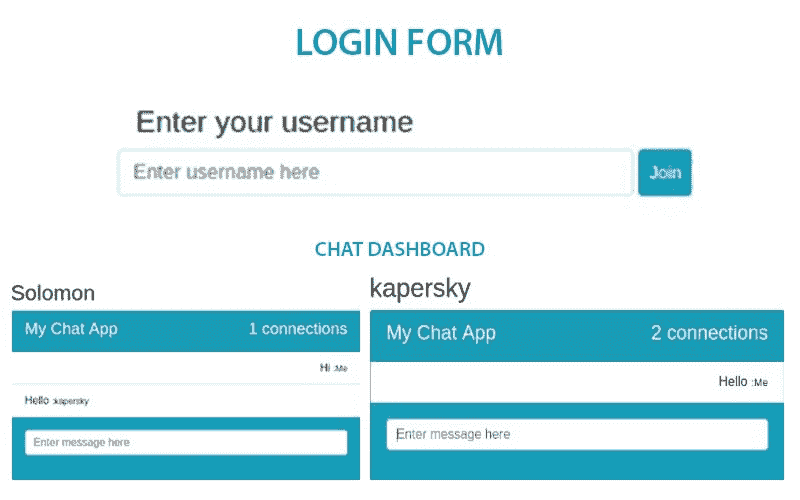

# 用 vuejs，socket 搭建一个实时聊天 app。IO 和 Nodejs

> 原文：<https://dev.to/kaperskyguru/build-a-real-time-chat-app-with-vuejs-socket-io-and-nodejs-41eh>

在我之前为后端开发人员编写的关于 Vue.js 的教程中，我列出了一个[后端开发人员](https://dev.to/kaperskyguru/top-5-backend-frameworks-3oml-temp-slug-2451065)需要在 Vue.js 中学习的重要内容，所以我决定利用列出的一些内容来创建一个生产就绪的实时聊天应用程序。

在这篇文章中，我将向你展示我如何用 VUEJS、NODEJS、EXPRESS 和 SOCKET.IO 构建一个实时聊天应用程序。

下面是我们将要构建的内容的截图:

我不是一个前端的家伙，所以不要嘲笑我的设计，颜色和设计是我的敌人，我正在努力和他们交朋友。这只是为了演示一下。

<figure>[](https://res.cloudinary.com/practicaldev/image/fetch/s--LYZIjUX4--/c_limit%2Cf_auto%2Cfl_progressive%2Cq_auto%2Cw_880/https://codelikemad.com.ng/wp-content/uploads/2019/04/WhatsApp-Image-2019-04-01-at-10.47.11-AM.jpeg) 

<figcaption>我们将建设什么。</figcaption>

</figure>

**设置**

在本教程中，Node.js 和 NPM 是必需的，如果您还没有安装 NodeJS，您可以从这里安装。

*   需要 JavaScript 的基础知识。

*   此外，很少或没有 VUEJS 的知识是必需的。

如果一切都准备好了，我们就开始吧。

为应用程序创建一个目录，用你喜欢的编辑器打开目录，我用的是 visual studio 代码。

如果你愿意，你可以使用终端。

```
 mkdir ChatApp && cd ChatApp && code . 
```

Enter fullscreen mode Exit fullscreen mode

接下来，让我们用 NPM 初始化目录。

```
 npm init 
```

Enter fullscreen mode Exit fullscreen mode

当系统提示您填写一些信息时，请继续或按 enter 键选择默认选项。这些信息将用于设置您的包。json 文件。

**依赖项安装。**

让我们安装应用程序依赖项。我将列出所需的依赖项以及如何安装它们。我们将保持简单，只安装这两个依赖项。

一.**快递**

```
 npm install express --save 
```

Enter fullscreen mode Exit fullscreen mode

二。**插座。IO**

```
 npm install --save socket.io 
```

Enter fullscreen mode Exit fullscreen mode

安装完所有依赖项后，运行

```
npm install 
```

Enter fullscreen mode Exit fullscreen mode

它将安装所有需要的软件包。

**带有 VUEJS(标记)的前端**

在前端，我们将使用 Vue。j 的，让我们开始安装 Vue。在我们的目录中，还有 bootstrap 4.3.1

创建一个 index.html 文件。

```
 touch index.html 
```

Enter fullscreen mode Exit fullscreen mode

包括 Vue。在我们的项目中，我们只需复制 CDN 并包含在我们的*index.html*文件的脚本部分。