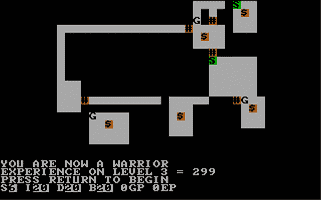
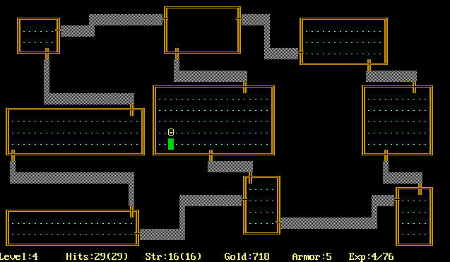
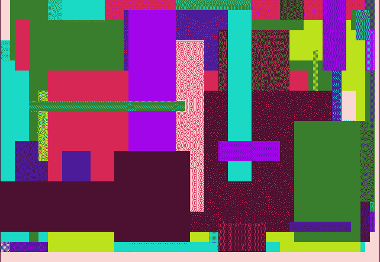
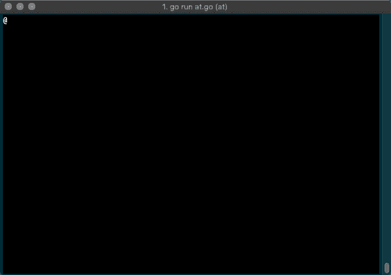

# 流氓围棋的尝试第 1 部分

> 原文：<https://dev.to/shindakun/a-stab-at-roguish-go-part-01-2nc6>

# ATLG Rogue

## 好的

我想从看 API 之类的东西中休息一下，但是不能完全决定整个星期要做什么。答案在一天多前看到一个关于[“7 天流氓喜欢”](https://itch.io/jam/7drl-challenge-2019)比赛评委的帖子时有了。特别是最近在大脑上出现的罗格里克斯、[奈特哈克](https://www.nethack.org/)和 [ADOM](https://www.adom.de/home/index.html) ，这是一个短暂的跳跃。

[](https://res.cloudinary.com/practicaldev/image/fetch/s--BJRaPq22--/c_limit%2Cf_auto%2Cfl_progressive%2Cq_66%2Cw_880/https://thepracticaldev.s3.amazonaws.com/i/uiwt9gcsf8hini7s4ycq.gif)

但是，首先给那些不知道我在说什么的人上一堂快速的历史课。在计算机拥有强大的图形处理器之前，基于文本的游戏风靡一时。1978 年的《苹果庄园下的*是第一款类似 roguelike 的商业游戏。它在两年前登陆了一些同名流派——[*流氓*](https://en.wikipedia.org/wiki/Rogue_(video_game)) 。要点是，作为玩家，你必须深入地牢取回一件强大的神器。战斗怪物，找到武器和升级和死亡。*

 *[](https://res.cloudinary.com/practicaldev/image/fetch/s---ciSJAbf--/c_limit%2Cf_auto%2Cfl_progressive%2Cq_auto%2Cw_880/https://thepracticaldev.s3.amazonaws.com/i/ko9r2dv6mt65uxdare81.PNG)

* * *

我们不打算写一个完整的系统来绘制到控制台。相反，我们将从 [`tcell`](https://github.com/gdamore/tcell/) 开始，并将其作为我们的基础。在 [Roguebasin](http://roguebasin.roguelikedevelopment.org/index.php?title=How_to_Write_a_Roguelike_in_15_Steps) 上有一个老帖子叫做*如何用 15 个步骤写一篇 rogue like*。我们将执行第一步到第三步。

* * *

## 入门

我们需要做的第一件事是从 GitHub 克隆`tcell` repo。之后，我们导航到`_demos`目录。哦，我们一定不能忘记实际上的`go get` `tcell`。

```
➜ git clone https://github.com/gdamore/tcell.git
➜ cd tcell/_demos
➜ _demos git:(master) ✗ go get github.com/gdamore/tcell
➜ _demos git:(master) ✗ go run boxes.go 
```

Enter fullscreen mode Exit fullscreen mode

[](https://res.cloudinary.com/practicaldev/image/fetch/s--scNXBWP8--/c_limit%2Cf_auto%2Cfl_progressive%2Cq_auto%2Cw_880/https://thepracticaldev.s3.amazonaws.com/i/npl3bbc2fek5tcmbviqk.png)

回购协议包括四个例子，我们可以开始尝试挑选出来。这四个都是简单程序循环的好例子。这里有一小段来自`boxes.go`中的`main()`。首先，它设置一个 ASCII 字符回退，然后创建一个新的`screen`。如果其中任何一项失败，我们将退出并返回错误代码`1`。屏幕初始化后，我们可以设置我们的风格，在这种情况下，一个黑色文本的白色背景。最后，我们清空屏幕。

```
 tcell.SetEncodingFallback(tcell.EncodingFallbackASCII)
  s, e := tcell.NewScreen()
  if e != nil {
    fmt.Fprintf(os.Stderr, "%v\n", e)
    os.Exit(1)
  }
  if e = s.Init(); e != nil {
    fmt.Fprintf(os.Stderr, "%v\n", e)
    os.Exit(1)
  }

  s.SetStyle(tcell.StyleDefault.
    Foreground(tcell.ColorBlack).
    Background(tcell.ColorWhite))
  s.Clear() 
```

Enter fullscreen mode Exit fullscreen mode

简单吧？紧接着，我们创建一个`quit`通道和一个匿名`goroutine`。`tcell.EventKey`打算负责阅读键盘输入。完美！我们应该可以更新这个来在屏幕上移动我们的玩家符号。

```
 quit := make(chan struct{})
  go func() {
    for {
      ev := s.PollEvent()
      switch ev := ev.(type) {
      case *tcell.EventKey:
        switch ev.Key() {
        case tcell.KeyEscape, tcell.KeyEnter:
          close(quit)
          return
        case tcell.KeyCtrlL:
          s.Sync()
        }
      case *tcell.EventResize:
        s.Sync()
      }
    }
  }() 
```

Enter fullscreen mode Exit fullscreen mode

现在，我们进入主循环。它检查`quit`通道，看我们是否应该退出。如果没有，我们运行`makebox()`。我们将跳过这段代码，因为我们不需要它。

```
 cnt := 0
  dur := time.Duration(0)
loop:
  for {
    select {
    case <-quit:
      break loop
    case <-time.After(time.Millisecond * 50):
    }
    start := time.Now()
    makebox(s)
    cnt++
    dur += time.Now().Sub(start)
  }

  s.Fini() 
```

Enter fullscreen mode Exit fullscreen mode

## 真实起点

我们旅程的第一步是将代码从`boxes.go`复制并粘贴到一个新文件中。我用了`at.go`。然后我们会把它修剪成我们需要的样子。如果我们运行代码，我们会看到一个空白屏幕，直到我们点击退出。

```
package main

import (
  "fmt"
  "math/rand"
  "os"
  "time"

  "github.com/gdamore/tcell"
)

func main() {
  tcell.SetEncodingFallback(tcell.EncodingFallbackASCII)
  s, e := tcell.NewScreen()
  if e != nil {
    fmt.Fprintf(os.Stderr, "%v\n", e)
    os.Exit(1)
  }
  if e = s.Init(); e != nil {
    fmt.Fprintf(os.Stderr, "%v\n", e)
    os.Exit(1)
  }

  s.SetStyle(tcell.StyleDefault.
    Foreground(tcell.ColorBlack).
    Background(tcell.ColorWhite))
  s.Clear()

  quit := make(chan struct{})
  go func() {
    for {
      ev := s.PollEvent()
      switch ev := ev.(type) {
      case *tcell.EventKey:
        switch ev.Key() {
        case tcell.KeyEscape, tcell.KeyEnter:
          close(quit)
          return
        case tcell.KeyCtrlL:
          s.Sync()
        }
      case *tcell.EventResize:
        s.Sync()
      }
    }
  }()

loop:
  for {
    select {
    case <-quit:
      break loop
    case <-time.After(time.Millisecond * 50):
    }

    // makebox(s)
  }

  s.Fini()
} 
```

Enter fullscreen mode Exit fullscreen mode

* * *

## 打印到屏幕上

我们有一个良好的开端，但让我们黑进打印到屏幕上的能力。我再次跳回到演示代码中。在`mouse.go`中，我们有一个很好的例子来说明如何在`emitStr()`中将文本写到屏幕上。下周我可能会花些时间通读整个`tcell`代码库，让自己更熟悉一些。但是现在，我们将从例子中大量借用。注意，我们需要`go get github.com/mattn/go-runewidth`来利用这个函数。

无论如何，我们要遍历字符串，确定符文的宽度，一次一个字符。一边走一边计算我们需要的间距。然后我们将它和我们的风格传递给`SetContent()`。这设置了我们将要在屏幕上显示的内容，但实际上并不显示任何内容。`Show()`或`Sync()`稍后会处理。

```
func emitStr(s tcell.Screen, x, y int, style tcell.Style, str string) {
  for _, c := range str {
    var comb []rune
    w := runewidth.RuneWidth(c)
    if w == 0 {
      comb = []rune{c}
      c = ' '
      w = 1
    }
    s.SetContent(x, y, c, comb, style)
    x += w
  }
} 
```

Enter fullscreen mode Exit fullscreen mode

* * *

## 你在哪里

大家一起把我们的`@`在屏幕上展示出来吧！我们从添加`emitStr()`开始。

```
package main

import (
  "fmt"
  "math/rand"
  "os"
  "time"

  "github.com/gdamore/tcell"
  "github.com/mattn/go-runewidth"
)

func emitStr(s tcell.Screen, x, y int, style tcell.Style, str string) {
  for _, c := range str {
    var comb []rune
    w := runewidth.RuneWidth(c)
    if w == 0 {
      comb = []rune{c}
      c = ' '
      w = 1
    }
    s.SetContent(x, y, c, comb, style)
    x += w
  }
}

func main() {
  tcell.SetEncodingFallback(tcell.EncodingFallbackASCII)
  s, e := tcell.NewScreen()
  if e != nil {
    fmt.Fprintf(os.Stderr, "%v\n", e)
    os.Exit(1)
  }
  if e = s.Init(); e != nil {
    fmt.Fprintf(os.Stderr, "%v\n", e)
    os.Exit(1)
  } 
```

Enter fullscreen mode Exit fullscreen mode

我们想交换前景和背景的颜色，这样我们就可以保持一个漂亮的深色背景。我们还设置了`white`来直接传递给我们的打印函数。

```
 white := tcell.StyleDefault.
    Foreground(tcell.ColorWhite).
    Background(tcell.ColorBlack)

  s.SetStyle(tcell.StyleDefault.
    Foreground(tcell.ColorWhite).
    Background(tcell.ColorBlack))
  s.Clear()

  quit := make(chan struct{})
  go func() {
    for {
      ev := s.PollEvent()
      switch ev := ev.(type) {
      case *tcell.EventKey:
        switch ev.Key() {
        case tcell.KeyEscape, tcell.KeyEnter:
          close(quit)
          return
        case tcell.KeyCtrlL:
          s.Sync()
        }
      case *tcell.EventResize:
        s.Sync()
      }
    }
  }()

loop:
  for {
    select {
    case <-quit:
      break loop
    case <-time.After(time.Millisecond * 50):
    } 
```

Enter fullscreen mode Exit fullscreen mode

我们把屏幕放在我们的循环中。然后放置我们的角色。最后，我们调用`Show()`将它实际显示在屏幕上。

```
 s.Clear()
    emitStr(s, 0, 0, white, "@")
    s.Show()
  }

  s.Fini()
} 
```

Enter fullscreen mode Exit fullscreen mode

[](https://res.cloudinary.com/practicaldev/image/fetch/s--9pWicLRp--/c_limit%2Cf_auto%2Cfl_progressive%2Cq_auto%2Cw_880/https://thepracticaldev.s3.amazonaws.com/i/hropulhlcletftbvh03i.png)

我们做到了！但这还不够好，我们可以更进一步！

* * *

## 婴儿步伐

我想这可能是我在帖子中列出的最多的代码了。希望这不会让阅读变得困难。每一个都足够小，我认为它们容易消化——请在评论中告诉我。无论如何，是时候让我们的小“冒险家”迈出他或她的第一步，去环游一个更大的世界(或者像现在这样的黑色深渊)。

```
package main

import (
  "fmt"
  "os"
  "time"

  "github.com/gdamore/tcell"
  "github.com/mattn/go-runewidth"
) 
```

Enter fullscreen mode Exit fullscreen mode

我们的“播放器”将是一个非常简单的结构，它保存我们希望播放器所在位置的 X 和 Y 坐标。我们将用它来告诉`emitStr()`我们在哪里，更新它将允许我们在屏幕上移动。

```
type player struct {
  x int
  y int
}

func emitStr(s tcell.Screen, x, y int, style tcell.Style, str string) {
  for _, c := range str {
    var comb []rune
    w := runewidth.RuneWidth(c)
    if w == 0 {
      comb = []rune{c}
      c = ' '
      w = 1
    }
    s.SetContent(x, y, c, comb, style)
    x += w
  }
} 
```

Enter fullscreen mode Exit fullscreen mode

`debug`？我们将添加一些代码，将玩家的当前位置打印到屏幕上。当我们在这里时，我们也在`0,0`初始化我们的播放器。

```
func main() {
  debug := false
  player := player{
    x: 0,
    y: 0,
  }

  tcell.SetEncodingFallback(tcell.EncodingFallbackASCII)
  s, e := tcell.NewScreen()
  if e != nil {
    fmt.Fprintf(os.Stderr, "%v\n", e)
    os.Exit(1)
  }
  if e = s.Init(); e != nil {
    fmt.Fprintf(os.Stderr, "%v\n", e)
    os.Exit(1)
  }

  white := tcell.StyleDefault.
    Foreground(tcell.ColorWhite).
    Background(tcell.ColorBlack)

  s.SetStyle(tcell.StyleDefault.
    Foreground(tcell.ColorWhite).
    Background(tcell.ColorBlack))
  s.Clear() 
```

Enter fullscreen mode Exit fullscreen mode

我们扩展了输入处理程序，从箭头键获取输入。我们将根据当前位置和按键，根据需要增加或减少玩家的 X 和/或 Y。我们还添加了`Ctrl-D`，它将翻转我们的`debug`布尔值，允许我们打开和关闭调试消息。

```
 quit := make(chan struct{})
  go func() {
    for {
      x, y := s.Size()
      ev := s.PollEvent()
      switch ev := ev.(type) {
      case *tcell.EventKey:
        switch ev.Key() {
        case tcell.KeyEscape, tcell.KeyEnter:
          close(quit)
          return
        case tcell.KeyRight:
          if player.x+1 < x {
            player.x++
          }
        case tcell.KeyLeft:
          if player.x-1 >= 0 {
            player.x--
          }
        case tcell.KeyUp:
          if player.y-1 >= 0 {
            player.y--
          }
        case tcell.KeyDown:
          if player.y+1 < y {
            player.y++
          }
        case tcell.KeyCtrlD:
          debug = !debug
        case tcell.KeyCtrlL:
          s.Sync()
        }
      case *tcell.EventResize:
        s.Sync()
      }
    }
  }()

loop:
  for {
    select {
    case <-quit:
      break loop
    case <-time.After(time.Millisecond * 50):
    }
    s.Clear() 
```

Enter fullscreen mode Exit fullscreen mode

这是我们的调试消息代码。我们确保它考虑了玩家当前所在的行，以便在屏幕的第 0 行或最后一行打印。然后我们画出我们的角色并开始循环。

```
 dbg := fmt.Sprintf("player x: %d y: %d", player.x, player.y)
    if debug == true {
      var yy int
      if player.y == 0 {
        _, yy = s.Size()
        yy--
      } else {
        yy = 0
      }
      emitStr(s, 0, yy, white, dbg)
    }

    emitStr(s, player.x, player.y, white, "@")
    s.Show()
  }

  s.Fini()
} 
```

Enter fullscreen mode Exit fullscreen mode

[](https://res.cloudinary.com/practicaldev/image/fetch/s--syMN2icZ--/c_limit%2Cf_auto%2Cfl_progressive%2Cq_66%2Cw_880/https://thepracticaldev.s3.amazonaws.com/i/gqj3ayjnq9jop26ff256.gif)

* * *

## 包装完毕

抓取一些代码并快速创建一个小的概念程序是很有趣的。我还没有决定我们是继续“15 步”的旅程，还是回到某种实用程序。请在评论中告诉我你的想法。

* * *

你可以在 GitHub 上的 repo 中找到这个和大多数其他试图学习围棋的帖子的代码。

##  [【新达昆】](https://github.com/shindakun) / [ atlg](https://github.com/shindakun/atlg)

### 我在 dev.to 上发布的“尝试学习围棋”帖子的来源报告

<article class="markdown-body entry-content container-lg" itemprop="text">

# 尝试学习围棋

在这里你可以找到我为尝试学习围棋而写的代码，这些代码是我在 [Dev.to](https://dev.to/shindakun) 上写的。

## 帖子索引

| 邮政 | 密码 |
| --- | --- |
| [制作下载器第 01 部分](https://dev.to/shindakun/attempting-to-learn-go---building-a-downloader-part-01-44gl) | - |
| [制作下载器第 02 部分](https://dev.to/shindakun/attempting-to-learn-go---building-a-downloader-part-02-2k7i) | - |
| [制作下载器第 03 部分](https://dev.to/shindakun/attempting-to-learn-go---building-a-downloader-part-03-2214) | - |
| [制作下载器第 4 部分](https://dev.to/shindakun/attempting-to-learn-go---building-a-downloader-part-04-3ln9) | - |
| [制作下载器第 05 部分](https://dev.to/shindakun/attempting-to-learn-go---building-a-downloader-part-05-44o) | - |
| [使用 REST API](https://dev.to/shindakun/attempting-to-learn-go---consuming-a-rest-api-5c7g) | [src](https://raw.githubusercontent.com/shindakun/atlg/master//go-api-01/main.go) |
| [继续休息冒险](https://dev.to/shindakun/attempting-to-learn-go---continuing-rest-adventures-2l4l) | [src](https://raw.githubusercontent.com/shindakun/atlg/master//go-api-02/main.go) |
| [现在发送休息请求](https://dev.to/shindakun/attempting-to-learn-go---now-sending-rest-requests-akp) | [src](https://raw.githubusercontent.com/shindakun/atlg/master//go-api-03/main.go) |
| [REST API 和模板上的位](https://dev.to/shindakun/attempting-to-learn-go---rest-api-and-a-bit-on-templates-4kca) | [src](https://raw.githubusercontent.com/shindakun/atlg/master//go-api-04/main.go) |
| [再次通过 API 发送电子邮件](https://dev.to/shindakun/attempting-to-learn-go---sending-email-via-api-again-2e4e) | [src](https://raw.githubusercontent.com/shindakun/atlg/master//go-api-05/main.go) |
| [让我们模块化吧！](https://dev.to/shindakun/attempting-to-learn-go---lets-get-modular-390i) | [src](https://github.com/shindakun/mailgunner) |
| [让我们再一次模块化！](https://dev.to/shindakun/attempting-to-learn-go---lets-get-modular---again-10cd) | [src](https://github.com/shindakun/mailgunner) |
| [构建开发日志第 1 部分](https://dev.to/shindakun/attempting-to-learn-go---building-dev-log-part-01-1c3m) | [src](https://raw.githubusercontent.com/shindakun/atlg/master//go-devsite-01/main.go) |
| [构建开发日志第 2 部分](https://dev.to/shindakun/attempting-to-learn-go---building-dev-log-part-02-179c) | [src](https://raw.githubusercontent.com/shindakun/atlg/master//go-devsite-02/main.go) |
| [构建开发日志第 3 部分](https://dev.to/shindakun/attempting-to-learn-go---building-dev-log-part-03-7lk) | [src](https://raw.githubusercontent.com/shindakun/atlg/master//go-devsite-03/main.go) |
| [构建开发日志第 4 部分](https://dev.to/shindakun/attempting-to-learn-go---building-dev-log-part-04-2bok) | [src](https://raw.githubusercontent.com/shindakun/atlg/master//go-devsite-04/main.go) |
| [构建开发日志第 5 部分](https://dev.to/shindakun/attempting-to-learn-go---building-dev-log-part-05-4mo1) | [src](https://raw.githubusercontent.com/shindakun/atlg/master//go-devsite-05/main.go) |
| [按扩展名 01 列出文件](https://dev.to/shindakun/attempting-to-learn-go---listing-files-by-extension-1n10) | [src](https://raw.githubusercontent.com/shindakun/atlg/master//go-sort-01/main.go) |
| [按扩展名 02 列出文件](https://dev.to/shindakun/attempting-to-learn-go---sorting-and-moving-files-by-extension-227j) | [src](https://raw.githubusercontent.com/shindakun/atlg/master//go-sort-01/main.go) |
| [开发至 API 01](https://dev.to/shindakun/interacting-with-the-devto-article-api-4g34) | [src](https://raw.githubusercontent.com/shindakun/atlg/master//go-devtoapi-01/main.go) |
| [开发至 API 02](https://dev.to/shindakun/interacting-with-the-devto-article-api---again-sort-of-2o8g) | 参见上面的代码 |
| [发行人](https://dev.to/shindakun/attempting-to-learn-go-issuer-01-5f0k) |

…</article>

[View on GitHub](https://github.com/shindakun/atlg)

* * *

| 喜欢这篇文章吗？ |
| --- |
| 给我买杯咖啡怎么样？ |

* * **