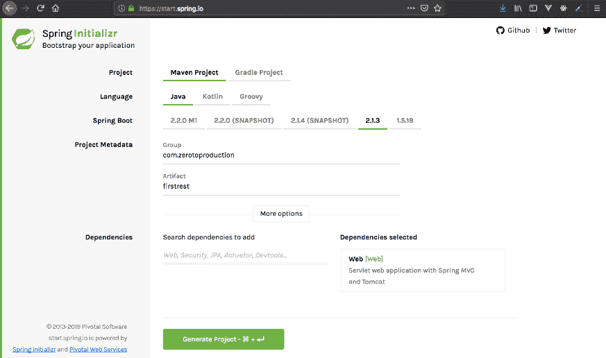
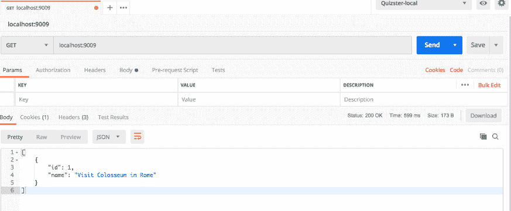
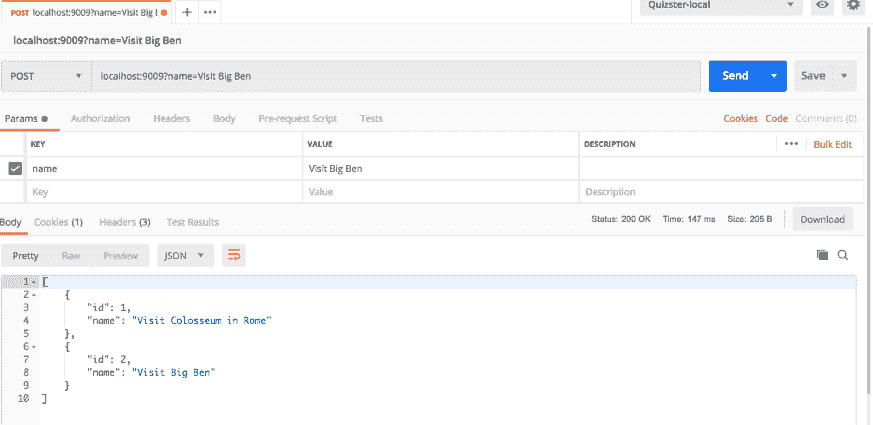
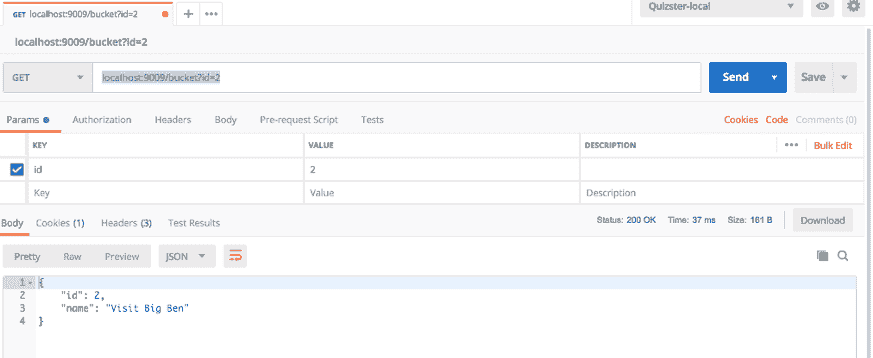
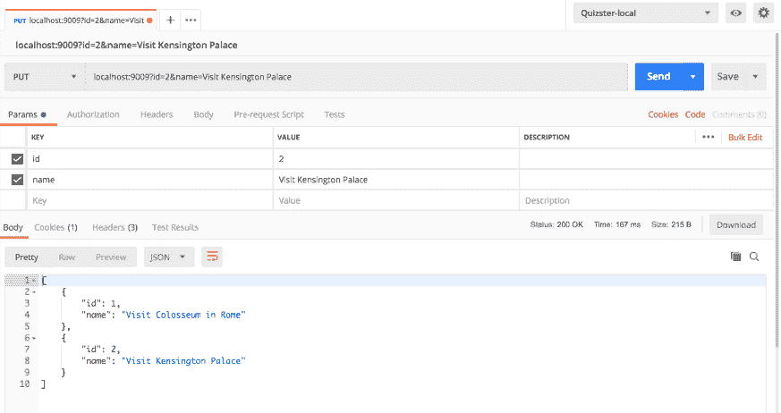
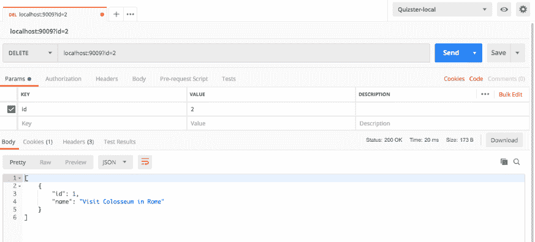

# 把你的春靴部署到 Heroku

> 原文：<https://dev.to/paultofunmi/deploying-your-spring-boot-to-heroku-3bf5>

在本教程中，您将学习如何使用 Spring Boot 开发 RESTful API 并将您的 API 发布到 Heroku。首先，我们将构建 api 完成后，我们将部署到 Heroku。

[](https://res.cloudinary.com/practicaldev/image/fetch/s--Q_enrVKn--/c_limit%2Cf_auto%2Cfl_progressive%2Cq_auto%2Cw_880/https://cdn-images-1.medium.com/max/873/1%2A5JTH58x775NGDTAOsgLRLA.jpeg)

**休息简介**

RESTful API 或 web 服务是一个应用程序编程接口，使用 HTTP 请求类型:GET、POST、DELETE 和 PUT 来对数据执行操作。它通常比最接近的替代简单对象访问协议(SOAP)更受欢迎，因为它需要的资源更少。通过编写遵循 RESTful 实践的 API，您同意采用一种表示、请求、存储和删除数据的架构风格。

GET:它用于请求数据。您可以请求单个项目或项目列表

PUT:它用于更新一个项目。

发布:它用于创建一个项目

删除:用于删除一个项目。

**教程中使用的工具**

```
IDE: IntelliJ
Framework: Spring Boot
Dependency: Spring boot starter web
Build Tool: Maven
Language: Java
Hosting platform: Heroku 
```

Spring boot starter web 包含引导嵌入式服务器等应用程序所需的一切。Tomcat 是默认的。

如果您没有 Heroku 帐户，您可以使用此链接注册

我们在建造什么？

想象一下，我们有一个愿望清单，上面列有我们一生中想去或想去的地方。我希望你知道。我们将创建一个应用程序来添加，编辑，查看和删除我们的遗愿清单中的项目。在本教程中，我们将使用一个非持久数据库(数组列表)；如果你想要一个持久存储，请在下面评论，因为我们有另一个教程。

**第一节**

1.  转到 start.spring.io 并为您的应用程序提供组和工件名称。这是一个用 Java 编写的 Maven 项目，依赖项是 Web。

2.  唯一需要的依赖是 Web 依赖。

3.  点击生成项目

4.  解压到你的电脑，并将下载的 maven 项目导入到你最喜欢的编辑器中

5.  在编辑器中打开提取的文件夹。

[](https://res.cloudinary.com/practicaldev/image/fetch/s--dVJrekxg--/c_limit%2Cf_auto%2Cfl_progressive%2Cq_auto%2Cw_880/https://cdn-images-1.medium.com/max/873/1%2AApR3E0oOEFLVHrD1cw72uQ.png)

**该写点代码了**

我们需要创建两个 Java 类。一个将作为接收请求和响应的控制器。第二个将作为数据模型。

数据模型(桶列表)

```
package com.zerotoproduction.firstrest;

public class BucketList {

private long id;
private String name;

BucketList(long id, String name){
    this.id = id;
    this.name = name;
}

public long getId() {
    return id;
}

public void setId(long id) {
    this.id = id;
}

public String getName() {
    return name;
}

public void setName(String name) {
    this.name = name;
}
} 
```

控制器(桶列表控制器)

```
package com.zerotoproduction.firstrest;

import org.springframework.http.ResponseEntity;
import org.springframework.web.bind.annotation.*;

import java.util.ArrayList;
import java.util.List;
import java.util.concurrent.atomic.AtomicLong;

@RestController
public class BucketListController {

private List<BucketList> myBucketList = new ArrayList();
private final AtomicLong counter = new AtomicLong();

public BucketListController(){
    myBucketList.add(new BucketList(counter.incrementAndGet(), "Visit Colosseum in Rome"));
}

@GetMapping(value = "/")
public ResponseEntity index() {
    return ResponseEntity.ok(myBucketList);
}

@GetMapping(value = "/bucket")
public ResponseEntity getBucket(@RequestParam(value="id") Long id) {
    BucketList itemToReturn = null;
    for(BucketList bucket : myBucketList){
        if(bucket.getId() == id)
            itemToReturn = bucket;
    }

    return ResponseEntity.ok(itemToReturn);
}

@PostMapping(value = "/")
public ResponseEntity addToBucketList(@RequestParam(value="name") String name) {
    myBucketList.add(new BucketList(counter.incrementAndGet(), name));
    return ResponseEntity.ok(myBucketList);
}

@PutMapping(value = "/")
public ResponseEntity updateBucketList(@RequestParam(value="name") String name, @RequestParam(value="id") Long id) {
    myBucketList.forEach(bucketList ->  {
        if(bucketList.getId() == id){
            bucketList.setName(name);
        }
    });
    return ResponseEntity.ok(myBucketList);
}

@DeleteMapping(value = "/")
public ResponseEntity removeBucketList(@RequestParam(value="id") Long id) {
    BucketList itemToRemove = null;
    for(BucketList bucket : myBucketList){
        if(bucket.getId() == id)
            itemToRemove = bucket;
    }

    myBucketList.remove(itemToRemove);
    return ResponseEntity.ok(myBucketList);
}
} 
```

作为补充，虽然不是必需的，但是您可以指定一个端口来运行您的应用程序。如果不指定端口，默认情况下它使用端口 8080。我已经在应用程序属性文件中将我的端口指定为 9009，如下所示:

server.port=9009

让我们使用 Postman 在本地测试我们的 API

```
To get all items in bucketlist, I am using this url like so: 
```

本地主机:9009

您应该将端口号更改为您在本地指定的端口号。

您应该会看到与下面的
[](https://res.cloudinary.com/practicaldev/image/fetch/s--61yC3oe2--/c_limit%2Cf_auto%2Cfl_progressive%2Cq_auto%2Cw_880/https://cdn-images-1.medium.com/max/873/1%2AfUusHV67niP3bwgKY-Rxqg.png) 类似的响应

```
To add an item, we specify the name in the url like so:
localhost:9009?name=Visit Big Ben 
```

我们增加了【参观大本钟】
[](https://res.cloudinary.com/practicaldev/image/fetch/s--cWsREJ5A--/c_limit%2Cf_auto%2Cfl_progressive%2Cq_auto%2Cw_880/https://cdn-images-1.medium.com/max/873/1%2Af9brBmXnj5iH90fSwtfEIA.png)

```
To view a single item in bucket list
localhost:9009?name=Visit Big Ben 
```

localhost:9009/桶？id = 2
[T3】](https://res.cloudinary.com/practicaldev/image/fetch/s--ElOC5lVK--/c_limit%2Cf_auto%2Cfl_progressive%2Cq_auto%2Cw_880/https://cdn-images-1.medium.com/max/873/1%2AHxupoM1hxrBg8czvDOuX4g.png)

```
To edit an item, we specify the id and new name in the url like so: 
```

localhost:9009？id = 2 & name =参观肯辛顿宫
[](https://res.cloudinary.com/practicaldev/image/fetch/s--TVSWWuhL--/c_limit%2Cf_auto%2Cfl_progressive%2Cq_auto%2Cw_880/https://cdn-images-1.medium.com/max/873/1%2AfSDm5UE5rI3hT794OyhTQg.png)

我们刚刚把遗愿清单上的第二个项目的名字从参观大本钟改为参观肯辛顿宫。

```
To remove an item, we specify the id 
```

localhost:9009？id = 2
[T3】](https://res.cloudinary.com/practicaldev/image/fetch/s--SrA5P7eT--/c_limit%2Cf_auto%2Cfl_progressive%2Cq_auto%2Cw_880/https://cdn-images-1.medium.com/max/873/1%2Aa8zdZQCGtd2vaZAbNbCzZw.png)

**第二部分:部署到 Heroku 的时间**

```
You need to create an account on Heroku
Install Heroku Cli. Heroku CLI is a command line application that lets you     create, deploy and manage Heroku apps from the command line. 
You can download Heroku CLI from Heroku Dev Center.
Login using your email and password 
```

**设置 Git 并创建一个 Heroku app**
Git init
Git add。
git commit -m "初始提交"
heroku 登录

现在，使用 heroku 创建一个应用程序，如下所示

```
heroku create 
```

**将应用部署到 Heroku**

```
git push heroku master 
```

**我们的应用现在已经部署到 Heroku**

```
https://intense-sands-41425.herokuapp.com/ 
```

让我们再次测试，但是您必须用 heroku 给出的 url 删除本地主机和端口。

例如，为了获得我们的桶列表中的所有项目，我们使用

```
https://intense-sands-41425.herokuapp.com/ 
```

为了得到我们使用的物品

```
 https://intense-sands-41425.herokuapp.com/bucket?id=1 
```

我们今天的教程到此结束。

要了解构建、保护和部署 Spring Boot Rest Api 的完整系列，请访问我们的博客:

[https://medium.com/zero-to-production](https://medium.com/zero-to-production)

```
Contact us via email on: zerotoproduction@gmail.com 
```

本教程的代码可以在 Github 上找到。
Github:[https://github.com/zero-to-production/firstrest](https://github.com/zero-to-production/firstrest)